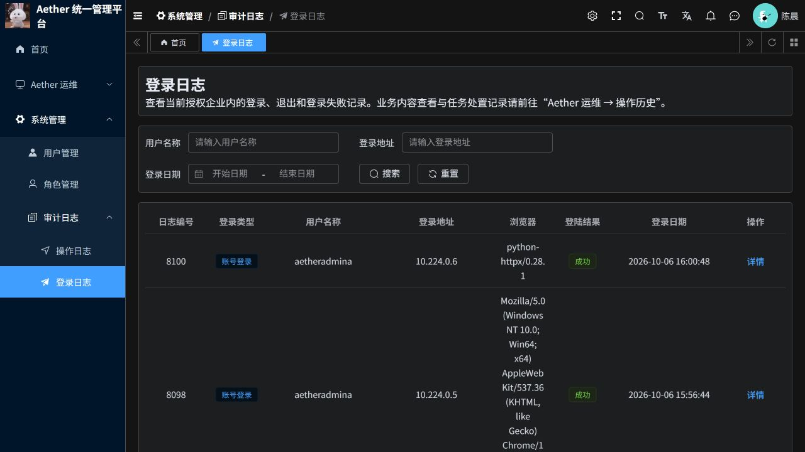

# 若依审计日志空白问题修复

日期：2026-10-06。分支：`codex/ruoyi-platform-20261006`。提交：`5ff42bb5`。

## 原因

截图中的“系统管理 → 审计日志 → 登录日志”存在前端缺陷，原有登录数据没有丢失。

请求拦截器原本用 URL 是否包含 `/login` 判断是否免带登录凭据。登录日志接口 `/system/login-log/page` 被误判，浏览器请求未附带登录凭据，服务器按要求返回 401。未登录处理又把含有 `loginlog` 的页面当成登录页，未显示重新登录提示，最终页面只显示“暂无数据”。

已在陈晨的真实企业权限下复现浏览器错误，并用带凭据与不带凭据的接口请求确认原因。

## 修复内容

- 免带凭据仅匹配确切的登录和刷新令牌接口。登录日志列表、详情与导出正常携带凭据。
- 登录页判断按路径的完整末级名称匹配，不再误判登录日志页。
- 登录日志和系统操作日志分别显示查询错误与无记录状态，避免将加载失败描述成没有数据。
- 页面顶部改为用途与范围说明，区分系统管理审计和 Aether 业务操作历史。

## 两类空白需要区分

| 入口 | 检查结果 | 正确理解 |
|---|---|---|
| 系统管理 → 审计日志 → 登录日志 | 陈晨权限下接口返回 66 条企业内记录，含本次正常登录核验产生的记录 | 原有数据存在，之前为空是前端缺陷 |
| 系统管理 → 审计日志 → 操作日志 | 该企业原生操作日志表为 0 条 | 仅展示已接入的系统管理变更；打开页面、查列表不会产生此类记录 |
| Aether 运维 → 操作历史 | 独立的业务审计入口 | 用户内容查看、任务处置等在这里追踪，不会自动出现在若依原生操作日志表中 |

没有删除、伪造或补造历史日志，没有修改用户密码、角色或租户授权。本次正常登录验证会由系统自然产生登录记录。

## 验证

- 49 项前端测试通过，覆盖精确鉴权匹配、登录页判断以及两个审计页编译；相关 ESLint 检查通过。
- 生产前端镜像构建与 ACR 推送成功。
- 陈晨权限下登录列表可读，返回记录均属于本企业用户；跨企业日志详情不可读。
- 不带登录凭据访问登录日志接口返回 401，没有放宽服务器鉴权。
- 原生操作日志为空时返回成功与 0 条，属于真实空结果，与查询失败区分。
- 云端前端实例已更新，实际运行镜像摘要与下方 ACR 镜像一致。浏览器使用陈晨账号验证，登录日志实际显示“共 66 条”。

部署镜像：`aetherp3acr-a0bne7gpetbpdcbq.azurecr.io/aether/ruoyi-frontend@sha256:c3ce7010ff802c5e0c55982223674350fa819873cadc7fd09737ec8b423036ea`。

访问：[若依后台](https://aether-p3-demo-c50c3827.southeastasia.cloudapp.azure.com/ruoyi/)。刷新页面后进入“系统管理 → 审计日志 → 登录日志”。

本轮只修改前端请求与审计页面，不新增后端审计事件类型，也不代表所有业务动作都已覆盖原生操作日志。
