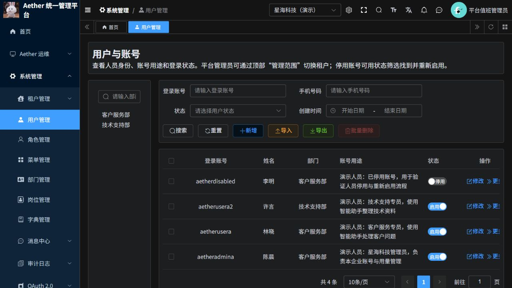
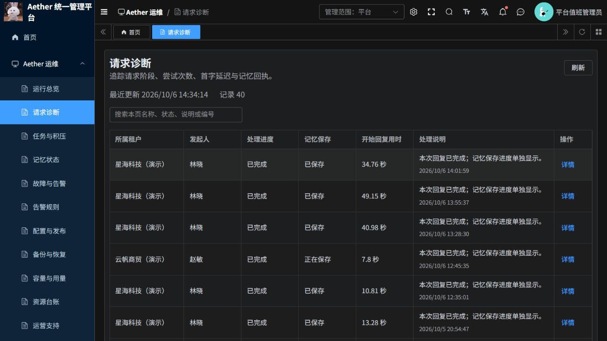

# 若依运维页面与演示数据调整说明

本轮已调整运维页面的业务描述、人员与企业目录，并发布到现有若依云端环境。以下记录只对应本轮界面及目录调整，不代表整个平台的高可用或完整灾备验收。

## 使用入口与账号

- [若依管理后台](https://aether-p3-demo-c50c3827.southeastasia.cloudapp.azure.com/ruoyi/)：平台管理员 `aetherplatform`；星海科技管理员 `aetheradmina`；云帆商贸管理员 `aetheradminb`。
- [新版 Agent](https://aether-p3-demo-c50c3827.southeastasia.cloudapp.azure.com/ruoyi-agent/)：业务人员 `aetherusera`、`aetherusera2`、`aetheruserb`。
- 原有登录名与密码均未改动。管理账号与业务账号按角色分开使用，统一由若依验证身份；Agent 入口会拒绝管理员角色，普通业务用户不能访问运维接口。两端也不共用登录会话。
- 独立恢复的旧版 Agent 使用旧身份体系，不与新版若依账号互通。

## 本轮变化

- 运维总览以中文显示服务可用性、待处理告警和请求统计；原始服务检查数据折叠在技术详情中。
- 请求、任务、记忆、告警、备份、用量、服务台账、工单和操作记录采用固定业务列，显示状态含义、处理说明及时间。请求与操作记录补充企业、人员名称，技术编号保留用于排障。
- 已受理、结果未知、需要人工处理、保存失败、等待重试和无法接入等状态分别显示，不将已受理当作执行成功。
- 配额维护通过企业名称选择；常见状态与紧急程度使用中文选项。
- 用户目录突出姓名、部门、用途和启停状态。顶部管理范围可切换企业，停用人员仍可通过状态筛选查找。
- 7 项服务台账补齐了中文名称、用途和负责团队。配额菜单遗留的乱码已通过后台接口修正；已有登录页面如仍显示旧菜单，请退出后重新登录。

## 演示场景

| 企业/范围 | 人员与账号 | 用途 |
|---|---|---|
| 平台管理中心 | 平台值班管理员 `aetherplatform` | 平台运维与企业管理 |
| 星海科技（演示） | 陈晨 `aetheradmina`；林晓 `aetherusera`；许言 `aetherusera2` | 企业管理、客户服务、技术支持 |
| 星海科技（演示） | 李明 `aetherdisabled` | 停用人员及重新启用场景，当前仍停用 |
| 云帆商贸（演示） | 周宁 `aetheradminb`；赵敏 `aetheruserb` | 企业管理与销售运营 |
| 远山咨询（暂停演示） | 王璐 `aetheruserc` | 企业暂停服务场景，当前企业仍停用 |

清理了 22 个上游样例/一次性验收账号、3 个无用租户，并清理其关联角色及授权关系。采用逻辑删除；清理前已备份。保留 8 个业务账号、1 个停用的系统应急管理员，以及业务会话与审计历史。对 8 个业务账号的登录名、密码、所属租户和状态进行变更前后摘要核对，结果一致。姓名和演示企业名称为虚构场景标签。

## 验证与范围

- 前端 9 项测试、后端 31 项测试通过；修改页面 ESLint 和 Python Ruff 检查通过，生产镜像构建完成。
- 14 类运维查询接口实测成功；企业名称及人员名称正确返回。
- 平台管理员可查询停用人员；租户管理员只能读取所属企业数据，平台级运维查询被拒绝。
- 业务人员可登录新版 Agent 并读取历史会话；管理员登录 Agent 返回 403，业务人员调用运维接口被拒绝，停用人员及停用企业成员登录被拒绝。
- 已实际登录浏览器检查总览、请求诊断与人员页面。技术详情仍保留原始字段，便于排障追踪。
- 全量 Vue 类型检查因内存耗尽未完成；不能将生产构建通过表述为全仓类型检查通过。未配置本机数据库的 9 项数据库测试未执行，本轮使用云端查询、目录与权限验证补充证据。
- 本轮未执行新的 LLM 对话/记忆写入或整个平台灾备演练，未修改独立旧版系统及其入口。

## 发布记录

分支：`codex/ruoyi-platform-20261006`。

提交：`cdc4b9c16ebed395d23298705cc33c27ea35c880`。

前端镜像：`aetherp3acr-a0bne7gpetbpdcbq.azurecr.io/aether/ruoyi-frontend@sha256:7e4607582571a8ec4fe3931d1cd1c0075cfb203719e9a5c1769ad40e5ecd616a`。

业务平台镜像：`aetherp3acr-a0bne7gpetbpdcbq.azurecr.io/aether/ruoyi-platform@sha256:deaa1e73b80eecc8d665003911e6658c9e297ced9045411d71b419bc71c999e8`。

实际运行 Pod 摘要与上述 ACR 镜像一致，公网入口已返回本轮前端制品。数据清理前备份和镜像替换前清单保存在项目外受控工作区，需回退时按具体范围恢复，不覆盖后续新业务记录。

