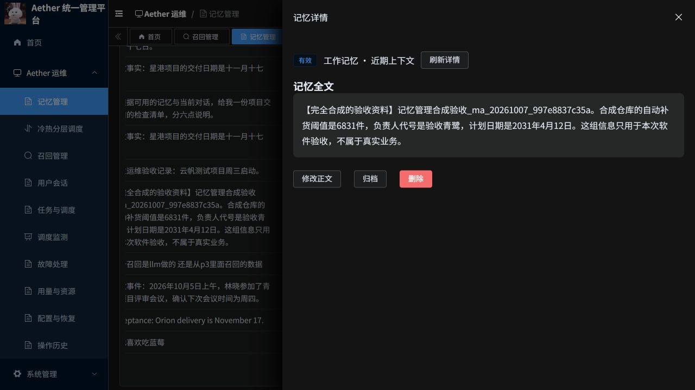
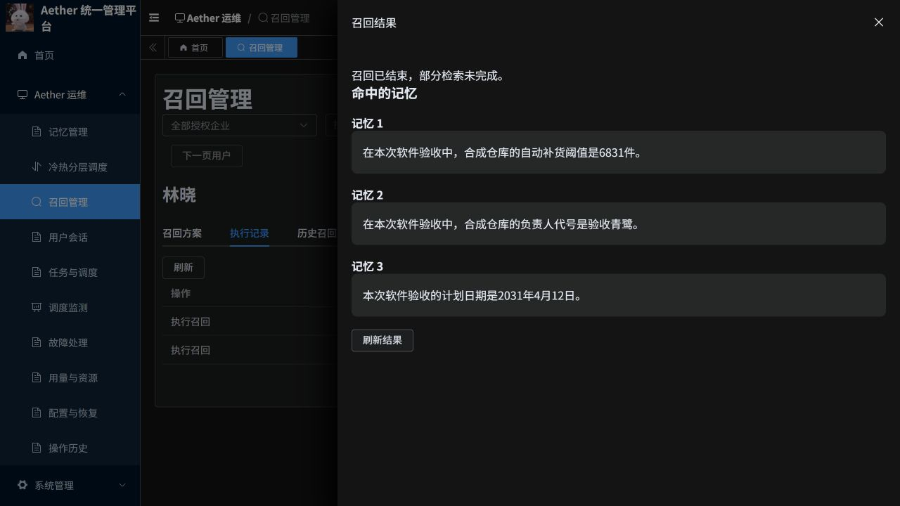

# 记忆与召回管理更新说明

日期：2026-10-07。环境：Azure AKS `aether-p3-demo`，若依版本。

## 使用入口

- [记忆管理](https://aether-p3-demo-c50c3827.southeastasia.cloudapp.azure.com/ruoyi/aether/memories)
- [召回管理](https://aether-p3-demo-c50c3827.southeastasia.cloudapp.azure.com/ruoyi/aether/recalls)

使用原有后台账号登录。在左侧“Aether 运维”进入对应页面，选择授权范围内的企业和用户。

| 页面 | 可以做什么 |
|---|---|
| 记忆管理 | 按用户、记忆类型、状态查询；查看完整正文及索引状态；新增记忆、修改正文、归档、恢复和删除。新增确认成功后直接打开该记忆详情。 |
| 召回方案 | 保存名称、检索内容、检索范围、会话及上下文长度；查看、修改、删除方案，按保存的方案执行召回。 |
| 临时召回 | 不保存方案，直接执行一次查询并查看命中的记忆。工作记忆检索需要选择会话。 |
| 执行记录、历史召回 | 查看管理端操作及真实 P3 召回记录，读取当前仍有权限访问的结果正文。删除方案不抹除历史执行记录。 |

记忆删除后无法在本页面恢复正文。页面区分逻辑删除和后台清理状态；不能把操作完成直接理解为所有底层副本已经物理清除。

## 租户与权限

平台管理员可选择授权企业；租户管理员只访问本企业。普通 Agent 账号不能访问管理接口。读取正文、新增、修改与归档、删除、管理召回方案、执行召回均有独立权限。

菜单和按钮遵循权限，Python 管理层及 P3 再次核验当前身份、目标用户归属和对象范围。任务保留真实管理员身份，不以目标用户身份登录。撤销权限后，后续执行与结果读取会重新校验。

修改、归档、恢复和删除同时检查正文版本与对象修订号；索引更新导致的记录修订号不会被误用成正文版本。执行保存方案时检查方案版本，防止查看后被别人修改仍按旧预期执行。

## 操作异常时如何处理

提交后显示处理中时，使用“查询原操作结果”。网络断开或结果未知时保留原操作编号，不直接重复创建任务。若服务端明确尚未受理，可使用“撤销未受理请求”；服务器封存原编号后才允许重新提交。若原请求已经受理，继续查看原任务状态。

召回显示“部分检索未完成”时，已展示的记忆仍是本次实际返回的内容，但不能据此判断所有来源都检索完整。空结果、部分结果、失败与结果失效分别显示。

## 验收证据

| 编号 | 验证范围 | 结果 |
|---|---|---|
| M01 | 后端管理、权限、P3 管理命令与现有控制台回归 | 118 项通过；平台存储用例使用独立 PostgreSQL，P3 授权与受理用例使用受控运行时。 |
| M02 | 前端组件、权限、并发版本与未知请求恢复 | 85 项 Node 测试通过；修改文件 ESLint、Stylelint 通过；前端生产镜像构建成功。 |
| M03 | 云端真实记忆维护 | 新增、重新读取正文、修改正文、归档、恢复成功；观察到真实索引就绪与异步提取结果。 |
| M04 | 云端召回方案 | 新增、读取、修改及按保存方案执行成功；实际查询与已保存方案一致。 |
| M05 | 云端召回内容 | 混合召回命中修改后的工作记忆。原长期召回返回三条来自修改后来源的长期记忆，包含阈值 6831、负责人代号及日期；结果仍标记为部分完成，原因是部分长期索引未就绪。未调整阈值或重放查询以制造完整通过。 |
| M06 | 真实账号授权 | 7 项检查通过：租户内用户列表与正文可读；跨租户正文、方案、写入均拒绝；普通 Agent 用户的管理读取与写入均拒绝。若依网关 HTTP 为 200 时，拒绝通过业务码 403/404 表达。 |
| M07 | 删除、结果失效及原数据核对 | 本次 11 条合成记忆及派生记录均提交逻辑删除，方案删除完成；两次原召回结果均已失效且不再返回正文。原用户数据基线中的版本、状态和对象修订号核对通过。未将逻辑删除等同于底层物理清理完成。 |
| M08 | 最终浏览器界面 | 已查看修改后全文、维护按钮，以及三条长期召回正文；重复内容和重复提示已移除。截图如下。 |

用例使用演示租户中的专用合成资料。原操作编号、正文哈希、来源证明和任务结果保存在项目外证据目录。用户原数据基线采集于本任务新增之后、修改和清理之前，明确排除了本任务数据；不将其称为创建前全量快照。

截图是在删除验收资料前拍摄，便于核对正文与界面；当前线上已清理这些合成资料，操作记录继续保留。

独立审查及真实数据联调修复了管理员授权外溢、保存方案版本拒绝、未受理请求无法解除、缺少对象修订号，以及页面混淆正文版本与记录修订号的问题。

完整测试套件未通过收集阶段：现有 `test_p2_tls_transport.py` 缺少 `aether_agent_memory.p2.generated`。用户此前要求暂缓的旧 Python CI 格式问题未修改。这里报告的是上述限定测试与真实业务验收，不表示完整 CI、性能或高可用验收通过。

## 发布与回滚

若依 P3、Python 管理服务、前端分别构建并推送到现有 ACR，使用不可变摘要部署；Ready Pod 的实际镜像摘要逐一核对。Java 网关复用现有受控路由，未更换镜像。新增若依菜单及精细权限，保留现有租户套餐和角色原有授权。

本次最终部署摘要（仓库前缀 `aetherp3acr-a0bne7gpetbpdcbq.azurecr.io/aether/`）：

| 镜像 | 实际部署摘要 |
|---|---|
| ruoyi-p3 | `sha256:add54f85d91c9c1020094b6615ceed2e2500ccd082f2c395d248fdddf8a6c931` |
| ruoyi-platform | `sha256:dc6b24cc887305b8358015b9f56884f2744d3b97dfbdba0b33056323e3a4aa4f` |
| ruoyi-frontend | `sha256:6b992b08b4080df76bb39ba3e9dea8e704fcaefe7bcc60fde800e854347cc4c6` |

仅更新 `aether-ruoyi-p3`、`aether-ruoyi-platform`、`aether-ruoyi-frontend` 及对应若依菜单数据。独立旧版系统的数据、镜像与 Temporal 绑定保持原状。

回滚目标：

| 服务 | 本次更新前的镜像摘要 |
|---|---|
| P3 | `sha256:53fe31bc8ec31c2f2d83404c17777af8d1b3869d20f556cb6f350dce4e4e0114` |
| Python 管理服务 | `sha256:d8926cc20d20576a0a953bfa1b5918013a5364d24851d86fdf60fc280fe84430` |
| 前端 | `sha256:050165dce02121d942820716527e54b87edbe76dcb3acbcd65bd92a23552f6d2` |

回滚前确认无进行中的业务操作，按服务恢复原摘要，隐藏新增入口并核对权限缓存。新增方案、命令、授权绑定和审计表保留；不得删除数据来回滚代码，也不覆盖已有 Temporal 绑定。

代码沿用 [PR #20](https://github.com/csdnk/Ather-AIAgent/pull/20)，目标分支为 `codex/project-workspace`；不自动合并。
