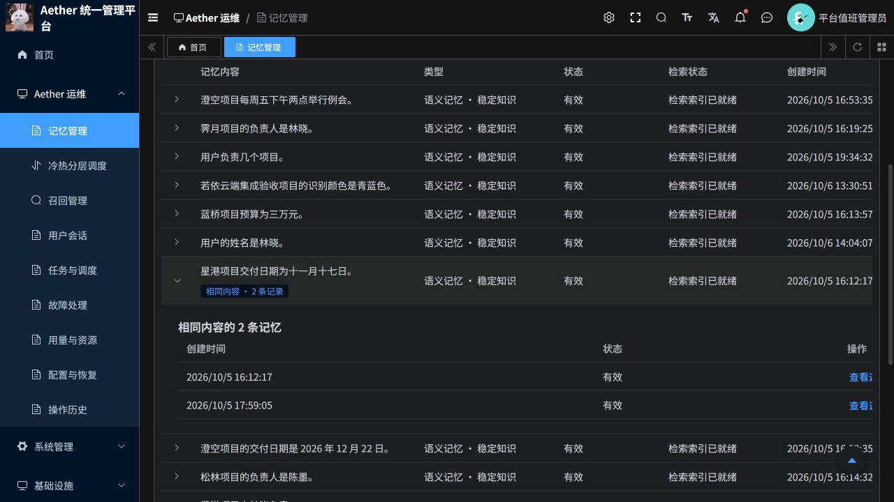

# 记忆列表优化与 Temporal 核查

日期：2026-10-07。代码分支：`codex/scheduling-task-triage-20261007`。PR：[20](https://github.com/csdnk/Ather-AIAgent/pull/20)。

## 交付结论

记忆列表优化已部署到若依云端，完成接口实测和浏览器核查。任务与调度确实连接 Temporal，但目前只支持部分受控操作，不能作为完整的人工审批或失败工作流恢复平台。

入口：[若依后台](https://aether-p3-demo-c50c3827.southeastasia.cloudapp.azure.com/ruoyi/)。本次没有新增 Temporal 人工干预接口，没有取消、重跑或重置云端业务任务。

## 记忆列表改动

- 先显示记录，再补齐正文摘要，避免整张表等待逐条正文读取。
- 摘要最多并发读取 4 条，单条 3 秒、整批 8 秒读取预算；超时后取消并等待剩余读取退出。
- 缓存有限数量的不可变正文摘要；每次读取仍先校验权限、当前版本和来源有效性，失效来源不能通过缓存继续读取。
- 默认筛选有效记忆；保留全部、工作、情景、语义类型筛选。
- 默认合并同一授权用户范围内、同类型同状态且正文完全相同的记录。可展开查看原记录，也可关闭合并恢复逐条显示。没有删除底层数据。
- 原先笼统的“点击查看全文”改为实际摘要或明确的读取状态，包括加载中、超时、来源失效等。

合并不包含语义近似判断。例如“交付日期为十一月十七日”和“交付日期是十一月十七日”仍可能各占一行。冲突内容也不会自动覆盖。本次不涉及写入端去重或存量记忆清理。

## 云端性能实测

以下为当前演示数据的一次核查样本，不是压力测试或性能 SLA。

| 场景 | 耗时 | 结果 |
|---|---:|---|
| 优化前同一 20 条列表 | 8.755 / 9.107 秒 | 部分摘要超时或没有轮到读取 |
| 优化后同一查询首次完整读取 | 7.735 秒 | 20 行，16 条摘要，其余明确返回可用性状态 |
| 优化后同一查询再次完整读取 | 3.411 秒 | 20 行，16 条摘要 |
| 新页面首个记录请求，有效且合并 | 1.640 秒 | 20 行，对应 27 条原记录 |
| 随后的摘要请求 | 3.986 秒 | 18 条摘要，无遗留加载中状态 |
| 有效语义记忆，不合并 | 1.387 秒 | 19 条原记录 |
| 有效语义记忆，合并 | 1.281 秒 | 16 行，仍对应全部 19 条原记录 |

记录请求与摘要请求先后执行；上述样本约 1.6 秒可显示记录，约 5.6 秒完成两次请求，不能解释为 1.6 秒读完全部正文。冷读取仍可能接近 7.7 秒，尚未进行全量目录索引重构或大规模检索性能验收。

浏览器已验证：有效状态和语义类型筛选、16 行合并显示、关闭合并恢复 19 行、展开两条原记录、打开第二条记录并显示匹配全文。现有表格在窄窗口中仍需要横向滚动查看最右侧操作。

## 任务与调度和 Temporal 的关系

业务任务由 `P3TaskWorkflow` 编排，通过 `p3.plan`、`p3.step`、`p3.close` 等 Activity 执行业务；周期维护由 `P3PeriodicWorkflow` 使用持久化计时器和 Continue-as-new 运行。页面中的业务状态与数量来自 P3 业务记录，工作流状态和队列观测来自 Temporal。

真实控制链路是：若依页面 → Java 管理网关 → Python 运维接口 → P3 控制接口 → 持久化控制请求与投递 → 原绑定的 Temporal 工作流 `control` Signal。没有让若依 Quartz 接管 P3 工作流。

| 页面动作或需求 | 当前真实效果 | 是否直接干预 Temporal 执行 |
|---|---|---|
| 查询任务、工作流和队列 | 读取 P3 业务记录及 Temporal 观测 | 只读 |
| 取消原执行 | 向仍在运行且符合授权与版本条件的原工作流发送取消请求 | 是，协作取消，不撤销已完成的外部写入 |
| 核对原执行 | 请求原工作流核查已有执行结果 | 是，不创建新任务，不等于重新执行 |
| 建单、认领、交接、记录进展 | 保存处理人、过程与历史 | 否 |
| 重新检查 | 重新读取任务、工作流和相关账号状态 | 只读，不修复故障 |
| 转研发 | 将工单标记为已升级处理 | 否，也不自动发消息或创建研发任务 |
| 提交结果、核验、关闭、重新打开工单 | 检查证据并更新工单状态 | 否，不改写原业务结果 |
| 关联后续任务 | 关联已经存在的任务作为处理证据 | 否，不自动补建或重跑任务 |
| 人工批准、驳回、补充输入后继续 | 当前工作流没有对应的人工等待节点和处理入口 | 未实现 |
| 重置、强制终止、重跑已结束工作流、通用暂停恢复 | 当前页面没有对应能力 | 未实现 |

取消和核对要经过租户、权限、任务修订号及原工作流链路绑定校验。控制请求受理或 Signal 送达不等于业务处理完成；结果未知时必须继续查询原操作编号，不能换编号盲目重复提交。

## “需要人工处理”到底是什么意思

当前实现中，`attention_required` 是业务终态。典型情况是执行或核对超时、查询预算耗尽，系统仍无法确认业务副作用；工作流收尾后结束，不会停在那里等待管理员点击批准。

本次云端只读抽查到一条真实样本：P3 状态为 `attention_required`，业务结果为 `unknown`，Temporal 工作流状态为 `completed`。这里的 completed 表示编排结束，不证明记忆已成功保存或迁移。

因此，现有工单可以做到责任分配、过程记录和证据核验，但无法把这类已结束任务原地继续执行。实际处理步骤应当是：

1. 核对原会话、原记忆、执行步骤和外部服务结果，确认已经完成哪些操作，避免重复写入。
2. 修复具体故障，例如恢复应有授权、恢复依赖连接、处理超时原因；这些修复并非均能在此页面完成。
3. 原任务仍在运行时，可以申请核对或取消；已经结束时，由业务负责人确认是否需要重新办理原请求，当前后台没有一键补建入口。
4. 如在业务入口重新办理并产生后续任务，将该已有任务关联到工单，由后台读取真实结果核验；如果不再需要办理，走独立复核后关闭。

要实现真正的人工执行闭环，还需按业务区分“等待人工决定”和“结果未知待核查”，为前者设计可持久等待的工作流节点，为后者提供核对及防重复的补偿/后续任务机制，再由页面按实际可用能力显示操作。本次仅核查并记录这些缺口，没有将工单按钮描述成已经具备这些能力。

## 验证范围与证据编号

| 编号 | 证据 | 结论 |
|---|---|---|
| M01 | Python 定向测试 | 57 项通过；覆盖元数据模式、并发限制、总预算、分组范围及失效来源缓存拒绝 |
| M02 | 前端 Node 测试 | 86 项通过 |
| M03 | Java 网关测试 | 13 项通过，构建成功 |
| M04 | 修改文件静态检查 | Ruff、ESLint、Stylelint、格式及 diff 检查通过 |
| M05 | 云端接口与浏览器 | 实际数据、摘要、分组与原记录详情核查通过；耗时见上表 |
| M06 | 发布核查 | 四个组件已部署，运行 Pod 镜像摘要与发布摘要一致 |
| T01 | Temporal 源码调用链和云端只读样本 | 真实接入、部分控制能力和业务终态差异得到核实 |

没有运行全套测试。Temporal 集成测试需要专用 Redis 等真实依赖环境，当前缺少 `P3_TEST_REDIS_HOST` 等配置而未完成；工单数据库测试缺少专用 PostgreSQL 配置，12 项跳过。本次没有在线发送取消或核对命令，不能将源码核查和只读样本当成实际干预验收。用户此前暂缓的旧 CI 格式问题未纳入本次修改。

## 发布与回滚

目标资源组 `aetherstore-p3`，AKS `aks`，命名空间 `aether-p3-demo`，ACR `aetherp3acr`。本次只更新若依版本的 P3、Python 管理服务、Java 后端及前端；独立旧版系统资源保持原有归属。

仓库前缀：`aetherp3acr-a0bne7gpetbpdcbq.azurecr.io/aether/`。

| 镜像仓库 | 本次运行摘要 | 发布前摘要 |
|---|---|---|
| ruoyi-p3 | `sha256:47c2d045506dc47f971eb87e133a672b00cf48566d914b6e7c61ea02fac8e7a3` | `sha256:add54f85d91c9c1020094b6615ceed2e2500ccd082f2c395d248fdddf8a6c931` |
| ruoyi-platform | `sha256:ca5818e7f4bccc67b17ebe682134fab376355e5b29430de7b389c141c99c529c` | `sha256:dc6b24cc887305b8358015b9f56884f2744d3b97dfbdba0b33056323e3a4aa4f` |
| ruoyi-backend | `sha256:6061635d6f27ca535f10fcb182fe23788b97d49dbe0b6aff795683d89690126e` | `sha256:f2a4448706852e0b168b01a417e409f48df45e0a6ea89ba4b307d54fd13cfcd9` |
| ruoyi-frontend | `sha256:3797baaaaaa9c5f7fadec3b2767a48e43bf7f0efc076b0c1989b01dbc91179e6` | `sha256:aef972346e552daf0e5110aeb14d1083952b18426aa5d9cf6470ccf95eb00f27` |

发布前保留了各组件部署快照。回滚时先检查在途业务和实际资源归属，再按原 Deployment 容器配置恢复发布前摘要，等待启动并重新验证登录、记忆读取和租户权限；不要改动旧版系统或删除数据。此优化无数据迁移，显示分组可随前端开关关闭。镜像就绪不代表生产高可用或全部业务验收完成。

## 源码定位

以下路径均相对于分支内 `AgentJYS-main/`：

- 记忆列表与读取预算：`src/aether_agent_memory/runtime/flows/admin_diagnostics.py`。
- 摘要缓存与有效性检查：`src/aether_agent_memory/remember/basic/content.py`、`pipeline.py`。
- 列表及状态文案：`ruoyi/frontend/src/views/aether/memories/index.vue`、`memoryList.mjs`。
- 工作流执行与终态：`src/aether_agent_memory/runtime/temporal/workflows.py:31,66,137`。
- 周期工作流：`src/aether_agent_memory/runtime/temporal/periodic_workflow.py:42`。
- 控制准入与 Signal 投递：`src/aether_agent_memory/runtime/temporal/controls.py:64`、`gateway.py:128`。
- 工单与实际控制：`src/aether_platform/operations/task_cases.py:332,403`。
- 页面操作限制：`ruoyi/frontend/src/views/aether/triage.mjs:12`。
