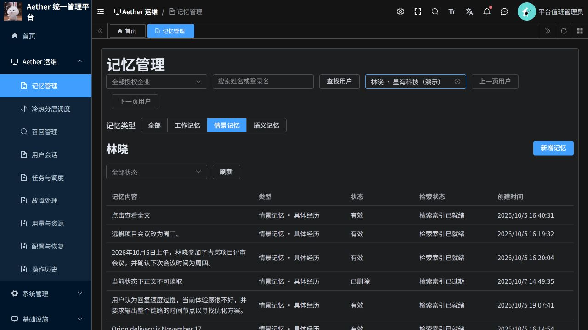
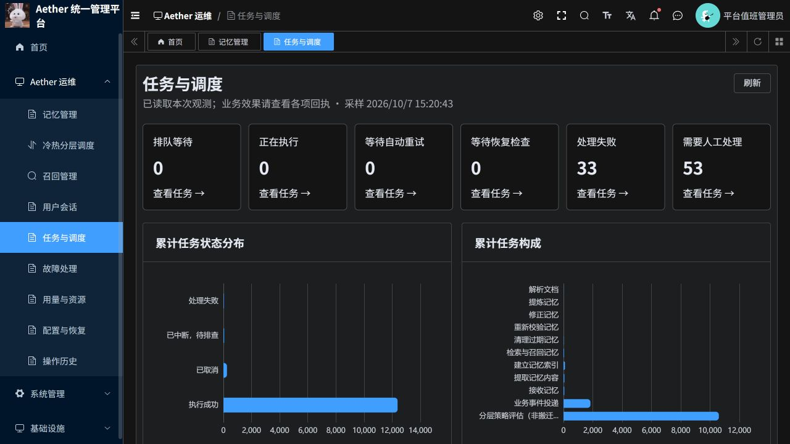

# 记忆筛选与调度页面合并

2026-10-07，若依云端版本已更新。

## 页面变化

- 记忆管理顶部始终显示“全部、工作记忆、情景记忆、语义记忆”。选定用户后按类型查询；切换类型会返回第一页并关闭旧详情，支持与记忆状态同时筛选。
- 调度监测并入“任务与调度”。顶部展示任务状态与累计分布，下方保留业务任务、执行器与队列、周期维护、持续业务采样。
- 点击状态卡片直接筛选本页任务。卡片统计覆盖当前部署全部任务，点击时清除此前的业务类别条件，避免数量与列表范围不一致。
- 删除重复的工作流任务列表，执行步骤、Temporal 工作流和人工处置继续通过任务详情查看。保留建单及既有处理流程。
- 保留执行器最近联系时间、五分钟联系判断、队列积压与检查提示。冷热分层调度保持独立入口。
- 旧 `/aether/scheduling` 自动跳转到 `/aether/tasks`，保留查询参数。旧菜单只隐藏，未删除角色授权。

## 验证结果

| 编号 | 验证 | 结果 |
|---|---|---|
| V1 | 前端 Node 测试 | 85 项通过，涵盖组件编译、权限、任务处理与队列状态 |
| V2 | 修改文件检查 | ESLint、Stylelint、Prettier、git diff 检查通过 |
| V3 | 生产构建与发布 | 构建、ACR 推送和 rollout 成功；运行 Pod imageID 与发布摘要一致 |
| V4 | 实际记忆类型筛选 | 工作/情景/语义首屏分别返回 20/11/20 条，接口返回类型全部匹配；浏览器核对三种筛选 |
| V5 | 分页切换 | 工作记忆进入第二页，再切换语义记忆，正确返回第一页 |
| V6 | 状态联动与处置 | 先选召回业务再点击失败卡片，业务筛选清空，首屏 30 条均为失败任务；可打开处理建议与建单入口 |
| V7 | 队列观测 | 合并页显示流程与步骤执行器联系状态、最近联系、积压与检查提示 |
| V8 | 旧路由兼容 | `scheduling?state=attention_required` 跳转至 `tasks?state=attention_required` 并选中对应状态 |
| V9 | 运行范围 | 仅若依前端部署及两个菜单属性更新；P3、Python 管理服务 Pod 模板与发布前一致 |

本次沿用现有租户授权及平台调度权限。未执行新的业务写入、删除、建单、取消或恢复命令；本次验收不代表历史失败任务已修复，也不构成新的调度性能基准。构建存在仓库原有环境变量、浏览器兼容数据与旧样式警告，不影响此次构建成功。

## 访问

- [记忆管理](https://aether-p3-demo-c50c3827.southeastasia.cloudapp.azure.com/ruoyi/aether/memories)
- [任务与调度](https://aether-p3-demo-c50c3827.southeastasia.cloudapp.azure.com/ruoyi/aether/tasks)
- [PR #20](https://github.com/csdnk/Ather-AIAgent/pull/20)，不自动合并。

## 发布与回滚

命名空间：`aether-p3-demo`；部署：`aether-ruoyi-frontend`。

当前镜像：`aetherp3acr-a0bne7gpetbpdcbq.azurecr.io/aether/ruoyi-frontend@sha256:aef972346e552daf0e5110aeb14d1083952b18426aa5d9cf6470ccf95eb00f27`。

回滚时将前端恢复至 `aetherp3acr-a0bne7gpetbpdcbq.azurecr.io/aether/ruoyi-frontend@sha256:6b992b08b4080df76bb39ba3e9dea8e704fcaefe7bcc60fde800e854347cc4c6`，并通过原生菜单接口恢复发布前两个菜单的名称、可见性与缓存属性。菜单原值及发布原始证据保存在独立工作区；不需要回滚 P3 或业务数据库。
