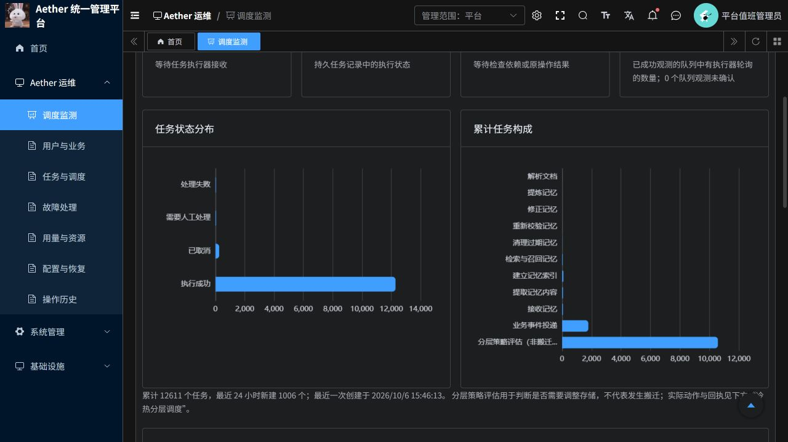

# 调度监测优化与菜单去重

2026-10-07。适用PR：[19](https://github.com/csdnk/Ather-AIAgent/pull/19)。

## 已完成

删除Aether运维下重复的“值班总览”菜单。首页继续显示指标与图表；旧地址 `/aether/overview` 跳转到 `/index`。已使用若依原生菜单删除接口处理角色关联与缓存，并同步新环境初始化和增量SQL。

调度页汇总任务时，从逐条读取Temporal绑定改为一次批量读取。原来12,611条任务会触发逐任务数据库查询；现改为一次读取任务、一次读取绑定，并在同一事务内按部署过滤，不改变服务端授权和部署隔离。

图表改为“累计任务构成”，区分分层策略评估、业务事件投递、记忆提取、索引等具体任务。补充最近24小时新建任务数和最近任务创建时间，明确评估不代表实际搬迁。实际动作与回执仍在下方“冷热分层调度”中展示。

## 实测速度

同一平台管理员入口、`limit=1`，修改前 13.347 秒；发布后两次读取分别为 1.63 秒、1.736 秒。计时从已认证客户端发出HTTP请求到响应返回，不包含登录及浏览器首次下载资源。

仍需查询Temporal实时状态，不能保证所有网络条件下固定耗时。此优化消除了逐任务数据库往返，仍会读取历史任务进行汇总；未来数据继续增长时可改为独立汇总表或监测快照。

## 为什么评估次数这么多

修改前查到当前部署累计12,611个任务，其中10,577个是 `operate.evaluate`，并非10,577次冷热搬迁。它们用于判断记忆是否需要调整层级，结果可以是保持、延期、升层或降层。当前部署可查询到的独立迁移动作记录为0；这仅说明当前记录范围，不能据此还原所有历史物理存储行为。

任务按UTC日期分布为10月5日10,315个、10月6日2,296个。最近任务创建于北京时间10月6日15:46；本次读取时并没有持续产生大量新任务。周期配置为30秒，实际是否创建评估还要经过到期、已有待办、授权和记忆状态等条件。

策略评估仍消耗CPU、数据库与Temporal执行/历史存储资源。原先每次打开调度页的逐条历史查询还会增加数据库开销，并在共享事务锁内延长等待。本次修复了这一确定的观测开销。

单次资源采样：若依P3约132m CPU（0.132核）、622MiB内存；Temporal约195m CPU、476MiB内存。该采样不能归因到某一个任务，也不能代表历史峰值或长期平均。不据累计次数断言当前过载；本次没有调整业务评估间隔、取消历史任务或改变冷热策略。

## 验证与部署

- Python：175通过、74跳过；修改Python文件Ruff通过。回归测试先确认原实现对每个任务读取绑定，再确认优化后该逐条读取次数为0，部署隔离与任务筛选测试保留。
- 前端：60项测试通过，修改Vue/路由ESLint和格式检查通过，生产镜像构建成功。
- 原生菜单接口确认60001不再返回；浏览器验证菜单仅保留一个首页，调度页能显示具体任务类型和统计时间。
- P3发布采用Recreate，部署前无等待中的聊天请求；前端随后更新。镜像均核对容器实际imageID。平台、数据库和调度策略未修改。
- 既有Python CI问题按用户要求保留，本次不宣称完整CI通过。

| 组件 | 运行镜像 |
| --- | --- |
| p3 | `aetherp3acr-a0bne7gpetbpdcbq.azurecr.io/aether/ruoyi-p3@sha256:62cac6e298db1a6fdea36100ba583ed18c124e901b14f01a44e61e3166eb9be7` |
| frontend | `aetherp3acr-a0bne7gpetbpdcbq.azurecr.io/aether/ruoyi-frontend@sha256:7cb412b9a17e94f521196a644c63a198a5bb9bccb6f10ebb475bae6efb46157a` |

回退使用发布前的不可变镜像；P3新旧worker不能重叠运行。菜单回退需通过管理接口恢复菜单与原角色关联，不恢复任何任务状态。

