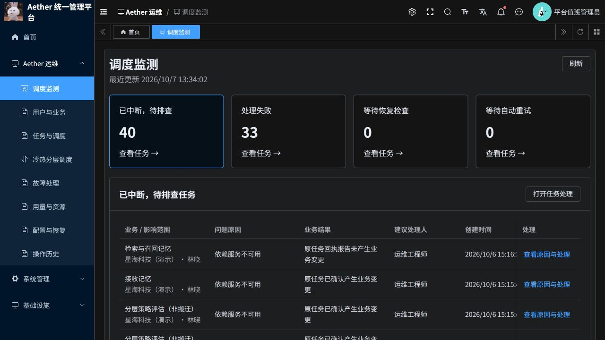
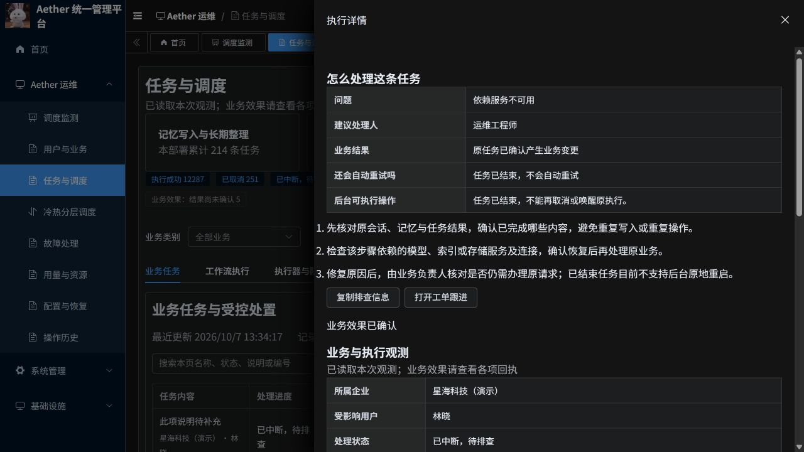

# 调度问题排查与处理指引

2026-10-07。调度监测已从单纯展示数量改成可进入具体问题的任务清单。点击状态卡片，查看业务、影响企业和用户、原因类别、业务结果、建议处理人及创建时间，再进入“查看原因与处理”。

## 运维如何处理

1. 先核对原会话、记忆和任务结果，判断哪些内容已经完成。失败或中断不等于所有步骤均未执行。
2. 按原因交给相应人员：依赖不可用由运维检查对应服务与连接；授权拒绝由权限管理员核对原企业、用户状态与授权；超时由运维检查排队和依赖耗时；一致性校验失败由研发检查输入、版本与回执。
3. 详情提供“复制排查信息”和“打开工单跟进”。后者进入故障处理的工单页，由人员填写问题、负责人和处理结果；本次没有自动创建、指派或发送工单。
4. 原因修复后，由业务负责人确认原请求是否仍需办理。后台目前不支持已结束任务原地重启。原工作流仍运行、任务版本有效且状态允许时，才显示申请取消或核对原执行；后端继续检查权限、租户、版本和操作原因。

## 当前记录说明

认证查询得到累计 33 条处理失败、40 条中断记录。这些是历史任务状态，不是 73 个正在阻塞的执行，也不是已经去重的待办工单数。

| 记录的原因类别 | 处理失败 | 已中断 |
| --- | ---: | ---: |
| 依赖服务不可用 | 13 | 7 |
| 执行授权被拒绝 | 3 | 27 |
| 超过处理时限 | 16 | 1 |
| 一致性校验失败 | 0 | 1 |
| 没有记录具体原因 | 1 | 4 |

33 条失败中，32 条回执为尚未开始业务变更，1 条为未产生业务变更。40 条中断中，33 条回执已确认产生业务变更，5 条结果未知，2 条未产生业务变更。因此没有添加统一“重试”按钮。回执确认不等于本次重新核验了每条记忆的正文、索引和召回。

源码将 failed 和 attention_required 都定义为结束状态，控制接口拒绝对结束任务取消或唤醒。分别查询每类前 10 条工作流，20 条均已完成；其余 53 条没有逐条读取工作流，不作全量验证声明。原任务失败历史应保留，后续工单处理不会把历史失败数清零；本次没有实现工单与任务自动关联及处理后自动销项。

## 下方业务执行情况

原 16 行来自 8 个业务队列各自的任务流、业务步骤两种内部队列，已合并成 8 行。保留各自的积压估计和联系状态，不将两类积压相加冒充用户请求数。

“5 分钟内有联系”表示执行器近期轮询过队列，不代表取到了任务或业务处理成功。缺失、过期和无法读取的观测不计作健康。任务历史分布移入可展开区域。

## 验证与发布

- 前端 70 项测试通过，包括 Vue 组件编译、结束任务操作门控、状态参数、业务效果不确定性及队列分组；修改的 Vue 文件 ESLint 和 git diff --check 通过。
- 浏览器验证数量筛选、中断任务第二页、任务详情跳转、原因与处理步骤、结束任务不显示取消/核对按钮、工单入口，以及最终版创建时间和 8 行执行器分组。
- 仅部署 aether-p3-demo 命名空间的 aether-ruoyi-frontend，已核对单个活动 Pod Ready 且实际镜像摘要一致。Python、Java、业务数据和原工作流未变更。
- ACR 镜像：`aetherp3acr-a0bne7gpetbpdcbq.azurecr.io/aether/ruoyi-frontend@sha256:e7929acbf58ccb364e024922d42cc2254b7ee5e97254697afa97e8f83487cdd0`。
- 回退到本轮开始前的前端镜像：同一仓库的 `sha256:210271b2fd66b9d7f1742658b73aff5fbc01a90b1bf2f937c475f00701ae81c4`。仅替换该 Deployment 的前端镜像并等待 rollout，随后检查 Ready、登录及页面，不改业务数据或工作流。
- 本次未执行故障恢复、任务重试或取消。未声称所有历史任务已修复、完整 CI 或生产验收通过。用户指定暂不处理的两个既有 Python CI 问题保留。

[打开调度监测](https://aether-p3-demo-c50c3827.southeastasia.cloudapp.azure.com/ruoyi/aether/scheduling)

