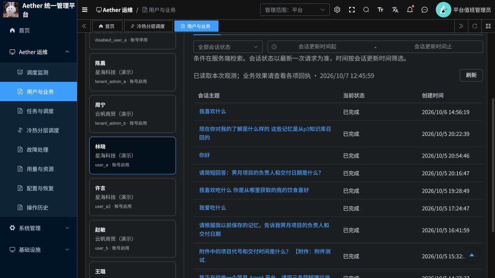
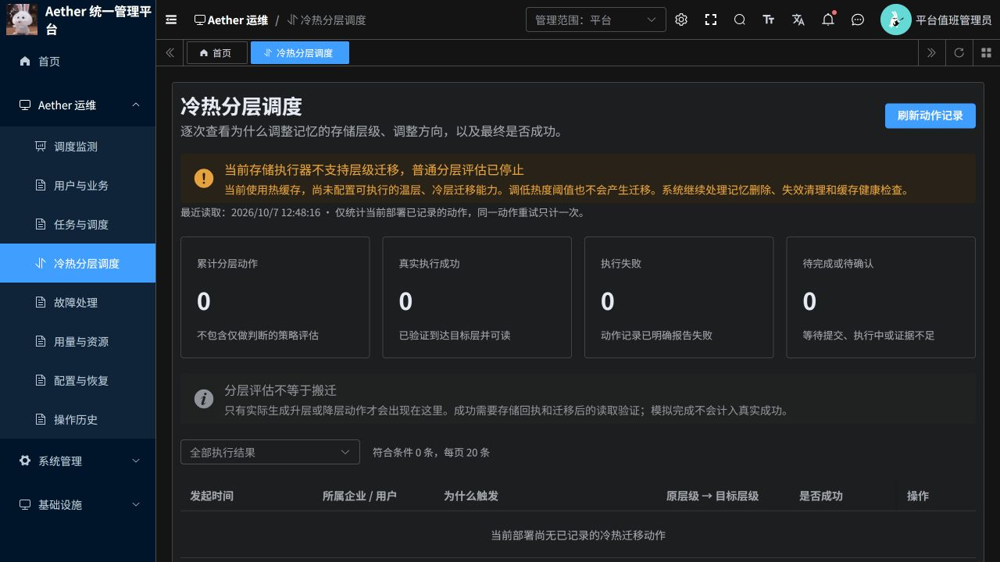

# 分层调度根因、降耗处理与重设计方案

日期：2026-10-07。范围：若依版本 aether-ruoyi-*，命名空间 aether-p3-demo。未操作 legacy 版本。

## 结论

当前未产生真正层级迁移，主要因为实际配置的 RedisExecutor 只提供热缓存，明确声明 supported_moves 为空。温层、冷层迁移并未实现为该执行器的能力。调低热度阈值不能补齐执行器。

此前将监测页面搭好，不等于已经完成三层迁移引擎。这次已修正入口行为与页面说明；真正三层存储建设仍属于下文的待实施方案。

## 一、线上核对结果

证据来源：当前 P3 Pod 配置、当前部署绑定任务及其 evaluation_result、operate_heat、operate_views；平台会话库与登录后的若依页面。未读取或输出凭据。

| 已绑定的分层评估任务结果 | 次数 | 含义 |
| --- | ---: | --- |
| 不支持层级迁移，因此推迟 | 9,801 | 约占全部评估 92.7%；没有生成迁移动作 |
| 策略判断保持当前状态 | 466 | 只做评估，没有生成迁移动作 |
| 缓存清理结果 | 6 | 必要维护，不是层级迁移 |
| 取消 | 243 | 未作为成功迁移计数 |
| 需人工关注 | 32 | 授权、依赖或超时异常 |
| 失败 | 29 | 授权、依赖或超时异常 |
| 合计 | 10,577 | 覆盖 82 条记忆，单条最多 336 次 |

以上 9,801 + 466 + 6 次在任务系统中显示 succeeded，表示“决策或结果已保存”，不表示发生了数据迁移。

任务生成窗口：北京时间 10月5日16:10:37 至 10月6日15:46:13。当前查询没有随后新增的已绑定评估任务，不能把已有任务不增长当成本次降耗效果。

77 份历史热度状态中，26 份期望温层、51 份期望冷层，记录热度范围约 0.10–0.46。执行器仍只报告热层，且禁止层级迁移，导致策略意图长期无法落实。

另有 78 条 Operate 周期对象的历史关注记录为 FORBIDDEN；其中 51 条视图的事件身份版本与当前本地身份版本不一致。这属于历史身份授权问题，不允许通过替换事件所有者或强制提升权限来恢复。其余对象仍需分别核对实时目录授权；未把它们全归因于版本变化。

## 二、之前到底多久评估一次

| 机制 | 当前配置/默认值 | 实际作用 |
| --- | --- | --- |
| 全局周期 | 30 秒 | 检查多类后台工作，不等于每条记忆每 30 秒都评估 |
| 普通策略审计间隔 | 300 秒 | 无变化时的正常复查上限，也会根据热度越过阈值时间提前 |
| 尝试变化/重试间隔 | 5 秒 | 策略层已决定变化后写入较近复查时间 |
| 热度衰减常数 | 3,600 秒 | 影响近期访问对热度的贡献 |
| 温层进入/退出阈值 | 0.25 / 0.15 | 带迟滞，避免临界值附近反复调整 |
| 热层进入/退出阈值 | 0.70 / 0.55 | 同上 |

代码问题在于：策略先判定降层并安排较快重试，随后发现执行器不支持，再改为 defer；之前没有从任务产生入口阻止这一类重复工作。周期检查又会为到期记忆继续派发。

历史同一记忆的两次评估创建间隔中位数为 255.135 秒，90 分位为 363.672 秒，最短 0.307 秒。它受业务事件、周期分批执行和队列影响，不是固定 5 秒执行一次。多条记忆长期重复足以累计一万多次。

资源快照：若依 P3 139m CPU、569Mi 内存；共享 Temporal 190m CPU、479Mi 内存。139m 是约 0.139 核。这些是整个进程的时点读数，没有任务级 CPU 归因，也没有改动前后的等负载对照，不能声称无效评估占用固定百分比资源。

## 三、本次已经落实的范围

1. RedisExecutor 公开静态“无层级迁移能力”；资源快照与入口使用同一能力声明。
2. 普通记忆事件仍保留观察数据与热度输入，但不会为该执行器新建普通分层评估任务。
3. 到期复查在身份重验、全量待办扫描和存储调用前跳过不可能执行的层级调整。
4. 删除、失效等生命周期清理继续进入原有授权与执行流程；已有动作恢复与证据没有删除或重置。
5. 监测页明确显示执行器能力缺口与普通评估已停止，避免把空列表解释成阈值太高。
6. 全局 30 秒周期保持原值，避免影响 Remember、Recall、保留策略和健康维护等其他工作。

这是消除已确认无效派发的修正，不是完整三层迁移能力的交付。

## 四、真正三层调度的重设计（待实施）

### 4.1 先建立真实存储能力

建议热层使用 Redis，温层使用明确配置的在线存储，冷层使用明确配置的归档存储。若继续采用 Ceph，温/冷层需要实际不同的池、存储类或介质与成本策略，并经过读写和恢复验证。两个没有存储策略区别的对象前缀不能作为真正冷热分层的证明。

现有 Ceph 仅是已配置的权威正文存储，不能未经迁移就把它改称为完整温层或冷层。最终温/冷层介质、容量、成本及恢复时延需要在后续存储实施设计中确定；该选择会改变云资源和数据迁移范围。

执行器能力必须按具体路径声明，例如 hot→warm、warm→cold；每条路径声明是否就绪、可用容量、是否支持查询原操作、校验与清理。缺少任何一条能力时将其标记为“等待存储配置”，不发任务，不伪造成功。

### 4.2 调度由事件和到期时间驱动

| 场景 | 建议的新行为 |
| --- | --- |
| 同一记忆密集读取 | 60 秒内合并为一次待评估，累计读取事实，不逐事件创建工作流 |
| 新记忆或版本变化 | 先合并同一版本的保存、索引等事件，再评估；旧版本失效 |
| 已知下一次热度越界 | 直接写入下一次可能变化时间，到期才读取和评估 |
| 稳定冷记忆、没有新访问 | 不重复产生评估任务；等待新事件 |
| 存储不支持该移动 | 等待能力配置版本变化；不做 5 秒重试 |
| 临时容量或服务异常 | 1、5、15、60 分钟退避，上限 1 小时；同一阻塞不反复新建任务 |
| 身份失效 | 阻塞并保留原因，等待合法的新事件/授权恢复，不自行更换所有者 |
| 删除与失效清理 | 独立高优先级通路，不等待普通热度合并窗口 |
| 低频兜底审计 | 每 6 小时检查一次，加入随机错峰；只补漏，不代替事件调度 |

上述数值是建议初值，需要用当前负载回放调整，并非已上线配置。

实现使用有索引的到期队列，按 deployment_id、next_evaluation_at 读取；同一记忆版本最多一个待评估记录、一个在途动作。每批最多 64 条、迁移并发初值 4，额外限制批处理时间和搬迁字节预算。不要每处理一条记忆就扫描全部历史 tasks。

流程：事件更新统计 → 合并待评估 → 到期读取小批量 → 校验能力、身份和版本 → 判断是否值得搬迁 → 复制到目标 → 校验内容并实际读取 → 提交位置记录 → 清理可删除旧副本。

迁移失败保留原副本；不确定结果只查询原动作，不用新的动作 ID 反复提交。旧副本清理失败与迁移结果分别记录，权威数据保持至少一份已验证副本。

### 4.3 页面应回答的问题

- 策略有没有启用，当前存储到底支持哪些移动；阻塞在哪里。
- 本轮检查了多少条、为什么跳过、实际生成了几个动作；无变化不产生满屏任务。
- 每个动作由什么事件触发、当时访问热度和重要性、源层/目标层、阈值、预估收益与搬迁成本。
- 待处理数量、最久等待、实际搬迁字节、耗时、失败/退避原因和下一次检查时间。
- 策略评估成功、真实迁移成功、模拟结果分别计数；展示每小时新增和累计，避免累计值制造持续高负载错觉。

### 4.4 实施与验收顺序

1. 当前能力门控与事实提示（本次完成）。
2. 合并待办、索引到期队列、退避与观测面板；先回放历史事件，验证不重复派发。
3. 在隔离存储空间实现至少一条真实层级路径，验证内容、重启恢复、未知结果原操作查询和清理回执。
4. 用少量明确授权的测试记忆灰度，逐层验证后再扩大。不可直接迁移当前全部用户记忆。

验收至少包括：100 次密集读事件合并不超过规定频率；10,000 条稳定冷记忆无访问时不产生普通评估工作流；不支持能力时零迁移提交；授权失效不产生任务风暴；每条可用层级路径均具备真实读回、内容一致、重启恢复、失败保留原副本证据。与同负载基线比较数据库访问、任务新增量、CPU、内存与搬迁带宽，不能以 Ready 或 HTTP 200 替代。

## 五、会话清理

共核对 26 条会话，其中清理前 14 条可见。已将以下 4 条纯验收会话从列表移除，采用系统已有 archived 逻辑，保留恢复能力与原有消息：

- 2 条若依云端集成验收颜色问答（验收脚本来源已核对）；
- 1 条租户配额验收（验收脚本来源已核对）；
- 1 条明确标注 Azure 云端迁移验收的单轮会话。

清理后可见会话 10 条。另两条名称包含“验收”的会话含后续饮食偏好与用户问答，保留；没有按标题关键词批量删除。没有删除 P3 记忆正文、附件、工作流或审计记录。

修改前核对精确会话 ID、标题、企业、用户、更新时间、单轮会话条件及无进行中请求，在事务内锁定并归档。恢复只需按此次精确清单取消归档，不能批量恢复其他历史会话。清单保存在受控处理区，不把用户会话内容纳入 Git。

## 六、测试与发布

Python 相关测试：192 passed、74 skipped；前端 63 passed；修改文件 Ruff、Vue ESLint 与格式检查通过。新增测试覆盖无迁移能力声明、到期检查提前跳过、普通事件保留观察而不派发、删除事件仍派发清理、支持或未静态声明能力的其他执行器兼容性。

上一轮完整 Temporal 工作流测试因缺少测试 Redis 连接配置未运行，本次没有把它计为通过；未宣称真实三层迁移端到端或合同性能验收通过。

| 组件 | 标签 | 摘要 |
| --- | --- | --- |
| p3 | `source-a1f232120734e728` | `sha256:53fe31bc8ec31c2f2d83404c17777af8d1b3869d20f556cb6f350dce4e4e0114` |
| frontend | `source-283b627537ae3d64` | `sha256:855922a46b9a254359a551e876edc4a952c2fda1156b62671ffa2a36fa025efe` |

部署使用 Recreate，保留单实例；平台 BFF、数据库、配置和其他部署保持原状。线上最终验证见本目录页面截图及发布后的能力接口核对。PR #19 保持未合并。

回退调度修正只恢复本次发布前的 P3 和前端不可变镜像；不需要修改策略阈值、数据库结构或历史动作。会话清理可独立按精确清单撤销归档。

## 发布后核对

2026-10-07 12:48（北京时间），实际页面已显示“不支持层级迁移，普通分层评估已停止”。认证接口返回 placement_capability=unsupported，两个新镜像摘要均与实际 Ready Pod 一致。两个认证查询耗时为 0.779 / 0.864 秒。会话 API 与浏览器都确认剩余 10 条可见会话，4 条纯验收记录不再出现。

该接口状态与测试验证的是能力门控，不是实际迁移证明；没有用线上用户记忆制造新动作。尚无相同负载下的 CPU 对照，暂不报告降耗百分比。

本次发布前的回退镜像：

- p3：`aetherp3acr-a0bne7gpetbpdcbq.azurecr.io/aether/ruoyi-p3@sha256:78c1abb70be739d91cfc2b832814c23f26ea4e51390a65773e9e34174f381ffa`

- frontend：`aetherp3acr-a0bne7gpetbpdcbq.azurecr.io/aether/ruoyi-frontend@sha256:c4aa4e0d80793c2892c83fe5c398ce3d5ec66b12a0172dd365140151877a0055`
