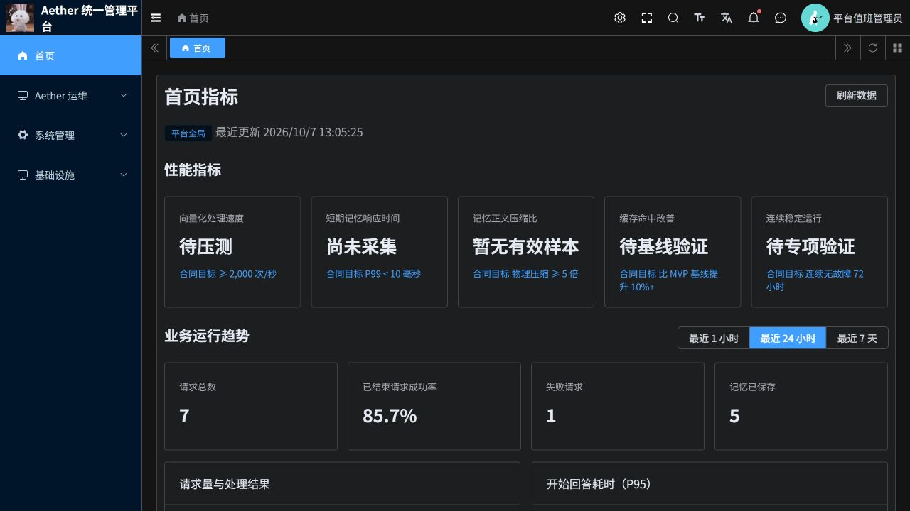
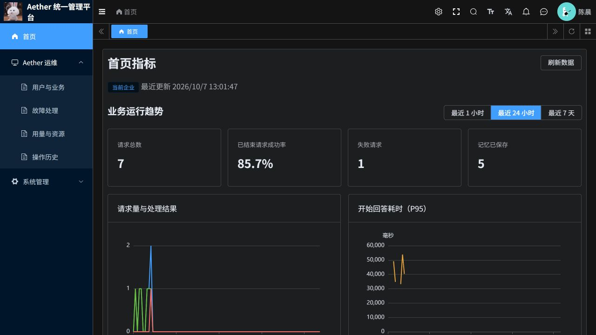

# 页面精简与权限核查

日期：2026-10-07

## 页面调整

首页移除标题下说明、性能验收长段解释、指标卡片脚注、图表口径脚注和重复更新时间说明，保留指标名、实际值或未采集状态、合同目标、图表、刷新时间和数据范围。正文压缩比采用准确名称，避免与整体物理存储节省混淆。

调度、冷热分层、用户与业务、任务处理、操作历史及通用运维页面移除重复引导、技术口径和说明型横幅。保留真实失败、未采集、数据截断、动作原因与执行结果等必要信息。冷热分层仍保留一行“不支持层级迁移，普通分层评估已停止”的状态。

若依原有顶部企业切换仅影响原生系统管理；在首页和 Aether 业务页面隐藏这个切换器，避免造成已经切换业务统计范围的误解。用户与业务自身的企业筛选继续使用后端授权检查。

## 权限范围

| 身份 | 首页 | 调度监测与冷热分层 | 用户、会话与记忆 |
|---|---|---|---|
| 平台管理员，具有运维读取授权 | 平台全局业务指标与部署级性能指标 | 可读 | 按平台授权查看 |
| 租户管理员，具有运维读取授权 | 仅本企业业务趋势，隐藏部署级性能卡片 | 菜单不下发，接口拒绝 | 仅本企业，正文另需内容读取授权 |
| 管理员，但运维读取授权已撤销 | 拒绝 | 拒绝 | 拒绝 |
| Agent 普通用户 | 拒绝管理接口 | 拒绝管理接口 | 继续使用 Agent 端自己的业务入口 |

前端原有任务监测检查只有角色判断，本次增加当前读取权限检查；首页也要求管理员角色和当前读取权限同时成立。等待身份确认期间不渲染指标区。

Java 管理入口检查当前权限，Python 再验证当前账号与角色，SQL 根据已认证身份限定租户，P3 对诊断与对象访问继续授权。本次保留现有授权模型：运维读取使用 aether:ops:read，正文使用 aether:content:read，操作使用相应 execute 权限；没有新增每个图表单独授权的体系，也没有扩大任何账号权限。

## 验证结果

- 前端：65 项通过，包含新增角色与权限组合测试及 Vue 组件编译；修改文件 ESLint、格式检查通过。
- Python：77 项相关权限、租户、首页、诊断与分层查询测试通过；一条已有依赖弃用警告。
- 平台管理员真实接口：首页、调度、分层均成功。
- 两个租户管理员真实接口：首页成功；调度与分层均返回业务码 403。跨租户用户查询返回 403，跨租户会话返回 404，无内容泄露。
- Agent 普通用户真实接口：上述三个管理入口均返回 403。
- 伪造角色、企业请求头及原生 visit-tenant-id 不会改变 Aether 首页统计范围。首页不接受调用者指定租户或角色查询参数。
- 两个租户的实际菜单都不包含 scheduling 与 placement。浏览器验证租户首页不显示部署级性能卡片，直接打开分层网址显示无可访问页面。
- 权限撤销测试为本地自动化验证，没有临时修改线上用户权限。

非法的首页 tenant_id / role 查询参数被 Java 参数白名单拒绝，目前返回业务码 500 且无数据；这是既有错误码语义问题，本次未修改 Java 网关，不能把它表述为标准 403。

## 页面实证

## 发布与回退

最终前端镜像：`aetherp3acr-a0bne7gpetbpdcbq.azurecr.io/aether/ruoyi-frontend@sha256:210271b2fd66b9d7f1742658b73aff5fbc01a90b1bf2f937c475f00701ae81c4`。

已验证 aether-p3-demo 中 aether-ruoyi-frontend 单实例 Ready 且实际运行摘要匹配；发布采用 Recreate。Python、Java、P3 和数据库均未在本轮更换或迁移。未影响旧版本的隔离资源。

回退前端使用本轮发布前镜像：`aetherp3acr-a0bne7gpetbpdcbq.azurecr.io/aether/ruoyi-frontend@sha256:855922a46b9a254359a551e876edc4a952c2fda1156b62671ffa2a36fa025efe`。无需数据回滚。

变更继续提交至 PR #19，保持未合并。既有两项用户要求暂不修复的 Python CI 问题保持原状，本轮没有宣称整个仓库 CI 全绿。
