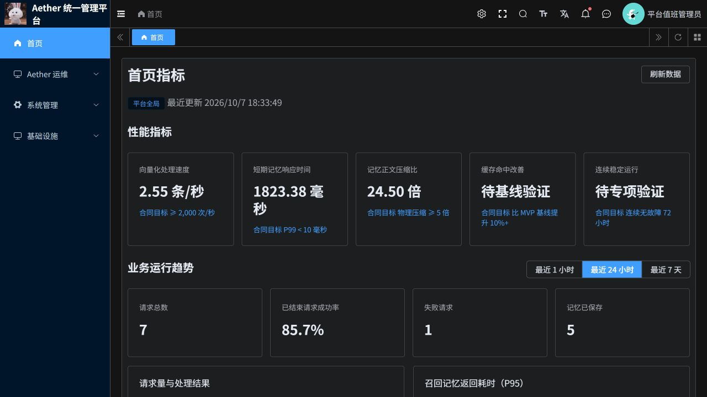

# 首页三项性能指标：更新与验收说明

三项指标已接入真实执行数据并部署到若依云端首页。观测时间：2026-10-07T10:33:10.541Z（UTC）。

访问：[若依后台](https://aether-p3-demo-c50c3827.southeastasia.cloudapp.azure.com/ruoyi/)。代码分支：`codex/scheduling-task-triage-20261007`；[PR #20](https://github.com/csdnk/Ather-AIAgent/pull/20)，基线为 `codex/project-workspace`，未自动合并。

## 指标口径与实测结果

| 指标 | 实测 | 样本与口径 |
| --- | --- | --- |
| 向量化处理速度 | 2.55 条/秒 | 最近 24 小时 144 次成功调用，共 144 条向量；成功向量条数 ÷ 成功批次累计耗时 |
| 短期记忆响应时间 | P99 1823.38 毫秒 | 最近 24 小时 27 次成功的 Working 记忆正文完整读取，包含权限核验、存储读取及结果复核 |
| 记忆正文压缩比 | 24.50 倍 | 1 个已发布且质量通过的正文产物；累计原始 99,440 字节 ÷ 压缩后 4,059 字节 |

向量化速度反映当前调用观测，不能替代并发容量压测，也没有证明合同 2,000 次/秒目标。短期记忆 P99 当前高于 10 毫秒目标，本次接通测量，没有完成响应时间优化。该耗时不含向量检索和模型生成，与业务趋势中的“召回记忆返回耗时”不同。

压缩样本来自一份明确标记的合成长文验收资料，走正常文档上传、摘要、压缩、质量校验及发布流程。资料含重复运维条目，不能代表真实业务语料。该数值是语义正文压缩比，原文仍保留，不能宣称整体物理存储已减少 24.50 倍或合同物理压缩目标已验收。

## 实现与权限

- 复用已持久化的真实节点日志和压缩产物，不增加每次推理或读取的额外指标写入。向量化过滤失败、健康检查和不合法数值；按返回条数计量。
- Working 读取按真实记忆类型匹配，采用 nearest-rank P99。日志限最近 24 小时、最多 10,000 条；截断时页面标明“部分样本”。本次没有截断。
- 元数据采用独立只读连接上的 3 条批量 SQL，避免业务全局锁和逐条查询；性能接口不查询 Temporal 实时工作流，也不附加无关业务统计。
- 平台管理员才能读取全局三项数据，管理服务和 P3 双层校验；既有租户范围业务趋势保持隔离。压缩任务和产物按部署、Temporal namespace 绑定筛选。
- 无样本时区分尚未触发、处理中、失败、尚无发布产物；统计读取异常不伪装为零。指标口径放在悬浮提示中，没有新增常驻说明小字。

## 验收证据

| 编号 | 验证 | 结果 |
| --- | --- | --- |
| HM-01 | Python 定向回归 | 124 项通过，覆盖聚合、压缩状态、权限、独立只读 SQL 和接口分支 |
| HM-02 | 若依前端测试 | 89 项通过；修改文件格式、静态检查与差异检查通过 |
| HM-03 | 独立代码复核 | 发现并修复统计持有业务锁及 N+1 查询的问题，复核无阻塞发现 |
| HM-04 | 真实 PostgreSQL 聚合 | 三项 available，独立读取与聚合约 1.258 秒 |
| HM-05 | 最终部署后的管理接口 | 三项 available，本次端到端接口请求 1.663 秒；不是压力测试 |
| HM-06 | 浏览器 | 首页显示三项实测数值，截图见下 |
| HM-07 | 真实文档压缩 | 正常上传后摘要、压缩成功，产物已发布且质量通过 |

完整 pytest 收集受既有 `aether_agent_memory.p2.generated` 缺失阻断，没有宣称全量测试通过。已有 httpx/Starlette 弃用警告与本次改动无关。原始执行记录、部署快照和构建输入清单保存在独立工作区，未放入用户交付目录。

HM-07 文件 SHA-256：`9e554e609b00d2f34198d91e943b0e8d223fb579497367c74bfe6d563e26a962`。上传编号：`a657d252-fcf2-4cf7-9529-5bd8887a67e4`。记忆编号：`bf5c416071f6104652ece27eda86260e30d0336869112690eb56a9e03db920cc`。入口任务编号：`f3e36fb00efcac1750bcb1674a86441fa450ce52801a4d521846438d2234c5d2`。资料为专用验收样本，尚未清理；没有删除其他用户资料，也没有修改压缩阈值。

## 发布与回滚

资源组 `aetherstore-p3`，AKS `aks`，namespace `aether-p3-demo`，ACR `aetherp3acr`。仓库前缀 `aetherp3acr-a0bne7gpetbpdcbq.azurecr.io/aether/ruoyi-`。

| 组件 | 本次最终镜像摘要 | 本次任务开始前回滚摘要 |
| --- | --- | --- |
| p3 | `sha256:b49a99ad9ffb19537bbb2a8302c8d6f4ea75b0f3624b8e6711ee8af26eb8d52d` | `sha256:01534f69bfb3ed8a880e3635801f62cb6ddacace176dd5ebda708322a1989d37` |
| platform | `sha256:ce7d0d9aa535c531943c8873d9d3350168d60e70389115beae50e400d0417661` | `sha256:24f6557def384b763de27b5f99da24133f039ca65b28c8e75977a4cf0ae3fa2c` |
| frontend | `sha256:437650a1829d50ee85c4cfc86e1709a2767b8b27924b6e056963305a08ae6583` | `sha256:10129a4e9f5a41e250da8b63fb75469dfef241fc327a34ab5867f3fbebd1c2c8` |

已核对运行 Pod 镜像摘要与目标一致。Java 网关及独立旧版系统未改动；无数据库结构迁移。回滚时将上述三个 Deployment 恢复到原摘要，保留业务数据与验收样本，并验证首页和原有业务入口。

