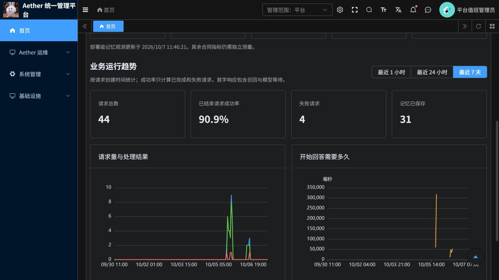

# 首页仅保留指标与测量情况说明

2026-10-07 更新。PR：[19](https://github.com/csdnk/Ather-AIAgent/pull/19)。

首页移除告警状态提示、快捷入口、观测覆盖说明、服务可用性和最近告警列表，仅保留性能卡片、业务统计、趋势图及必要的加载错误/权限提示。左侧功能菜单保留。

## 为什么合同指标没有实测值

上一版实现了展示页面和部分聚合查询，没有完成五项合同指标各自的测量接入。四项卡片仍显示固定待测状态，单纯刷新不会产生数据。这是测量链路尚未完成，不是若依不能展示。

| 指标 | 当前事实 | 还缺什么 |
| --- | --- | --- |
| 向量化吞吐 ≥2000 QPS | 首页未连接吞吐测量结果 | 按明确负载、并发、环境运行压测，保存成功吞吐和错误率，接入结果 |
| 短期记忆 P99 <10ms | 首页未连接短期记忆接口延迟分布 | 在对应接口采集耗时、样本数及时间窗口，计算 P99；不能用模型首字响应替代 |
| 长期记忆物理压缩 ≥5倍 | 10月7日11:34在线查询：有效已发布正文样本为0 | 先完成真实压缩产物与质量校验，再核对物理存储占用；正文长度比不是全系统物理压缩率 |
| 缓存命中率比MVP改善10%+ | 首页未接入当前命中率和基线对比结果 | 记录命中/未命中，并在同一负载下运行MVP基线与当前策略，明确百分比/百分点口径 |
| 72小时无故障运行 | 首页未接入连续稳定性验收记录 | 定义故障判据，持续观测72小时并保存中断与恢复记录；容器运行时长不能替代 |

目前真实采集并显示的是业务请求量、完成/失败数、已结束请求成功率、记忆保存数和首字响应P95。它们来自业务持久化记录，与上述合同性能验收指标范围不同。

本次只精简首页并核对数据来源，没有运行2000 QPS压测、创建压缩样本、执行基线对比或启动72小时验收。

## 验证与发布

- 前端60项测试通过，包含Vue SFC编译；修改页面ESLint和格式检查通过。
- 前端镜像构建、ACR发布和AKS前端滚动更新完成，核对实际容器imageID。
- 前端源码提交：`c4f6ab22`；镜像摘要：`sha256:96de583c4377f237f487872e34bb879cc118958d32dadcf51910277ce7fca640`。
- 只更新前端，P3业务服务和任务worker未在此次发布中重启。
- 回退前端可恢复上一不可变镜像 `sha256:43046ee8e7a88406c13c753b39b04fa9c2845fd487b7e584cf48007fc8d4b611`；无数据迁移。
- 既有Python CI问题未修改；本次不宣称完整CI或合同性能验收通过。

