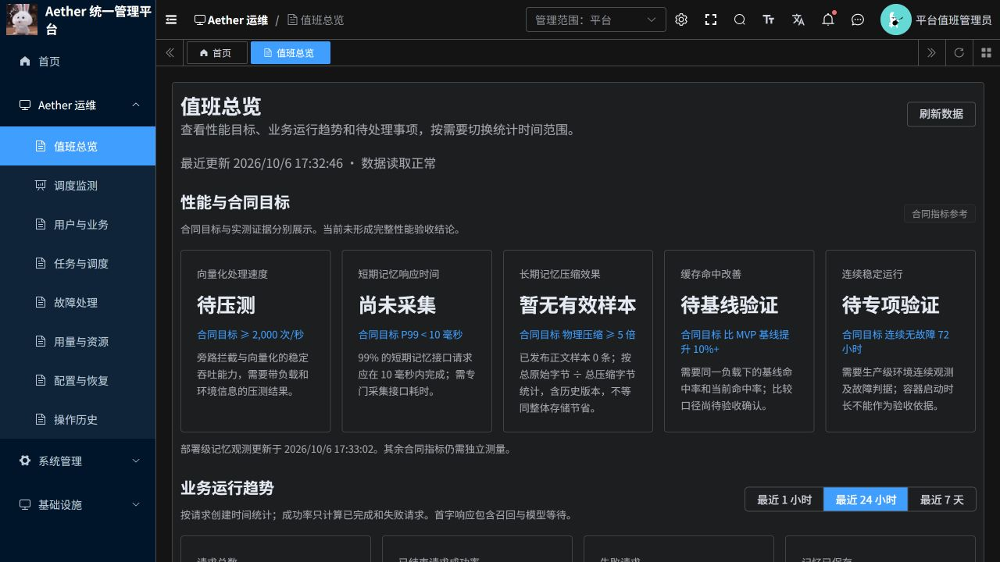
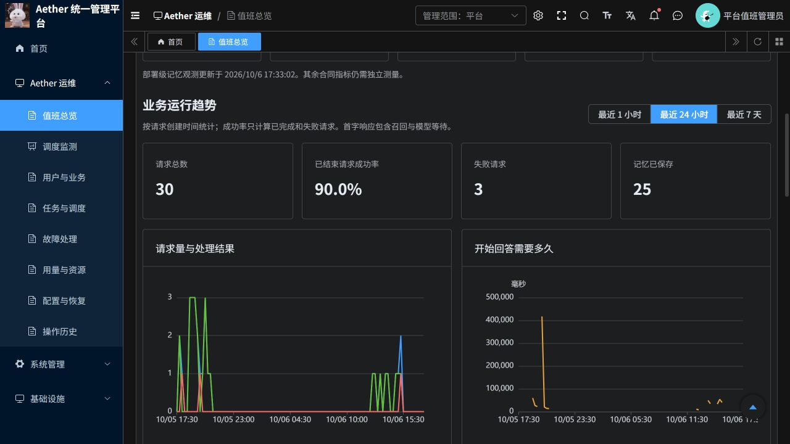
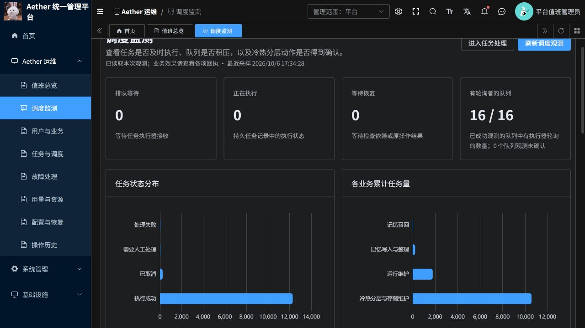
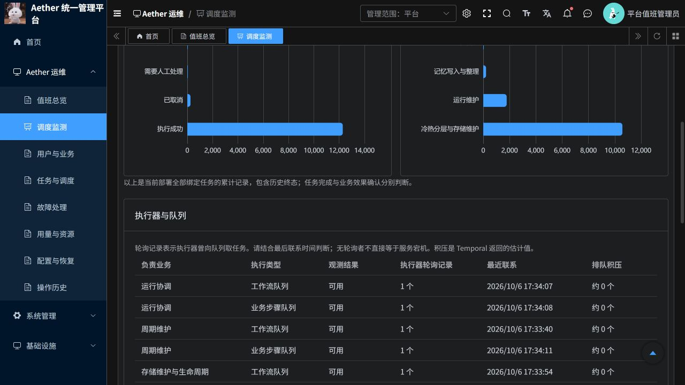

# 首页性能指标与调度监测交付说明

交付日期：2026-10-06。适用分支：`codex/ruoyi-platform-20261006`；后续 PR [#19](https://github.com/csdnk/Ather-AIAgent/pull/19)（原 PR #18 已合并），目标分支 `codex/project-workspace`。

## 使用入口

- 首页：https://aether-p3-demo-c50c3827.southeastasia.cloudapp.azure.com/ruoyi/
- 调度监测：https://aether-p3-demo-c50c3827.southeastasia.cloudapp.azure.com/ruoyi/aether/scheduling
- 平台管理员在「Aether 运维 → 调度监测」查看部署全局调度，在「进入任务处理」跳转原有任务处置页。
- 企业管理员的业务指标按所属企业筛选。部署级调度菜单不分配给企业管理员，诊断接口同时实施服务端权限检查。

## 首页提供什么

顶部展示合同的五项性能目标：向量化吞吐、短期记忆接口 P99、长期记忆物理压缩、相对 MVP 基线的缓存命中改善、连续 72 小时稳定运行。

下方是实时业务统计，可切换最近 1 小时、24 小时、7 天：请求总量、已结束请求成功率、失败数、记忆已保存数、请求量与处理结果趋势、首字响应 P95 趋势。无首字响应样本的时间段留空。基础服务状态、告警和业务入口继续保留。

业务统计读取持久化的会话请求记录，按请求创建时间分组；成功率分母仅含已完成和失败请求。记忆已保存数与回答完成数分别统计，不将收到请求、完成回答和保存记忆混为一谈。接口只返回聚合值，不返回用户会话正文。

## 调度监测提供什么

| 区域 | 运维人员可以判断的问题 |
| --- | --- |
| 排队、执行、等待恢复 | 当前部署绑定的任务还有多少未结束，多少在等执行器或恢复 |
| 任务状态与业务分布图 | 累计任务主要属于哪个业务，历史终态与处理中任务如何分布 |
| 执行器与队列 | 哪类业务有执行器取任务，最近联系是什么时候，Temporal 估计积压多少 |
| 周期维护 | 周期任务是否绑定、工作流是否运行、是否返回下一次执行时间 |
| 冷热分层动作 | 提升或降低存储层级等意图的进度、存储回执、真实或模拟执行方式 |

队列轮询记录不是实时心跳，需要结合最近联系时间。任务分布包括历史任务，累计失败不代表当前仍有活动故障。分层动作只统计与当前部署任务绑定的记录，按动作编号去重，展示最近 30 条；请求迁移不等于存储已经完成迁移。取消、恢复等操作继续集中在原任务处理页。

## 本次观测与性能验收边界

初次上线验证时最近 24 小时有 32 个请求：完成 29、失败 3、待完成 0、记忆已保存 27；已结束请求成功率 90.625%。首字响应有效样本 21 个，P95 约 59.66 秒。17:32 最终截图的 24 小时滑动窗口已变为 30 个请求、3 个失败、25 个记忆已保存，成功率 90.0%；窗口滑动会使旧记录移出。以上响应时间是模型开始回答的业务耗时，不能作为 Redis 短期记忆接口 P99 的证据。

2026-10-06 17:27（北京时间）的调度采样：等待、执行、等待恢复各 0；16/16 个队列有轮询记录，各队列估计积压为 0。周期工作流运行中，未返回下一次执行时间；当前部署未记录冷热迁移动作。

当前没有有效的已发布压缩正文样本；页面显示「暂无有效样本」。未来有样本时按原始总字节/压缩总字节计算，限定于已发布、质量通过且任务属于当前部署的正文产物，包含历史版本；不等同整个物理存储的压缩倍数。只有有效样本存在时展示字节对比图。

向量化稳定 2000 QPS、短期记忆 P99 <10ms、物理压缩 ≥5 倍、命中率比 MVP 提升 10%+、72 小时无故障仍需各自的测量和验收证据。页面没有把合同目标填成实测值，没有伪造达标结果。缓存改善的百分比/百分点口径仍需验收确认。

## 验证记录

- Python 平台与 AKS runner 单元测试：175 通过、74 跳过；1 项已有依赖弃用警告。跳过用例不计为通过。
- 前端：60 项测试通过，包含运维业务展示与 Vue SFC 编译检查。修改的 Vue 文件 ESLint、格式检查通过，生产镜像构建成功。
- PostgreSQL 真引擎聚合验证：以临时表构造两企业数据，核对企业隔离、成功率、P95 和空样本。事务回滚，无业务数据写入。
- 在线权限验证：平台管理员包含调度菜单；企业管理员不包含调度菜单；企业管理员调用部署级诊断返回业务码 403。
- 页面验证：中文说明、真实业务指标、时间范围切换、调度图表和队列列表。深色主题增加清晰的坐标文字与较弱网格；先加载首页概况，再读取较慢的部署诊断。
- 按用户要求，原有两次 Python CI 失败不修复：`render_candidate.py` 的 11 项 E501 与 `test_quotas.py` 的 1 项 I001 仍保持。完整 CI、上游全量类型检查和已有 Stylelint 问题不宣称通过。

## 部署与回退

镜像发布至 ACR `aetherp3acr`，部署命名空间 `aether-p3-demo`。Python/P3 沿用 Recreate 部署方式，部署前确认无等待中的聊天请求，避免相同执行域重叠启动 worker。最后的页面优化只更新前端。

新增菜单由 `AgentJYS-main/ruoyi/backend/sql/mysql/aether-dashboard.sql` 增量创建，菜单编号 60015，仅授予平台运维角色 51001；新环境的初始化 SQL 同步包含该菜单。无需迁移业务数据。

回退时先核对当前镜像和执行域，恢复本次发布前保存的不可变镜像与配置；P3/平台不得让新旧 worker 同时运行。前端可独立回退。菜单可以保留供后续版本使用，若撤回入口则仅解除角色对应菜单授权并刷新菜单缓存。保留历史业务记录、日志与告警。

本次发布过程曾出现短暂的服务连接告警，后续采样已自动恢复；保留告警历史，不将它们删除。单次就绪、队列无积压和页面可访问不构成 72 小时稳定性或高可用验收。

## 页面截图

## 本次运行镜像

| 组件 | 不可变镜像摘要 |
| --- | --- |
| frontend | `sha256:43046ee8e7a88406c13c753b39b04fa9c2845fd487b7e584cf48007fc8d4b611` |
| platform | `sha256:54ca12133bc29cbc29a5d1ffdac9cbe646d0dbf33e288f38de4b8180fe5bde6a` |
| p3 | `sha256:4a23a8c380532822b409d238bfe11357a7dd38340cd07eb0e3a319e2f96cec03` |

前端最终源码提交：`699cee7d`。平台与 P3 功能提交：`6f7bbcf9`。部署验证保存了源文件哈希与容器实际 imageID 的对应关系。
