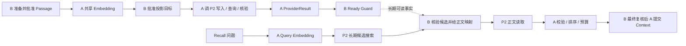

# A 组 P2 接口设计讲解稿

适用会议：2026-09-16 接口设计讲解。建议时长 25 分钟。基于 2026-09-15 工作区资料和当前源码静态核对。

主表：[S01 A组_P2接口逻辑字段表_清理版.xlsx](A组_P2接口逻辑字段表_清理版.xlsx)。完整材料和版本提示见[文档导航](02_相关文档导航.md)，所有字段的精确定位见[表格与代码定位](03_表格与代码定位.md)。

## 1. 先讲清楚这份表解决什么问题

这份表是 A 组对 P2 的逻辑输入输出契约。讲解的目标，是让参与者理解每次调用的发起条件、请求数据来源、返回值含义，以及下游怎样使用它。先展示流程，再挑关键字段解释。

| 参与方 | 对结果负责的部分 | 与本表的关系 |
|---|---|---|
| A：Recall / Embedding | 最终召回上下文正确性；共享向量化；向量投影执行与核验机制 | 组织调用，验证返回结果，向 B 交付机制结论 |
| B：Remember | Memory 主事实、版本、生命周期、正文映射、片段及投影构建批准、领域 Ready | 提供请求的业务依据，消费 A 的机制结果 |
| P2 / Provider | 向量存储与搜索、正文物理读取、操作及对象状态 | 执行物理能力并返回可核对的事实 |
| C：Operate | 表示的放置策略、调层 / 预热动作和生命周期 | 消费访问事实；维护可选预热路径相关动作 |
| RF | 共享身份、事务 / 持久化 / CAS 等运行基础能力 | 承接可靠执行、记录和事件基础设施 |

**ContentStorePort / OBJ-001 的 Owner 仍是 B。** A 依照 B 的正文契约使用读取能力，不因此变成正文事实或内容存储 Port 的 Owner。VectorSearchPort 与 VectorProjectionPort 归 A。

可直接说：“B 决定哪些记忆当前有效、允许读什么；P2 给出实际存储结果；A 把两者连接起来，对最终上下文负责。”

依据：[S08 AetherStore_P3_Work_Map_V0.4.1.md](资料/分工与项目理解/总设计/AetherStore_P3_Work_Map_V0.4.1.md)；[S03 A组_接口层功能框架节点_V0.1.md](资料/分工与项目理解/Recall流程/A组_接口层功能框架节点_V0.1.md)；[S07 召回与记忆形成接口对接需求_V0.1.md](资料/分工与项目理解/Recall流程/运行时详细设计_V0.1/召回与记忆形成接口对接需求_V0.1.md)。

## 2. 两条链路怎样连接

上半条链解决“怎样形成可用的长期投影”，下半条链解决“怎样使用记忆回答当前请求”。两条链共用 Embedding 能力和模型空间约束。

Query 向量只用于本次搜索；Passage 向量在 B 批准后进入投影写入。纯向量化到返回向量与绑定信息为止，不自动分块、写库或更新 B 的领域状态。

### Working 在哪里

Recall 内部依据授权、Scope 和类型选择 working_only / long_term_only / combined。working_only 从 B 取得 Working 候选，跳过 Query Embedding 和长期搜索；combined 同时需要 Working 与长期来源。故障发生后保留原来的来源要求，按结果规则表达缺失或降级。

图中展开的是依赖 P2 的长期分支。Working 已带可信内联正文时，不必再通过 P2 下载一遍。Prewarm 则发生在正文加载阶段，不能与 Working 混为一个来源。

依据：[S04 召回与P2接口对接需求_V0.1.md](资料/分工与项目理解/Recall流程/运行时详细设计_V0.1/召回与P2接口对接需求_V0.1.md)；[S05 召回流程详细设计_V0.1.md](资料/分工与项目理解/Recall流程/运行时详细设计_V0.1/召回流程详细设计_V0.1.md)；[S07 召回与记忆形成接口对接需求_V0.1.md](资料/分工与项目理解/Recall流程/运行时详细设计_V0.1/召回与记忆形成接口对接需求_V0.1.md)。

## 3. 在线读链：从问题到可信正文

### 3.1 RP2-01：search，先找到候选

**翻表：接口字段第 2～18 行；公共字段第 24～36、48～54 行。**

调用前，A 已经拿到经过校验的 Query 向量。`P2SearchInput` 中按四组解释：

| 字段组 | 代表字段 | 为什么需要 |
|---|---|---|
| 本次查询 | query_vector、usage=Query | 传真实向量，明确它是搜索用途 |
| 可比较空间 | model_binding、retrieval_space_ref | 维度相同不保证模型和空间兼容 |
| 搜索范围 | scope、memory_types、occurred_after / before | 在获准租户、业务范围、记忆类型和时间内搜索 |
| 结果界限 | top_k | 控制候选规模，并与响应 requested_k 对照 |

`P2SearchResult` 不只有 hits，还包含 `completion`、`partial_reason`、查询绑定和完成依据。每个 `P2SearchHit` 给出稳定投影引用、原始排名 / 分数、模型及 Schema 信息。

举例：“top_k=10 返回 3 条，可能就是只有 3 条合格候选，也可能只完成了部分检索。不能仅靠列表长度判断，必须看 complete / partial / failed 的语义和依据。”

搜索结果用于候选发现，随后还要经 B 确认 Memory 的当前版本、权限、生命周期和领域可读性。P2 的相似度不能代替这些资格事实。

### 3.2 B 核验：把投影命中转成允许读取的准确正文

这一步不新增一个 P2 接口。A 向 B 查询候选对应的 Memory / chunk / version 和当前资格；B 给出准确的 `P2ContentTarget`、获准字节范围及可信摘要依据。

这里要区分两个版本：`memory_version` 是记忆业务版本；`content_version` 是准确正文版本。两者必须有可信映射，但字符串不必相同。搜索命中旧版本时，不能直接拿新正文填进去。

### 3.3 BP2-02 / RP2-02：共享正文读取

**翻表：接口字段第 19～33 行；公共字段第 37～47、116～125 行。**

`P2ContentReadInput` 只需抓住五个部分：

| 字段 | 讲解方式 |
|---|---|
| content | 读哪个准确内容目标及版本 / 表示 |
| approved_range | B 批准读哪些字节；采用半开区间 [start,end) |
| expected_hash | 对这些准确字节的可信完整性依据 |
| version_condition_ref | 本次读取使用的版本条件或等价约束 |
| max_response_bytes | 本次响应可接收的上限 |

返回后，A 对 `data`、`returned_range`、`returned_bytes`、`meta` 和 `evidence` 一起校验。`status=ok` 仍要与目标、范围、字节数及摘要一致；失败残留字节不作为可信正文。

**口头例子：**“B 批准 memory-42 的 memory-v3 对应正文 [0,15)。这里是 15 字节，不是 15 个汉字。读取到的版本、范围或摘要不符，就不能拿去组装 Context。”这是设计示意，非生产报文。

前面讨论的重复在这里统一：Remember 的 BP2-02 与 Recall 的 RP2-02 都依赖正文读取这一公共能力。保留两个需求编号，消费者写 Remember、Recall；两侧仍可有不同适配视图，不要求所有 DTO 名称合并。

### 3.4 正文之后还要做什么

A 用已经验证的正文做内容身份去重、来源排名融合和预算控制，消费 B 的语义 / 冲突策略；对全部可组装候选及替补做最终复核，再可靠提交 ContextPack、终态和必要追踪记录。当前 P2 表覆盖这条链中的外部存储依赖，完整 Context 规则见主设计。

依据：[S04 召回与P2接口对接需求_V0.1.md](资料/分工与项目理解/Recall流程/运行时详细设计_V0.1/召回与P2接口对接需求_V0.1.md)；[S05 召回流程详细设计_V0.1.md](资料/分工与项目理解/Recall流程/运行时详细设计_V0.1/召回流程详细设计_V0.1.md)；[S02 总体流程框架节点.md](资料/分工与项目理解/总设计/总体流程框架节点.md)。

## 4. 投影维护链：从 Passage 到可核验结果

### 4.1 写之前先固定三个东西

**翻表：公共字段第 14～36、75～89 行。**

1. **目标：** `P2ProjectionTarget` = 租户 + Provider + 检索空间 + `ProjectionIdentity` + 可用的物理目标引用。五元组是 memory_id、chunk_id、memory_version、model_version、projection_schema_version，不能缩成一个 memory_id。
2. **载荷：** `P2ProjectionPayload` 包含 Passage 真实向量、模型绑定、源摘要、输入绑定、正文表示 / 版本 / 范围，以及过滤元数据。
3. **原操作身份：** 稳定的 `provider_idempotency_key` 和 `request_fingerprint`。同一个操作重试沿用原身份，同键不同语义要冲突。

### 4.2 RP2-06：upsert，提交准确投影

**翻表：接口字段第 34～48 行。**

请求用 `P2UpsertInput` 把 target、payload、幂等键、指纹和适用条件绑在一起。返回 `P2MutationResult`，表达原操作关联、P2 操作进度，以及当前已取得的对象事实。

讲解重点是“被受理”和“完成可用”的差别：`accepted` 或 `running` 说明存在可信操作进度；`completed` 之后仍须核对准确载荷和完成条件，不能直接把 B 的 ProjectionState 改成 Ready。

### 4.3 RP2-07 与 RP2-08：两种查询各回答一个问题

**翻表：接口字段第 49～78 行。**

| 项目 | query_operation（RP2-07） | get_projection（RP2-08） |
|---|---|---|
| 问题 | 这次写入 / 删除执行到哪里了？ | 这个准确对象实际是什么状态？ |
| 主要关联 | 原动作、幂等键、请求指纹、已取得的远端操作引用 | 完整目标、预期写入指纹、关联操作、是否回读载荷 |
| 主要结果 | 原操作状态、副作用 / 重发依据 | 存在性、实际载荷、持久化、可查询性、删除与屏障事实 |
| 典型使用 | 写请求超时、回包丢失、恢复 | 操作结束后核验；对象 / 索引事实复查 |

两种逻辑能力可以由 P2 一次 RPC 同时承接，但两类事实都需要解释。

**故障例子：**P2 已经写成功，返回包在网络中丢失。A 先按原键查原操作，再核验对象；不能换一个键再写。操作查询返回普通 `not_found`，也不等于确认从未生效或以后不会迟到生效。

`P2ResubmitAssessment` 说明前次无效果、无迟到效果和同键重发许可，并带有效窗口与依据。一个 `retryable=true` 不能单独替代这些条件。

### 4.4 三层状态必须分别讲

| 层次 | 对象 / 状态 | 谁解释 |
|---|---|---|
| P2 原操作 | P2MutationResult.operation_status：accepted / running / completed / rejected / failed / not_found / unknown | P2 提供原事实，A 适配 |
| A 机制结果 | ProviderResult：ACCEPTED / PENDING / READY / FAILED / UNKNOWN | A 基于操作与准确对象证据形成 |
| B 领域状态 | ProjectionState 与 Ready Guard | B 核对当前 Memory、正文、模型和完整构建目标后决定 |

upsert 机制 READY 要有准确对象存在、实际载荷绑定、持久化及可查询性的完成依据。`index_queryable=true` 不表示任何一句 Query 都一定命中它。

即使 memory-v3 的机制 READY 真实成立，若 B 当前已经是 memory-v4，也不能用旧结果更新当前领域状态。多 chunk 还要由 B 检查完整构建清单。

### 4.5 RP2-09：删除还要防止旧写复活

**翻表：接口字段第 79～93 行。**

删除请求固定准确目标、删除幂等键 / 指纹、适用条件和历史 upsert 关联。返回仍使用 `P2MutationResult`。删除机制 READY 表示删除动作完成，需要准确对象消失、退出可查询状态，以及旧在途写不会重新创建它的依据。

例子：“先发的 upsert 还在执行，后发的 delete 先完成。若没有屏障，旧 upsert 晚到就可能把对象写回来。只看到一次 delete 成功响应不能结束核验。”

同五元组 rebuild 在当前设计中明确拒绝；普通幂等重试仍指向历史操作。新版本构建和旧目标清理由 B 编排。

依据：[S04 召回与P2接口对接需求_V0.1.md](资料/分工与项目理解/Recall流程/运行时详细设计_V0.1/召回与P2接口对接需求_V0.1.md)；[S06 召回数据定义_V0.1.md](资料/分工与项目理解/Recall流程/运行时详细设计_V0.1/召回数据定义_V0.1.md)；[S07 召回与记忆形成接口对接需求_V0.1.md](资料/分工与项目理解/Recall流程/运行时详细设计_V0.1/召回与记忆形成接口对接需求_V0.1.md)；[C05 models.py](资料/AgentJYS-main/src/aether_agent_memory/recall/vector_projection/models.py)；[C06 ports.py](资料/AgentJYS-main/src/aether_agent_memory/recall/vector_projection/ports.py)。

## 5. 公共对象怎么讲，避免逐行念表

本表有 117 条接口字段记录、131 条公共字段记录；合计 248 条，按“对象名＋字段名”去重后是 186 项。复用对象在多个位置展开，记录重复不等于开发重复。

| 公共概念 | 类型 / 字段 | 它回答的问题 |
|---|---|---|
| 调用身份 | P2CallContext、P2ResponseContext | 哪次调用、哪个租户 / Provider、原期限和响应关联是什么？ |
| 权限范围 | Scope | 在哪个已获准范围操作？null 维度不能直接解释为无限范围 |
| 模型空间 | EmbeddingModelBinding | 哪个模型版本、维度、dtype、预处理和检索空间？ |
| 逻辑 / 物理目标 | ProjectionIdentity、P2ProjectionTarget、P2ContentTarget | 哪个 chunk / 版本 / 表示、哪个真实资源？ |
| 字节与完整性 | ByteRange、Hash | 哪些准确字节，按什么编码和算法核对？ |
| 事实依据 | P2Evidence | 返回结论依据什么事实、适用范围和观察时间？ |
| 错误与效果 | P2Error、P2ResubmitAssessment | 失败能否解释、有无副作用、是否能安全重发？ |

**摘要不要混用：** source_hash 对应源输入；vector_hash 对应按模型 dtype 编码后的真实向量；metadata_hash 对应规范元数据；request_fingerprint 对应操作语义。当前 `P2ProjectionMetadata` 是 scope、memory_type、occurred_at 三个字段，模型绑定在载荷的独立位置。

类型列直接使用当前 Python 定义：例如 `Identifier`、`UInt`、`Hash`、`EmbeddingModelBinding`。`contract_ref` 是字段名，其代码类型是 `Identifier`；不需要发明一个不存在的 `ContractRef` 类。

`T | None` 表示允许值为空。当前契约的这些字段仍要求出现，必须显式给出 None；对象存在性未知和明确不存在不能都填 false。

**证据不等于再建设一个服务。** 它可以来自有明确含义的原始响应及契约，保存后可关联追溯。只有引用字符串或请求摘要回显，不能证明实际载荷正确落库。

依据：[S06 召回数据定义_V0.1.md](资料/分工与项目理解/Recall流程/运行时详细设计_V0.1/召回数据定义_V0.1.md)；[S04 召回与P2接口对接需求_V0.1.md](资料/分工与项目理解/Recall流程/运行时详细设计_V0.1/召回与P2接口对接需求_V0.1.md)；[C01 contracts.py](资料/AgentJYS-main/src/aether_agent_memory/p2/contracts.py)；[C02 contract_types.py](资料/AgentJYS-main/src/aether_agent_memory/runtime/contract_types.py)；[C03 models.py](资料/AgentJYS-main/src/aether_agent_memory/recall/embedding/models.py)。

## 6. 后面三项能力为何单独放

**翻表：接口字段第 94～118 行。**

| 项目 | 作用 | 讲解边界 |
|---|---|---|
| RP2-03 head_content / checksum | 按需核对准确版本的大小、编码及摘要信息 | 已由可信映射 / 读取结果覆盖时，不要求每次额外 HEAD |
| RP2-04 read_with_cache | 读取已获准的同版本热副本，失败按规则回退 | 可选能力；不能改变候选资格和正文正确性要求 |
| RP2-05 放置 / 来源观察 | 随读取说明实际 Provider、层级、代际及动作关联 | 附带事实，不强制新增独立 RPC；不由期望层级推导实际层级 |

主讲先解释正式读链。S19 曾建议本期关闭可选 Prewarm，材料保留其设计位置，但本次没有证据把该建议说成已经落实的运行配置。

表中的 `P2MutationResult` 被 upsert、查询操作、delete 共用；`P2ContentReadResult` 被正式读取和缓存读取共用。这是公共返回结构的复用。A 与 C 的操作恢复有相似设计原则，但对象、Owner、状态与屏障语义不同，不能因此合并成一个业务接口。

依据：[S04 召回与P2接口对接需求_V0.1.md](资料/分工与项目理解/Recall流程/运行时详细设计_V0.1/召回与P2接口对接需求_V0.1.md)；[S13 召回与调度优化接口对接需求_V0.1.md](资料/分工与项目理解/Recall流程/运行时详细设计_V0.1/召回与调度优化接口对接需求_V0.1.md)；[S19 Recall_P2反馈影响与可接受性评估_V0.1.md](资料/分工与项目理解/总设计/Recall_P2反馈影响与可接受性评估_V0.1.md)；[S02 总体流程框架节点.md](资料/分工与项目理解/总设计/总体流程框架节点.md)。

## 7. 当前实现范围：可直接采用的汇报说法

“当前这份表所列对象和字段都有实际代码定义。共享 Embedding 已迁入 Recall 模块，并有真实 ONNX 本地运行记录；请求受理、自动选路、幂等和执行骨架也已有实现。完整 Recall 后续阶段和生产 P2 接口贯通是另外一层工作，不能用对象定义完成来替代。”

| 层次 | 当前可依据的结论 | 依据 |
|---|---|---|
| 表格字段与类型 | 本次对 248 条记录逐项 AST 核对，名称和注解一致；去重为 186 项 | 本包 03 定位清单；C01～C03 |
| P2 方法边界 | 搜索、读取、投影 Provider 的 Protocol 已定义；B→A 另有 VectorProjectionPort | C04、C06 |
| 新受理入口 | admit → start，目前停在 RUNNING_REQUEST_VALIDATION | S09、S10 |
| 既有 Query 实验 | 可准备 Query / P2SearchInput 并到 RUNNING_VECTOR_SEARCH；尚未接成新骨架完整链 | S12、S10 |
| 真实 Embedding | S11 记录 ONNX 的 Query / Passage 本地验证；授权和记录仍用测试替身 | S11 |
| 投影行为验证 | 有状态模拟器覆盖写、查、可见性及删除屏障；生产投影协调器不能按模拟器算完成 | S12、C08 |
| 完整外部链 | 本次没有执行真实 P2 / RF 联调或完整 Context 端到端验证 | S09～S12；本次工作范围 |

**代码路径更新：** `EmbeddingModelBinding` 当前实际定义在 `recall/embedding/models.py`。原 `b1/semantic/models.py` 只做兼容导出。Excel 中已有部分源码批注保留生成时路径；本次不改表，现场定位使用本包 03 的新路径。

`P2SearchInput` 等逻辑 DTO 也不是已发布 Proto 的同名字段。当前仓库 VectorService 声明了 InsertVector、DeleteVectors、SearchVector 等方法；没有看到原操作查询和准确向量目标核验的直接对应 RPC。ObjectService 有 GetObject、GetObjectRange、HeadObject。声明存在和全部语义验证通过是两件事。

这里不复述旧文档的测试总数作为本次测试结果。本次做的是资料整理、类型静态核对和原文副本校验。

依据：[S09 flow_architecture.md](资料/AgentJYS-main/docs/flow_architecture.md)；[S10 recall_admission_first_batch.md](资料/AgentJYS-main/docs/recall_admission_first_batch.md)；[S11 recall_embedding_native.md](资料/AgentJYS-main/docs/recall_embedding_native.md)；[S12 RECALL_EMBEDDING_FIRST_BATCH_20260914.md](资料/AgentJYS-main/docs/RECALL_EMBEDDING_FIRST_BATCH_20260914.md)；[C07 aether_engine.proto](资料/AgentJYS-main/engine/proto/aether_engine.proto)。

## 8. 常见追问与答法

| 可能被问到 | 建议回答 |
|---|---|
| 为什么不用一个 memory_id 做全部关联？ | 同一个 Memory 有多个 chunk、业务版本、模型和投影 Schema；准确目标必须能区分它们。租户、Provider、空间还在五元组之外约束目标。 |
| 为什么维度相同还要模型绑定？ | 向量空间还受模型权重、预处理、用途编码和输出规则影响；维度只说明长度。 |
| contract 里都有定义，是不是只差调用一下？ | 定义解决结构与校验；适配还要解释实际 RPC 数据、授权、版本、完成性及故障恢复，并经过真实联调。 |
| object_present=true 为什么还不能 Ready？ | 对象可能载荷错误、未持久化或不可查询；还要证明绑定和完成条件，再交 B 执行领域判断。 |
| 再搜索一次，命中就证明写成功吗？ | 搜索不是准确对象核验；未命中也不证明不存在。应使用准确目标和载荷 / 可查询性事实。 |
| 既然有 checksum，为何还要范围和编码？ | 同一文本在不同编码、不同字节范围下摘要不同；必须知道比较的是哪一份字节。 |
| ETag 可以直接当 hash 吗？ | 不能默认。它通常是不透明版本 / 实体标签，只有明确契约支持时才能按对应语义使用。 |
| 不支持 S3 Versioning 就不能做吗？ | 可以通过不可变 key 与可信版本映射提供等价的准确版本定位，重点是同 key 不被不同内容覆盖 / 复用。 |
| 缓存读取失败是否一定降级？ | 若在原预算内回退到同版本可信正式正文并成功，不单因缓存失败自动降级。 |
| 为什么字段里允许 unknown / null？ | 分布式调用可能只知道受理或暂时无法观察；未知不是否定事实，也不是正常空结果。 |
| 为什么移除了“待确认”等文字？ | 清理的是表格里的对接过程备注。接口的事实语义和实现边界仍应按源码与有效记录说明，不能将删备注解释成所有能力已完成。 |
| 是否需要把 248 行全部讲完？ | 主讲接口分组和关键保证，嵌套字段按公共对象展开；用定位清单回答具体字段。 |

## 9. 用三个场景收尾

1. **正常读取：** Query 在正确空间检索 → B 核验 → 读取批准版本和范围 → 校验通过 → 最终复核和 Context 交付。
2. **写成功但回包丢失：** 保留原键 → 查询原操作 → 核验准确对象 → A 形成机制结果 → B 决定领域状态。
3. **删除与迟到写竞争：** 对准确目标执行删除 → 核验退出查询及对象消失 → 取得旧写屏障依据，防止复活。

结束语：“这套接口把目标、操作和结果依据串起来，让正常调用能接通，也让超时、旧版本和并发删除时有明确处理路径。今天主要请大家理解两条流程的交接和每种结果的采用条件。”
