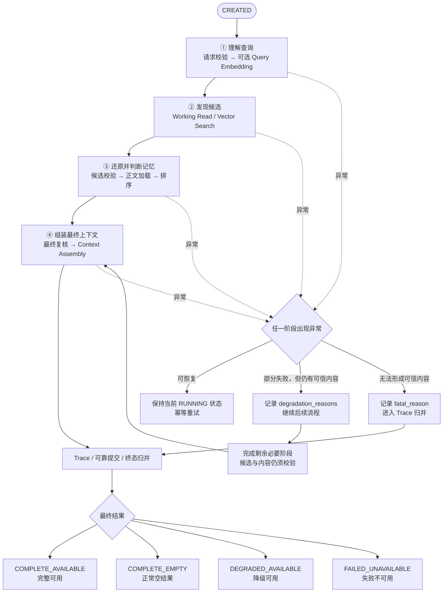

# AetherStore P3 Recall Overall Flow V1.0

> 文档定位：Recall / Context Serving 总体业务与工程流程说明。
>
> 2026-09-05 更新：纳入 Working 当前读取、长期向量召回及可选 Prewarm 内容加载。本文只定义 Recall 流程及其自有状态机；详细设计见[运行时详细设计 V0.1](运行时详细设计_V0.1/召回流程详细设计_V0.1.md)。其他流程和共享能力只引用原契约、列使用需求；不因 A 同时负责某能力而取得在本包定义它的权限。
>
> 2026-09-06 更新：上游不传模式，P4 只做网关；Recall 按 scope_union_v1 自行选路。规则唯一维护于[详细设计 3.1](运行时详细设计_V0.1/召回流程详细设计_V0.1.md#31-校验请求并选路)，本次不新增执行状态或外部接口。

---

## 0. 文档目的

本文从端到端 Outcome 出发，说明 Recall 如何把一次业务 Query 转换为可供上层智能体使用的 Context Pack，并说明：

1. Recall 的业务入口和最终 Outcome；
2. Recall 的端到端主数据流；
3. 数据流中的关键 Domain Object 与 State；
4. Recall 自己拥有的事实和从其他负责人处消费的事实；
5. Recall 与 Remember、Operate、P2 的 Handoff；
6. 当前仍需继续明确的流程问题。

---

## 1. Recall 的业务定位

2026-09-07 开发基线同步：本状态机保持原十三态；调用前预算、全候选最终复核、提前失败来源记录和截止后提交恢复以[详细设计](运行时详细设计_V0.1/召回流程详细设计_V0.1.md)为准，字段见[数据定义](运行时详细设计_V0.1/召回数据定义_V0.1.md)。未确认的跨模块契约和责任统一见[独立待确认清单](运行时详细设计_V0.1/跨模块待确认事项_V0.1.md)。

### 1.1 业务入口

Recall 从一次 Query 开始（P3 提供接口，上游经 P4 网关转交）。上游提供 Scope、筛选、Trace、deadline 和 Token Budget，不提供 retrieval_mode。Recall 校验当前 session/task、各来源授权及类型约束，对适用来源取并集：两类均适用为 combined，只有一类适用为对应单来源模式；没有适用来源则拒绝。Working 仍限当前会话/任务；未知授权不当作未授权，来源故障不改变模式。

在总体流程层面，业务入口可以表示为：

```text
Recall Input
  ├─ Query
  ├─ Request Context / Scope
  ├─ Retrieval Constraint（已有类型/时间筛选；不含模式或来源控制）
  └─ Context Token Budget / tokenizer / deadline
```


Recall 内部再产生 SourceSelection、retrieval_mode 及派生 allowed_sources，随标准请求固定；这三个值不是网关参数。

### 1.2 最终 Outcome

Recall 的最终 Outcome 是返回给 Gateway / 上层 Agent 的 Context Pack（有效上下文包）。内容来自当前 Scope 的 Working 读取，或由 Embedding 定位的长期候选；两者都必须通过 B 的事实、权限与版本校验，并使用可验证的当前 Working 内容或正式 Canonical Content。

```text
Working Read / Embedding 定位长期候选
  → Memory 事实校验（长期候选额外校验 Ready Projection）
  → 验证 Working 内容 / 加载 Canonical Payload（可选 Prewarm 加速）
  → 选取 Query 相关内容片段
  → Context Pack
```

Context Pack 的核心组成包括：

- 可直接供上层 Agent 使用的相关有效内容片段；
- Memory、版本、类型和来源标识；
- content_ref、Provenance 和 Evidence；
- 相关度顺序、冲突说明和过滤信息；
- complete、degraded、failed、empty、truncated 等结果状态。

一个满足业务目标的 Context Pack 应具备以下性质：

- **Relevant**：内容与当前 Query 相关；
- **Valid**：Memory 在最后复核时点有效；长期候选额外使用当前匹配的 Ready Projection；
- **Authorized**：没有越过调用者的数据 Scope；
- **Canonical**：使用 B 认可、版本与完整性可验证的 Working 内容、Original 或 Artifact；热副本必须匹配相同正式内容描述；
- **Traceable**：可以追踪 Memory、版本、来源和证据；
- **Explainable**：可以说明候选为何入选、被过滤、降级或截断；
- **Bounded**：结果满足 Token Budget；
- **Status-aware**：能够区分完整、降级和失败结果。

因此，Recall 的核心工程目标是：

> 在给定 Query、身份范围和上下文预算的条件下，找到相关候选，排除无效 Memory，从正式内容中取得可信片段，并向 Gateway / 上层 Agent 返回正确、有效、可解释、可追踪且状态明确的 Context Pack。

### 1.3 端到端责任

本文中的 A 指其 Recall 职责。Recall 对 Query 到 Context Pack 的整体结果负责，需要定位问题并向原 Owner 提交使用问题；这不意味着可以定义、复制为权威或改写其他流程的对象与事实。共享 Embedding/VectorProjection 的非 Recall 职责只按现有 Work Map 引用。

> **A不是对所有底层事实负责，而是对这些事实经过 Recall 处理后形成的 Context Pack 是否可信、可用且状态真实负责。**

---

## 2. Recall 主数据流

### 2.1 总体流程

```text
【阶段一：理解查询】
Query
  → Recall Request Validation
  → Query Embedding（仅长期分支；Working-only 记录跳过）

【阶段二：发现候选】
  → Working Read / Vector Search（按模式启用，分别记录完整性）

【阶段三：还原并判断记忆】
  → Candidate Validation
  → Memory Read
  → Working 内容校验 / Canonical Load（可选 Prewarm + 权威回退）
  → Rank / Decay / Conflict Handling

【阶段四：组装最终上下文】
  → Context Assembly / 发出前事实复核 / Token Budget
  → Context Pack

【全链路观测与反馈】
  → Recall Trace / AccessTrace
```

这条链路可归纳为四个阶段：

```text
理解查询 → 发现候选 → 还原并判断记忆 → 组装最终上下文
```

向量承担长期语义候选发现，Working Read 提供当前 Scope 的有界候选；Prewarm 是内容读取加速，不是第三个必需逻辑来源。两来源的候选统一经过事实校验、内容验证、排序和预算处理。具体字段与加载时序以 A-01 为准。

正常主数据流与异常分支共用同一个 `RecallExecution` 状态机，具体状态定义、流转规则、恢复方式和终态条件见 2.2。

### 2.2 RecallExecution 状态机

`RecallExecution` 是一次 Recall 请求从 Query 到 Context Pack 的唯一执行状态机。它以第 2 章的八个流程阶段为主状态，不再另外维护一套“阶段完成状态”。

八个 `RUNNING_*` 状态表示当前正在执行的阶段。进入某个阶段状态前，上一阶段的输出必须已经形成可靠检查点；因此服务重启后可以从当前阶段幂等恢复，而不必重复已经确认完成的前置阶段。

#### 2.2.1 状态说明

| 状态 | 业务含义 | 进入该状态时已经具备的可靠检查点 |
|---|---|---|
| `CREATED` | Recall 请求已经创建，尚未开始处理 | Query 引用、Caller Context、Scope、Token Budget、幂等键和 Trace 上下文 |
| `RUNNING_REQUEST_VALIDATION` | 正在校验 Query、权限边界和请求约束 | RecallExecution 创建成功 |
| `RUNNING_QUERY_EMBEDDING` | 为长期分支生成并校验 Query Vector；Working-only 记录跳过 | 请求校验、mode、Scope、Budget 和 Retrieval Constraint |
| `RUNNING_VECTOR_SEARCH` | 沿用状态名，执行本次 Working/Vector 候选发现并汇总 | Query 向量，或明确的跳过/长期分支失败检查点 |
| `RUNNING_CANDIDATE_VALIDATION` | 结合 B 的事实验证两类候选 | 各来源 Candidate Set、完整性、失败范围和稳定引用 |
| `RUNNING_CANONICAL_LOAD` | 验证 Working 内容或按 content_ref 加载正式内容；允许 Prewarm 回退 | 保留/过滤结论，Memory 及适用的 Projection 版本快照 |
| `RUNNING_RANKING` | 正在执行排序、衰减和冲突处理 | 可安全使用的 Canonical Payload 集合及校验结果已保存 |
| `RUNNING_CONTEXT_ASSEMBLY` | 组装、发出前事实复核与最终 Token 计数 | 排序结果、策略版本、冲突和证据信息已保存 |
| `RUNNING_TRACE_FINALIZATION` | 正在完成 Trace、持久化结果原因并执行终态归并 | Context Pack 草稿、`confirmed_empty`、`degradation_reasons` 或 `fatal_reason` 已保存 |
| `COMPLETE_AVAILABLE` | 流程完整结束，并形成完整可用的 Context Pack | 非空 Context Pack，且没有降级原因和致命错误 |
| `COMPLETE_EMPTY` | 在本请求模式、filter、limit 和快照内确认没有合格内容 | 必需来源全部确认，空 Pack，confirmed_empty=true，无故障不确定性 |
| `DEGRADED_AVAILABLE` | 存在部分失败或缺失，但仍形成安全可用的 Context Pack | 非空 Context Pack，且存在明确的 `degradation_reasons` |
| `FAILED_UNAVAILABLE` | 无法形成任何可信 Context Pack | 没有安全可用内容，且存在明确的 `fatal_reason` |

`truncated` 是 Token Budget 裁剪标志，不是 RecallExecution 状态。只要裁剪符合既定规则并保留必要来源和证据，它不会自动导致 `DEGRADED_AVAILABLE`。

#### 2.2.2 总体状态流转

下面的简化图用于展示 Recall 正常主链路和三类统一异常出口；具体八阶段状态及转换条件以本节后续状态流转表和各阶段说明为准。



```text
CREATED
  → RUNNING_REQUEST_VALIDATION
  → RUNNING_QUERY_EMBEDDING
  → RUNNING_VECTOR_SEARCH
  → RUNNING_CANDIDATE_VALIDATION
  → RUNNING_CANONICAL_LOAD
  → RUNNING_RANKING
  → RUNNING_CONTEXT_ASSEMBLY
  → RUNNING_TRACE_FINALIZATION
  → COMPLETE_AVAILABLE
     或 COMPLETE_EMPTY
     或 DEGRADED_AVAILABLE
     或 FAILED_UNAVAILABLE
```

状态机允许三类受控分支：

```text
确认没有候选或所有候选均被权威事实确认无效
  （本模式的必需来源都已确认，且没有未解决的缺失）
  → 设置 confirmed_empty
  → RUNNING_CONTEXT_ASSEMBLY
  → RUNNING_TRACE_FINALIZATION
  → COMPLETE_EMPTY

部分失败但仍有可信候选
  → 记录 degradation_reasons
  → 继续后续必要阶段
  → RUNNING_TRACE_FINALIZATION
  → DEGRADED_AVAILABLE

不可恢复失败且无法形成可信内容
  → 记录 fatal_reason
  → RUNNING_TRACE_FINALIZATION
  → FAILED_UNAVAILABLE
```

#### 2.2.3 状态流转表

| 当前状态 | 事件或条件 | 处理动作 | 下一状态 |
|---|---|---|---|
| `CREATED` | `RecallStarted` | 固定执行 ID、幂等键和初始请求事实 | `RUNNING_REQUEST_VALIDATION` |
| `RUNNING_REQUEST_VALIDATION` | 请求合法且权限、Scope、Budget 完整 | 持久化校验结果 | `RUNNING_QUERY_EMBEDDING` |
| `RUNNING_REQUEST_VALIDATION` | 请求无效、越权或缺少必要边界 | 写入 `fatal_reason` | `RUNNING_TRACE_FINALIZATION` |
| `RUNNING_QUERY_EMBEDDING` | Query Vector 生成并通过模型契约校验 | 保存向量引用和模型信息 | `RUNNING_VECTOR_SEARCH` |
| `RUNNING_QUERY_EMBEDDING` | working_only 不需要向量 | 保存跳过原因，长期来源为 not_requested | `RUNNING_VECTOR_SEARCH` |
| `RUNNING_QUERY_EMBEDDING` | 暂时超时或依赖短暂不可用 | 保留当前检查点并受控重试 | 保持当前状态 |
| `RUNNING_QUERY_EMBEDDING` | combined 的长期向量失败，仍有预算读取 Working | 记录长期来源不可用及降级原因，不写请求级 fatal | `RUNNING_VECTOR_SEARCH` |
| `RUNNING_QUERY_EMBEDDING` | long_term_only 无可信向量，或请求已无安全继续条件 | 写入 fatal_reason | `RUNNING_TRACE_FINALIZATION` |
| `RUNNING_VECTOR_SEARCH` | 启用的 Working/Vector 来源汇总后存在候选 | 保存 Candidate Set、各来源完整性及失败范围 | `RUNNING_CANDIDATE_VALIDATION` |
| `RUNNING_VECTOR_SEARCH` | 所有必需来源完整、零候选且无 gap | 设置 confirmed_empty | `RUNNING_CONTEXT_ASSEMBLY` |
| `RUNNING_VECTOR_SEARCH` | 只取得部分可信候选 | 保存候选并记录 `degradation_reasons` | `RUNNING_CANDIDATE_VALIDATION` |
| `RUNNING_VECTOR_SEARCH` | 无法取得或确认任何可信结果 | 写入 `fatal_reason` | `RUNNING_TRACE_FINALIZATION` |
| `RUNNING_CANDIDATE_VALIDATION` | 存在通过校验的候选 | 保存逐条保留／过滤结论 | `RUNNING_CANONICAL_LOAD` |
| `RUNNING_CANDIDATE_VALIDATION` | 所有候选被权威排除，且必需来源完整、无其他 gap | 设置 confirmed_empty | `RUNNING_CONTEXT_ASSEMBLY` |
| `RUNNING_CANDIDATE_VALIDATION` | 部分候选无法验证，但仍有已验证候选 | 隔离无法验证候选并记录 `degradation_reasons` | `RUNNING_CANONICAL_LOAD` |
| `RUNNING_CANDIDATE_VALIDATION` | 因依赖故障导致所有候选都无法验证 | 写入 `fatal_reason` | `RUNNING_TRACE_FINALIZATION` |
| `RUNNING_CANONICAL_LOAD` | Working/正式内容已验证，或 Prewarm 失败但权威回退成功 | 保存安全内容集合，成功回退仅记诊断 | `RUNNING_RANKING` |
| `RUNNING_CANONICAL_LOAD` | 部分内容加载失败，但仍有安全内容 | 过滤失败候选并记录 `degradation_reasons` | `RUNNING_RANKING` |
| `RUNNING_CANONICAL_LOAD` | 所有合格候选内容均不可用，且无可信 Working 内容 | 写入 fatal_reason | `RUNNING_TRACE_FINALIZATION` |
| `RUNNING_RANKING` | 排序和冲突处理完成 | 保存排序结果、策略版本和证据 | `RUNNING_CONTEXT_ASSEMBLY` |
| `RUNNING_RANKING` | 冲突无法消解但可以安全呈现 | 保存 Conflict Group 并记录 `degradation_reasons` | `RUNNING_CONTEXT_ASSEMBLY` |
| `RUNNING_RANKING` | 没有可安全呈现的内容或排序不可恢复失败 | 写入 `fatal_reason` | `RUNNING_TRACE_FINALIZATION` |
| `RUNNING_CONTEXT_ASSEMBLY` | 完整 Context Pack 组装完成 | 记录预期结果 `COMPLETE_AVAILABLE` | `RUNNING_TRACE_FINALIZATION` |
| `RUNNING_CONTEXT_ASSEMBLY` | 确认空结果并完成空 Context Pack | 记录预期结果 `COMPLETE_EMPTY` | `RUNNING_TRACE_FINALIZATION` |
| `RUNNING_CONTEXT_ASSEMBLY` | 使用部分可信内容完成组装 | 记录预期结果 `DEGRADED_AVAILABLE` | `RUNNING_TRACE_FINALIZATION` |
| `RUNNING_CONTEXT_ASSEMBLY` | 无法形成可追踪的可信 Context Pack | 写入 `fatal_reason` | `RUNNING_TRACE_FINALIZATION` |
| `RUNNING_CONTEXT_ASSEMBLY` | 最终复核确认候选已失效 | 移除旧条目，重算预算；只有所有来源已确认且无 gap 才设置 confirmed_empty | `RUNNING_TRACE_FINALIZATION` |
| `RUNNING_CONTEXT_ASSEMBLY` | 最终复核未知或有内容但全部组装不下 | 隔离未知条目；无可交付内容则记录失败原因，不伪造 empty | `RUNNING_TRACE_FINALIZATION` |
| `RUNNING_TRACE_FINALIZATION` | Trace 完整且 Context Pack 完整可用 | 冻结 Context Pack 和终态 | `COMPLETE_AVAILABLE` |
| `RUNNING_TRACE_FINALIZATION` | Trace 完整且 `confirmed_empty=true` | 冻结空 Context Pack 和终态 | `COMPLETE_EMPTY` |
| `RUNNING_TRACE_FINALIZATION` | 有安全内容且存在 `degradation_reasons` | 冻结降级原因、缺失范围和 Context Pack | `DEGRADED_AVAILABLE` |
| `RUNNING_TRACE_FINALIZATION` | 没有安全内容且存在 `fatal_reason` | Fail Closed，冻结失败原因 | `FAILED_UNAVAILABLE` |
| `RUNNING_TRACE_FINALIZATION` | 结果/Trace/Outbox 的可靠提交失败或未知 | 不返回 Context；按原 commit_id 查证，使用独立恢复额度 | 保持当前状态 |
| `RUNNING_TRACE_FINALIZATION` | 业务截止已过且尚未确认最终结果 | 存储侧原子返回已有结果，或隔离所有旧代提交并一致保存无正文失败包/Trace/Outbox | 已提交则保持原终态；新失败提交确认后 FAILED_UNAVAILABLE；未知仍保持当前状态 |
| `RUNNING_TRACE_FINALIZATION` | 提交恢复窗口或次数耗尽 | 协调标记 attention_required，保留幂等与提交证据，停止自动调用 | 保持当前状态；不伪造业务终态 |
| 任一终态 | 重复请求 | 当前权限与 B 事实复核通过才重放原结果；否则拒绝重放并要求新请求 | 保持原终态 |
| 任一终态 | 重复事件或迟到回调 | 只记审计，不回退终态 | 保持原终态 |

所有进入终态的表项，都以结果、最小 Trace 和必要 Outbox 已可靠一致提交为前提；未提交成功不对外声称终态已冻结。完整结果判定输入与场景见 A-02。

#### 2.2.4 异常、恢复与终态约束

所有阶段统一使用以下五类处理规则：

| 异常类型 | 状态处理 | 后续措施 |
|---|---|---|
| 单候选已知无效或数据缺失 | 保持当前 RUNNING 阶段 | 权威无效记录排除；故障缺失记录 gap；继续其他候选 |
| 阶段暂时失败且可以安全重试 | 保持当前 `RUNNING_*` | 从当前阶段检查点幂等重试，不重复已完成阶段 |
| 阶段部分失败但仍有可信内容 | 记录 `degradation_reasons` 后继续 | 完成剩余必要阶段，最终进入 `DEGRADED_AVAILABLE` |
| 所有必需来源已确认且无候选、无 gap | 设置 confirmed_empty 并跳转 Context Assembly | 形成请求边界内的正常空结果 |
| 不可恢复失败且没有可信内容 | 设置 `fatal_reason` 并跳转到 Trace Finalization | 记录原因后进入 `FAILED_UNAVAILABLE` |

每次状态修改必须校验当前状态、租约令牌和 state_version。外部读取先可靠预占次数和字节，阶段输出先保存检查点再推进。重启先恢复原账本；旧在途调用实际字节未知则按预留全额扣费。已完成输出仅在仍有效时推进；缺少输出也须有原次数、字节和业务 deadline 才能继续，不能把重跑阶段当作新额度。Query 推理由共享 Embedding 唯一协调，Recall 只附着原共享调用。

提交查证以固定 commit_id/generation 及唯一结果为准，普通 not_found 不等于旧提交不会迟到。业务截止后停止推理、搜索、正文读取和 B 复核，只用 P-22～P-24 查证原提交或原子隔离后失败收尾；不能提交新的可用结果。已提交终态不回退，新到达的同键请求仅在自己的接入预算内复核并重放原结果。P-16=0 清除可重放正文，但保留恢复所需执行、幂等和提交标记。详细分支见主设计 3.8.1。

终态必须满足以下互斥条件：

```text
有安全内容 + 无降级原因 + 无致命错误
  → COMPLETE_AVAILABLE

无合格内容 + 必需来源全部确认 + confirmed_empty=true + 无结果不确定性
  → COMPLETE_EMPTY

有安全内容 + degradation_reasons 非空 + 无致命错误
  → DEGRADED_AVAILABLE

无安全内容 + fatal_reason 非空
  → FAILED_UNAVAILABLE
```

若不变量冲突，禁止发布内容；持久化可用时记录失败并收尾，持久化不可用时保持未终态并返回暂不可用。四个终态均不可回退；新搜索创建新的 RecallExecution。预算前有合格内容但全部装不下属于失败不可用，不是正常空。详细优先级见 A-02。

### 2.3 可召回 Memory 的就绪条件

这里描述的是**单条 Memory／Projection 能否进入 Recall 结果的资格条件**，不是整个 Recall 流程的全局启动条件。Recall 可以随时处理 Query；某条 Memory 尚未 Ready 时，只过滤该条候选并继续处理其他已就绪候选，不会因为一条 Memory 未完成而阻塞整次 Recall。

Working 与长期候选使用不同的附加就绪条件：

- Working：B 确认 Active + Working、当前 session/task、权限、版本、TTL，以及正文或引用可验证；不等待 Projection Ready。
- 长期：除当前有效的 Memory、权限与正式内容外，还要求 B 确认匹配的 ProjectionState=Ready。

以下 Projection 构建顺序只适用于长期向量召回：

```text
Memory 已形成
  → Passage Embedding 已生成
  → Vector Projection 已写入 Provider
  → ProviderResult 已返回
  → B 已完成版本校验
  → ProjectionState = Ready
```

P2 Provider 返回 READY 只是机制执行结果。只有 B 在校验 Memory、Model 和 Schema 等版本关系后，才能把领域状态转为 Ready。Recall 不应把 ProviderResult.READY 直接当作 Memory 可召回事实。

### 2.4 阶段一：Recall Request Validation

该阶段确认一次 Recall 是否具备继续执行的基本条件，包括：

- Query 是否可以处理；
- 调用身份和数据 Scope 是否存在；
- Token Budget 是否有效；
- Trace 上下文是否可以贯穿后续流程；
- Retrieval Constraint 是否能被当前 Recall 流程理解。
- 新执行是否已按 scope_union_v1 产生模式与来源理由；Working/combined 是否具有已授权的 session/task；tokenizer 与 deadline 是否有效。客户端模式/来源字段拒绝，重试沿用原绑定，不重新选路。

该阶段的作用是阻止明显无效或无边界的请求进入 Embedding 和后端检索流程。

原始输入的格式、授权、选路和准入先在创建执行前检查，拒绝时不虚构 RecallExecution。下表中的失败流转只适用于已受理后复核发现的问题；内部模式在创建标准请求时已固定，RUNNING_REQUEST_VALIDATION 不根据实时健康重新选路。

本阶段对应 `RUNNING_REQUEST_VALIDATION`。正常完成后进入 `RUNNING_QUERY_EMBEDDING`；请求本身不可执行时，记录失败原因并转入 Trace 归并。

| 情况 | 导致结果 | 状态流转 | 后续处理 |
|---|---|---|---|
| 请求校验全部通过 | 可以开始 Recall 主链路 | `RUNNING_REQUEST_VALIDATION → RUNNING_QUERY_EMBEDDING` | 持久化校验结果，进入 Query Embedding |
| Query 缺失、为空或当前能力无法处理 | 无法形成明确检索意图 | `RUNNING_REQUEST_VALIDATION → RUNNING_TRACE_FINALIZATION → FAILED_UNAVAILABLE` | 拒绝请求，由上游修正 Query 后重新发起 |
| 身份、Tenant、Scope 或授权信息缺失 | 无法证明后续读取已获授权 | `RUNNING_REQUEST_VALIDATION → RUNNING_TRACE_FINALIZATION → FAILED_UNAVAILABLE` | 终止 Recall，不进入 Embedding，并记录安全原因 |
| 已受理请求的 SourceSelection、模式和策略绑定存在且仍合法 | 采用受理时已固定的模式 | `RUNNING_REQUEST_VALIDATION → RUNNING_QUERY_EMBEDDING` | 只核验原绑定；缺失/损坏按失败收尾，不在运行阶段重新选路 |
| Token Budget 或 Retrieval Constraint 非法，且没有冻结默认值 | 无法约束最终检索与组装范围 | `RUNNING_REQUEST_VALIDATION → RUNNING_TRACE_FINALIZATION → FAILED_UNAVAILABLE` | 终止 Recall，由上游修正请求 |

### 2.5 阶段二：Query Embedding

A 使用 SemanticEmbeddingCapability，以 Query Usage 将 Query 转换为查询向量。

该调用仅服务长期来源。working_only 保存“无需向量”的检查点并继续候选发现。combined 的向量分支失败且仍有预算时，记录长期来源 gap 后继续 Working；不能提前把整个请求判为失败。

本阶段必须保持 Query Embedding 与 Passage Embedding 的语义空间一致，重点关注：

- Embedding Usage 正确；
- Model Version 一致；
- Vector Dimension 一致；
- Query Vector 可用于目标 Projection 空间；
- 结果能够关联当前 Recall Trace。

本阶段输出的是用于候选发现的语义表示，不是最终业务结果。

本阶段对应 `RUNNING_QUERY_EMBEDDING`。正常向量、Working-only 跳过，以及仍可读取 Working 的 combined 长期分支失败，都进入候选发现；只有没有安全继续路径时才转入 Trace。

| 情况 | 导致结果 | 状态流转 | 后续处理 |
|---|---|---|---|
| Query Vector 生成成功且模型契约一致 | 可以执行向量搜索 | `RUNNING_QUERY_EMBEDDING → RUNNING_VECTOR_SEARCH` | 持久化 Vector、Model Version、Dimension 和 Usage |
| working_only 不要求向量 | 正常跳过模型调用 | `RUNNING_QUERY_EMBEDDING → RUNNING_VECTOR_SEARCH` | 保存跳过原因，长期来源记 not_requested |
| Embedding 暂时超时或能力短暂不可用 | 暂时无法取得 Query Vector | 保持 `RUNNING_QUERY_EMBEDDING` | 按原 caller_ref/caller_request_ref 附着或补取，P-08 只计调用次数；共享推理单独受 EM-04 控制 |
| Embedding 持续失败，但 combined 仍有预算读取 Working | 长期来源不可用 | `RUNNING_QUERY_EMBEDDING → RUNNING_VECTOR_SEARCH` | 不执行 Vector Search；继续 Working，保留降级原因 |
| 模型/维度/Schema/输出值不兼容 | 禁止使用该向量 | combined 可继续 Working；long_term_only 转 Trace 失败归并 | 不切换到未经批准的模型；记录 EMBEDDING_CONTRACT_MISMATCH |
| long_term_only 无可信向量，或整次 deadline 已无安全继续条件 | 无法取得可信来源 | `RUNNING_QUERY_EMBEDDING → RUNNING_TRACE_FINALIZATION → FAILED_UNAVAILABLE` | 收尾补齐两份 SourceReadResult；未调用必需来源 unavailable，未请求来源 not_requested；只有可靠提交后才正式失败 |

### 2.6 阶段三：Vector Search

A 在 RUNNING_VECTOR_SEARCH 阶段按模式发现候选：Working 通过 B 已认可的当前读取能力，长期通过 VectorSearchPort。本文不自定义 B 的视图或 API。状态名沿用历史定义，不代表 Working 必须查询向量。两来源在此阶段可并行，并分别保存完整性。

本阶段的主要职责是：

- 在允许的 Scope 内检索候选；
- 获取候选的稳定引用、相关度和版本信息；
- 保留候选与 Projection、Model 的关联信息；

Vector Search 输出可能相关的 Projection；Working Read 输出当前范围内的 Working 候选。统一候选集仍须完成后续事实与内容校验。Prewarm 不作为独立候选发现来源。

本阶段对应 `RUNNING_VECTOR_SEARCH`。取得可信候选后进入校验；只有所有必需来源确认完成、无候选且无 gap 才进入空 Pack 组装；必需来源有故障且没有可信候选时转入失败归并。

| 情况 | 导致结果 | 状态流转 | 后续处理 |
|---|---|---|---|
| 启用的来源返回至少一个可信候选 | 可以继续校验 | `RUNNING_VECTOR_SEARCH → RUNNING_CANDIDATE_VALIDATION` | 保存各来源结果及 gap；另一必需来源失败时不冒充完整 |
| 所有必需来源完整完成、零候选且无 gap | 本请求范围内已确认无候选 | `RUNNING_VECTOR_SEARCH → RUNNING_CONTEXT_ASSEMBLY` | 设置 confirmed_empty；单个来源为空不能提前结束 combined |
| 搜索暂时超时且结果尚不可确认 | 暂时无法判断是否存在候选 | 保持 `RUNNING_VECTOR_SEARCH` | 查询 Port 权威状态或按策略重试，不把超时当作空结果 |
| Working/Vector 任一失败，但另一来源有可信候选 | 来源覆盖不完整 | `RUNNING_VECTOR_SEARCH → RUNNING_CANDIDATE_VALIDATION` | 隔离失败来源，继续已取得候选 |
| 必需来源有故障且汇总后无可信候选 | 无法确认结果 | `RUNNING_VECTOR_SEARCH → RUNNING_TRACE_FINALIZATION → FAILED_UNAVAILABLE` | 不把超时、partial 零条或 Redis 故障当正常空 |
| 只取得部分候选 | 候选发现不完整 | `RUNNING_VECTOR_SEARCH → RUNNING_CANDIDATE_VALIDATION` | 记录 `degradation_reasons`，继续校验已取得候选 |
| 单个候选缺少可解析稳定引用或必要的版本/排名证据 | 该候选无法追踪和校验 | 保持 `RUNNING_VECTOR_SEARCH`，完成候选整理后再决定下一状态 | 隔离并记录 gap；契约排名证据完整时，缺少原始分数本身不构成失败 |

### 2.7 阶段四：Candidate Validation 与 Memory Read

A 根据候选稳定引用调用 B 提供的 MemoryReadCapability，使用 B 的 Memory 事实校验候选。

校验关注点包括：

- Memory 是否存在；
- Memory 是否属于当前 Scope；
- Memory 是否为当前有效版本；
- Memory 业务状态是否允许被召回；
- 长期候选是否对应当前 Ready Projection；Working 是否符合当前 session/task、TTL 和 Working Read 合同；
- Memory 是否存在冲突、过期、替代或证据缺失；
- Recall 后续排序需要的语义属性是否可用。

被过滤的候选及过滤原因应进入 Recall 的解释信息。A 不应在本地重新维护一套 Memory 生命周期、权限或版本事实。

本阶段对应 `RUNNING_CANDIDATE_VALIDATION`。存在有效候选时进入内容加载；全部候选被权威排除且所有必需来源已确认、无其他 gap 时可组装空 Pack；存在故障未知且无可信候选时失败。

| 情况 | 导致结果 | 状态流转 | 后续处理 |
|---|---|---|---|
| 存在通过版本、状态、Scope 和权限校验的候选 | 候选可以加载正式内容 | `RUNNING_CANDIDATE_VALIDATION → RUNNING_CANONICAL_LOAD` | 保存逐条保留／过滤结论及 Memory／Projection 版本快照 |
| Memory 已删除、过期、被替代或版本不匹配 | 该候选已确认不能使用 | 保持 `RUNNING_CANDIDATE_VALIDATION` | 过滤该候选，继续处理其他候选 |
| 长期候选的 ProjectionState 不是 Ready | 该长期候选尚不具备资格 | 保持 `RUNNING_CANDIDATE_VALIDATION` | 过滤，由 B 构建/重建；有效 Working 不执行此 Guard |
| Candidate 超出 Scope 或权限校验不通过 | 继续读取会越过授权边界 | 保持 `RUNNING_CANDIDATE_VALIDATION` | 立即过滤候选并记录安全原因，不加载正文 |
| MemoryRead 部分失败或部分事实缺失 | 受影响候选无法被证明有效 | `RUNNING_CANDIDATE_VALIDATION → RUNNING_CANONICAL_LOAD` | 隔离无法验证的候选，记录 `degradation_reasons`，继续处理已验证候选 |
| 所有候选被权威排除，且所有必需来源完整、无其他 gap | 本请求范围内确认无可用 Memory | `RUNNING_CANDIDATE_VALIDATION → RUNNING_CONTEXT_ASSEMBLY` | 设置 confirmed_empty；若还有来源/事实未知，则转失败归并 |
| 因 MemoryRead 故障导致所有候选都无法验证 | 无法形成任何可信候选 | `RUNNING_CANDIDATE_VALIDATION → RUNNING_TRACE_FINALIZATION → FAILED_UNAVAILABLE` | 不把“无法验证”当作“已确认无效”，恢复 MemoryRead 后重新执行 |

### 2.8 阶段五：Canonical Load

候选通过 Memory 校验后，A 验证 B 提供的 Working 正文，或依据 B 的 Memory → content_ref 映射加载正式内容。Prewarm 只作为正式内容加载的可选加速路径，必须匹配 B 批准的版本、范围和 hash；失败时在剩余 deadline 内回退到权威内容。

每次下载/回退/重试前按主设计 3.5.1 原子预占调用次数和正文 byte，按稳定顺序准入。Working 内联正文已在发现调用中记账，本阶段不重复扣费。实际量未知时保守扣预算并保留统计未知；无法限制响应大小的适配不启用。

本阶段把 Working/长期候选还原为最终能够进入上下文的可信内容，并识别：

- Content 是否存在；
- Content 是否完整；
- Checksum 是否一致；
- 当前内容是否与 Memory 和 Projection 版本相符。

B 拥有 Memory 到 content_ref 的映射事实；Durable Store Provider 拥有 Payload 的物理事实。A 消费这两类事实，但不取得其所有权。

本阶段对应 `RUNNING_CANONICAL_LOAD`。获得可信 Canonical Payload 后进入 `RUNNING_RANKING`；部分加载失败时携带降级原因继续；全部不可用时转入 Trace 归并。

| 情况 | 导致结果 | 状态流转 | 后续处理 |
|---|---|---|---|
| 保留候选的 Working/正式内容均通过校验 | 获得可排序内容 | `RUNNING_CANONICAL_LOAD → RUNNING_RANKING` | 保存内容引用、Checksum、来源和版本证明 |
| Prewarm miss、过期、被释放或校验失败，但权威回退成功 | 加速失败但内容完整 | `RUNNING_CANONICAL_LOAD → RUNNING_RANKING` | 只记缓存诊断，不自动降级，不由 A 重建预热副本 |
| `content_ref` 缺失或指向错误版本 | 无法定位当前 Memory 的正式内容 | 保持 `RUNNING_CANONICAL_LOAD` | 隔离该候选，记录 `degradation_reasons`，由 B修复映射 |
| Payload 不存在、读取超时或后端不可用 | 候选无法还原为正式内容 | 保持 `RUNNING_CANONICAL_LOAD` | 过滤该候选，记录 `degradation_reasons`，继续加载其他候选并定位 Durable Store Provider |
| Checksum 不一致、内容损坏或版本不匹配 | 加载内容不可信 | 保持 `RUNNING_CANONICAL_LOAD` | 禁止内容进入 Context Pack，记录校验原因和 `degradation_reasons` |
| 部分候选加载成功、部分失败 | 只能形成不完整但可信的上下文 | `RUNNING_CANONICAL_LOAD → RUNNING_RANKING` | 只保留成功加载且通过校验的内容，并记录 `degradation_reasons` |
| 所有合格候选内容均不可用，包括 Working 内容也不可验证 | 无可信 Context | `RUNNING_CANONICAL_LOAD → RUNNING_TRACE_FINALIZATION → FAILED_UNAVAILABLE` | 不使用 Vector Metadata、未经批准的 Artifact 或旧缓存替代 |

### 2.9 阶段六：Rank / Decay / Conflict Handling

A使用通过校验并完成内容加载的候选构建最终排序。

排序过程消费 B 提供的语义属性和策略输入，例如：

- Confidence；
- Stability；
- Decay Input；
- Conflict；
- Provenance / Evidence；
- Memory Type 和业务状态相关属性。

B 负责提供 Memory 语义事实和相应属性，A负责将这些信息应用到 Recall 结果中。A对最终候选顺序、保留、过滤和冲突呈现承担责任。

冲突不应被静默覆盖。即使最终只选择部分内容进入 Context Pack，也应保留必要的冲突和证据信息。

A只决定 Recall 中的顺序、保留、过滤和冲突呈现，不在本阶段修改 B拥有的 Memory、Conflict 或 Evidence 事实。

来源融合、identity_key 去重、B 语义修正、同分规则与预算原子组见[运行时详细设计第 3.6、3.7 节](运行时详细设计_V0.1/召回流程详细设计_V0.1.md#36-排序)。算法和实验参数是 A 侧提案，B 语义策略仍由 B 确认，不将不同模型的 raw_score 直接比较。

本阶段对应 `RUNNING_RANKING`。完成排序和冲突处理后进入 `RUNNING_CONTEXT_ASSEMBLY`；存在可安全呈现的未决冲突时携带降级原因继续；没有可安全呈现内容时转入 Trace 归并。

| 情况 | 导致结果 | 状态流转 | 后续处理 |
|---|---|---|---|
| 排序、衰减和冲突处理正常完成 | 获得可组装的有序候选 | `RUNNING_RANKING → RUNNING_CONTEXT_ASSEMBLY` | 保存排序结果、策略版本、分数依据和证据 |
| Confidence、Stability、Decay 或策略输入部分缺失 | 无法完整执行既定排序 | 保持 `RUNNING_RANKING` | 使用已冻结的保守规则或过滤受影响候选，并记录 `degradation_reasons` |
| 必要排序输入全部缺失且没有安全回退规则 | 无法形成可负责的排序结果 | `RUNNING_RANKING → RUNNING_TRACE_FINALIZATION → FAILED_UNAVAILABLE` | 停止组装，记录策略输入缺失和责任来源 |
| 冲突可以依据版本、证据或既定策略处理 | 可以确定优先顺序 | 保持 `RUNNING_RANKING` | 按 B提供的事实完成处理，并继续正常排序流程 |
| 冲突无法消解但可以安全呈现 | 不能把任意一方当作唯一事实 | `RUNNING_RANKING → RUNNING_CONTEXT_ASSEMBLY` | 以 Conflict Group 呈现内容和证据，并记录 `degradation_reasons` |
| 冲突内容无法安全呈现，但仍有其他安全候选 | 相关冲突候选不能进入上下文 | 保持 `RUNNING_RANKING` | 过滤冲突内容，记录 `degradation_reasons`，继续处理其他候选 |
| 冲突内容无法安全呈现，且没有其他安全候选 | 无法形成不会误导上层的上下文 | `RUNNING_RANKING → RUNNING_TRACE_FINALIZATION → FAILED_UNAVAILABLE` | 停止组装，记录冲突事实并反馈 B治理 |
| 排序执行失败且没有可用回退规则 | 无法形成可负责的候选顺序 | `RUNNING_RANKING → RUNNING_TRACE_FINALIZATION → FAILED_UNAVAILABLE` | 停止 Context Assembly，修复排序能力后重新执行 |

### 2.10 阶段七：Context Assembly 与 Token Budget

A将排序后的候选组装为 Context Pack，并执行 Token Budget 控制。

正式提交前，以全部已加载可组装候选（含试装未入包的替补）为固定范围，批量复核当前版本、状态、Scope、TTL 与调用方权限。一轮复核后逐项记录通过/排除/未知及有效窗口，只用有效通过项重算完整冲突组和 eligible_count，再从空包精确渲染预算得到 packed_count。缺少最终证据或证据过期的替补不得入包；不重新搜索/下载或循环开启新的复核轮次。复核到交付的窗口保证仍由 AL-B03 确认，不声称未经实现的跨服务事务。

Context Assembly 需要保证：

- 每条内容仍可追踪到 Memory、版本和证据；
- Token Budget 有效并得到执行；
- 截断是显式行为，不静默丢失关键信息；
- 冲突提示和来源关系不会因截断而完全丢失；
- Context Pack 能够明确表达内容、来源、证据和截断信息。

Context Pack 是 Recall 的正式业务输出，也是 A 端到端责任的最终落点。

本阶段对应 `RUNNING_CONTEXT_ASSEMBLY`。无论形成完整、空、降级还是失败结果，都必须先进入 `RUNNING_TRACE_FINALIZATION`，再冻结最终状态。

| 情况 | 导致结果 | 状态流转 | 后续处理 |
|---|---|---|---|
| 输入候选完整且组装成功 | 形成完整 Context Pack | `RUNNING_CONTEXT_ASSEMBLY → RUNNING_TRACE_FINALIZATION` | 记录预期结果为 `COMPLETE_AVAILABLE`，等待 Trace 后归并终态 |
| 上游阶段不完整但仍有可信内容 | Context Pack 可用但不完整 | `RUNNING_CONTEXT_ASSEMBLY → RUNNING_TRACE_FINALIZATION` | 只组装已验证内容，记录预期结果为 `DEGRADED_AVAILABLE` |
| 上游流程完整且确认没有可用候选 | 正常无内容返回 | `RUNNING_CONTEXT_ASSEMBLY → RUNNING_TRACE_FINALIZATION` | 准备空 Context Pack，记录预期结果为 `COMPLETE_EMPTY` |
| 没有可信内容，且原因是依赖故障或无法验证 | 无法形成 Context Pack | `RUNNING_CONTEXT_ASSEMBLY → RUNNING_TRACE_FINALIZATION → FAILED_UNAVAILABLE` | 设置 `fatal_reason`，不填充可疑内容 |
| Token Budget 导致正常裁剪 | 低优先级内容未进入 Context Pack | `RUNNING_CONTEXT_ASSEMBLY → RUNNING_TRACE_FINALIZATION` | 按完整候选条目裁剪并标记 `truncated`，不自动降级 |
| 存在合格内容但没有完整内容组能装入预算 | 不可满足请求预算 | `RUNNING_CONTEXT_ASSEMBLY → RUNNING_TRACE_FINALIZATION → FAILED_UNAVAILABLE` | 记录 BUDGET_UNSATISFIABLE，不能伪造正常空结果 |
| 最终复核确认条目已删除/过期/换版本 | 旧条目已知不能使用 | 保持组装阶段，剔除后重算并进入 Trace | 仅无其他 gap 且必需来源完整时可为 COMPLETE_EMPTY |
| 最终复核无法确认条目有效性 | 不能继续返回该条目 | 隔离后进入 Trace 归并 | 有其他安全内容则降级；否则失败 |
| 组装后内容失去来源、证据或版本关联 | Context Pack 不再可追踪 | `RUNNING_CONTEXT_ASSEMBLY → RUNNING_TRACE_FINALIZATION → FAILED_UNAVAILABLE` | 放弃不可追踪内容，记录失败原因 |

### 2.11 阶段八：Recall Trace 与 AccessTrace

Recall 应记录从 Query 到 Context Pack 的关键处理轨迹，包括：

- 使用了哪个 Embedding Model 和 Projection；
- Vector Search 返回了哪些候选；
- 候选校验使用了哪些 Memory 事实；
- 加载了哪些 Canonical Content；
- 哪些候选进入最终 Context Pack；
- 如何执行排序、冲突呈现和 Token Budget；
- 内容是否被选中、是否交付给传输层；有实际调用方回执时才能证明接收或用于模型请求。

其中，Recall Trace 服务于 Recall 的解释、定位和审计；AccessTrace 作为 A/B 产生、C 消费的运行事实，为后续存储热度和层级优化提供输入。

本阶段对应 `RUNNING_TRACE_FINALIZATION`。它负责汇总安全内容、空结果、降级原因和致命原因，并将本次 Recall 收敛到唯一终态。

最终引用必须有 working、long_term 两份 SourceReadResult。提前失败未到发现阶段时，由本阶段补齐缺少的记录并保存真实 producer_stage/read_attempted；已有来源记录沿用，未执行阶段在 StageTrace 记 skipped，不伪造发现检查点。准备稿及最终结果以 commit_id/generation 唯一绑定，截止/未知/额度耗尽按 2.2.4 和主设计 3.8.1 处理。

| 情况 | 导致结果 | 状态流转 | 后续处理 |
|---|---|---|---|
| Trace 完整且 Context Pack 完整可用 | Recall 正常完成并返回内容 | `RUNNING_TRACE_FINALIZATION → COMPLETE_AVAILABLE` | 冻结 Context Pack、Trace 和终态 |
| Trace 完整且 `confirmed_empty=true` | Recall 正常完成但没有内容 | `RUNNING_TRACE_FINALIZATION → COMPLETE_EMPTY` | 冻结空 Context Pack 和确认依据 |
| 有安全内容且存在 `degradation_reasons` | Recall 可用但结果不完整 | `RUNNING_TRACE_FINALIZATION → DEGRADED_AVAILABLE` | 冻结 Context Pack、降级原因和缺失范围 |
| 没有安全内容且存在 `fatal_reason` | Recall 无法提供可信上下文 | `RUNNING_TRACE_FINALIZATION → FAILED_UNAVAILABLE` | Fail Closed，冻结失败原因和责任定位 |
| Recall Trace 缺少非安全关键解释，但仍有安全内容 | 内容可用但解释不完整 | `RUNNING_TRACE_FINALIZATION → DEGRADED_AVAILABLE` | 先尝试补齐；无内容且还有未解决缺失时失败，不使用降级空结果 |
| Recall Trace 无法证明授权、来源或版本 | Context Pack 不再可信 | `RUNNING_TRACE_FINALIZATION → FAILED_UNAVAILABLE` | 不返回相关内容，记录 `fatal_reason` |
| 非安全关键 Trace 信息暂缺 | 有可信内容时可能降级 | 保持 `RUNNING_TRACE_FINALIZATION` 至可靠收尾 | 只在原业务预算内补齐；最小 Trace/提交本身未知时走提交查证，恢复额度耗尽不能伪造降级或失败 |
| AccessTrace 写入或投递未确认 | C可能缺少热度和访问输入 | 保持 `RUNNING_TRACE_FINALIZATION`；写入可靠 Outbox 后按既定结果进入终态 | 将 AccessTrace 持久化为待投递并执行幂等补发，不改变 Context Pack 判定 |
| Trace 或 AccessTrace 重复 | 可能产生重复统计 | 保持 `RUNNING_TRACE_FINALIZATION`；去重完成后按既定结果进入终态 | 按 recall_id、事件版本和幂等键去重 |
| 结果、最小 Trace 或本地 Outbox 提交失败/未知 | 尚不能发布可恢复的结果 | 保持 `RUNNING_TRACE_FINALIZATION` | 返回暂不可用，查询 commit 后恢复，不假报终态 |

Recall 的本地访问观察逐阶段采集并随检查点可靠落点，终态本地记录 RecallCompleted。ContextSelected、ContextEmitted 是 Recall 的生产观察名称；共享事件名称与格式按 RF 已有契约映射，不能直接用本地字段替它定义。实际模型使用只消费实际调用方的既有证据。详细本地记录与 Outbox 规则见 A-03。

---

## 3. Recall 关键 Domain Object 与 State

| Domain Object / State | 在 Recall 中的作用 | 数据来源／形成方式 | 事实归属 |
|---|---|---|---|
| Query / Recall Input | 触发一次 Recall | Gateway / 上游 Agent Runtime 根据当前用户输入、Session 和任务上下文形成 | 上游输入，A负责处理 |
| RecallExecution | 表示一次从 Query 到 Context Pack 的可恢复执行；承载当前阶段、结果判定变量、失败／降级原因和恢复检查点，完整状态机见 2.2 | A收到 Recall 请求后创建，并在各阶段完成时以 CAS 方式推进 | A |
| Query Embedding Result | 表示 Query 的语义向量及模型信息 | A调用 SemanticEmbeddingCapability，以 Query Usage 对 Query 执行 Embedding | A |
| Vector Candidate Set | Vector Search 返回的候选集合及检索状态 | A使用 Query Embedding 调用 VectorSearchPort，由 P2 Vector Provider 返回原始搜索结果后形成 | A |
| ProviderResult（查询前置机制结果） | A 的向量写入机制观察，不是 RecallExecution | [机制流程](运行时详细设计_V0.1/召回流程详细设计_V0.1.md#2-embedding-与向量投影写入怎么实现)及[数据定义第 24 章](运行时详细设计_V0.1/召回数据定义_V0.1.md#24-providerresult向量投影机制的事实结果) | A 拥有机制结果，B 拥有 ProjectionState |
| ProjectionState | Projection 在 P3 领域中的生命周期事实 | B在 Make Recallable 流程中，根据 ProviderResult 和 Memory / Model / Schema 版本校验结果维护 | B |
| MemoryRecord | Memory 当前版本、类型、Scope、状态和证据 | B在 Remember 的 Fact Formation、Classification 和 Lifecycle 流程中形成 | B |
| MemoryState | MemoryRecord 的业务生命周期状态，用于判断 Memory 当前能否参与 Recall | B根据 Memory 生命周期维护，状态包括 Active、Archived、Superseded、Expired、Deleted | B |
| Memory Semantic Attributes | Confidence、Stability、Decay、Conflict 等 | B根据 Memory 来源、生命周期、版本、访问与冲突信息形成 | B定义，A消费 |
| Memory → content_ref Mapping | Memory 与正式内容位置的映射 | B在 Durable Content 写入和 MemoryRecord 建立过程中形成 | B |
| Canonical Payload | 正式内容字节或对象 | 原始内容经 B写入流程落入 ContentStorePort，并由 P2 / Durable Store Provider 持久化和读取 | Durable Store Provider |
| SourceReadResult | 本请求 Working/长期来源的候选引用、边界及完整性 | A 汇总 Working Read 与 Vector Search | A；底层事实 Owner 不变 |
| Working Snapshot | 当前 Working 的正文/引用、版本、TTL 与 Scope | B 的受控 Working Read 提供 | B；A 消费 |
| Recall Candidate | 通过事实与内容校验的候选 | A 结合 Working/Vector 来源、B 快照与验证内容形成 | A |
| Ranked Recall Candidates | 经去重、来源融合与 B 语义修正的有序候选 | A 按固定策略处理已验证内容 | A |
| Context Pack | Recall 最终业务结果 | A根据 Ranked Recall Candidates、Conflict 处理结果和 Token Budget 组装形成 | A |
| Recall Trace | Recall 过程解释与定位信息 | A在 Query、Embedding、Search、Validation、Load、Rank 和 Assembly 各阶段持续采集并汇总 | A负责产生，Schema 受共享基础契约约束 |
| AccessTrace | 提供给 Operate 的访问事实 | A/B Runtime 根据 Memory 命中、读取和实际上下文使用事件产生 | A/B产生，C消费，Schema 由 Runtime Foundation Steward 管理 |

### 3.1 ProviderResult：仅引用外部契约

ProviderResult 属于共享向量写机制，不属于本次 Recall 自有对象设计。其定义、状态与责任直接引用 [Work Map 第 3.3、5、7 章](../总设计/AetherStore_P3_Work_Map_V0.4.1.md)，不在本文维护第二套状态机、字段、重试或持久化规则。

Recall 只读取 B 最终确认的 Projection 可用性。Provider 机制成功不等于 Memory 已获得可召回资格；未满足资格时按 Recall 自身过滤规则处理，不在查询链修复或重放写操作。

### 3.2 ProviderResult 与 ProjectionState 的区别

```text
ProviderResult
  = 向量机制执行到了哪一步
  = A 管理机制结果

ProjectionState
  = Memory 的向量表示是否在领域上可供 Recall 使用
  = B 管理领域生命周期
```

两者不能合并，也不能由 A 和 B 双写。

### 3.3 Memory State 与 Recall Candidate 的区别

`MemoryState` 是 `MemoryRecord` 中由 B维护的业务生命周期状态，包括 Active、Archived、Superseded、Expired 和 Deleted。它表达“这条 Memory 当前处于什么状态、是否具备被使用的资格”，不是向量搜索结果。

`Recall Candidate` 来自 Working Read 或 P2 的 Vector Candidate。两者都必须结合 B 的 MemoryState、Scope、Version 并验证内容；只有长期候选额外依赖 Ready Projection。正文可来自验证过的 Working 内容或 B 批准的 Canonical 表示。

这一过程最终要保证：**向量相关只代表“可能相关”，不代表 Memory 当前有效、有权限读取、正式内容可用或一定能够进入 Context Pack。** Recall 必须完成 Candidate Validation、Memory Read、Canonical Load 和最终排序，才能把可信的相关内容片段作为正式业务结果交给上层 Agent。


---

## 4. Recall 的事实所有权

### 4.1 Recall 自己拥有的事实

本包仅定义以下归属 Recall 的事实或结果：

- RecallExecution 的当前状态、`state_version`、阶段检查点和最终终态；
- 本次 Query Embedding 调用的本地结果记录及模型兼容校验结论；
- Vector Search 返回的候选及检索完整性判断；
- 候选在 Recall 链路中的过滤、排序和降级决定；
- Context Pack 及其 `complete / degraded / failed` 结果分类和 `truncated` 标志；
- Recall E2E 结果；
- Recall 过程中的解释和追踪信息。

共享向量机制输出本身的契约、Passage 写路径和 ProviderResult 不因同属 A 而列入 Recall 定义范围。

### 4.2 A 消费但不拥有的事实

A消费以下事实，但不能在 Recall 内部另建权威副本或擅自修改：

- B 的 MemoryRecord；
- B 的 Memory 业务状态；
- B 的 Memory Version 和冲突事实；
- B 的 ProjectionState；
- B 的 Memory 语义属性和证据信息；
- B 的 Memory → content_ref Mapping；
- Durable Store Provider 的 Canonical Payload；
- P2 Provider 的物理索引、持久化和后端运行事实；
- C 管理的 PlacementPlan、TierAction 和调度决策。

### 4.3 A 明确不拥有的内容

- Memory 主事实；
- ProjectionState；
- Canonical Payload 的物理事实；
- P2 内部 ANN、Segment、Object 或存储层实现；
- Memory 生命周期和版本冲突规则；
- 存储层级决策和物理迁移动作；
- Operate 的调度状态。

---

## 5. Recall 与其他负责人的 Handoff

本章统一通过两类边界说明协作关系：

- **Internal Capability**：P3 内部 A、B、C 之间的业务能力边界；
- **Port**：P3 对 P2 Provider 的机制调用边界。

### 5.1 Remember（B）→ Recall（A）：Memory 事实与正式内容

长期向量检索返回候选后，A 通过 B 的 MemoryRead/CanonicalLoad 完成确认和加载；Working 通过 B 已有能力发现当前候选，再完成权限、版本与内容验证。接入方式由 AL-B01 向 B 确认；Recall 不自定义 working 视图或新增 P2 Port。
```text
VectorSearchPort（A）
  → 返回 Vector Candidate

MemoryReadCapability（B 提供，A消费）
  → Memory 当前版本
  → Memory 业务状态
  → ProjectionState
  → Scope / Validity
  → Confidence / Stability / Decay
  → Conflict / Evidence
  → Memory → content_ref Mapping

CanonicalLoadCapability（B管理契约与映射，A消费）
  → 依据 content_ref 通过 ContentStorePort 加载正式内容
  → 返回 Canonical Payload 或明确的缺失、部分可用、校验失败状态

A
  → 候选校验
  → 正式内容加载
  → 排序、过滤和冲突呈现
  → Context Pack
```

各边界的责任如下：

| 能力或 Port | Provider / Owner | Consumer | 责任 |
|---|---|---|---|
| MemoryReadCapability | B | A | 提供 Memory 当前有效事实和语义属性 |
| 当前 Working 读取（具体已有能力由 B 确认） | B | A | Recall 需要当前范围、有界结果、有效性与完成证据，不要求 Projection |
| CanonicalLoadCapability | B 管理契约及映射 | A | 根据 Memory 找到正式内容位置 |
| Context Pack | A | 上游调用方 | A对最终 Recall 结果负责 |

A 不读取 B 的内部数据库，也不自行推断 Memory 状态。若 B 的现有能力不能证明 Recall 所需的版本和有效性，登记使用问题并隔离受影响候选；由 B 决定其能力如何补足。

### 5.2 Make Recallable：只引用前置依赖

Passage Embedding、Projection Build、向量写入和 ProviderResult 的处理属于查询前置流程。A 的 Embedding 与向量写/查/删、恢复已在[运行时详细设计第二章](运行时详细设计_V0.1/召回流程详细设计_V0.1.md#2-embedding-与向量投影写入怎么实现)展开，数据见《召回数据定义》第 19～25 章；B 仍负责构建编排和领域状态。

Recall 只需确认当前模型空间兼容，且 B 已认可当前候选的可读资格。未满足时排除或按事实未知处理；相关缺口见 AL-B05、AL-P201，不由 Recall 接管构建。

### 5.3 Recall（A）→ Operate（C）：AccessTrace

A 在各阶段通过 AccessTraceCapability 产生访问事实并可靠记录，完成/失败时汇总结果。C 异步消费，Context 发出与模型实际使用分别需要传输观察和实际调用方回执。

```text
Recall 执行结果
  → A生成 AccessTrace
  → 写入 Shared Runtime Trace Store
  → C消费 AccessTrace
  → 计算 per-representation hotness
  → 生成 RepresentationPlacementPlan
```

AccessTrace 可以表达：

- 命中或未命中；
- 实际加载了哪些 Representation；
- 哪些内容进入了 Context Pack；
- 上下文使用情况；
- 访问频次及相应时间信息；
- Recall 的完整、降级或失败状态。

责任边界为：

| 对象或能力 | 责任方 |
|---|---|
| AccessTrace Schema / Ingest Contract | Runtime Foundation Steward |
| Recall AccessTrace 生产 | A |
| Trace 持久化 | Shared Runtime Trace Store |
| AccessTrace 消费 | C |
| Hotness、PlacementPlan、TierAction | C |

AccessTraceCapability 是 P3 内部能力，不是 A直接调用 P2 的 Port。A只负责如实记录 Recall 访问行为，不负责根据这些访问事实制定存储调度动作。

### 5.4 Operate（C）对 Recall（A）的间接影响

C不会直接修改 Recall 的候选和 Context Pack。C通过以下 P2 控制 Port 调整不同 Representation 的存储位置：

```text
AccessTrace / MemorySignal
  → C计算 Hotness
  → C生成 RepresentationPlacementPlan
  → ActuationTargetResolvePort
  → PlacementStatePort / SegmentIntrospectionPort / BackendHealthPort
  → TierActionExecutorPort
  → ActionFeedbackPort
  → C完成 Reconciliation
```

C的调度结果可能使：

- Vector Projection 保持在较热层级；
- Original Content 保持在较冷层级；
- 某个 Representation 升层、降层或保持不变。

这些变化会影响后续 Recall 的检索和内容加载延迟，但 A不直接调用上述调度 Port，也不读取 `target_type`、Segment 或物理层级制定 Recall 分支。

A只通过自己的业务边界感知结果：

```text
VectorSearchPort
  → 搜索成功、部分可用、超时或失败

CanonicalLoadCapability / ContentStorePort
  → 内容加载成功、部分可用、超时或失败
```

A根据这些业务可见结果决定 Context Pack 是 `complete`、`degraded` 还是 `failed`。

### 5.5 三方 Handoff 总结

```text
Remember 写路径：

B编排 Memory
  → SemanticEmbeddingCapability（A）
  → VectorProjectionPort（A）
  → P2 Vector Provider
  → ProviderResult（A）
  → ProjectionState（B）


Recall 读路径：

上游 Query
  → 校验 Scope、筛选、预算与 deadline；Recall 内部选择并固定模式
  → Working Read（B）/ SemanticEmbeddingCapability + VectorSearchPort（A）
  → MemoryReadCapability（B）
  → Working 内容校验 / CanonicalLoadCapability（B 映射，可选 Prewarm）
  → ContentStorePort / 当前 Working 内容
  → 最终复核、来源融合与 Token Budget
  → Context Pack（A）
  → AccessTrace（A）


Operate 调度路径：

AccessTrace（A）/ MemorySignal（B）
  → Operate（C）
  → P2控制类 Ports
  → Representation 存储层级发生变化
  → 间接影响后续 Recall 延迟和可用性
```

最终责任可以概括为：

> B拥有 Memory 与 ProjectionState 事实；A拥有 Embedding、向量访问机制和 Context Pack 端到端结果；C拥有 Representation 调度决策与 TierAction。三者通过明确的 Capability 和 Port 交接，不互相接管领域状态。

---

## 6. Recall 与 P2 的关系

### 6.1 总体原则

```text
P3 Recall 定义：需要什么能力、业务语义和最终 Outcome
P2 Provider 决定：索引、对象、Segment 和物理存储如何实现
```

A不直接依赖 P2 内部实现，而是通过冻结的 Port 语义使用 P2 能力。真实 P2 与 Simulator 应位于同一适配边界后方，Recall 业务代码不应通过 `if mock` 改变业务流程。

### 6.2 VectorProjectionPort

VectorProjectionPort 对应 VEC-001，Owner 为 A；实际向量存储与索引由 P2 提供。完整机制见[运行时详细设计第二章](运行时详细设计_V0.1/召回流程详细设计_V0.1.md#2-embedding-与向量投影写入怎么实现)。在线 Recall 不触发写/删/重建，仍消费 B 的最终资格事实。

### 6.3 VectorSearchPort

VectorSearchPort 对应 VEC-002，是 Recall 在线读路径与 P2 的主要直接关系。

```text
A Query Vector
  → VectorSearchPort
  → P2 Vector Provider
  → Candidate Set / Partial / Timeout / Failure
  → A 后续 Candidate Validation
```

P2只返回向量搜索机制结果，不负责判断 Memory 是否仍然有效，也不负责生成 Context Pack。

### 6.4 ContentStorePort 与 Prewarm

ContentStorePort（OBJ-001）Owner 仍为 B，Durable Store Provider 是字节 Authority。A 经 B 的 CanonicalLoad 映射使用正文；Prewarm 只是同一获批内容的可选加速路径。缓存失败后的权威回退、版本与 hash 校验见 A-01；生命周期和释放决策属于 C，物理写入/回收属于 Provider。

## 7. 当前暂未明确的 Recall 流程问题

本章只保留各流程的查阅入口。A 内部实现规则见运行时详细设计 V0.1；未确认的外部输入输出、保证及责任统一维护在[跨模块待确认事项](运行时详细设计_V0.1/跨模块待确认事项_V0.1.md)，不将草案当作已签收契约。

### 7.1 Recall 模式边界

- working_only、long_term_only、combined 是 Recall 内部 scope_union_v1 的决策结果；Working 为选定的必需来源，不是未经声明的向量故障兜底。
- 内部选路归属已确认；各来源授权证据、Working 读取与上游无模式入口仍待 AL-RF01、AL-B01、AL-P401 对接确认。未确认能力不启用真实流量，也不偷偷缩小模式。
- 多语义空间并用及兼容集合由 AL-B05/AL-P202 对齐，不能直接混用不兼容向量。

### 7.2 Candidate 合并与去重

- A-01 已定义 identity_key 去重、来源 rank 融合、当前版本排除和稳定同分规则。
- B 的语义修正与冲突字段待 AL-B04 确认；实验参数需质量评测，不能冒充生产最优值。

### 7.3 版本一致性窗口

- A-01 要求发出前事实复核、旧版本移除、缓存版本/hash 校验和重放前复核。
- AL-B03/B06/P203 仍需确认一致性窗口、删除事件、映射版本和范围校验证据；不声称跨服务线性一致。

### 7.4 Rank / Decay / Conflict 的职责细化

- A-01 定义 Recall 来源融合、外部语义策略的消费边界、预算原子组和本地 policy_version；不规定 B 必须提供评分系数。
- B 确认语义策略/缺失回退；A 负责最终排序与呈现。AL-B04 未关闭前不能暗填 confidence 或 decay。

### 7.5 Canonical Load 策略

- V0.1 对有界候选集合加载 B 认可的正文/范围，再排序；可选 Prewarm 失败则在剩余预算内回退权威正文。
- A 不在在线链路等待 C 调层；部分内容失败依 A-02 返回降级或失败。
- Artifact 资格、读取限额和 Prewarm 同版本合同待 AL-B02、AL-P203、AL-C01/C04 确认。

### 7.6 Context Assembly 策略

- V0.1 不硬分来源 Token 比例，按确定顺序加入完整可追踪片段/冲突组，并以实际模板精确计数。
- 有内容但全部装不下时为失败不可用，不是正常空；参数定义见 A-01。
- 实际 tokenizer/模板以及上游对 empty/degraded/failed 的处理待 AL-P403/AL-P401 确认。

### 7.7 Recall 与 Operate 的反馈关系

- A-03 分别记录命中、校验、加载、选中、发出和有证据的实际模型使用；C 决定不同事件如何进入热度。
- A-04 按动作、表示版本、实际来源与时间窗口验证；证据缺失为不可验证，不伪造未命中。
- Schema/Ingest、水位、动作关联和实际调用方回执待 AL-RF03、AL-C02/C03、AL-P402 确认。

---

## 8. Recall 流程总结

Recall 不是“Query 转向量后查数据库”，而是一条由候选发现、领域事实校验、正式内容加载、业务排序和上下文组装共同构成的端到端链路：

```text
Query
  → A 校验授权/类型约束，内部选择并固定读取模式
  → Working Read / Query Embedding + Vector Search
  → A 消费 B 的 Memory 事实校验候选
  → A 验证 Working 内容，或通过 B Mapping 加载正式内容
  → 可选 Prewarm 加速；失败按同版本权威路径回退
  → A 消费 B 的属性执行 Rank / Decay / Conflict
  → A 最终复核、精确计数并生成 Context Pack
  → A 记录 Recall Trace，并向 C 提供 AccessTrace
```

最终责任边界是：

- **A**：对 Query → Context Pack 的最终 Recall Outcome 负责；
- **B**：对 Memory、ProjectionState、Memory 语义属性和 content_ref Mapping 负责；
- **C**：对 Representation Placement、TierAction 和调度闭环负责；
- **P2**：对向量、内容和层级控制的底层 Provider 能力及物理事实负责。

Recall 的工程价值不只是“找到相关内容”，而是确保最终交付给智能体的上下文正确、有效、可解释，并且在任何依赖部分不可用时都能真实表达其可用程度。

最终输出是“相关有效内容片段 + Memory 与来源证据 + 结果状态”。Working Read 提供当前候选，Embedding 定位长期候选，B 提供事实与内容映射；A 负责内容验证、选择、排序、冲突、预算及可靠结果。Context Pack 交给上游注入模型；实际接收和模型调用由实际调用方回执证明。

异常情况下，Recall 采用统一的结果归并原则：流程完整但没有相关或有效 Memory 时返回 `complete / empty`；仍有安全内容但处理不完整时返回 `degraded / available`；因依赖故障无法形成任何可信内容时返回 `failed / unavailable`。A始终负责阻止不可信内容进入 Context Pack，并把根因定位到对应事实 Owner。

---
