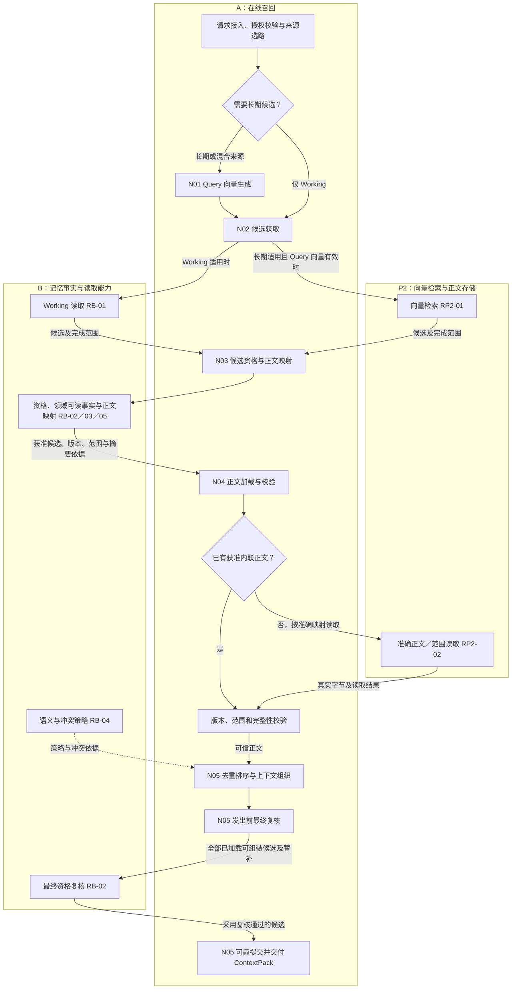
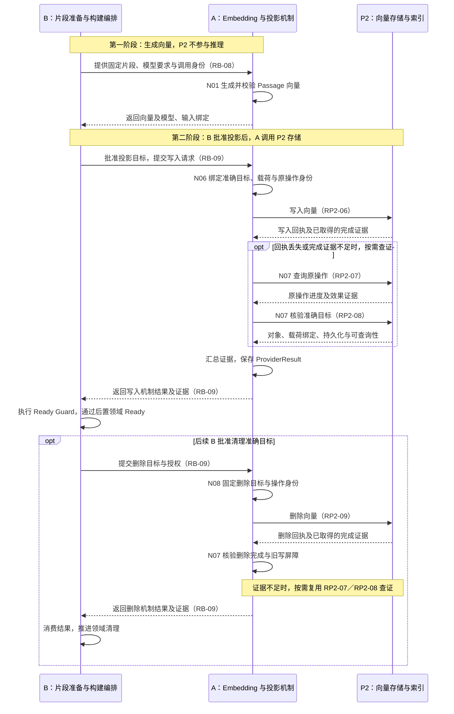

# A 组接口层功能框架节点 V0.1

编制日期：2026-09-14。覆盖范围：Recall／A 组的在线召回、共享 Embedding 与向量投影维护。

本文用于接口对接讨论和近期进展汇报，说明功能节点、输入输出、责任边界以及对 P2 的能力需求。节点表示逻辑功能，不限定具体类、服务、部署实例或独立 RPC；接口细化与堵点可按节点继续补充。

## 1. 总体框架与责任边界

A 组围绕两条链路开展工作：在线召回将问题转换为可信上下文；投影维护将 B 批准的片段向量写入 P2，并提供写入、查询、核验和删除的机制结果。Query 与 Passage 共用 A 的向量生成能力。

| 参与方 | 在本框架中的职责 | 主要交接内容 |
|---|---|---|
| A：Recall／Embedding | 向量生成、召回编排、候选处理、正文校验、上下文交付、向量投影执行与核验 | 向 B 返回向量和机制结果，向 P2 提交存储／检索请求，向上游交付上下文 |
| B：Remember | 片段准备、Memory 事实与资格、正文契约及映射、投影构建编排、领域 Ready 判定与清理授权 | Working 候选、获准正文映射、语义策略、投影写删目标及授权 |
| P2／存储 Provider | 向量存储与检索、正文物理读取、操作状态和准确对象事实 | 候选引用、真实字节、原操作状态、对象及索引状态、删除完成依据 |
| C／RF：补充协作方 | C 负责调度与预热生命周期；RF 提供共享运行时及访问事实接入能力 | 经确认契约交接访问事实和可选预热证据 |

**A 的机制结果与 B 的领域状态分开。** A 根据 P2 的执行和对象证据返回 `ProviderResult`；B 结合当前 Memory、正文、模型与版本执行 Ready Guard，决定 `ProjectionState`。P2 请求已受理、向量生成成功或 A 返回机制 READY，都不能单独替代 B 的领域 Ready 判定。

### 八个框架节点

下列 N01～N08 仅用于本文定位，不新增对外接口编号。

| 节点 | 功能链路 | 框架节点 | 主要接口关系 |
|---|---|---|---|
| N01 | 共享能力 | 向量生成 | Recall 内部／B 调用 A 的 Query／Passage 向量生成能力 |
| N02 | 在线召回 | 候选获取 | A 调 B 获取 Working 候选；A 调 P2 获取长期向量候选 |
| N03 | 在线召回 | 候选资格与正文映射 | A 调 B 核验候选，获取准确正文映射与完整性依据 |
| N04 | 在线召回 | 正文加载与校验 | A 按 B 批准的映射使用内联正文，或调用 P2 读取正文并校验 |
| N05 | 在线召回 | 上下文组织与交付 | A 去重排序，调用 B 最终复核，提交并交付上下文 |
| N06 | 投影维护 | 向量投影写入 | B 批准投影后，A 调 P2 写入向量及关联信息 |
| N07 | 投影维护 | 操作查询与目标核验 | A 调 P2 查原操作及准确目标，形成机制结果交 B |
| N08 | 投影维护 | 向量投影删除 | B 批准清理后，A 调 P2 删除并经 N07 核验 |

## 2. 两条功能链路

### 2.1 在线召回

图示为正常路径。候选获取节点汇总本次所需来源的结果及完成情况后，统一进入资格核验；不会因一个来源先返回就跳过另一个所需来源。仅 Working 路径跳过 Query 向量生成和 P2 向量检索；混合来源先完成 Query 阶段，再获取两类候选。Query 失败时，混合来源可按剩余预算继续 Working，并保留长期来源缺失事实。

Working 已提供可信内联正文时无需重复下载；只有引用时仍需按 B 映射读取。正文校验、最终复核未通过或来源不完整时，按已有召回规则处理缺口和终态，不能将故障当作正常空结果。

### 2.2 Embedding 与投影维护

**起点是 B 提供待向量化片段，Embedding 由 A 执行；P2 从获批后的向量写入阶段开始参与。** 下图按时间从上到下阅读，三列分别表示参与方。

N07 负责汇总已有回执和查证事实；图中的操作查询与目标核验表达两类能力，不要求固定调用顺序或每次都增加两次 RPC。写入响应已提供充分证据时可以直接形成结果；证据不足时按需继续查询。结果按写入／删除动作返回 B 对应流程。

Query 向量用于检索，不进入投影写入。Passage 向量先交 B，只有 B 批准投影后才写入 P2。更新使用 B 批准的新目标；当前设计不支持通过同目标 rebuild 自动修复，普通重投沿用原操作。

## 3. 节点说明

### N01 向量生成

| 项目 | 内容 |
|---|---|
| 节点职责 | 将问题或固定片段转换为与指定检索空间兼容的真实向量，校验数值并保留模型和输入绑定 |
| 输入 | 问题／片段、Query 或 Passage 用途、模型与检索空间要求、输入摘要、稳定调用标识、授权与时限 |
| 输出 | 经校验的向量及向量摘要、模型版本／维度／数值类型、输入绑定和执行结果 |
| 调用方／提供方 | Recall 调 A 生成 Query；B 调 A 生成 Passage；提供方均为 A 的共享 Embedding 能力 |
| 关联接口编号 | Passage 对接沿用 RB-08；Query 为 A 内部调用，无独立 RP2 编号 |

**接口细化与堵点：** 待补充。

### N02 候选获取

| 项目 | 内容 |
|---|---|
| 节点职责 | 按已确定来源获取有界候选，保留每个来源的完成、部分结果或失败情况 |
| 输入 | 已授权 Scope、适用 session／task、候选数量限制；长期检索另需 Query 向量、模型空间、类型／时间筛选 |
| 输出 | Working 候选和／或长期候选，包含稳定身份、版本关联、排序信息及来源完成情况 |
| 调用方／提供方 | A 调 B 的 Working 读取能力；A 调 P2 的向量检索能力 |
| 关联接口编号 | RB-01；RP2-01，归属 VectorSearchPort／VEC-002 |

**接口细化与堵点：** 待补充。

### N03 候选资格与正文映射

| 项目 | 内容 |
|---|---|
| 节点职责 | 核验候选当前资格与授权，取得获准使用的准确正文映射；长期候选另核对领域可读状态和模型兼容性 |
| 输入 | 候选 Memory／片段／投影引用及版本、授权范围、Query 模型空间、所需正文范围 |
| 输出 | 候选有效／无效／不可验证结论，准确正文引用与版本、批准范围、期望摘要及有效窗口 |
| 调用方／提供方 | A 调 B；B 提供 Memory 事实、领域可读事实和正文映射 |
| 关联接口编号 | RB-02、RB-03、RB-05；正文契约归属 ContentStorePort／OBJ-001，Owner 为 B |

**接口细化与堵点：** 待补充。

### N04 正文加载与校验

| 项目 | 内容 |
|---|---|
| 节点职责 | 在授权与读取预算内取得准确正文，校验版本、范围、字节数和完整性 |
| 输入 | B 批准的正文引用／版本／范围、可信期望摘要、读取条件、响应字节上限和时限；或已取得的获准内联正文 |
| 输出 | 可信正文及关联身份、实际读取范围／字节数、校验结果与缺口原因；有依据时记录实际来源 |
| 调用方／提供方 | A 使用 B 提供的映射和契约，调用 P2／内容 Provider 读取物理字节；校验由 A 执行 |
| 关联接口编号 | 主能力 RP2-02；按需补充 RP2-03；可选 RP2-04、RP2-05；B 侧沿用 RB-03 |

**接口细化与堵点：** 待补充。

### N05 上下文组织与交付

| 项目 | 内容 |
|---|---|
| 节点职责 | 对可信内容去重排序，消费 B 的语义与冲突策略，完成最终资格复核、整包预算控制和上下文交付 |
| 输入 | 已校验正文及候选身份、来源排名、B 的语义／冲突策略、上下文预算与原请求时限 |
| 输出 | 可靠提交的 ContextPack、召回终态及最小访问记录；发出与实际使用按真实发生情况分别记录 |
| 调用方／提供方 | A 组织结果并调用 B 最终复核；A 借助 RF 运行时能力提交记录，向上游交付上下文 |
| 关联接口编号 | RB-02、RB-04；经确认的访问事实交接关联 RC-05；不新增 P2 核心接口 |

**接口细化与堵点：** 待补充。

### N06 向量投影写入

| 项目 | 内容 |
|---|---|
| 节点职责 | 将 B 批准的投影目标、已验证 Passage 向量及关联载荷绑定为稳定操作，提交 P2 写入 |
| 输入 | B 的写入授权；Memory、chunk、Memory 版本、模型版本、投影 Schema 版本五元组；向量、正文关联、检索属性、空间、幂等键与请求指纹 |
| 输出 | 原写入操作关联、逐项目标回执及已取得的完成证据，交 N07 判断或继续查证 |
| 调用方／提供方 | B 调 A 的投影机制；A 调 P2 的物理向量写入能力 |
| 关联接口编号 | RB-09；RP2-06，归属 VectorProjectionPort／VEC-001 |

**接口细化与堵点：** 待补充。

### N07 操作查询与目标核验

| 项目 | 内容 |
|---|---|
| 节点职责 | 查询原操作执行进度，核验准确向量对象、载荷绑定、持久化与可查询性，汇总形成机制结果 |
| 输入 | 原动作、目标五元组、租户／空间、幂等键与请求指纹、已取得的 P2 操作引用、预期载荷绑定 |
| 输出 | 原操作进度、对象和索引事实、完成或未知依据；A 保存并向 B 返回 ProviderResult，必要时继续恢复查询 |
| 调用方／提供方 | A 调 P2 获取执行与物理状态；B 向 A 补取机制结果并作领域判定 |
| 关联接口编号 | RP2-07、RP2-08；B／A 交接沿用 RB-09 |

操作查询回答“这一次写入或删除执行到了哪里”，目标核验回答“这个准确对象现在是什么状态”。查询不到操作记录不能直接认定未执行；对象存在也不能直接证明本次写入正确完成。

**接口细化与堵点：** 待补充。

### N08 向量投影删除

| 项目 | 内容 |
|---|---|
| 节点职责 | 执行 B 批准的准确目标清理，经 N07 核验对象／索引退出及旧在途写不会复活目标 |
| 输入 | B 的删除授权、准确目标及代际／条件、稳定删除身份与指纹、已知历史写入关联 |
| 输出 | 删除操作回执、实际进度和核验后的机制结果；证据不足时保留待查证状态 |
| 调用方／提供方 | B 调 A 发起清理；A 调 P2 执行删除并查询核验；B 消费结果推进领域清理 |
| 关联接口编号 | RP2-09；核验复用 RP2-07、RP2-08；B／A 交接沿用 RB-09 |

**接口细化与堵点：** 待补充。

## 4. 提供给 P2 的能力边界

后续接口表以六项核心能力为主体。每项再拆为“P3 向 P2 提供的请求”和“P2 向 P3 返回的结果”，沿用已有类型与编号。

| 关联节点 | 核心能力 | 编号 | P3 提供的关键数据 | P2 需要提供的关键结果 |
|---|---|---|---|---|
| N02 | 向量检索 | RP2-01 | Query 向量、模型空间、Scope、筛选、TopK | 稳定候选引用、版本关联、分数／排名、完成情况 |
| N04 | 正文读取 | RP2-02 | 准确正文版本／范围、读取条件、期望摘要、字节上限 | 实际字节、版本／范围、完整性元数据及读取状态 |
| N06 | 向量写入 | RP2-06 | 准确目标、向量及关联载荷、原操作身份 | 逐项写入回执、原操作关联和完成证据 |
| N07 | 原操作查询 | RP2-07 | 原目标、动作、幂等键／操作引用和指纹 | 原操作执行进度、效果及适用的安全重发依据 |
| N07 | 准确目标核验 | RP2-08 | 准确目标、预期载荷绑定和关联操作 | 对象存在性、实际绑定、持久化和可查询性 |
| N08 | 向量删除 | RP2-09 | 获准目标、删除身份、代际／条件和历史写入关联 | 删除进度、对象／索引退出和防止旧写复活的依据 |

以上按逻辑能力计数，实际可由 P2 的一个或多个方法组合满足。正式方法名、报文映射和服务保证仍需双方对齐。

| 补充能力 | 编号 | 放置位置与当前口径 |
|---|---|---|
| 正文元数据查询 | RP2-03 | 放在 N04，按需取得大小、版本、编码或摘要依据；可以由可信映射或读取响应覆盖 |
| 热副本读取 | RP2-04 | N04 的可选加速路径；9 月 13 日评估建议本期关闭，采用正式正文读取，最终范围以双方确认记录为准 |
| 实际来源与动作归因 | RP2-05 | N04 读取响应附带的信息，支持后续访问事实与可选效果核验；证据不足时保持不可验证，不计为热副本命中 |

公共接入还需对齐授权与租户隔离、请求／追踪标识、模型与协议版本、服务限额、超时／错误和重试语义。这些是六项能力的共同运行条件。A 使用既有公共健康观察，不新增 A 专属健康 Port；BackendHealthPort 的 Owner 仍为 C。

## 5. 近期进展与后续落地

对象与字段继续以既有设计为目标推进。现有代码需要新增哪些模型、补充哪些字段，以及新旧对象如何映射，见配套[对象与字段设计落地说明](A组_对象与字段设计落地说明_V0.1.md)。

截至 2026-09-14，已有材料覆盖 A 组两条主链路、数据定义、A／B 与 A／P2 对接需求；9 月 13 日完成了对 P2 反馈的影响评估，9 月 14 日已有源码入口与设计差异对照。现有代码提供召回服务、来源适配、排序组装、Embedding 和 P2 适配等基础，但新设计要求的完整状态恢复、准确目标核验、预算与最终提交保证仍需按源码对照逐项落实。这些进展属于设计整理和静态对照，不能据此认定完整实现、部署或真实联调已经通过。

| 后续工作 | 本阶段要形成的结果 |
|---|---|
| 接口对齐 | 将六项核心能力落到 P2 的实际方法与版本，确认字段映射、样例、权限／版本语义及完成保证 |
| A 侧适配与流程实现 | 依据现有源码补齐向量输入、B 资格与映射、正文校验、状态恢复、投影查询核验及最终提交链路 |
| 真实环境接入 | 落实可调用服务、访问凭据、测试资源、模型／检索空间配置和联合验证窗口；具体人员与日期待对接确认 |
| 场景联调与部署验证 | 覆盖正常召回、Working 路径、部分结果、写入回包丢失、版本／摘要不符、索引未就绪、删除与旧写竞态、服务重启等场景，保存实际结果与问题记录 |

P2 反馈中仍需重点落实搜索契约、准确版本正文读取、原操作查询、准确目标核验和删除屏障。按 9 月 13 日评估所引用的反馈，当时真实环境尚未就绪，最新可用情况需继续对接确认。部署后的正确性、恢复行为和性能应在固定版本、配置与数据条件下验证。

## 6. 依据资料

- [Recall 与 Embedding：P2 接口对接需求](运行时详细设计_V0.1/召回与P2接口对接需求_V0.1.md)：六项核心接口、三项补充能力及 RP2 编号。
- [召回与 Remember 接口对接需求](运行时详细设计_V0.1/召回与记忆形成接口对接需求_V0.1.md)：RB 编号、向量生成、投影机制及领域责任。
- [召回与 Operate 接口对接需求](运行时详细设计_V0.1/召回与调度优化接口对接需求_V0.1.md)：访问事实、可选热副本及归因边界。
- [Work Map V0.4.1](../总设计/AetherStore_P3_Work_Map_V0.4.1.md)：A／B／C、Port Owner 与机制／领域状态分工。
- [P2 反馈影响与可接受性评估，2026-09-13](../总设计/Recall_P2反馈影响与可接受性评估_V0.1.md)：最新反馈评估、补齐条件和本期范围建议。
- [Recall 源码对照与开发顺序，2026-09-14](Recall源码对照与开发顺序_2026-09-14.md)：已有代码基础、设计差异和后续实现方向。

本文的“接口细化与堵点”用于后续讨论记录；正式契约确认状态继续以既有[跨模块待确认事项](运行时详细设计_V0.1/跨模块待确认事项_V0.1.md)及双方确认记录为准。
