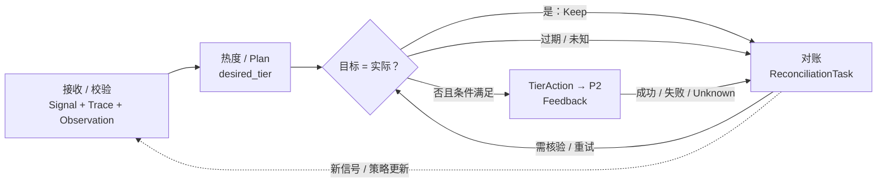
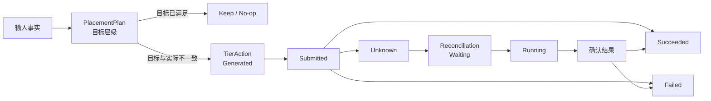
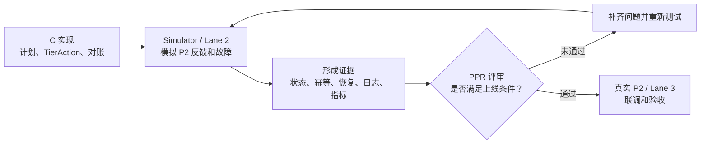

# AetherStore P3 C 组 Operate / Optimize Overall Flow V1.0

> 文档定位：C 组 Operate / Optimize 总体业务与工程流程说明。
>
> 本文只讨论 C 组从运行事实输入到调度结果闭环的业务流程及必要上下游关系，不定义 P2 内部物理迁移实现、字段级接口契约、错误码和最终验收用例。

---

## 0. 文档目的

本文从端到端 Outcome 出发，说明 C 组如何把 MemorySignal、AccessTrace 和 Placement Observation 转换为可执行、可确认、可恢复的存储层级调度结果，并说明：

1. C 组的业务入口和最终 Outcome；
2. C 组的端到端主数据流；
3. 数据流中的关键 Domain Object 与 State；
4. C 组自己拥有的事实和从其他负责人处消费的事实；
5. C 组与 Remember、Recall、P2 / P1 的 Handoff；
6. PPR 中需要证明的上线能力；
7. 当前仍需继续明确的流程问题。

---

## 1. C 组的业务定位

### 1.1 业务入口

C 组不是从 Agent 的原始 Query 开始，而是从其他模块产生的运行信号开始：

- **Remember Runtime（B）→ C：`MemorySignal`**
  - 表示 Memory 形成、更新、版本变化等事实信号。
  - Remember Runtime 负责产生，C 负责消费和确认。
- **Recall Runtime → Shared Runtime Trace Store → C：`AccessTrace`**
  - Recall 完成或失败后，记录 Memory / representation 的命中、未命中、加载、上下文使用等运行事实。
  - Recall Runtime 负责产生和写入，C 从共享 Trace Store 消费；C 不直接依赖 Recall 内部实现。

C 需要根据这些信号判断：不同 representation 当前是热还是冷，以及是否需要调整存储位置。

### 1.2 最终 Outcome

C 组的最终结果不是“发出了一条迁移指令”，而是完成一个可验证的调度闭环：

1. 为每个 representation 做出可解释的冷热判断。
2. 生成目标存储层级和放置方案。
3. 向 P2 发出可执行的 `TierAction`。
4. 确认 P2 的真实执行结果和实际层级。
5. 对超时、失败、反馈丢失和状态不一致进行对账和恢复。
6. 根据真实结果持续优化调度策略。

因此，C 组的核心工程目标是：**让每条 Memory representation 被放到合适的逻辑存储层，并且能够确认动作是否真的成功。**

### 1.3 端到端责任

C 组对“运行事实进入后，是否形成正确的调度决策，以及调度结果是否最终可确认、可恢复、可查询”负责。C 组需要定位问题发生在输入、决策、P2 执行反馈还是对账阶段，并推动对应事实 Owner 修复；这不意味着 C 可以复制或改写 B、Recall Runtime、P2 / P1 的领域事实。

> **C 组不是对所有底层事实负责，而是对这些事实经过调度处理后形成的 Placement Plan、TierAction 和最终调度结果负责。**

---

## 2. C 组主数据流

### 2.1 总体流程

这条流程可以分成五个阶段，图中按这五个阶段分组，并展示每个阶段的关键动作：

```text
【阶段一：接收并校验运行事实】
MemorySignal / AccessTrace / Placement Observation
  → 去重、版本校验、输入完整性和新鲜度检查

【阶段二：计算热度并生成目标】
  → per-representation Hotness
  → 生成或更新 RepresentationPlacementPlan
  → 得到 desired_tier

【阶段三：比较计划和实际层级】
  → 重新读取最新 Placement Observation
  → 比较 desired_tier 与 observed_tier
  → 判断是否满足 TierAction 前置条件

【阶段四：执行并确认】
  → 生成 TierAction
  → P2 执行
  → 获取 Feedback 和最新 Placement Observation
  → 得到 Succeeded / Failed / Unknown

【阶段五：对账和持续优化】
  → Reconciliation
  → 确认结果，或决定是否创建新的动作尝试
  → 更新策略并进入下一轮重新评估
```

这里的 `Placement Observation` 在三个位置有不同作用：阶段一用于建立输入快照，阶段三用于动作提交前的最新层级比较，阶段四和阶段五用于确认真实执行结果。因此，图中阶段三的“读取最新 Observation”不是重复定义，而是为了避免使用过期状态。



图中最重要的闭环是：**先接收并校验事实，再计算热度和目标；然后用最新 Observation 比较目标与实际，只有确实不一致且条件满足时才生成 TierAction；P2 执行后，C 通过反馈和对账确认最终结果。**

### 2.2 阶段一：信号进入

C 从 Remember Runtime 接收 `MemorySignal`，从 Shared Runtime Trace Store 读取 Recall Runtime 写入的 `AccessTrace`。两类输入进入后，首先完成幂等去重、版本校验和输入完整性检查。重复信号不能重复生成新的计划或动作。

输入到达并不意味着一定要调层：它只表示需要重新评估。输入不完整、版本过旧或状态未知时，不能假设对象已经处于目标层级，应保留 `Keep / No-op` 结果，或进入后续对账。

### 2.3 阶段二：热度计算

热度不能只判断“整个 Memory 是热还是冷”，而要按 representation 分开计算。例如：

- Vector Projection 可能经常被检索，应保持较热。
- Original Content 只有最终候选需要加载时才访问，可能保持较冷。

热度计算可以使用访问命中、未命中、上下文使用、最近访问时间、唤醒频次和重要度等信息。具体公式和权重仍需进一步冻结。

### 2.4 阶段三：生成放置方案

C 根据输入信号、representation 热度和最新的 `Placement Observation`，生成或更新 `RepresentationPlacementPlan`。这个对象是 C 管理的**目标状态和决策记录**，不是直接执行的动作。它表达“这个 representation 期望处于哪个逻辑层级”，但不代表 P2 已经完成迁移。

这个对象连接了：

```text
MemorySignal / AccessTrace
    → representation 热度
    → 更新 RepresentationPlacementPlan（desired_tier）
    → 与最新 observed_tier 比较
    → 只有不一致且前置条件满足时才生成 TierAction
```

每个 representation 生成一条独立 entry，至少包含：

- `representation_id`
- `representation_type`
- `provider_ref`
- `observed_tier`（生成计划时读取到的实际层级快照）
- `desired_tier`（C 的目标层级）
- `actuation_target_ref`（需要执行动作时才需要）
- `target_generation`（提交动作时用于并发校验）
- `hotness_score`
- `decision_reason`
- `policy_version`
- `generated_at`
- `valid_until`

### 2.5 阶段四：Plan 对比后生成并提交 TierAction

`RepresentationPlacementPlan` 不是执行动作。Plan 更新 `desired_tier` 后，C 还要读取最新的 `Placement Observation`，比较 `desired_tier` 和 `observed_tier`，再决定是否生成 `TierAction`。

直接规则如下：

- `desired_tier == observed_tier`：说明实际层级已经满足计划，记录 `Keep / No-op`，不生成 `TierAction`。
- `desired_tier != observed_tier`，并且目标可解析、`generation` 有效、没有未完成动作且防抖条件满足：生成 `TierAction`，再提交给 P2。
- 实际层级未知、观测已过期、目标无法解析或已有未完成动作：暂不生成新的动作，进入等待或 Reconciliation。

必须遵守：

- `Submitted` 或 P2 的 `ACCEPTED/RUNNING` 不等于执行成功。
- 只有收到 P2 的 `SUCCEEDED` 和真实 `actual_tier` 后，C 才能把动作记为 `Succeeded`。
- 超时或没有反馈时进入 `Unknown`，先查询 `action_id` 和真实状态，不能直接盲目重试。

### 2.6 阶段五：反馈、对账和优化

C 收到反馈后，需要把动作状态、实际层级、`generation` 和计划状态进行核对。P2 的反馈只是执行过程或结果的一部分，C 仍要通过 `Placement Observation` 确认真实层级。

只有当 P2 返回成功、实际层级等于 `desired_tier`，并且 `generation` 校验通过时，才算本次 Plan 已经收敛。若实际层级仍与目标不一致，不能把反馈简单当成成功，应继续对账。

以下情况必须进入 Reconciliation：

- 提交超时，但 P2 可能已经成功执行；
- P2 接收后执行失败；
- 反馈丢失；
- P3 重启后动作仍在执行；
- `generation` 不一致；
- 期望层级和实际层级不一致。

对账时先查询真实状态，再决定收敛、重试、标记原动作失败或人工介入。若需要重新执行，应基于最新的 `observed_tier` 和 `desired_tier` 创建新的动作尝试，不能把原动作重复当作新动作提交。对账结果和策略版本应保留，供后续优化和审计使用。

---

## 3. C 组关键 Domain Object 与 State

### 3.1 C 组关键 Domain Object

| Domain Object / State | 在 C 中的作用 | 数据来源／形成方式 | 事实归属 |
|---|---|---|---|
| `MemorySignal` | Remember Runtime 产生的 Memory 事实信号 | B 在 Memory 形成、更新或版本变化时产生 | B；C 消费 |
| `AccessTrace` | Recall Runtime 产生的访问和使用事实 | Recall Runtime 写入 Shared Runtime Trace Store，C 读取并汇总 | A/B Runtime；C 消费 |
| `HotnessScore` | 表示某个 representation 在观察窗口内的访问热度 | C 根据 AccessTrace、MemorySignal 和策略计算 | C |
| `RepresentationPlacementPlan` | 每个 representation 的目标层级和放置决策记录，不是执行动作 | C 根据输入事实、热度和 Placement Observation 生成或更新 | C |
| `ActuationTarget` | 对 P2 的不透明执行目标 | C 根据 Plan 解析并提交给 P2 | C 负责解析；P2 负责执行 |
| `TierAction` | 一次具体的层级调整动作及其最终结果 | C 从有效 Plan 派生，提交 P2 后根据反馈和观察结果更新 | C；P2 提供执行反馈 |
| `Placement Observation` | P2 / 后端实际观察到的层级和 generation | P2 或后端查询接口返回 | P2 / P1；C 消费 |
| `Reconciliation` | 处理反馈丢失、超时和实际层级不一致 | C 根据 Unknown、超时或不一致结果创建 | C |

### 3.2 C 组拥有的主要事实和字段

C 组主要拥有以下事实或结果：

- 每个 representation 的 `hotness_score`；
- `RepresentationPlacementPlan` 和 `desired_tier`；
- `TierAction` 及其 `ActionState`；
- 调度策略版本 `policy_version` 和调度原因 `decision_reason`；
- Reconciliation 任务、对账结论和优化结果；
- 与上述对象关联的幂等键、版本、时间和审计记录。

`observed_tier`、物理介质、容量和后端运行状态属于 P2 / P1 的事实。C 可以在 Plan 或 Action 中保存观测快照，但不能把快照当成真实状态的唯一来源。

### 3.3 核心状态机总览

状态机设计文档中有多个对象，但总体流程只需要突出主业务闭环的 3 个核心对象：

| 核心对象 | 在主流程中的作用 | 总体流程中保留的状态 |
|---|---|---|
| `RepresentationPlacementPlan` | 记录 C 计算出的目标层级和决策依据 | 没有独立 `PlanState`，通过有效性、generation、有效期和是否被新计划替代判断生命周期 |
| `TierAction` | 记录一次交给 P2 的具体调层动作 | `Generated → Submitted → Succeeded / Failed / Unknown` |
| `ReconciliationTask` | 对 `Unknown`、超时和层级不一致进行查询、恢复和收敛 | `Waiting → Running → Succeeded / Failed / Cancelled` |

这 3 个状态机的关系可以简单看成：



需要特别说明：

- `RepresentationPlacementPlan` 是决策生命周期，不额外新增 `PlanState`。
- `TierAction.Unknown` 不是终态，必须进入 `ReconciliationTask`；不能直接重试，也不能直接当成功。
- `TierAction.Succeeded` 必须同时满足 P2 成功、`actual_tier` 正确和 `generation` 校验通过。
- `ReconciliationTask.Failed` 表示对账无法自动完成或需要人工处理，不一定等同于 TierAction 已确认失败。

`OperatorControlTask`、`Policy / Model Release` 和 `SimulatedStorageState` 保留在《AetherStore_P3_Operate_Optimize_State_Machine_V1.0》中作为人工控制、策略发布和测试辅助状态机；在总体流程中只作为前置条件、策略版本和 PPR 测试内容出现，不再展开完整状态图。

### 3.4 RepresentationPlacementPlan 生命周期

#### 3.4.1 对象定义与控制边界

`RepresentationPlacementPlan` 是 C 计算出的目标状态，表达“这个 representation 期望处于哪个逻辑层级”。它不是执行动作，不会直接修改实际层级；只有在目标层级和实际层级不一致，并且前置条件通过时，才会派生 `TierAction`。

| 问题 | 设计答案 |
|---|---|
| 这个对象是谁？ | C 针对某个 representation 生成的目标层级计划，保存 `desired_tier`、`observed_tier` 快照、`target_generation`、策略版本和决策原因 |
| 它有哪些状态？ | 冻结 Map 没有独立 `PlanState`；通过有效期、generation、输入版本和是否被新计划替代判断是否仍可用 |
| 谁拥有它？ | C 组 |
| 谁能改？ | C 的决策器、策略发布处理器、运营控制处理器和对账器；需要改变目标时生成新计划，保留旧计划审计 |
| 什么事件触发？ | `MemorySignal`、`AccessTrace`、`Placement Observation`、generation、策略版本、人工控制或对账结果发生变化 |
| 失败后去哪？ | 计划生成失败时不生成 `TierAction`，保留上次可查询结果并记录错误，等待下一次信号或重算；派生动作失败则由 `TierAction` 进入 `Failed / Unknown` |
| 重启后怎么恢复？ | 加载最近计划，检查 `valid_until`、`target_generation`、新输入、策略和人工控制；失效计划先重算，不直接发动作 |
| 什么时候算终态？ | 没有独立终态；计划到期、被新计划替代或被人工控制覆盖后，不再驱动新动作，但历史记录保留 |

#### 3.4.2 完整状态

冻结 Map 没有给 `RepresentationPlacementPlan` 定义独立状态，因此下面列出的是生命周期节点和判断条件，不是新增的 `PlanState`：

| 节点 / 条件 | 含义 | 进入前需要保留 | 是否终态 |
|---|---|---|---|
| `RepresentationPlacementPlan` | 已生成目标层级计划，记录当前观察快照和决策依据 | `representation_id`、`desired_tier`、`observed_tier`、`target_generation`、`policy_version`、`reason` | 否 |
| `PlanValidityGuard` | 检查计划是否过期、generation 是否匹配、是否被新事实替代 | 计划版本、输入版本和检查时间 | 否 |
| `TierMismatchGuard` | 比较 `desired_tier` 与最新 `observed_tier` | 最新 Observation 和比较结果 | 否 |
| `TierActionPreconditions` | 检查目标、容量、权限、人工控制和并发条件 | 检查结果和失败原因 | 否 |
| `KeepNoOpDecision` | 实际层级已经满足目标，不创建 `TierAction` | 决策原因和观察快照 | 业务分支结束，但不是 `PlanState` 终态 |
| `PlanExpiredOrSuperseded` | 计划到期、被新计划或人工控制替代，历史记录仍保留 | 替代原因和时间 | 旧计划停止驱动，但不是新增 `PlanState` |

计划仍然有效的基本条件是：

```text
当前时间 < valid_until
且当前 generation = target_generation
且没有更新的输入或计划替代它
且没有人工控制覆盖
```

#### 3.4.3 合法状态转换

状态转换采用“事件 [Guard] / Action”语义：

| 当前节点 | 触发事件与 Guard | 状态转换动作 | 下一节点 | 异常分支 |
|---|---|---|---|---|
| 初始输入 | `CreateOrUpdatePlan`（收到有效输入事实并完成基本校验） | 保存目标、观察快照和版本 | `RepresentationPlacementPlan` | 输入缺失或校验失败：不生成新计划，保留错误记录 |
| `RepresentationPlacementPlan` | `CheckPlanValidity`（进入计划有效性检查） | 检查有效期、generation 和输入版本 | `PlanValidityGuard` | 无 |
| `PlanValidityGuard` | `PlanExpiredOrGenerationMismatch`（计划过期或 generation 不匹配） | 重新计算目标 | `RecomputePlacementPlan` | 重新计算失败：保留上次可查计划，不创建动作 |
| `PlanValidityGuard` | `PlanValid`（计划仍有效） | 读取最新实际层级 | `TierMismatchGuard` | Observation 过期或未知：进入等待或 Reconciliation |
| `TierMismatchGuard` | `DesiredTierMatchesObservedTier`（目标与实际一致） | 记录保持当前层级 | `KeepNoOpDecision` | 无 |
| `TierMismatchGuard` | `DesiredTierDiffersFromObservedTier`（目标与实际不一致） | 检查调层前置条件 | `TierActionPreconditions` | 目标无效、容量不足或人工禁止：不创建动作 |
| `TierActionPreconditions` | `PreconditionsPassed`（目标、generation、权限和并发检查通过） | 创建新的 `action_id` | `TierAction.Generated` | 检查失败：保留原因，等待下一次重算 |
| `RecomputePlacementPlan` | `RecomputePlan`（使用最新事实重新计算） | 保存新计划，旧计划只保留审计 | `RepresentationPlacementPlan` | 仍失败：不创建 `TierAction` |
| `RepresentationPlacementPlan` | `PlanExpiredOrSuperseded`（到期或被新事实、新计划替代） | 停止驱动新动作 | `PlanExpiredOrSuperseded` | 历史计划不可删除 |

#### 3.4.4 并发、恢复与终态约束

- `RepresentationPlacementPlan` 只记录 C 的 Desired State，不能把 Plan 存在当成调层成功。
- 需要改变目标时创建新计划，不把旧计划原地改成另一个目标；旧计划保留用于审计和解释。
- Plan 通过 `valid_until`、`target_generation`、输入版本和人工控制判断是否有效，不额外新增 `PlanState`。
- C 重启后先加载最近计划和输入版本，再重新检查有效期、generation、策略和人工控制；失效计划先重算。
- `desired_tier == observed_tier` 时只记录 `Keep / No-op`，不创建 `TierAction`。
- 计划派生出的动作如果进入 `Failed` 或 `Unknown`，由 `TierAction` 和 `ReconciliationTask` 负责后续处理，不能回写成“计划已成功”。

调层是否成功，仍然由后面的 `TierAction` 和 `Placement Observation` 共同确认。

### 3.5 TierAction 状态机

#### 3.5.1 对象定义与控制边界

`TierAction` 表示一次“把某个 representation 从当前实际层级调整到目标逻辑层级”的动作记录。它由有效的 `RepresentationPlacementPlan` 派生，不由单独的 `MemorySignal` 或 `AccessTrace` 直接派生。

| 问题 | 设计答案 |
|---|---|
| 这个对象是谁？ | 一次独立的层级调整动作，以 `action_id` 和幂等键唯一标识，并关联 representation、Plan 和 target_generation |
| 它有哪些状态？ | `Generated → Submitted → Succeeded / Failed / Unknown`；其中 `Succeeded`、`Failed` 是终态，`Unknown` 必须进入对账 |
| 谁拥有它？ | C 组拥有业务动作记录和 `ActionState` |
| 谁能改？ | C 的策略执行器、反馈处理器和对账器；P2 只能修改自己的 Provider 任务并返回结果 |
| 什么事件触发？ | 有效 Plan 确认目标层级与实际层级不一致，且前置条件通过时创建；P2 反馈、超时或查询结果触发后续转换 |
| 失败后去哪？ | 明确失败进入 `Failed`；结果不明确进入 `Unknown` 并创建或关联 Reconciliation |
| 重启后怎么恢复？ | 加载非终态动作，使用 `action_id`、Provider 引用、幂等键和 generation 查询或复用结果，不盲目重复提交 |
| 什么时候算终态？ | P2 失败或成功证据与 actual_tier、generation 校验均已确认时，分别进入 `Failed` 或 `Succeeded` |

#### 3.5.2 完整状态

```text
Generated
    ↓
Submitted
    ↓
Succeeded / Failed / Unknown
```

| 状态 | 含义 | 进入该状态前必须已持久化 | 是否终态 |
|---|---|---|---|
| `Generated` | 已生成动作，但还没有提交给 P2 | Plan、目标层级、当前观察、generation、幂等键 | 否 |
| `Submitted` | 已提交给 P2，可能仍在 ACCEPTED / RUNNING | Provider 引用、提交时间和请求快照 | 否 |
| `Succeeded` | P2 成功且 actual_tier、generation 已校验 | 成功反馈、实际观察和完成时间 | 是 |
| `Failed` | 已确认本次动作失败，或确认本次动作没有执行 | 稳定失败原因、P2 反馈或对账证据 | 是 |
| `Unknown` | 超时、反馈丢失或结果与动作无法对应 | 最后已知反馈、查询记录和对账任务引用 | 否 |

P3 与 P2 的状态映射：

| P3 | P2 |
|---|---|
| `Submitted` | `ACCEPTED / RUNNING` |
| `Succeeded` | `SUCCEEDED`，且有匹配的 `actual_tier` |
| `Failed` | `FAILED` |
| `Unknown` | `UNKNOWN` 或超时无反馈 |

#### 3.5.3 合法状态转换

状态转换采用“事件 [Guard] / Action”语义：

| 当前状态 | 触发事件与 Guard | 状态转换动作 | 下一状态 | 异常分支 |
|---|---|---|---|---|
| 初始伪状态 | PlanReady [`needs_tier_action`] | 创建 TierAction，保存目标和幂等键 | `Generated` | 目标无效或实际层级未知：不创建动作 |
| `Generated` | SubmitToP2 [`provider_accepted`] | 保存 Provider 引用和提交时间 | `Submitted` | 提交前校验失败：`Failed` |
| `Submitted` | FeedbackObserved [`ACCEPTED / RUNNING`] | 更新最后观测时间 | `Submitted` | 无 |
| `Submitted` | FeedbackObserved [`SUCCEEDED && actual_tier_matches && generation_matches`] | 保存成功证据 | `Succeeded` | 反馈与实际观察不一致：`Unknown` |
| `Submitted` | FeedbackObserved [`FAILED`] | 保存失败原因 | `Failed` | 无 |
| `Submitted` | ObservationLost [`timeout || feedback_lost`] | 创建或关联 Reconciliation | `Unknown` | 不得直接重提动作 |
| `Unknown` | ReconcileObserved [`success_evidence`] | 校验实际层级和 generation | `Succeeded` | 证据不足：保持 `Unknown` |
| `Unknown` | ReconcileObserved [`failure_evidence`] | 保存确认失败或未执行证据 | `Failed` | 无 |

重复反馈只更新观测时间和证据，不重复执行物理动作。若失败后需要重试，必须创建新的 `action_id`，并关联原动作。

#### 3.5.4 并发、恢复与终态约束

- 状态更新必须同时校验当前状态和 `state_version`，避免后写入覆盖先写入。
- 阶段结果先按幂等键落盘，再推进 `ActionState`；重启后发现结果已存在但状态未推进时，只补做校验和状态推进。
- `Submitted`、`Unknown` 不能直接当成成功；必须通过 P2 查询和 `Placement Observation` 收敛。
- `Succeeded`、`Failed` 不允许回退；迟到或冲突的反馈只记审计事件。
- 只有确认本次动作没有改变对象，才允许基于最新观察创建重试动作。

这里要区分两个对象：`RepresentationPlacementPlan` 负责记录 C 想要的 `desired_tier`；`TierAction` 只负责执行一次从实际层级到目标层级的动作。Plan 可以更新但不产生动作，例如目标层级没有变化或实际层级已经满足目标。

### 3.6 ReconciliationTask 状态机

#### 3.6.1 对象定义与控制边界

`ReconciliationTask` 是异常路径中的恢复任务，用来把 C 的动作记录、P2 的执行结果和真实层级重新对齐。它主要处理 `TierAction.Unknown`、超时、反馈丢失、`generation` 不一致、重启后未闭合动作和实际层级不一致。

| 问题 | 设计答案 |
|---|---|
| 这个对象是谁？ | 一次针对未知或不一致结果的对账任务，关联 `action_id`、Provider 引用、`desired_tier` 和 `generation` |
| 它有哪些状态？ | `Waiting → Running → Succeeded / Failed / Cancelled`；`Waiting`、`Running` 不是终态 |
| 谁拥有它？ | C 组拥有对账任务和任务状态 |
| 谁能改？ | C 的对账调度器、对账执行器和异常处理器；P2 只提供查询结果，Operate 可以发起取消或人工处置，但由 C 落任务状态 |
| 什么事件触发？ | `TierAction.Unknown`、超时、反馈丢失、实际层级不一致、generation 不一致、重启扫描或定期一致性检查 |
| 失败后去哪？ | 暂时无法确认时保持 `Running` 或回到 `Waiting` 重试；确认无法自动恢复或需要人工处理时进入 `Failed` |
| 重启后怎么恢复？ | `Waiting` 重新入队；`Running` 通过租约或心跳恢复为可领取任务；已终态任务不重复执行 |
| 什么时候算终态？ | 已确认 C 的记录与实际层级一致为 `Succeeded`；确认无法自动恢复或需要人工处理为 `Failed`；运营人员取消为 `Cancelled` |

#### 3.6.2 完整状态

```text
Waiting
    ↓
Running
    ↓
Succeeded / Failed / Cancelled
```

| 状态 | 含义 | 进入该状态前必须已持久化 | 是否终态 |
|---|---|---|---|
| `Waiting` | 对账任务等待领取或等待下一轮重试 | `action_id`、创建原因、重试信息和租约信息 | 否 |
| `Running` | 对账器正在查询 P2、读取 Observation 或判断结果 | 查询记录、最后心跳和当前判断依据 | 否 |
| `Succeeded` | 已确认 C 的记录与实际层级、generation 和动作关联一致 | 对账证据、实际观察和完成时间 | 是 |
| `Failed` | 已确认无法自动恢复或需要人工处理 | 稳定失败原因、查询证据和人工处置标记 | 是 |
| `Cancelled` | 运营人员明确取消对账任务 | 取消人、取消原因和取消时间 | 是 |

#### 3.6.3 合法状态转换

状态转换采用“事件 [Guard] / Action”语义：

| 当前状态 | 触发事件与 Guard | 状态转换动作 | 下一状态 | 异常分支 |
|---|---|---|---|---|
| 初始伪状态 | `CreateReconciliationTask`（TierAction 进入 Unknown 或发现不一致） | 保存关联对象和对账原因 | `Waiting` | 参数不完整：记录创建失败，不触发物理迁移 |
| `Waiting` | `ClaimTask`（对账器领取任务并获得租约） | 记录领取者和心跳 | `Running` | 无法领取：保持 `Waiting` |
| `Running` | `QueryP2AndObservation`（查询 P2、读取 Observation 或重试查询） | 保存查询结果和判断依据 | `Running` | 暂时无法查询：按重试策略保持或回到 `Waiting` |
| `Running` | `ReleaseLease`（执行者失去租约或心跳超时） | 释放执行权，等待其他执行者 | `Waiting` | 不得创建新的物理动作 |
| `Running` | `ConfirmConsistency`（`actual_tier`、`generation` 和 `action_id` 证据一致） | 更新相关 TierAction 的成功证据 | `Succeeded` | 证据不足：保持 `Running` 或回到 `Waiting` |
| `Running` | `MarkManualIntervention`（确认无法自动恢复或需要人工判断） | 保存失败原因和人工处置标记 | `Failed` | 相关 TierAction 可能仍保持 `Unknown` |
| `Running` | `CancelTask`（运营人员取消） | 保存取消人和原因 | `Cancelled` | 已经完成的任务不能回退 |

#### 3.6.4 并发、恢复与终态约束

- 对账任务只负责查询、比较和收敛，不因为查询过程本身直接发起物理迁移。
- 所有查询必须可重复执行；重试对账不能重复提交同一个 `TierAction`。
- `TierAction.Unknown` 不能因为等待时间变长就直接变成成功，必须通过 P2 查询和最新 `Placement Observation` 获得证据。
- 只有确认本次动作没有改变对象，才允许基于最新观察和新计划创建新的 `action_id` 重试；不能把旧动作原地改成 `Submitted`。
- C 重启后，`Waiting` 重新入队，`Running` 通过租约恢复；`Succeeded`、`Failed`、`Cancelled` 不重复执行。
- `ReconciliationTask.Failed` 表示对账无法自动完成或需要人工处理，不一定等同于相关 `TierAction` 已确认失败；只有确认本次动作没有生效，TierAction 才能进入 `Failed`。
- `Succeeded`、`Failed`、`Cancelled` 都是任务终态，终态任务不允许回退；迟到查询结果只记审计事件。

---

## 4. C 组的事实所有权

本章区分 C 组自己维护的调度事实、从其他负责人处消费的输入事实，以及 C 明确不拥有的底层实现事实。

### 4.1 C 组自己拥有的事实

- 每个 representation 的热度分数；
- `RepresentationPlacementPlan`；
- 目标层级和调度决策；
- `TierAction` 及其 P3 状态；
- 冷却时间、阈值和回退策略；
- 对账状态、优化策略版本和决策原因。

### 4.2 C 组消费但不拥有的事实

- Remember Runtime（B）的 Memory 主事实和 `MemorySignal`；
- Recall Runtime 写入 Shared Runtime Trace Store 的 `AccessTrace`；
- Memory 的 Working / Episodic / Semantic 类型；
- P2 返回的实际执行状态；
- P2 或存储后端返回的真实 `observed_tier`、物理状态和 generation；
- Runtime Foundation Steward 负责的 `AccessTrace` Schema / Ingest 契约。

### 4.3 C 组明确不拥有的内容

- Memory 的主事实、生命周期和 Working / Episodic / Semantic 类型转换，由 B 组负责。
- Vector / Object / Cache / Index 等 representation 的冷热判断和目标层级决策，由 C 组负责。
- DRAM / NVMe / HDD / Object Storage 等具体物理介质、容量和实际放置，由 P2 / P1 负责。

C 可以使用记忆类型和 representation 类型作为调度输入，并输出逻辑上的 `HOT / WARM / COLD` 目标，但不能改变 Memory 的业务类型，也不能把 P2 的物理执行结果直接当成自己的事实。逻辑层级、representation 类型和物理介质不是一一对应关系。

---

## 5. C 组与其他负责人的 Handoff

本章通过业务事实和能力接口说明协作关系。C 组接收 B / Recall Runtime 的事实输入，并通过统一的调度能力向 P2 表达目标；C 不接管其他模块的领域状态，也不依赖 P2 的内部物理实现。

### 5.1 Remember Runtime（B）→ C：MemorySignal

Remember Runtime（B）向 C 提供 Memory 形成、更新、版本变化等事实信号。

C 需要关注：

- `memory_id` 和版本是否稳定；
- `signal_id` / 幂等键是否存在；
- 信号是否重复；
- 信号是否已经被 C 消费确认。

Remember Runtime 不需要知道 C 的冷热策略、预测模型和 TierAction 细节。

### 5.2 Recall Runtime → Shared Runtime Trace Store → C：AccessTrace

Recall 完成或失败后，Recall Runtime 通过 `AccessTraceCapability` 记录访问事实并写入 Shared Runtime Trace Store，C 再从共享存储中消费这些事实来计算热度。C 不要求 Recall 在同一个同步调用里直接返回调度结果。

在共享契约层面，`AccessTrace` 可以由 A/B Runtime 产生；但在本条 Recall 链路中，具体生产者是 Recall Runtime。也就是说，C 依赖的是统一的 Trace 契约和共享存储，不依赖某个 Runtime 的内部实现。

重点信息包括：

- 命中或未命中；
- 哪个 Memory / representation 被访问；
- 是否被加载进 Context；
- 是否被 Agent 实际使用；
- 访问时间和链路标识。

另外还应尽量保留 Recall 的 `complete`、`degraded` 或 `failed` 结果，便于 C 区分“实际使用成功”“访问发生但结果降级”和“依赖失败”。

Trace 的 Schema / Ingest 契约属于 Runtime Foundation Steward，不由 C 单独定义。

### 5.3 C → P2：TierAction / Storage Control

C 只向 P2 表达“哪个 representation 期望调整到哪个逻辑层级”，不直接指定使用哪一种物理介质。只有在 Plan 与最新实际层级不一致、目标可解析且并发条件有效时，C 才生成并向 P2 提交 `TierAction`，包括：

- 目标引用；
- representation 引用；
- 当前 generation；
- 期望 Tier；
- 动作幂等键；
- 策略版本和决策原因；
- 超时和追踪信息。

P3 只定义需要什么能力和结果，不绑定 P2 内部使用 Segment、Object 或其他实现方式。`target_type` 只能用于诊断，不能进入 C 的决策分支。

### 5.4 P2 → C：Feedback / Placement Observation

P2 向 C 返回：

- `action_id`；
- `ACCEPTED / RUNNING / SUCCEEDED / FAILED / UNKNOWN`；
- 错误信息；
- 实际层级 `actual_tier`；
- 当前 generation；
- 查询动作状态所需的信息。

C 负责根据这些结果推进 P3 状态、对账和后续策略；P2 负责实际迁移执行和物理层级事实。

### 5.5 三方 Handoff 总结

```text
Remember 输入：

B 产生 MemorySignal
  → C 消费并计算 representation 热度
  → C 生成 RepresentationPlacementPlan


Recall 输入：

Recall Runtime 产生 AccessTrace
  → Shared Runtime Trace Store 持久化
  → C 消费并计算 representation 热度
  → C 生成 RepresentationPlacementPlan


Operate 调度：

RepresentationPlacementPlan
  → 比较 desired_tier 与 observed_tier
  → 生成 TierAction
  → P2 执行
  → Feedback / Placement Observation
  → C 确认、对账并更新结果
```

最终责任可以概括为：

> B 负责 Memory 事实和记忆类型；Recall Runtime 负责产生访问事实；C 负责 Representation Placement、TierAction 和调度闭环；P2 / P1 负责执行能力、物理介质和真实层级事实。

---

## 6. PPR

这里的 PPR（Production Readiness Review）不是再增加一条业务流程，而是检查 C 的业务闭环是否具备上线条件。我要证明的不是“已经发出调层请求”，而是这个流程在正常、失败、反馈丢失和重启之后，仍然能够查清楚、恢复并继续运行。

### 6.1 C 组在 PPR 中需要证明什么？

| PPR 检查点 | C 组需要说明或提供的证据 |
|---|---|
| 输入契约 | MemorySignal、AccessTrace、Placement Observation 的来源、关键字段、版本和幂等方式 |
| 决策可解释 | 为什么给出这个目标层级；计划中保留 observed_tier、desired_tier、generation、policy_version 和 decision_reason |
| P2 交接 | C 发送 TierAction，P2 返回 ACCEPTED / RUNNING / SUCCEEDED / FAILED / UNKNOWN |
| 状态闭环 | Submitted 不等于成功；只有实际层级和 generation 校验通过，才能进入 Succeeded |
| 失败恢复 | 超时、反馈丢失或 UNKNOWN 进入 Reconciliation，不盲目重复执行 |
| 幂等和重启 | 通过 action_id、Provider 引用、幂等键和 generation，保证重启后不重复执行 |
| 可观测和审计 | 能根据 action_id 查到计划、动作、P2 反馈、实际观察、错误原因和策略版本 |
| 故障测试 | 至少覆盖明确失败、Unknown、重复提交、generation 不一致、P3 重启和对账恢复 |
| 策略发布 | 新策略或模型按 Shadow → Canary → Progressive 推进，异常时进入 Rollback |

### 6.2 PPR 对 C 组的验收闭环



当前 C 组可以先完成：

- 抽象的 TierAction 接口和状态机；
- Simulator 中的正常、失败、超时、反馈丢失和重启场景；
- action_id 幂等、Unknown 对账和 generation 校验；
- 计划、动作、反馈和对账结果的可查询记录；
- 预测不可用时的回退链：上一稳定结果 → Heuristic → Keep / No-op。

进入真实 P2 的 Lane 3 前，还需要确认 P2 的提交、查询、反馈和实际层级查询接口，以及验收所需的字段和证据。

### 6.3 PPR 里最重要的一句话

**C 组的上线标准不是“能调层”，而是“调层结果可确认、失败可恢复、过程可审计、重启不重复执行”。**

---

## 7. 当前还没想清楚的问题

以下问题需要在评审或与其他负责人讨论时确认，当前不应假设已经冻结：

1. **热度公式**：访问次数、最近访问、唤醒频次、重要度、命中率分别占多大权重？
2. **统计粒度**：热度按 Memory、representation、provider 还是更细粒度统计？当前架构要求至少按 representation 独立统计。
3. **阈值和防抖**：达到什么条件升层/降层？冷却时间多长？如何避免冷热来回震荡？
4. **Representation 映射**：`memory_id → representation_id → provider_ref` 由谁生成、何时更新、如何处理旧版本？
5. **Target 解析**：`ActuationTarget` 的生成和失效条件是什么？`target_generation` 如何校验？
6. **P2 接口**：提交、查询、反馈、实际层级查询的字段和时序是否已经确定？
7. **Unknown 处理**：超时后多久查询一次，查询几次后进入人工介入或稳定回退？
8. **真实层级事实源**：`observed_tier` 由哪个 P2 接口提供，P3 如何处理 stale 或 unknown？
9. **动作幂等**：P2 如何保证重复 `action_id` 不重复执行？P3 重启后如何恢复未完成动作？
10. **优化指标**：除了命中率提升，还需要记录迁移次数、迁移成本、延迟、失败率和资源占用哪些指标？
11. **预测回退**：预测不可用时，是否按“上一稳定策略 → Heuristic → Keep / No-op”顺序回退？
12. **真实集成验收**：Simulator 通过后，进入真实 P2 的 Lane 3 还需要哪些数据、接口和证据？

### 7.1 六个核心问题的初步回答

下面先对应会议稿里的 6 个核心问题给出初步判断。这些内容是当前建议，不代表 P2/P1 已经最终冻结；正式接口、介质映射和验收参数还需要评审确认。

#### 1. HOT、WARM、COLD 分别对应什么介质？

初步建议把冷热温定义成逻辑层级，再由 P2/P1 把逻辑层级映射到具体的 Storage Profile：

| 逻辑层 | 初步定位 | 主要承载内容 |
|---|---|---|
| HOT | Redis 高速缓存 + 快速 NVMe/SSD | Working Memory、近期高频上下文、预热数据，以及最常访问的向量/图表示 |
| WARM | 可靠 CSI + SSD/NVMe | 正常在线的 E1 向量索引、E3 图索引、长期记忆压缩结果 |
| COLD | 容量型可靠存储、HDD 或 S3 兼容对象后端 | E2 原始内容、完整对话、大对象、低频 Artifact 和历史数据 |

这里要注意：E1、E2、E3 是引擎，不是冷热层。一个 E1 向量集合里可以同时存在高频和低频 Segment；E2 里的对象也不一定永远是冷的。

P2 当前更明确的是 `Reliable CSI` 和高性能的 `Local NVMe / LocalPV` 等 Storage Profile，还没有正式冻结 HOT/WARM/COLD 与物理介质的一一映射。因此 C 只输出：

```text
desired_tier = HOT / WARM / COLD
```

具体使用哪种盘、容量、延迟和成本由 P2/P1 的 Storage Profile 决定。

#### 2. Redis 是不是统一冷热调度的一部分？

初步建议把 Redis 先看作两种用途：

1. Remember Runtime 中 Working Memory 等高频短期数据的存储或缓存能力；
2. 对 E1/Milvus 等长期数据的热缓存和预热目标。

所以 Redis 应该属于 HOT 能力的一部分，但不能作为 Memory 唯一的事实源。原始内容、长期记忆和可恢复事实仍然需要可靠持久化。

第一阶段建议把 Redis 的缓存动作和 P2 的物理迁移动作分开：C 可以产生 `Prefetch`、`Keep` 或缓存相关建议，由 Redis Adapter/Cache Executor 执行；等接口明确后，再考虑是否统一纳入 `TierAction`。

简单说：**Redis 可以参与 HOT 能力，但不能把 Redis 直接等同于所有热层，也不能让 C 直接绕过 P2 / Cache Executor 操作 Redis。**

#### 3. 调度对象按 Memory、Object、Segment 还是 representation？

初步建议采用“三层关系”：

```text
Memory：业务上的根对象
representation：C 做冷热判断和放置决策的单位
Object / Segment / Cache Key：后端实际执行的单位
```

因此，C 的决策粒度应是 `representation`。例如一个 Memory 的 Vector Projection 可以升温，而 Original Content 仍然保持冷；不能因为原文是冷的，就把向量也一起降冷。

最终执行时，P2 可以把 representation 映射成 E1 的 Segment、E2 的 Object、E3 的图数据或 Redis Cache Key。这个物理映射由 P2/P1 处理，C 不需要根据 `target_type` 写多套决策逻辑。

#### 4. `actual_tier` 和物理介质状态由谁负责？

初步建议分两层负责：

- P2/Tier Executor 返回某个目标的逻辑状态：`actual_tier`、`provider_ref`、`generation`、动作状态和错误信息；
- P1/CSI 或底层存储提供 Storage Profile、容量、延迟、负载、可用空间和实际介质信息。

监控平台可以展示这些信息，但不应该成为唯一事实源。若 MVP 阶段只有 P2 一个统一接口，可以由 P2 Adapter 汇总 P1 的资源信息后返回给 C。

C 主要消费这些状态，不拥有物理事实。建议最少保证下面这些字段能够关联起来：

```text
action_id
provider_ref
observed_tier / actual_tier
storage_profile
generation
observed_at
```

#### 5. P2/P1 的真实迁移接口什么时候使用？

目前文档没有冻结具体时间，初步建议按能力就绪条件推进，而不是先拍一个日期。

C 可以先基于抽象接口和 Simulator 开发，完成策略、状态机、幂等、Unknown 和 Reconciliation。真实 P2/P1 联调至少需要具备：

- 目标查询或解析接口；
- TierAction 提交接口；
- 根据 `action_id` 查询执行状态的接口；
- 实际层级和 generation 查询接口；
- 成功、失败、超时和反馈丢失的反馈机制；
- 重复 action 不重复执行的幂等保证。

初步建议的责任边界是：C 负责调度决策，P2/Tier Executor 提供统一控制接口，P1 或底层存储负责实际物理迁移。只有接口契约、测试环境和反馈字段都具备后，才能从 Simulator/Lane 2 进入真实 P2 的 Lane 3 验收。

#### 6. 热度阈值、防抖、冷却和回退怎么定？

初步可以先用一个可配置的启发式基线，不把下面参数直接写成最终合同指标：

| 情况 | 起步规则 |
|---|---|
| Promote | 热度分数连续两个观察窗口达到 `0.7` 以上，或被明确 Pin/高优先级保护 |
| Demote | 热度分数连续三个观察窗口低于 `0.3`，且没有 Pin、未被近期使用、没有未完成动作 |
| 中间区间 | `0.3` 到 `0.7` 之间保持当前层级 |
| 冷却时间 | 一次动作完成后，至少经过一个完整观察窗口再允许反向动作；具体时长再按流量调整 |
| 状态不足 | 无法确认当前状态时采用 `Keep / No-op`，不直接迁移 |
| Unknown | 先按 `action_id` 查询真实状态，再决定收敛或重试 |
| 执行失败 | 先保持当前层级，记录失败原因；连续失败的目标进入冷却或人工处理 |
| 预测不可用 | 按“上一稳定策略 → Heuristic → Keep / No-op”回退 |

热度分数可以先由最近访问、访问频次、Context 实际使用、Memory 重要度和命中情况共同计算，其中最近访问和实际使用作为主要因素，权重全部配置化并记录在 `policy_version` 中。

这组 `0.7 / 0.3` 和连续窗口规则只是第一版实验起点，后面要根据访问 Trace、迁移成本、容量压力和命中率数据调整。核心原则是：**升层要有持续证据，降层要更谨慎，动作未确认前不能重复触发。**

---

## 8. C 组流程总结

C 组不是“收到信号就直接调层”，而是一条从运行事实到可确认结果的完整闭环：

```text
MemorySignal / AccessTrace / Placement Observation
  → C 校验并计算 per-representation Hotness
  → 生成 RepresentationPlacementPlan
  → 比较 desired_tier 与 observed_tier
  → 条件满足时生成 TierAction
  → P2 执行实际层级动作
  → C 校验 Feedback 与 Placement Observation
  → Succeeded / Failed / Unknown
  → Unknown 进入 Reconciliation
  → 结果可查询、可审计、可恢复
```

需要守住的责任边界是：

- C 决定是否需要调层以及目标逻辑层级；
- P2 / P1 决定具体物理介质并执行实际迁移；
- C 不能把 P2 的 `ACCEPTED / RUNNING` 当成成功；
- 超时、反馈丢失或结果不一致时，必须先对账再决定收敛或重试；
- 记忆类型转换由 B 负责，不属于 C 的调度动作。

---
