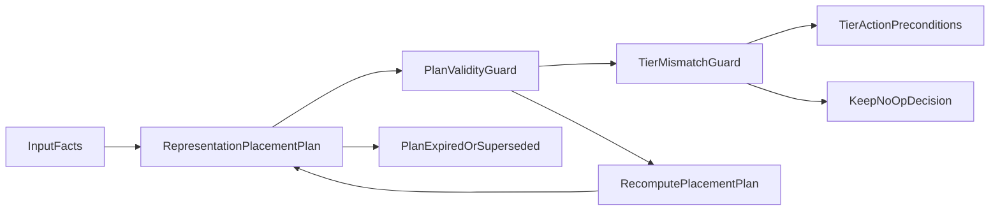
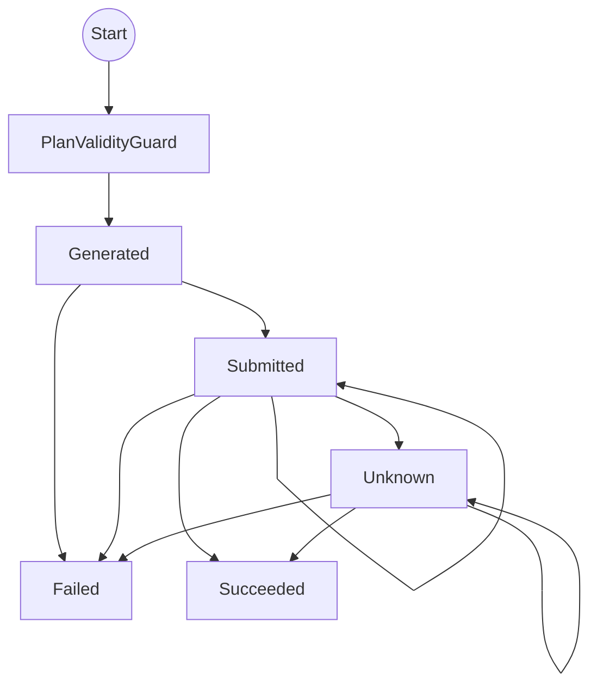
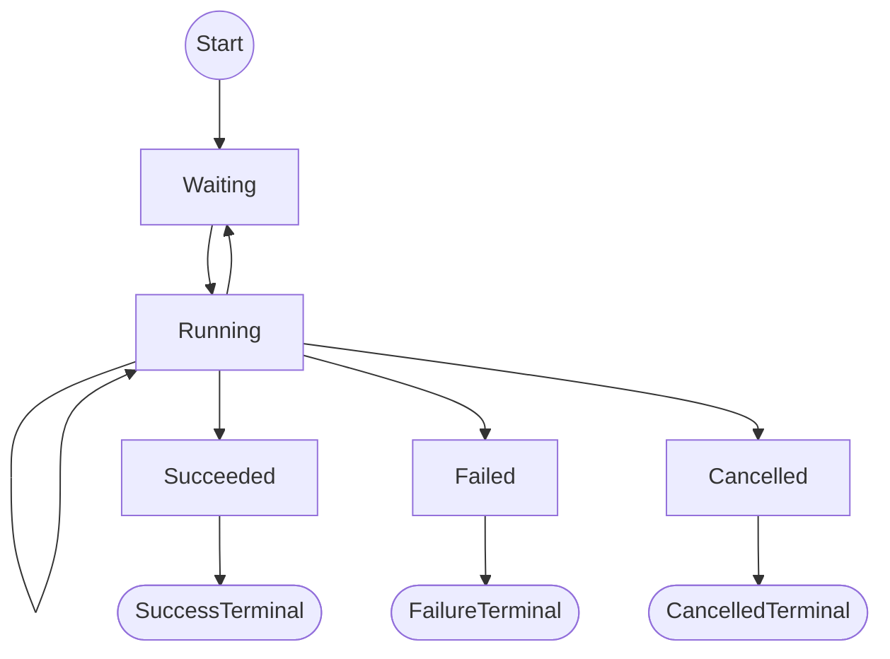
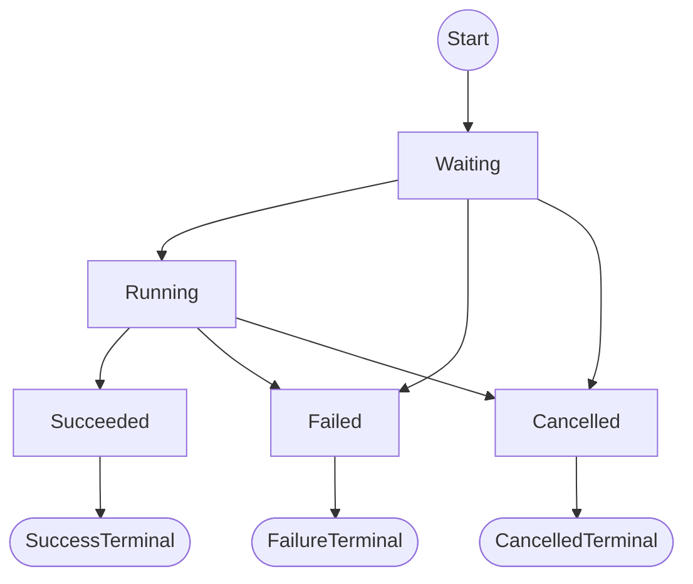
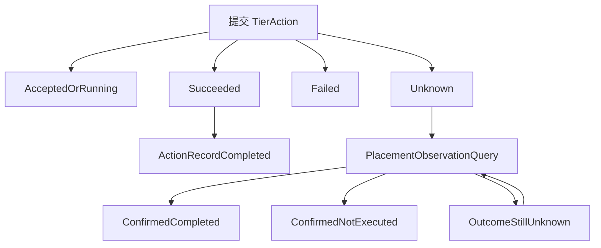
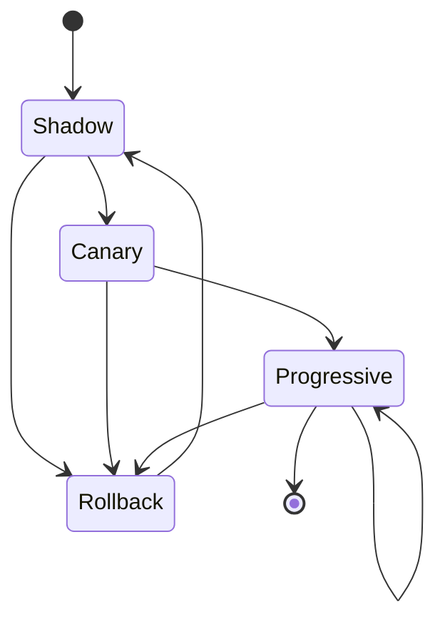
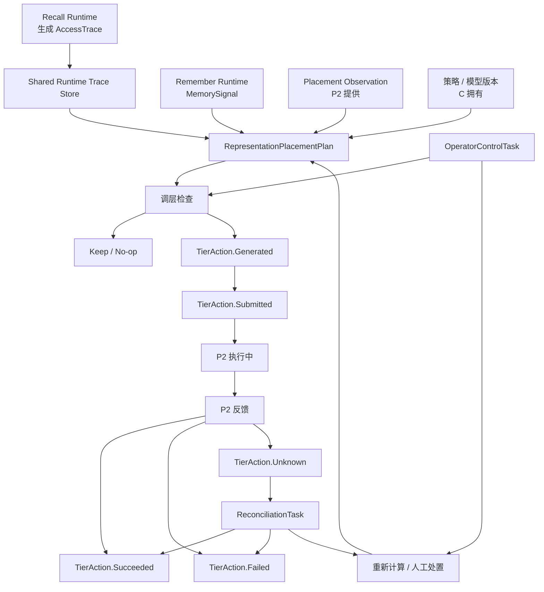
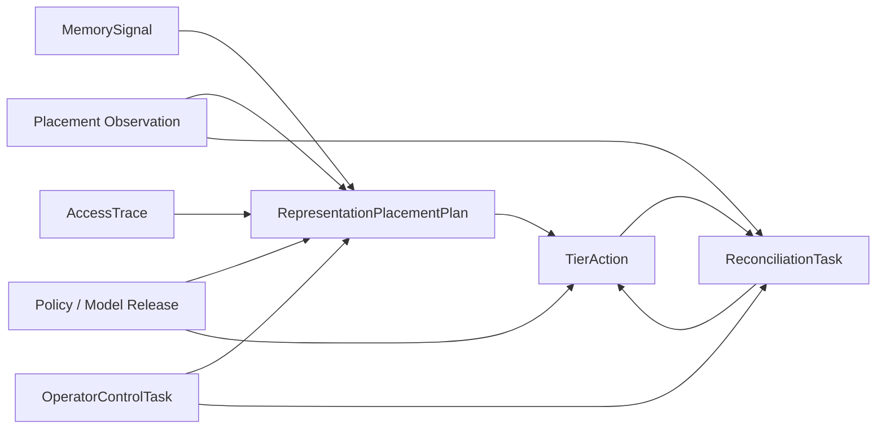

# C 组状态机设计

---

## 1. 先说结论

C 组不是直接管理 A、B 的内部状态，也不是直接管理 P2 的物理迁移过程。

C 组主要负责：

1. 根据 B 的记忆信号、A/B 的访问事实和当前层级观察结果，决定“要不要调层”。
2. 把决定变成 TierAction，交给 P2 执行。
3. 根据 P2 的反馈确认最终结果，处理超时、反馈丢失和状态不一致。
4. 提供暂停、恢复、取消、固定层级等运营控制。
5. 管理策略和模型的发布过程。
6. 在测试环境中模拟存储层级和 P2 反馈，验证上述流程。

最核心的链路是：

```text
MemorySignal / AccessTrace / Placement Observation
                    |
                    v
      生成 RepresentationPlacementPlan
                    |
                    v
          生成 TierAction
                    |
                    v
              P2 Provider
                    |
                    v
   ACCEPTED / RUNNING / SUCCEEDED / FAILED / UNKNOWN
                    |
                    v
        C 更新结果，或进入对账恢复
```

---

## 2. 冻结状态口径

### 2.1 C 的 TierAction.ActionState

```text
Generated / Submitted / Succeeded / Failed / Unknown
```

状态含义：

| 状态 | 简单解释 | 可写？ | 可查？ |
|---|---|---|---|
| Generated | C 已经算出一个调层动作，但还没有提交给 P2 | 是 | 是 |
| Submitted | 已经提交给 P2，P2 可能还在 ACCEPTED 或 RUNNING | 是 | 是 |
| Succeeded | P2 已完成，且 C 校验过实际层级和 generation | 是 | 是 |
| Failed | P2 明确告诉 C 执行失败，或 C 已经确认失败 | 是 | 是 |
| Unknown | C 暂时无法确认结果，例如超时、反馈丢失、P2 返回 UNKNOWN | 是 | 是 |

固定映射：

| P2 Provider 状态 | C 的 TierAction.ActionState |
|---|---|
| ACCEPTED | Submitted |
| RUNNING | Submitted |
| SUCCEEDED，且 actual_tier 正确、generation 校验通过 | Succeeded |
| FAILED | Failed |
| UNKNOWN、超时、反馈丢失 | Unknown |

重要约束：

- Submitted 不是最终成功，只表示 P2 接收或正在处理。
- Unknown 不能直接当成成功。
- Unknown 必须先查询、对账，再决定是成功还是失败。
- 失败重试要新建新的 action_id，不能把旧的 Failed 原地改成 Submitted。
- 调层前容量检查不通过时，不创建 TierAction，直接保持原层级，即 Keep / No-op。
- Succeeded 和已确认的 Failed 可以作为正常终态；Unknown 不是正常终态。

### 2.2 范围说明


本文只设计 C 组自己拥有的对象状态机。A/B 的内部状态不在本文展开；MemorySignal、AccessTrace 等只作为 C 的外部输入，P2 状态只在交接和结果映射中说明。

---

## 3. C 组自己拥有的业务对象总表

| 对象 | 是否由 C 拥有 | 作用 | 主要使用者 |
|---|---:|---|---|
| TierAction | 是 | 记录一次具体的调层动作及其最终结果 | C、P2、Operate、审计 |
| RepresentationPlacementPlan | 是 | 记录 C 根据当前事实算出的目标层级计划 | C、Operate、P2 适配层 |
| ReconciliationTask | 是 | 处理未知结果、反馈丢失和实际层级不一致 | C、P2、Operate |
| OperatorControlTask | 是 | 表达暂停、恢复、取消、固定层级等人工控制 | C、Operate、审计 |
| Policy / Model Release | 是 | 管理策略或模型从试运行到逐步放量的过程 | C、Operate、审计 |
| SimulatedStorageState | 是，但仅测试环境 | 模拟对象当前层级、generation 和 P2 反馈 | C 测试、集成测试 |

MemorySignal、AccessTrace、Placement Observation 和 P2 物理迁移只作为 C 的输入或 Handoff 依赖，不在本文件设计它们的状态机。

---

# 4. RepresentationPlacementPlan 生命周期

## 4.1 这个对象是谁？

RepresentationPlacementPlan 是 C 计算出来的“当前应该把对象放在哪一层”的计划，也是 C 记录的 Desired State。

它不是执行动作，也不会直接修改对象的实际层级，更不是 P2 的物理迁移任务。它描述的是：

- 当前看到的层级；
- 希望达到的层级；
- 基于哪个 generation；
- 使用了哪个策略版本；
- 这个判断在什么时间前有效。

Plan 新建或更新后，C 再将其中的 desired_tier 与当前有效的 observed_tier 比较：

- 两者相同：保持 Keep / No-op，不创建 TierAction；
- 两者不同：通过第 5 部分的前置检查后，才创建 TierAction.Generated。

计划中至少需要：

```text
representation_id
generated_at
valid_until
observed_tier
desired_tier
target_generation
policy_version
reason
```

不单独增加 PlanState。计划是否仍可用，通过时间、generation 和输入事实判断。

## 4.2 它有哪些状态？

冻结 Map 没有给 RepresentationPlacementPlan 定义独立的状态枚举，因此不新增 PlanState。

用下面几组字段描述它的生命周期：

| 字段或条件 | 含义 |
|---|---|
| generated_at | 计划生成时间 |
| valid_until | 计划有效截止时间 |
| observed_tier | 生成计划时看到的实际层级 |
| desired_tier | 计划希望达到的目标层级 |
| target_generation | 计划针对的对象版本 |
| policy_version | 生成计划使用的策略版本 |

计划可以被使用的条件：

```text
当前时间 < valid_until
且当前 generation 与 target_generation 匹配
且输入事实没有被新事实替代
且没有被人工控制覆盖
```

计划不再适用的原因：

- 到达 valid_until；
- 对象 generation 发生变化；
- 新的 MemorySignal 或 AccessTrace 导致重新计算；
- 策略或模型版本改变；
- 运营人员固定了对象层级；
- 已生成新计划替代旧计划。

这里的“失效”是生命周期判断，不是新增的业务状态名。

## 4.3 谁拥有它？

C 组拥有计划。

P2 不负责计划决策，只负责执行 C 交给它的目标。B 提供信号，但不拥有 C 的计划。

## 4.4 谁能改？

- C 的优化决策器：生成新计划。
- C 的策略发布处理器：策略变化时生成新计划。
- C 的运营控制处理器：固定、解除固定或人工调层时触发新计划。
- 对账器：发现实际层级和计划不一致时，要求重新生成计划。

旧计划不原地改成另一个计划。需要改变目标时，应创建新的计划，并保留原计划用于审计和解释。

## 4.5 什么事件触发？

- B 的 MemorySignal 更新；
- A/B 的访问事实更新；
- P2 的 Placement Observation 更新；
- 当前 generation 改变；
- 策略版本或模型版本发布；
- 运营人员执行 Force Keep、解除固定或指定目标层；
- 对账发现计划和实际结果不一致。

以上事件只会触发或更新 RepresentationPlacementPlan，不直接创建 TierAction；TierAction 的直接触发条件见第 5.5 节。

## 4.6 失败后去哪？

计划本身没有调用 P2，因此通常不会有“执行失败”。

如果计划生成失败：

- 不生成 TierAction；
- 保留上一次可查询的计划和输入事实；
- 记录错误；
- 下一次信号、定时重算或人工触发时再次生成。

如果计划生成成功，随后由它派生的 TierAction 执行失败：

```text
RepresentationPlacementPlan
             |
             v
       TierAction Failed / Unknown
             |
             v
   ReconciliationTask 或重新计算计划
```

不能因为计划存在就认为调层已经成功。

## 4.7 重启后怎么恢复？

C 重启后：

1. 加载最近的计划和输入版本。
2. 检查 valid_until。
3. 检查 target_generation 是否仍匹配当前观察到的 generation。
4. 检查是否有新的策略、模型或人工控制。
5. 仍然有效的计划可以继续使用。
6. 已经过期或 generation 不匹配的计划不直接用于创建 TierAction，先重新计算。
7. 正在执行的动作仍以 TierAction 和 P2 查询结果为准。

## 4.8 什么时候算终态？

计划没有单独的终态状态名。

从业务上看，出现以下情况后，旧计划就不再继续驱动新动作：

- 到达 valid_until；
- 被新 generation 对应的计划替代；
- 被新的输入事实或策略替代；
- 被人工控制覆盖。

“调层成功”不等于“计划终止”；调层结果由 TierAction 和 Placement Observation 确认。

## 4.9 生命周期图

### 4.9.1 图中状态 / 节点表

> 第一列使用英文对象名、字段名或流程标识。带有 `Guard`、`Decision`、`Operation` 的名称表示流程判断或操作，不代表新增的冻结 Domain Object / State。表中的“可写”表示 C 是否可以落库或更新该状态；“可查”表示该状态是否需要保留并供其他模块查询。

| Field / Object / Guard | 含义 | 可写？ | 可查？ |
|---|---|---|---|
| `InputFacts` | 收到 MemorySignal、AccessTrace 或 Placement Observation | 否 | 是 |
| `RepresentationPlacementPlan` | 生成或更新目标层级计划，记录目标层级和版本 | 是 | 是 |
| `PlanValidityGuard` | 判断计划是否过期、generation 是否匹配 | 否 | 否 |
| `TierMismatchGuard` | 判断 desired_tier 与 observed_tier 是否一致 | 否 | 否 |
| `TierActionPreconditions` | 检查是否满足调层的前置条件 | 否 | 否 |
| `RecomputePlacementPlan` | 原计划失效后重新计算 | 是 | 是 |
| `KeepNoOpDecision` | 实际层级已满足目标，不创建 TierAction | 是 | 是 |
| `PlanExpiredOrSuperseded` | 计划不再驱动后续动作，但历史记录保留 | 否 | 是 |

### 4.9.2 动作映射表

| 起点 | 动作 / 判断 | 终点 |
|---|---|---|
| `InputFacts` | `CreateOrUpdatePlan`（收到输入事实并生成计划） | `RepresentationPlacementPlan` |
| `RepresentationPlacementPlan` | `CheckPlanValidity`（进入计划有效性检查） | `PlanValidityGuard` |
| `PlanValidityGuard` | `PlanExpiredOrGenerationMismatch`（计划已过期或 generation 不匹配） | `RecomputePlacementPlan` |
| `PlanValidityGuard` | `PlanValid`（计划有效，继续比较层级） | `TierMismatchGuard` |
| `TierMismatchGuard` | `DesiredTierDiffersFromObservedTier`（desired_tier 与 observed_tier 不一致） | `TierActionPreconditions` |
| `TierMismatchGuard` | `DesiredTierMatchesObservedTier`（desired_tier 与 observed_tier 一致） | `KeepNoOpDecision` |
| `RecomputePlacementPlan` | `RecomputePlan`（重新计算得到新计划） | `RepresentationPlacementPlan` |
| `RepresentationPlacementPlan` | `PlanExpiredOrSuperseded`（计划到期、被新事实或新计划替代） | `PlanExpiredOrSuperseded` |



---

# 5. TierAction 状态机

## 5.1 这个对象是谁？

TierAction 是“一次调层动作”的记录。

它不是直接由 MemorySignal 或 AccessTrace 生成，而是由有效的 RepresentationPlacementPlan 派生。也就是说，业务顺序是：输入事实 → RepresentationPlacementPlan → 前置校验 → TierAction.Generated。

```text
MemorySignal / AccessTrace / Placement Observation
                    ↓
      RepresentationPlacementPlan
                    ↓
        有效性、generation、容量和人工控制检查
                    ↓
              TierAction.Generated
```

只有当 Plan 没有过期、generation 匹配、实际层级与目标层级确实不同，并且容量和人工控制检查通过时，C 才创建 TierAction。Plan 判断为 Keep / No-op 时，不创建 TierAction。

例如：

- 把某个对象从热层调到温层；
- 把某个对象从温层调到冷层；
- 把某个对象从冷层调回温层；
- 根据策略决定保持原层级时，不创建 TierAction。

它至少要能让别人查询到：

- action_id
- 对象标识
- observed_tier
- desired_tier
- target_generation
- policy_version
- ActionState
- 提交时间、完成时间
- P2 返回的引用和错误信息
- 查询和对账结果

## 5.2 它有哪些状态？

```text
Generated / Submitted / Succeeded / Failed / Unknown
```

状态机：

### 5.2.1 图中状态表

| Field / Object / Guard | 含义 | 可写？ | 可查？ |
|---|---|---|---|
| `PlanValidityGuard` | 检查 Plan 是否有效且确实需要调层 | 否 | 否 |
| `Generated` | 已生成 TierAction，尚未提交 P2 | 是 | 是 |
| `Submitted` | 已提交 P2，可能仍在 ACCEPTED / RUNNING | 是 | 是 |
| `Succeeded` | P2 成功且 actual_tier、generation 已校验 | 是 | 是 |
| `Failed` | 已确认本次动作失败 | 是 | 是 |
| `Unknown` | 暂时无法确认本次动作结果 | 是 | 是 |
| `SuccessTerminal` | 图示出口，不是新增 ActionState | 否 | 否 |
| `FailureTerminal` | 图示出口，不是新增 ActionState | 否 | 否 |

### 5.2.2 动作映射表

| 起点 | 动作 / 事件 | 终点 |
|---|---|---|
| `PlanValidityGuard` | `CreateTierAction`（有效 Plan、需要调层，且容量和人工控制检查通过） | `Generated` |
| `Generated` | `SubmitToP2`（提交 P2 成功并获得 Provider 任务引用） | `Submitted` |
| `Generated` | `RejectBeforeSubmit`（本地校验失败或提交前失败） | `Failed` |
| `Submitted` | `ProviderAcceptedOrRunning`（P2 返回 ACCEPTED / RUNNING） | `Submitted` |
| `Submitted` | `ConfirmSuccess`（P2 返回 SUCCEEDED，且层级和 generation 校验通过） | `Succeeded` |
| `Submitted` | `ConfirmFailure`（P2 返回 FAILED） | `Failed` |
| `Submitted` | `MarkUnknown`（超时、反馈丢失或 P2 返回 UNKNOWN） | `Unknown` |
| `Unknown` | `ReconcileSuccess`（查询确认已完成，且层级和 generation 校验通过） | `Succeeded` |
| `Unknown` | `ReconcileFailure`（查询确认失败或确认未执行） | `Failed` |
| `Unknown` | `ContinueReconciliation`（查询仍无法确认，进入 ReconciliationTask） | `Unknown` |
| `Succeeded` | `CloseSuccess`（进入成功终态出口） | `SuccessTerminal` |
| `Failed` | `CloseFailure`（进入失败终态出口） | `FailureTerminal` |



图中的“成功终态”和“失败终态”只是两个分开的图示出口，不是新增的 ActionState。真正的业务状态仍然只有 `Succeeded` 和 `Failed`，两者互不汇合。

## 5.3 谁拥有它？

C 组拥有 TierAction 的业务记录和状态。

P2 只拥有执行侧的 Provider 任务及物理迁移过程。P2 可以返回执行结果，但不能直接修改 C 的 ActionState 存储；C 根据返回结果和校验规则落状态。

## 5.4 谁能改？

- C 的策略执行器：在有效 Plan 通过前置检查后创建 Generated，提交后更新为 Submitted。
- C 的反馈处理器：根据 P2 反馈更新为 Succeeded、Failed 或 Unknown。
- C 的对账器：处理 Unknown，在查询确认后更新为 Succeeded 或 Failed。
- Operate 人员：只能通过 OperatorControlTask 发起暂停、取消或人工处置，不能直接把旧动作改成成功。
- P2：只能修改自己的执行记录和返回反馈。

约束：

- 一个 action_id 只能按允许的方向变化。
- 重试必须创建新的 action_id，并保存与原动作的关联。
- 人工强制确认需要审计记录，不能绕过 generation 和实际层级校验。

## 5.5 什么事件触发？

TierAction.Generated 的直接触发事件是：RepresentationPlacementPlan 完成计算，并确认需要执行层级调整。

以下条件全部满足，才创建 TierAction.Generated：

- Plan 要求调度时（即desired_tier 与 observed_tier 不一致）（没有过期，且 target_generation 与当前 generation 匹配）；
- 没有生效的 Pin / Force Keep 等人工控制；
- 容量、权限和目标操作检查通过；
- 同一对象没有需要先处理的 Submitted 或 Unknown 动作，且不在冷却时间内。

变为 Submitted 的事件：

- C 调用 P2 Provider 成功，并获得可查询的 Provider 任务引用。

变为 Succeeded 的必要条件：

- P2 返回 SUCCEEDED；
- P2 返回的 actual_tier 等于目标层级；
- generation 校验通过；
- 对象标识、action_id 或幂等键能够对应上。

变为 Failed 的事件：

- P2 明确返回 FAILED；
- 提交前的必要校验失败；
- 对账确认这次动作没有执行且已经判定失败。

变为 Unknown 的事件：

- P2 返回 UNKNOWN；
- 查询超时；
- 反馈事件没有到达；
- 返回信息与 action 或 generation 对不上，暂时无法判断。

## 5.6 失败后去哪？

分两类：

1. 已明确失败：进入 Failed。原对象保持原层级，不把失败误记成目标层级。
2. 结果不明确：进入 Unknown，创建或关联 ReconciliationTask。

对 Unknown 的处理顺序：

```text
Unknown
  -> 查询 P2 Provider
  -> 查询 Placement Observation
  -> 比较 actual_tier / generation / action_id
  -> 确认 Succeeded 或 Failed
  -> 仍无法确认则保留 Unknown，并继续对账
```

只有确认对象当前确实没有被本次动作改变，才允许新建重试动作。

## 5.7 重启后怎么恢复？

C 重启后：

1. 从持久化存储加载所有非终态的 Generated、Submitted、Unknown。
2. Generated：根据幂等键检查是否已经提交；没有提交记录才重新提交。
3. Submitted：根据 P2 Provider 引用查询执行结果。
4. Unknown：优先进入对账，不直接重试。
5. 查询到成功时，仍要校验 actual_tier 和 generation。
6. 查询到失败时，进入 Failed。
7. 长时间查不到结果时，保持 Unknown，由 ReconciliationTask 继续处理。
8. 已经是 Succeeded 或确认的 Failed 的动作不重复执行。

恢复的关键是：不能因为 C 重启就重复发起同一个物理动作，必须依赖 action_id、幂等键、P2 引用和 generation。

## 5.8 什么时候算终态？

- Succeeded：结果已确认，实际层级等于目标层级，generation 校验通过。
- Failed：结果已确认失败，或确认这次动作没有执行。
- Generated、Submitted、Unknown：都不是终态。

如果已经是 Unknown，不能因为“过了很久”就自动算成功；必须通过查询、观察或明确的失败规则结束。

---

# 6. ReconciliationTask 状态机

## 6.1 这个对象是谁？

ReconciliationTask 是一次“把 C 的记录、P2 的执行结果和真实层级重新对齐”的任务。

它不是普通调层动作，而是异常或不确定场景下的恢复任务。典型情况：

- TierAction 为 Unknown；
- P2 反馈丢失；
- 读取到的实际层级和 C 预期不一致；
- generation 不一致；
- C 或 P3 重启；
- P2 已经执行，但 C 没有收到最终反馈。

## 6.2 它有哪些状态？

统一沿用 Task 状态：

```text
Waiting / Running / Succeeded / Failed / Cancelled
```

状态机：

### 6.2.1 图中状态表

| State | 含义 | 可写？ | 可查？ |
|---|---|---|---|
| Waiting | 对账任务等待领取或下一轮重试 | 是 | 是 |
| Running | 对账器正在查询 P2、读取 Observation 或判断结果 | 是 | 是 |
| Succeeded | 已确认 C 的记录与实际层级一致 | 是 | 是 |
| Failed | 已确认无法自动恢复或需要人工处理 | 是 | 是 |
| Cancelled | 运营人员明确取消对账任务 | 是 | 是 |

### 6.2.2 动作映射表

| Start State | Action / Event | End State |
|---|---|---|
| `Start` | `CreateReconciliationTask`（创建对账任务并进入等待） | `Waiting` |
| `Waiting` | `ClaimTask`（对账器领取任务） | `Running` |
| `Running` | `QueryP2AndObservation`（查询 P2、读取 Observation 或重试查询） | `Running` |
| `Running` | `ReleaseLease`（执行者失去租约，等待下一轮重试） | `Waiting` |
| `Running` | `ConfirmConsistency`（已确认 C 的记录与实际层级一致） | `Succeeded` |
| `Running` | `MarkManualIntervention`（已确认无法恢复或需要人工处理） | `Failed` |
| `Running` | `CancelTask`（运营人员取消任务） | `Cancelled` |
| `Succeeded` | `CloseSuccess`（进入成功终态出口） | `SuccessTerminal` |
| `Failed` | `CloseFailure`（进入失败终态出口） | `FailureTerminal` |
| `Cancelled` | `CloseCancelled`（进入取消终态出口） | `CancelledTerminal` |



## 6.3 谁拥有它？

C 组拥有对账任务。

P2 提供查询接口和真实层级观察结果；A/B 可能提供输入事实，但不拥有这个任务。

## 6.4 谁能改？

- C 对账调度器：Waiting → Running。
- C 对账执行器：记录查询过程和最终判断。
- C 的异常处理器：将任务置为 Succeeded 或 Failed。
- Operate：通过 OperatorControlTask 取消任务或要求人工介入。
- P2：只提供查询结果，不直接修改 C 的 Task 状态。

## 6.5 什么事件触发？

创建 ReconciliationTask 的事件：

- TierAction 进入 Unknown；
- 反馈超时或事件丢失；
- actual_tier 与 desired_tier 不一致；
- generation mismatch；
- C/P3 重启后发现有未闭合动作；
- 定期扫描发现持久化记录与 P2 状态不一致。

执行任务时主要查询：

- P2 Provider 任务状态；
- P2 的 Placement Observation；
- action_id、幂等键、generation；
- 需要时查询对象是否仍然存在。

## 6.6 失败后去哪？

- 查询确认一致：Succeeded，并将相关 TierAction 收敛到正确结果。
- 查询确认动作失败或对象不可恢复：Failed，保留原层级和错误原因，等待人工或新计划。
- 暂时查不到：任务继续保持 Running，按重试策略继续查询；不要直接把未知当成功。
- 需要人工决策：Failed 并标记需要人工处置，或由 Operate 创建新的控制任务。

注意：ReconciliationTask 的 Failed 不等于业务对象调层失败；它表示这次对账无法自动完成，相关 TierAction 可能仍需保持 Unknown。

## 6.7 重启后怎么恢复？

- Waiting：重新进入任务队列。
- Running：通过租约或心跳判断是否已失去执行者；失去执行者后恢复为可领取的 Waiting 语义。
- 已经 Succeeded、Failed、Cancelled 的任务不重复执行。
- 对账查询要幂等，不能因为任务重启而重复触发物理迁移。
- 每次查询结果、判断依据和时间都要保留，便于解释为什么收敛到成功或失败。

## 6.8 什么时候算终态？

- Succeeded：已经拿到足够证据，C 的记录和实际观察一致。
- Failed：达到明确失败规则，或者确定需要人工处理。
- Cancelled：运营人员明确取消。
- Waiting、Running：都不是终态。

---

# 7. OperatorControlTask 状态机

## 7.1 这个对象是谁？

OperatorControlTask 是运营人员对 C 业务流施加控制的任务记录。

支持的控制语义包括：

- Pause：暂停新的自动调层；
- Resume：恢复自动调层；
- Cancel：取消仍可取消的任务；
- Pin：固定某个对象的层级；
- Force Keep：要求对象保持当前层级，不创建调层动作。

它记录的重点是：

- 谁发起；
- 控制什么对象或范围；
- 控制原因；
- 生效时间和失效时间；
- 是否已传播到相关执行器；
- 操作审计。

## 7.2 它有哪些状态？

沿用统一 Task 状态：

```text
Waiting / Running / Succeeded / Failed / Cancelled
```

状态机：

### 7.2.1 图中状态表

| State | 含义 | 可写？ | 可查？ |
|---|---|---|---|
| Waiting | 控制任务等待校验或执行 | 是 | 是 |
| Running | 控制任务正在执行并传播 | 是 | 是 |
| Succeeded | 控制已经生效并完成传播 | 是 | 是 |
| Failed | 控制没有生效或无法完成 | 是 | 是 |
| Cancelled | 控制任务被提交者或运营人员取消 | 是 | 是 |

### 7.2.2 动作映射表

| Start State | Action / Event | End State |
|---|---|---|
| `Start` | `CreateOperatorControlTask`（创建控制任务并进入等待） | `Waiting` |
| `Waiting` | `ValidateAuthorizationAndParameters`（权限与参数校验通过） | `Running` |
| `Waiting` | `RejectInvalidControl`（权限或参数校验失败） | `Failed` |
| `Waiting` | `CancelTask`（提交者取消任务） | `Cancelled` |
| `Running` | `PropagateControl`（控制已生效并完成传播） | `Succeeded` |
| `Running` | `ControlPropagationFailed`（传播失败或目标无法控制） | `Failed` |
| `Running` | `CancelTask`（仍可取消且运营人员取消） | `Cancelled` |
| `Succeeded` | `CloseSuccess`（进入成功终态出口） | `SuccessTerminal` |
| `Failed` | `CloseFailure`（进入失败终态出口） | `FailureTerminal` |
| `Cancelled` | `CloseCancelled`（进入取消终态出口） | `CancelledTerminal` |



这里的 Pause / Resume / Cancel / Pin / Force Keep 是控制动作，不是给统一 Task 额外增加的状态。

## 7.3 谁拥有它？

C 组拥有控制任务的状态、权限校验和审计记录。

P2 只负责执行它能够执行的实际控制，例如取消可取消的 Provider 任务；P2 不决定 C 的自动策略是否暂停，也不拥有运营审计。

## 7.4 谁能改？

- 具备权限的 Operate 人员：发起控制请求。
- C 控制服务：校验、执行、落状态。
- C 策略执行器：根据已经生效的控制结果停止或恢复自动动作。
- P2：返回实际取消或执行结果。
- 无权限的调用方不能直接修改控制任务。

## 7.5 什么事件触发？

- 运营人员提交 Pause、Resume、Cancel、Pin 或 Force Keep；
- 告警触发保护性暂停；
- 发布策略或模型时进入控制窗口；
- P2 发生故障，需要暂停新的调层；
- 风险解除后恢复自动运行；
- 需要人工固定对象层级。

控制的效果：

- Pause 生效后：不再创建新的自动 TierAction，已有动作按既定恢复和对账规则处理。
- Resume 生效后：重新读取最新事实，再生成计划；不能盲目继续旧计划。
- Pin / Force Keep 生效后：策略计算不能把对象调到其他层，直到控制解除。
- Cancel 只对仍可取消的任务生效，不能伪造已经完成的迁移结果。

## 7.6 失败后去哪？

- 权限、参数或范围校验失败：Failed，不产生实际控制效果。
- P2 拒绝取消：Failed，记录 P2 返回原因；不把动作误记成已取消。
- Pin 或 Force Keep 传播不完整：Failed，对相关对象做对账。
- 控制失败不应悄悄继续自动调层；必要时触发保护性 Pause，由 Operate 决定下一步。

## 7.7 重启后怎么恢复？

- 从持久化记录加载未完成的 Waiting、Running 控制任务。
- Waiting 重新校验权限和有效期后入队。
- Running 根据操作幂等键确认是否已经传播，避免重复执行。
- 已生效的 Pause、Pin、Force Keep 必须从持久化控制记录恢复，不能因进程重启而失效。
- Resume 恢复后要基于最新观察结果重新计算。
- 已终态的控制任务不重复执行。

## 7.8 什么时候算终态？

- Succeeded：控制语义已经生效，并且相关组件确认收到。
- Failed：控制没有生效或无法自动完成。
- Cancelled：任务被明确取消。
- Waiting、Running：不是终态。

注意：控制任务终态和控制效果的有效期是两件事。一个 Pin 任务可以是 Succeeded，但固定效果仍然持续到明确解除或约定的截止时间。

---

# 8. SimulatedStorageState 状态变化

## 8.1 这个对象是谁？

SimulatedStorageState 只用于测试环境，用来模拟：

- 对象当前在哪一层；
- 对象当前的 generation；
- 已经提交的 action；
- P2 返回的反馈；
- 重启后能否恢复现场。

它不是生产环境的真实存储状态，也不能替代 P2 的真实观察结果。

## 8.2 它有哪些状态？

不新增业务状态枚举。模拟器维护这些数据：

```text
current_tier
generation
action record
feedback
```

其中 feedback 使用 P2 已有状态：

```text
ACCEPTED / RUNNING / SUCCEEDED / FAILED / UNKNOWN
```

状态变化规则：

### 8.2.1 图中状态 / 数据表

| 模拟状态 / 节点 | current_tier | generation | 含义 | 可写？ | 可查？ |
|---|---|---|---|---|---|
| AcceptedOrRunning | 保持不变 | 保持不变 | P2 已受理或正在执行 | 是 | 是 |
| Succeeded | 更新为目标层级 | 待更新 | 模拟动作成功 | 是 | 是 |
| ActionRecordCompleted | 已更新 | 加 1 | 成功动作完成并更新版本 | 是 | 是 |
| Failed | 保持不变 | 保持不变 | 模拟动作明确失败 | 是 | 是 |
| Unknown | 暂不改变 | 暂不改变 | 结果待查询和对账 | 是 | 是 |
| PlacementObservationQuery | 读取实际值 | 读取实际值 | 查询模拟 P2 的真实结果 | 否 | 是 |
| ConfirmedCompleted | 更新为目标层级 | 加 1 | 对账确认动作已完成 | 是 | 是 |
| ConfirmedNotExecuted | 保持不变 | 保持不变 | 对账确认动作未执行 | 是 | 是 |
| OutcomeStillUnknown | 暂不改变 | 暂不改变 | 继续等待后续对账 | 是 | 是 |

### 8.2.2 动作映射表

| 起点 | 动作 / 反馈 | 终点 |
|---|---|---|
| 开始 | 提交 TierAction 后返回 ACCEPTED / RUNNING | AcceptedOrRunning |
| 开始 | 提交 TierAction 后返回 SUCCEEDED | Succeeded |
| 开始 | 提交 TierAction 后返回 FAILED | Failed |
| 开始 | 提交 TierAction 后返回 UNKNOWN | Unknown |
| Succeeded | 成功后更新 generation，动作记录完成 | ActionRecordCompleted |
| Unknown | 对 UNKNOWN 结果发起对账查询 | PlacementObservationQuery |
| PlacementObservationQuery | 查询确认动作已完成 | ConfirmedCompleted |
| PlacementObservationQuery | 查询确认动作未执行 | ConfirmedNotExecuted |
| PlacementObservationQuery | 查询仍无法确认 | OutcomeStillUnknown |
| OutcomeStillUnknown | 继续下一轮对账查询 | PlacementObservationQuery |

这里没有单独的 SimulatedStorageState 状态机。下面只是测试数据变化示意，不是新增业务状态：



## 8.3 谁拥有它？

测试环境的 C 测试组件拥有 SimulatedStorageState。

生产环境中真实层级由 P2 拥有，C 只能读取 Placement Observation。

## 8.4 谁能改？

- 测试驱动器可以注入反馈和故障。
- 模拟 P2 Provider 根据测试场景改变模拟状态。
- C 测试断言只能读取并验证结果，不能直接修改生产语义。
- 生产 C 代码不能把模拟状态当作真实状态源。

## 8.5 什么事件触发？

- 测试提交一个 TierAction；
- 模拟 P2 返回 ACCEPTED、RUNNING、SUCCEEDED、FAILED 或 UNKNOWN；
- 测试模拟超时、进程重启和反馈丢失；
- 测试执行查询和对账。

## 8.6 失败后去哪？

- FAILED：模拟器保持当前层级，C 的动作进入 Failed。
- UNKNOWN：模拟器不主动改变状态；通过查询场景分别覆盖“实际已改变”和“实际未改变”。
- 对账无法判断：保留未知结果，验证 C 不会错误重试或错误宣告成功。

## 8.7 重启后怎么恢复？

测试必须把模拟状态持久化，至少恢复：

- current_tier
- generation
- action_id 和幂等键
- P2 feedback
- 查询记录

重启后要验证：

- Submitted 不重复提交；
- Unknown 先对账；
- Succeeded 不重复执行；
- generation 连续递增；
- 失败不改变当前层级。

## 8.8 什么时候算终态？

模拟器本身没有新增业务终态。

对一条模拟动作来说：

- P2 SUCCEEDED 且观察结果正确：对应 C 的 Succeeded；
- P2 FAILED：对应 C 的 Failed；
- P2 UNKNOWN：继续等待查询或对账，不能作为成功终态。

---

# 9. Policy / Model Release 状态机

## 9.1 这个对象是谁？

Policy / Model Release 是 C 使用的调层策略或优化模型的一次可追踪发布版本。

它解决两个问题：

1. C 这次为什么决定把对象放到某一层？
2. 新策略或模型出现问题时，如何暂停放量并回退？

每个 TierAction 和 RepresentationPlacementPlan 都应记录使用的 policy_version 或 model_version。

## 9.2 它有哪些状态？

PPR 已明确的发布状态：

```text
Shadow / Canary / Progressive / Rollback
```

状态机：

### 9.2.1 图中状态表

| 状态 | 含义 | 可写？ | 可查？ |
|---|---|---|---|
| Shadow | 只计算或旁路观察，不影响正式调层 | 是 | 是 |
| Canary | 小范围真实使用，观察关键指标 | 是 | 是 |
| Progressive | 按比例逐步扩大使用范围 | 是 | 是 |
| Rollback | 停止当前版本影响业务，回退到稳定版本或安全策略 | 是 | 是 |
| 版本终止（Mermaid 的 `[*]`） | 当前版本被后续版本替代，保留历史记录 | 否 | 是 |

### 9.2.2 动作映射表

| 起点 | 动作 / 事件 | 终点 |
|---|---|---|
| 开始 | 新策略或模型准备发布 | Shadow |
| Shadow | Shadow 评估通过 | Canary |
| Shadow | Shadow 发现明显问题 | Rollback |
| Canary | Canary 指标通过 | Progressive |
| Canary | Canary 指标异常或人工停止 | Rollback |
| Progressive | Progressive 继续按比例放量 | Progressive |
| Progressive | Progressive 出现线上异常或回归 | Rollback |
| Rollback | 修复后的下一版本重新验证 | Shadow |
| Progressive | 当前版本完成生命周期并由后续版本替代 | 版本终止（`[*]`） |



说明：

- Shadow：只计算或旁路观察，不影响正式调层。
- Canary：小范围真实使用。
- Progressive：逐步扩大范围。
- Rollback：停止当前版本继续影响业务，并回退到稳定版本或安全策略。
- Rollback 后修复的版本必须作为新版本重新从 Shadow 开始，不能把原版本直接改回 Canary。

## 9.3 谁拥有它？

C 组拥有策略和模型发布记录。

Operate 负责发布审批、观察指标和人工控制；平台发布系统可以提供部署能力，但不能替代 C 对业务版本状态的记录。

## 9.4 谁能改？

- C 的发布控制器：推动版本阶段。
- 有权限的 Operate：批准进入下一阶段、暂停或触发回退。
- 监控和评估组件：提供指标和异常信号。
- 未授权调用方不能直接修改发布状态。

## 9.5 什么事件触发？

- 新策略或模型完成构建；
- Shadow 评估通过；
- Canary 指标达到要求；
- Progressive 阶段的错误率、延迟、容量或数据一致性异常；
- Operate 人工批准、暂停或回退；
- P2、A 或 B 的依赖故障导致调层结果不可信。

发布版本必须关联：

- 版本号；
- 评估结果；
- 生效范围；
- 发布时间；
- 回退目标；
- 使用该版本生成的计划和动作。

## 9.6 失败后去哪？

- Shadow 或 Canary 发现问题：进入 Rollback。
- Progressive 发现线上问题：进入 Rollback，停止继续放量。
- 回退时，不自动删除旧的计划、动作和审计记录。
- 受影响的未完成动作根据 TierAction 状态继续查询或对账。
- 回退后的稳定策略重新生成计划，不能直接复用可能已经过时的旧计划。

## 9.7 重启后怎么恢复？

- 加载当前发布版本和其状态。
- 恢复已经生效的发布范围和回退目标。
- 未完成的阶段推进任务按幂等键恢复。
- 已经处于 Rollback 的版本不能因重启再次放量。
- 恢复后先检查 P2、A/B 依赖和关键指标，再决定是否继续推进。

## 9.8 什么时候算终态？

- 当前版本进入 Rollback 后，不再继续向前推进。
- Progressive 不是“永远成功”，它表示当前正在逐步放量。
- 版本被后续版本替代后，可以结束当前版本的生命周期，但历史记录必须保留。
- 任何发布阶段的异常都应优先进入 Rollback，而不是继续放量。

---

# 10. P2 物理迁移事务的边界

P2 内部的物理迁移过程是：

```text
Copy → Verify → Cutover → Reclaim
```

这条过程由 P2 拥有，C 不把它拆成自己的业务状态机。

C 只关心两层结果：

```text
C 发送目标：desired_tier / opaque ActuationTarget
P2 返回结果：ACCEPTED / RUNNING / SUCCEEDED / FAILED / UNKNOWN
```

边界如下：

| 问题 | C 负责 | P2 负责 |
|---|---|---|
| 是否需要调层 | 是 | 否 |
| 目标层级是什么 | 是 | 接收目标 |
| 选择具体物理介质 | 否 | 是 |
| Copy | 否 | 是 |
| Verify | 读取结果并校验 | 执行校验 |
| Cutover | 读取最终观察 | 执行切换 |
| Reclaim | 否 | 执行旧副本回收 |
| 调层动作记录 | 是，TierAction | 提供 Provider 引用 |
| 真实层级观察 | 消费 | 拥有 |
| 超时和反馈丢失后的收敛 | 是，ReconciliationTask | 提供查询能力 |

因此，C 不需要知道 P2 具体把热、温、冷层落在哪个底层介质，也不应该在 C 内部复制一套 Copy / Verify / Cutover / Reclaim 状态。

---

# 11. C 组总数据流状态图

### 11.1 图中节点 / 状态表

| 节点 / 状态 | 含义 | 可写？ | 可查？ |
|---|---|---|---|
| Recall Runtime / AccessTrace | Recall 完成或失败后产生的访问事实 | 否 | 是 |
| Shared Runtime Trace Store | 持久化并供 C 读取 AccessTrace | 否 | 是 |
| Remember Runtime / MemorySignal | Memory 形成、更新或版本变化的事实信号 | 否 | 是 |
| Placement Observation | P2 提供的实际层级和 generation | 否 | 是 |
| Policy / Model Release | C 使用的策略或模型版本 | 是 | 是 |
| RepresentationPlacementPlan | C 计算出的 desired_tier 计划 | 是 | 是 |
| 调层检查 | 比较 desired_tier 与 observed_tier，并检查前置条件 | 否 | 否 |
| Keep / No-op | 不需要调层，不创建 TierAction | 是 | 是 |
| TierAction.Generated | 已生成但未提交的动作 | 是 | 是 |
| TierAction.Submitted | 已提交 P2 的动作 | 是 | 是 |
| P2 执行中 | P2 返回 ACCEPTED / RUNNING | 否 | 是 |
| P2 反馈 | P2 返回 SUCCEEDED / FAILED / UNKNOWN | 否 | 是 |
| TierAction.Succeeded | 成功且层级、generation 校验通过 | 是 | 是 |
| TierAction.Failed | 已确认动作失败 | 是 | 是 |
| TierAction.Unknown | 结果暂时无法确认 | 是 | 是 |
| ReconciliationTask | 对账和异常恢复任务 | 是 | 是 |
| 重新计算 / 人工处置 | 重新生成计划或等待人工决定 | 是 | 是 |
| OperatorControlTask | Pause / Resume / Pin / Force Keep 等人工控制 | 是 | 是 |

### 11.2 动作映射表

| 起点 | 动作 / 关系 | 终点 |
|---|---|---|
| Recall Runtime / AccessTrace | Recall Runtime 写入 AccessTrace | Shared Runtime Trace Store |
| Shared Runtime Trace Store | C 从共享 Trace Store 读取 AccessTrace | RepresentationPlacementPlan |
| Remember Runtime / MemorySignal | MemorySignal 进入计划计算 | RepresentationPlacementPlan |
| Placement Observation | Placement Observation 进入计划计算 | RepresentationPlacementPlan |
| Policy / Model Release | 策略 / 模型版本进入计划计算 | RepresentationPlacementPlan |
| RepresentationPlacementPlan | Plan 进入调层检查 | 调层检查 |
| 调层检查 | 不需要调层或检查不通过 | Keep / No-op |
| 调层检查 | 需要调层且前置检查通过 | TierAction.Generated |
| TierAction.Generated | 提交已生成的 TierAction | TierAction.Submitted |
| TierAction.Submitted | P2 进入执行阶段 | P2 执行中 |
| P2 执行中 | P2 返回执行反馈 | P2 反馈 |
| P2 反馈 | SUCCEEDED 且校验通过 | TierAction.Succeeded |
| P2 反馈 | P2 明确返回 FAILED | TierAction.Failed |
| P2 反馈 | UNKNOWN、超时或反馈丢失 | TierAction.Unknown |
| TierAction.Unknown | Unknown 进入对账 | ReconciliationTask |
| ReconciliationTask | 对账确认动作成功 | TierAction.Succeeded |
| ReconciliationTask | 对账确认动作失败 | TierAction.Failed |
| ReconciliationTask | 对账无法自动收敛 | 重新计算 / 人工处置 |
| 重新计算 / 人工处置 | 重新计算后生成新 Plan | RepresentationPlacementPlan |
| OperatorControlTask | 人工控制参与调层检查 | 调层检查 |
| OperatorControlTask | 人工控制触发重新计算或处置 | 重新计算 / 人工处置 |



这张图讲的是：

- Remember Runtime、Recall Runtime 和 P2 提供事实；
- C 负责决策和动作记录；
- P2 负责执行；
- C 负责把执行结果收敛成可查询的业务结果；
- 不确定结果进入对账，不直接当成功。

---

# 12. 对象之间的关系

### 12.1 对象 / 状态表

| 对象 | 责任 / 作用 | 可写？ | 可查？ |
|---|---|---|---|
| MemorySignal | Remember Runtime 提供的输入事实 | 否 | 是 |
| AccessTrace | 共享 Trace Store 中的访问事实 | 否 | 是 |
| Placement Observation | P2 提供的实际层级观察 | 否 | 是 |
| Policy / Model Release | C 管理的策略或模型版本 | 是 | 是 |
| RepresentationPlacementPlan | C 管理的目标状态和决策记录 | 是 | 是 |
| TierAction | C 管理的一次执行动作记录 | 是 | 是 |
| ReconciliationTask | C 管理的异常对账任务 | 是 | 是 |
| OperatorControlTask | C 管理的人工控制任务 | 是 | 是 |

### 12.2 关系映射表

| 起点 | 关系 / 触发 | 终点 |
|---|---|---|
| MemorySignal | MemorySignal 作为输入事实 | RepresentationPlacementPlan |
| AccessTrace | AccessTrace 作为输入事实 | RepresentationPlacementPlan |
| Placement Observation | Placement Observation 作为输入事实 | RepresentationPlacementPlan |
| Policy / Model Release | Policy / Model Release 提供决策版本 | RepresentationPlacementPlan |
| OperatorControlTask | OperatorControlTask 覆盖或约束计划 | RepresentationPlacementPlan |
| RepresentationPlacementPlan | 目标层级与实际层级不一致时生成动作 | TierAction |
| TierAction | TierAction Unknown 或实际不一致时创建对账 | ReconciliationTask |
| Placement Observation | 对账读取实际层级观察 | ReconciliationTask |
| OperatorControlTask | 人工控制取消或处置对账任务 | ReconciliationTask |
| Policy / Model Release | 策略版本解释或约束 TierAction | TierAction |
| ReconciliationTask | 对账结果更新动作记录 | TierAction |



关系说明：

- MemorySignal 和 AccessTrace 是输入事实，不是 C 的调层结果。
- RepresentationPlacementPlan 是决策产物。
- TierAction 是执行意图和执行结果记录。
- ReconciliationTask 是异常恢复和一致性收敛。
- OperatorControlTask 是人工控制入口。
- Policy / Model Release 解释计划和动作为什么这样生成。

---

# 13. 需要重点测试的状态转移

## 13.1 正常成功

```text
有效输入
→ 生成计划
→ TierAction.Generated
→ TierAction.Submitted
→ P2 ACCEPTED / RUNNING
→ P2 SUCCEEDED
→ 校验 actual_tier 和 generation
→ TierAction.Succeeded
```

## 13.2 P2 明确失败

```text
TierAction.Submitted
→ P2 FAILED
→ TierAction.Failed
→ 保持原层级
→ 新信号或人工操作后再生成新的 action_id
```

## 13.3 反馈丢失

```text
TierAction.Submitted
→ 超时或反馈丢失
→ TierAction.Unknown
→ ReconciliationTask.Waiting
→ ReconciliationTask.Running
→ 查询 P2 和 Placement Observation
→ Succeeded 或 Failed
```

## 13.4 C 重启

```text
重启
→ 加载 Submitted / Unknown
→ 通过 action_id 或 Provider 引用查询
→ 校验 generation
→ 收敛到 Succeeded / Failed
```

## 13.5 generation 不一致

```text
计划针对 generation = 10
实际对象已经是 generation = 11
→ 不直接执行旧计划
→ 重新读取事实
→ 生成新计划
```

## 13.6 人工固定层级

```text
OperatorControlTask.Waiting
→ Running
→ Succeeded
→ C 暂停该对象自动调层
→ 解除固定后重新读取事实并计算
```

## 13.7 策略发布异常

```text
Shadow
→ Canary
→ Progressive
→ 指标异常
→ Rollback
→ 修复版本从 Shadow 重新开始
```

---

# 14. 明天可以怎么讲

可以按下面的顺序讲，比较容易让别人听懂：

1. **先讲边界**  
   “C 决定要不要调层，P2 负责真正执行；C 不管理 P2 内部 Copy、Verify、Cutover、Reclaim。”

2. **再讲主对象**  
   “我的核心对象是 TierAction。它从 Generated 到 Submitted，最后根据 P2 反馈进入 Succeeded、Failed 或 Unknown。”

3. **强调 Unknown**  
   “超时或反馈丢失不能算成功，要进入 ReconciliationTask，查 P2 和实际层级后再收敛。”

4. **讲计划和动作的区别**  
   “RepresentationPlacementPlan 只是 C 的决策计划，TierAction 才是发给 P2 的一次执行动作；计划有效不代表动作已经成功。”

5. **讲谁拥有什么**  
   “C 拥有计划、动作、对账和运营控制；B 拥有 MemorySignal，A/B 拥有 AccessTrace，P2 拥有真实层级观察和物理迁移过程。”

6. **最后讲恢复**  
   “重启后不重复发动作。先加载未终态记录，用 action_id、Provider 引用和 generation 查询，再决定成功、失败，还是继续对账。”

---

# 15. 当前还需要确认的问题

这些是设计中仍需要和 P2、A、B 负责人确认的接口问题，不是擅自新增状态：

1. P2 查询接口是否支持按 action_id、Provider task id 和对象 id 查询？
2. P2 的 Placement Observation 是否一定包含 actual_tier 和 generation？
3. C 如何判断 generation 是对象版本、层级版本，还是迁移操作版本？
4. UNKNOWN 结果的查询重试次数、间隔和最终人工介入规则是什么？
5. P2 返回 SUCCEEDED 但 actual_tier 不等于目标层级时，是否统一进入对账？
6. P2 是否支持取消？在 ACCEPTED、RUNNING、Copy、Cutover 的哪些阶段可取消？
7. Pause 只阻止新动作，还是也需要暂停已经 Submitted 的动作？
8. Pin / Force Keep 的有效期和解除方式是什么？
9. 容量不足时是否只记录 Keep / No-op，还是要产生可查询的拒绝记录？
10. C 生成计划时，B 的 MemorySignal 是否带 generation 或输入版本？
11. 策略回退后，哪些未完成的 TierAction 继续执行，哪些需要重新对账？
12. P2 物理迁移失败后，P2 内部是否保证旧副本和新副本的清理规则？

---

## 最后总结

C 组的完整状态机重点不是把所有模块的状态都接管过来，而是把自己的闭环做完整：

```text
事实输入
→ C 生成计划
→ C 生成 TierAction
→ P2 执行
→ C 校验结果
→ 成功 / 失败 / 未知
→ 未知进入对账
→ 重启后可恢复
→ 结果可查询、可审计、可负责
```

最需要守住的三条规则：

1. Submitted 不等于成功。
2. Unknown 不等于成功，必须对账。
3. 失败重试新建 action_id，不能修改旧动作假装重新执行。
