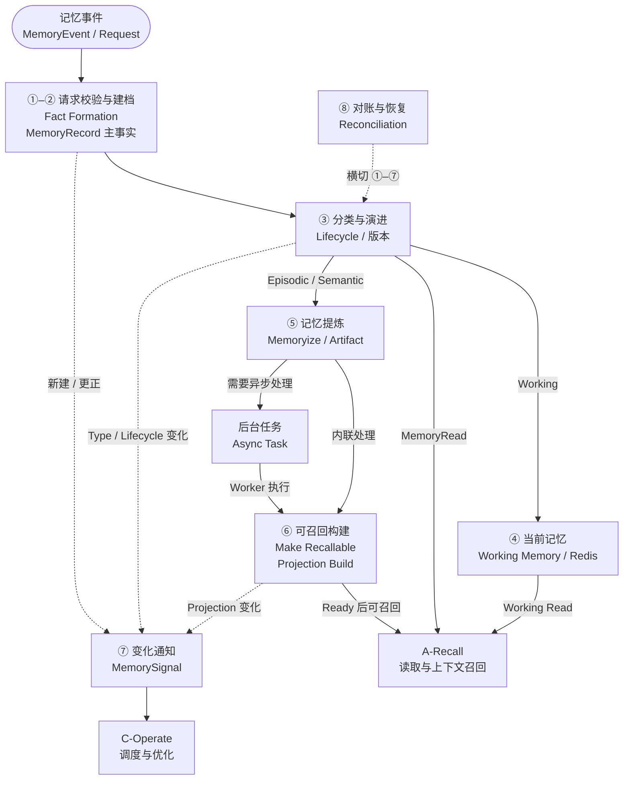

# AetherStore P3 Remember Overall Flow V2.0

> 文档定位：Remember / Memory Formation 总体业务与工程流程说明。  
> 负责范围：PROGRAM B / B-Remember — **Remember Runtime**（Memory Formation → Recall Ready）。  
> 生成时间：2026-09-03 20:16:08（Asia/Shanghai）。  
>
> 本文只讨论 Remember 流程及其必要上下游关系；不冻结字段级接口、错误码、部署实现或验收用例。未冻结项单列于问题清单。  
> 本文保留 V1.0 的一级章节框架与总体顺序；内部小章节按 Remember Runtime 口径重组。  
> 术语边界：**B-Remember 是 Remember Runtime 的业务闭环 Owner，不等同于 PRD 中历史工程模块名 `B2`。**本文只有在引用 PRD 的独立验收或旧模块表述时才使用 `B1/B2/B3`；它们不能直接推导当前 A/B/C 的 Runtime 归属。  
> 核心口径：**MemoryEvent 先形成 `Active` MemoryRecord 主事实，再由 B-Remember 判定当前 Memory Type；当前 Session/Task 中快速变化或无法可靠判定的内容按 Working 管理，已确认事件或长文本处理结果可形成 Episodic，Semantic 必须经过 Candidate 校验。Working 核心路径使用 Redis；长期记忆保留持久化文本内容，并以向量 Projection 支撑语义召回。**

---

## 0. 文档目的

本文从 Remember Runtime 的端到端 Outcome 出发，说明一次 `MemoryEvent` 如何形成可靠的 MemoryRecord、经过生命周期和语义处理，并达到可被 Recall Runtime 使用的 `Recall Ready`。

本文重点说明：

1. Remember 的业务入口和最终 Outcome；
2. 从主事实形成到 `Recall Ready` 的端到端主数据流；
3. Working / Episodic / Semantic 的分类、巩固和证据关系；
4. Working 的 Redis 当前读写，以及长期 Memory 的正文 + 向量 Projection；
5. Memory、Task、Projection、Signal 等对象的独立状态、检查点与恢复；
6. B-Remember 与 A-Recall、C-Operate、P2/Provider 的 Handoff；
7. 当前仍需在详细设计或 Acceptance Profile 中冻结的问题。

本文以 PRD 的产品语义和生命周期为优先依据，并采用《项目方向纠正会_三层模型版》的 Runtime 划分：B-Remember 的流程终点是 `Recall Ready`；`Query → Context Assembly` 属于 A-Recall。`AetherStore_P3_Recall_Overall_Flow_V1.0(1).md` 仅作为本文的组织、阶段、结果语义和 Handoff 写法参照，不迁移 Recall 的业务职责。

全文始终区分以下概念：

```text
Memory Type        = Working / Episodic / Semantic（业务语义）
Memory Status      = Active / Archived / Superseded / Expired / Deleted（生命周期）
ProjectionState    = 长期向量表示是否具备领域可召回资格
Physical Storage   = Redis / Durable Content / Vector Provider 等实现与位置
```

因此，Session/Task End 只触发巩固判定，不直接等于 `Active → Archived`；Working 可在 Redis 当前读取，不以 Projection Ready 为前提；Episodic/Semantic 必须保留可读取正文，不能只保留向量。关于“所有新事实均先为 Working”的项目覆盖规则，PRD 与既有口径仍存在待决差异，见第 7 章及问题清单。

---

## 1. Remember 的业务定位

### 1.1 业务入口

Remember 从 Agent、RAG、Workflow 或业务应用提交的 `MemoryEvent` 开始。Redis、Durable Store、Celery、Embedding 和 Vector Provider 是下游能力，不是业务入口。

一次有效输入至少包括：

```text
MemoryEvent
  ├─ content 或 content_uri
  ├─ source / source_event / occurred_at
  ├─ tenant / project / agent / session / task Scope
  ├─ caller identity / permission
  ├─ idempotency_key
  └─ RequestContext(request_id, trace_id, deadline)
```

所有合法的新输入都先形成统一主事实：

```text
memory_status = Active
memory_type   = 由 B-Remember 的规则/策略判定；uncertain 时按 Working 管理
```

| 入口 | B-Remember 的第一步 | 初始结果 | 后续方向 |
|---|---|---|---|
| 对话/交互事件 | 校验身份、Scope、来源和幂等 | 通常 Active + Working | 当前 Context；会话后巩固 |
| 工具调用结果 | 保留输入、输出、状态和证据 | 当前过程通常 Working；已确认历史结果可 Episodic | 任务结束后巩固/长期化 |
| 任务中间状态 | 写当前目标、约束和进度 | Active + Working | 保持、过期或巩固 |
| 用户长期偏好声明 | 先形成主事实 | 触发 Semantic Candidate，不直接成为 Semantic | 保留原始事件并校验证据 |
| 业务事件 | 先形成主事实 | 当前状态可 Working；已确认事件可 Episodic | 按事件/时间边界长期化 |
| 长文本/文档 | 校验大小和 content_uri | Active + Task；处理结果可形成 Episodic | 异步提纯、压缩、Projection |
| 更正/新证据 | 校验权限、版本和证据 | 新版本或派生记录 | 旧版 Superseded，相关 Projection 失效 |

若无法可靠确定 Memory Type，记录 `uncertain` 或等价属性，并按 Working 管理，不新增第四种 Memory Type。

### 1.2 最终 Outcome

Remember 的 Outcome 不是单一 `Success`，而是形成一组可查询、可恢复、可交接的事实：

```text
MemoryEvent
  → MemoryFact / MemoryRecord
  → Active + Type 判定
  → Working Redis 当前可用，或形成 Episodic 长期事实
  → Consolidation Evaluation
  → Episodic / Semantic
  → Durable Text / Compression Artifact
  → Embedding / Vector Projection
  → ProjectionState Ready
  → MemoryRead / CanonicalLoad → A-Recall
  → MemorySignal → C-Operate
```

一个满足 B-Remember / Remember Runtime 业务目标的 Memory 应具备：

- **Reliable**：当前 Working 主事实，或长期 Memory 的主事实与必要正文，达到可确认落点；
- **Traceable**：可追踪 `memory_id`、version、Scope、来源和证据；
- **Versioned**：更正、新证据和派生结果不覆盖旧版本；
- **Recoverable**：Task、Content、Projection、Signal 在失败和重启后可继续收敛；
- **Recall-safe**：Working 可即时读取；长期 Projection 通过 B-Remember Ready Guard 后才用于向量 Recall；
- **Independently degradable**：Artifact、Projection、Signal 或 Worker 失败不回滚主事实。

B-Remember 的核心工程目标是：

> 让每个合法 MemoryEvent 先形成唯一、可靠的 `Active` MemoryRecord；当前过程和不确定内容按 Working 管理，已确认事件形成 Episodic，稳定知识经 Candidate 校验形成 Semantic，并为长期 Memory 保留正文与可重建向量 Projection。

### 1.3 端到端责任

| B-Remember / Remember Runtime 负责 | B-Remember / Remember Runtime 不负责 |
|---|---|
| MemoryEvent 准入、Scope、权限和幂等 | A 的 Query Embedding、Vector Search、最终 Rank 和 Context Pack E2E |
| MemoryFact/MemoryRecord、稳定 ID、版本和 Provenance | Durable Store 中正文的物理字节 |
| Memory Type 判定、Working/Episodic 巩固与 Semantic Candidate 生命周期 | C 的 Hotness、PlacementPlan、TierAction 和调度决策 |
| Working Redis 读写语义、TTL 和当前 Scope | Redis 内核、复制、持久化机制实现 |
| Memory→content_ref 映射和正文业务确认 | P2/Object Store 的 WAL、分片、复制和恢复内核 |
| Task、Artifact、ProjectionState、MemorySignal | A/Vector Provider 的 ANN 和索引内部状态 |
| Ready Guard、版本失效与 Reconciliation | Celery/Broker/Worker 的内部队列实现 |
| MemoryReadCapability、CanonicalLoad mapping | A-owned Context Pack 最终状态 |

责任口诀：

```text
Memory 没形成、类型/版本/证据错误：B-Remember
Recall 最终结果错误：A-Recall E2E；若根因是 Memory Fact，再通过契约找 B-Remember
TierAction/Placement/调度错误：C
正文、向量、Redis 的物理执行事实：对应 Provider
```

---

## 2. Remember 主数据流

### 2.1 总体流程

Remember 不是只有“写入成功／失败”两个结果的线性 API 链路。它以 `MemoryRecord` 主事实为中心：①–⑥ 形成和演进 Memory，⑦ `MemorySignal` 与⑧ `Reconciliation` 横切全程。

```text
【阶段一：受理与主事实形成】
MemoryEvent / Request
  → Request Validation
  → Fact Formation
  → MemoryRecord

【阶段二：分类、生命周期与当前可用】
  → Classification / Lifecycle
  ├→ Working Memory（Redis）
  └→ Episodic / Candidate / Semantic

【阶段三：长期沉淀与可召回构建】
  → Memoryize / Artifact（按策略）
  → 内联处理 / Async Task
  → Make Recallable / Projection Build
  → Recall Ready

【全链路交接、观测与收敛】
  → Working Read / MemoryRead / Canonical Load → A-Recall
  → MemorySignal → C-Operate
  → Reconciliation（贯穿各阶段）
```

这条链路可归纳为三个主阶段：

```text
受理与主事实形成
  → 分类、生命周期与当前可用
  → 长期沉淀与可召回构建
```

`Working Memory` 服务当前会话／任务；`Async Task` 是长文本、压缩、背压、重建等工作的执行路线，不改变主事实。`MemorySignal` 与 `Reconciliation` 是横切闭环，不是长期 Projection 之后才发生的最后一步。具体状态枚举、Guard、失败出口和恢复动作在 2.2、2.3–2.10 中展开。



图中不展开 Working、Memory、Task、Projection 和 Signal 的具体状态枚举；其合法转换仍以第 2.2 节和各阶段表为准。

### 2.2 Remember 的跨对象状态机编排

Remember 本节采用**组合状态机**写法：每个阶段说明“当前对象组合 → 事件／Guard → 下一对象组合 → 后续处理”。

#### 2.2.1 状态维度与阶段检查点

| 状态对象／维度 | 在第 2 章承担的阶段含义 | 可作为何种检查点 | 不应被误当作 |
|---|---|---|---|
| `MemoryRecord` 的 Status + Type | 主事实是否仍有效，以及当前是 Working、Episodic 或 Semantic | `Active` 且正文／引用、Scope、version 可追溯，才完成 Fact Formation；Type 决定下一路径 | Task 已创建、Redis 有值或向量已写入的替代品 |
| Redis Working 表示 | 当前 Scope 下的快速临时可读性 | `Active + Working` 且 Redis 的 version / TTL / 内容已确认，才可 Working Read | 长期向量 Recall Ready |
| `Task` | 一个耗时派生动作的可恢复执行事实 | `Pending / Running / Retryable` 说明工作未完成；仅在目标对象经验证后才可 `Succeeded` | Broker 消息、Worker 取件或函数返回 |
| `Artifact` | Original / Canonical 的可追溯压缩或提纯表示 | source memory/version、checksum 和质量规则都通过，才可作为指定 Projection 输入 | 新的 Memory Type 或主事实 |
| `ProjectionState` | 指定 memory/version 的长期向量可用性 | `Ready` 需 Provider 结果、对象存在、版本、模型、Schema 与可查询性共同成立 | Provider `READY` 或 Task `Succeeded` 的同义词 |
| `MemorySignal` | 向 C 交接的事实变更和使用价值输入 | `Succeeded` 需匹配版本的消费确认；未 Ack 可保持未决而不回滚 Memory | C 的 Placement / TierAction 状态 |

#### 2.2.2 主链组合状态流转

| 当前组合状态 | 事件／Guard | 组合状态转换 | 阶段出口 |
|---|---|---|---|
| 无 MemoryRecord | Request 已通过校验，必要正文或 `content_ref` 可可靠关联 | `无记录 → MemoryRecord=Active`；随后执行分类 | 进入 2.4、2.5；派生对象尚非成功条件 |
| `Memory=Active`，Type 尚未稳定 | 当前 Session/Task 内容或 Type uncertain，分类选择 Working | `Active → Active + Working`；Redis 写入确认后才成为当前可读 | 进入 2.6 Working Read；不等待 Task/Projection |
| `Memory=Active + Working` | SessionEnd/TaskEnd 或长期价值 Guard 通过 | `Active + Working → Active + Episodic`，或创建关联 Episodic 版本 | 进入 2.7 Artifact 与 2.8 Projection Build |
| `Memory=Active`，明确事件／长文本结果满足事件性条件 | 分类 Guard 通过 | `Active → Active + Episodic` | 可直接进入长期 Recallability，不必先经过 Working |
| `Memory=Active + Episodic` | 聚合／提纯产生 Semantic Candidate | `Episodic 保持 → Candidate`；Candidate 不是 Semantic 主事实 | 等待证据／策略校验 |
| `Memory=Active + Episodic + Candidate` | 证据、Scope、时效与策略 Guard 通过 | `Candidate → Active + Semantic`；Episodic evidence 保留 | 按策略建立或重建 Projection |
| `Memory=Active + Episodic/Semantic`，Projection 缺失／Stale | projection_policy 要求该版本向量召回 | `Projection: 无／Stale → Pending → Processing/Building`；仅耗时路线同时 `Task: 无 → Pending` | 调用 Provider，等待真实结果 |
| `Projection=Processing/Building` | Provider 成功且 Ready Guard 通过 | `Projection → Ready`；关联 Task（如有）在目标证据成立后 `→ Succeeded` | 该 memory/version 成为长期向量候选／Recall Ready |
| Memory、Type、Status、Projection 或有效使用发生变化 | Signal 触发事实与版本完整 | `Signal: 无 → Pending → Submitted → Succeeded` | C-Operate 消费事实；不改变 Memory Type |

#### 2.2.3 失败、Unknown 与版本变化的组合状态流转

| 当前组合状态 | 事件／观察 | 状态转换或保持 | 恢复／异常出口 |
|---|---|---|---|
| 无 MemoryRecord | 输入非法、越权或关键内容无法验证 | 保持无 Memory；不得创建“半成功” Task／Projection | 返回稳定错误，由调用方修正后重新提交 |
| Fact Formation 前的正文／引用结果未知 | Content timeout／Unknown | 保持未确认主事实；不进入 `Memory=Active` | 用 `content_ref`、head/get/checksum 查询真实状态；确认后重试或失败 |
| `Memory=Active + Working`（或即将进入） | Redis 写入／读取未确认 | Memory 可保持 Active，但**不进入可读 Working** | 按契约失败或部分接受；Redis/Memory 对账后受控补写 |
| `Task=Pending/Running` | Broker 丢消息、Worker 崩溃、心跳超时 | `Task → Pending/Retryable`；目标 Projection／Artifact 不得误置成功 | Outbox／扫描重新投递；只在目标经验证后 `Task→Succeeded` |
| `Projection=Pending/Processing` | Provider Accepted/Pending/Unknown 或调用 timeout | Projection 保持非 Ready；Memory Active/Type 不回滚 | 查询 operation／对象；必要时 `Task→Retryable`，禁止盲目重写 |
| `Projection=Processing/Ready` | Provider 明确失败、对象缺失、模型／Schema／version 不匹配 | `Projection → Failed/Stale`；旧 Task 失权或取消 | 按当前有效版本与幂等键创建新 attempt 重建 |
| 当前 Memory 有新证据、更正、过期或删除 | 新版本或 Status 变化生效 | 旧 Memory `→ Superseded/Expired/Deleted`；旧 Projection `→ Stale/删除`；旧 Task `→ Cancelled` | 先从默认 Recall 排除，再异步删除／对账 |
| `Signal=Pending/Submitted` | C 未 Ack、Ack 版本不匹配或网络失败 | `Signal → Retryable`，或保持当前等待状态 | 使用相同 signal_id/version 补发；Memory 不回滚 |

因此，写入接口只报告“主事实是否可靠形成”以及各对象的当前状态和未决项；长文本等异步路线可按契约返回 `Accepted/Partial`，但 `ProjectionState=Ready`、`Task=Succeeded`、`Signal=Succeeded` 分别是不同对象的事实。它们没有一个可以替代另一个，也没有一个可以代表整条 Remember 主链的全局成功。

每次跨对象推进都要先持久化本阶段输出，再以对象当前 state、版本和乐观并发条件（例如 `state_version`）校验后更新；迟到回调、重复投递和旧版本结果只能被去重、审计或拒绝，不能回退已确认状态。

### 2.3 阶段一：Request Validation 与 Canonical Content

本阶段建立身份、Scope、时间、来源、内容和幂等基础。`RequestContext` 是控制封套，不是 Memory 内容；本阶段只决定“输入能否进入 Fact Formation”，**不**决定 Memory Type，也不应在主事实形成前把 Broker 消息或 Task 当作写入成功。

| 当前组合状态 | 事件或 Guard | 状态流转 | 后续处理 |
|---|---|---|---|
| 无 `MemoryRecord`、无 Task、无 Projection | 身份、Scope、权限、来源、内容和幂等均合法 | 保持无领域对象；形成规范化 `MemoryEvent`、固定 Scope 与 request/trace/idempotency 关联 | 生成／解析 memory_id、version，进入 Fact Formation |
| 无 `MemoryRecord`、无 Task、无 Projection | 未认证 | 保持无领域对象；返回 `Unauthorized` | 由上游完成认证后重新提交 |
| 无 `MemoryRecord`、无 Task、无 Projection | 已认证但无权限、跨 Scope 或 Scope 不完整 | 保持无领域对象；返回 `Forbidden` 或契约错误，不泄露资源存在性 | 拒绝，不触达 Memory、Content、Task |
| 无 `MemoryRecord`、无 Task、无 Projection | 内容为空、结构非法、大小／媒体类型不被当前策略支持 | 保持无领域对象；返回 `Invalid/Contract Error` | 上游修正后重提 |
| 已有相同幂等键对应的 memory/version | 请求与既有事实完全相同 | 所有既有对象状态保持；不产生新版本或新 Task | 返回既有 Memory、Task、Projection、Signal 的当前状态 |
| 已有相同幂等键对应的 memory/version | 内容、Scope 或请求语义冲突 | 所有既有对象状态保持；返回 `Conflict` | 由业务方更正或显式建立新版本，不覆盖既有事实 |
| 无 `MemoryRecord`，输入为长内容或 `content_uri` | 引用可访问，大小／checksum／来源约束可接受 | 保持无领域对象，进入 Fact Formation；尚未以“已入队”代替主事实 | 主事实可靠落点后，才可创建持久化 Task 并投递 |
| 无 `MemoryRecord`，Content 观察结果为 Unknown | 必要正文／引用的写入或验证超时 | `无记录 → 无记录`；不得进入 `Memory=Active`，也不得创建“半成功” Task／Projection | 用 `content_ref`、head/get/checksum 查询真实状态，再决定继续、失败或补偿 |

短期 Working 内容可以由 Redis 保存正文或引用；长内容通常由 Durable Store 保存 Original，而 MemoryRecord／当前运行上下文保存 `content_ref`。这只是正文表示与物理落点，不能据此推断 Memory Type：长文本处理结果可以直接形成 Episodic，Working 也可能只保存引用。

### 2.4 阶段二：Fact Formation

输入通过后，B-Remember 才创建 `Active` MemoryRecord 主事实，并保存或引用 Original、来源、证据、Scope、时间、version、Category Hint 与策略版本。这里落实 PRD 的 `Fact First`：先确认可追踪的主事实，再决定分类、压缩、Projection 与 Signal 的同步／异步路径。

Memory Status 在此进入 `Active`；Memory Type 是紧随其后的分类结果：当前／不确定内容按 Working 管理，已确认事件可直接为 Episodic，Semantic 只能在 Candidate 校验后形成。

| 当前组合状态 | 事件或 Guard | 状态流转 | 后续处理 |
|---|---|---|---|
| 无 `MemoryRecord`，必要正文或可验证引用、Scope、来源、version 已可靠落点 | 主事实可被重启后的 Runtime 重新读取与追踪 | `无记录 → MemoryStatus=Active`；Type 尚待 2.5 分类；Task／Projection 仍非成功条件 | 进入 2.5 判定 Type 与生命周期 |
| 无 `MemoryRecord`，Original／canonical 引用尚未确认 | 无法证明该 Memory 可追溯 | `无记录 → 无记录`；不确认 `Active`，不报告写入成功 | 回到 2.3 的 Content 对账，确认后重试 Fact Formation |
| `Memory=Active`，目标 Type 为 Working | 当前 Working 的 Redis 写入未确认 | `Memory=Active` 保持；Working 可读状态尚未形成 | 记录未就绪原因；由 2.6 补写／对账 Redis，按契约返回失败或部分接受 |
| 已存在相同 memory/version | 重复请求／重复投递，且 idempotency_key 一致 | Memory、Task、Projection 保持既有状态 | 返回既有主事实及对象状态，不重复创建长期工作 |
| 旧 `Memory=Active(version=n)` | 更正或新证据可形成可追溯的新版本 | `Active(n) → Superseded(n)`；创建 `Active(n+1)` 或关联派生 Memory | 对新版本重新分类；旧 Projection／Task 按版本失效 |
| `Memory=Active` 已确认 | 分类、压缩、Embedding、Projection 或 Signal 随后失败 | `Memory=Active` 保持；派生对象各自进入 `Pending / Retryable / Failed / Stale` | 由对应 Task／Reconciliation 收敛；主事实不回滚 |

进程内缓存、请求已发送、消息已入队、Task 已创建或向量已生成都不能代替主事实的可靠形成。

### 2.5 阶段三：Classification 与 Lifecycle

Classification 在 Active MemoryRecord 形成后判定当前 Memory Type，并在 Session/Task 阶段变化、新证据、内容更正、跨 Session 复用或策略升级时重新判定。Memory Type 与 Memory Status 正交：Type 表示当前业务角色，Status 表示主事实是否仍然有效。

| 当前组合状态 | 事件或 Guard | 状态流转 | 后续处理 |
|---|---|---|---|
| `Memory=Active`，Type 未定或待重判 | 当前 Session/Task 仍在推进，内容快速变化 | `Active → Active + Working` | 保留 Scope、version、TTL、当前目标／约束／中间状态，进入 2.6 Redis Working 路径 |
| `Memory=Active`，Type 未定或待重判 | Type 暂时无法可靠判定 | `Active → Active + Working(uncertain=true)`；不新设第四种 Type | 保存 uncertainty、classification_source、policy_version、判定时间；等待新证据再次分类 |
| `Memory=Active`，Type 未定或待重判 | 已确认事件、任务过程、交互结果或长文本处理结果具有时间边界 | `Active → Active + Episodic`，可为同一版本或带 lineage 的派生记录 | 保留 Original／正文、时间窗口、Session/Task、来源和 evidence；必要时进入 Artifact／Projection |
| `Memory=Active + Working` | SessionEnd／TaskEnd，且通过长期价值判断 | `Active + Working → Active + Episodic`，或形成关联 Episodic | 保存巩固原因、来源、旧／新版本关系；进入长期 Recallability；SessionEnd 本身不等于 Archived |
| `Memory=Active + Working` | 失去当前用途且无长期价值 | `Active + Working → Archived` 或 `Expired` | 保存 TTL／策略／判定证据；从默认 Recall 排除，按保留策略清理 |
| `Memory=Active + Episodic` | 满足稳定复用的候选条件 | `Active + Episodic → Active + Episodic + Candidate`；Candidate 不是第四种 Memory Type | 保存 Candidate 输入、独立证据、有效期、策略版本；进入证据／策略校验，不得直接标为 Semantic |
| `Memory=Active + Episodic + Candidate` | 证据、Scope、时效和策略 Guard 全部通过 | `Candidate → Active + Semantic`；Episodic evidence 仍保留 | 保存 derived_from/evidence、confidence、stability、Scope、valid_to；可按策略建立／重建 Projection |
| `Memory=Active + Episodic + Candidate` | 证据不足、来源不独立或时效不足 | `Candidate → 无 Candidate`，保持 `Active + Episodic` | 保存不通过原因和已有 evidence；后续新证据可再次触发 Candidate |
| `Memory=Active + Episodic` 或 Candidate | 多来源冲突且不能判定真值 | Memory Type／Status 保持；增加 Conflict 关系，不静默覆盖 | 保存双方来源、版本、冲突证据；Recall 仅能按 A 的规则显示 Conflict/Degraded |
| 当前有效 `Memory(version=n)` | 明确更正、新版本、过期或授权删除 | `Active(n) → Superseded / Expired / Deleted`；如有新事实则创建 `Active(n+1)` | 保存 lineage、原因、时间、审计；旧 Projection／Task／Signal 按版本失效、取消、清理或补发 |

分类／巩固结果必须记录 `classification_source`、`policy_version`、判定时间和不确定性。TTL、证据门槛、权重、Category 词表与阈值由版本化 Policy/Profile 冻结；实现不得把 Type 流转误解为 Redis、正文库或向量库之间的物理搬迁。

### 2.6 阶段四：Working 可用与 Async Task

这里有两条并行语义：Working 路径保证当前 Scope 的快速可用；Async Task 路径承载不能在当前 deadline 内可靠完成的派生工作。Async 不是 Projection 的前置条件，Working 也不等待长期处理。

**Working 当前可用：**

| 当前组合状态 | 事件或 Guard | 状态流转 | 后续处理 |
|---|---|---|---|
| `Memory=Active + Working`，Redis 表示尚未确认 | Redis 写入成功，且 Scope/version/TTL 与当前值一致 | `Working 未确认 → Working 当前可读`；Memory Status/Type 不变 | 当前 Session/Task 可通过受控 Working Read 使用；后续可触发巩固 |
| `Memory=Active + Working`，Redis 表示尚未确认或读取结果 Unknown | Redis 写入、读取或版本校验未确认 | `Memory=Active + Working` 保持，但 `Working 当前可读` 不成立 | 返回明确失败或部分可用语义；按 Redis/Memory 对账补写，不伪装为成功 |
| `Memory=Active + Working`，Redis 有旧／异常表示 | Scope、Permission、TTL 或 version 不匹配 | `Working 当前可读 → 当前读取候选排除`；Memory 主事实不因此回滚 | 不泄露跨 Scope 内容；等待新版本或重新写入 |
| `Memory=Active + Working` | SessionEnd／TaskEnd | 不直接改变 Memory Status；进入 `Working → Episodic / Archived / Expired` 的分类判定 | 回到 2.5；保持 Working、转 Episodic，或 Expired/Archived |

Working 不等待 Celery、Milvus、Embedding、压缩、Projection 或 C-Operate。指定 Working API 的合同目标为端到端 P99 `< 10 ms`；该指标不等同于完整 Context 的 P99。

**Async Task 派发与执行：**

当处理涉及长文本、提纯、压缩、批量、背压、重建、补发，或内联调用超出 deadline／Provider 返回 Accepted、Pending、Unknown 时，B-Remember 在主事实可靠形成后持久化 Task，再投递执行通道。短 Episodic/Semantic 若在 deadline 内完成 Projection 与 Ready Guard，可以不创建 Task。

| 当前组合状态 | 事件或 Guard | 状态流转 | 后续处理 |
|---|---|---|---|
| 主事实已确认，尚无 Task | 长文本、提纯、压缩、批量、背压、重建、补发，或内联超过 deadline／Provider 返回 Accepted/Pending/Unknown | `无 Task → Pending`，再写 Outbox；目标 Memory 保持既有状态 | 记录 target_id、target_version、operation、idempotency、trace、优先级和重试预算；可向调用方返回 task_id |
| `Task=Pending` | Worker 获得有效租约 | `Pending → Running` | 记录 attempt、步骤、心跳、租约和输入版本；执行目标操作，不以取件代替成功 |
| `Task=Running`，目标对象尚未被证实 | Artifact／Projection／Signal 已真实完成并校验 | `Running → Succeeded`，且目标对象已先到达其可证明状态 | 保存目标版本、checksum／Provider 证据／Ack；回写 Task 完成事实 |
| `Task=Running` | 瞬时错误、Worker 崩溃或依赖短暂不可用 | `Running → Retryable` | 保存最后检查点、错误分类、retry_after；有界退避后回到 `Pending/Running` |
| `Task=Running` 或 `Retryable` | 永久错误或预算耗尽 | `Running/Retryable → Failed` | 保留 Memory 主事实；告警、人工或后续新版本修复 |
| `Task=Pending/Running/Retryable` | 新版本、删除或人工取消 | `Pending/Running/Retryable → Cancelled` | 校验当前版本是否仍有效；旧 Task 不得覆盖新版本 |
| `Task=Pending/Retryable` | 超过有效窗口 | `Pending/Retryable → Expired` | 依据价值／有效期策略，不无条件追赶低价值历史工作 |

| 对象 | 作用 | 不可替代的边界 |
|---|---|---|
| Task | B-Remember 持久化的后台工作记录 | 是任务状态、目标版本、重试和恢复的业务事实 |
| Broker | 暂存／转发队列消息 | 不是 Task 的事实来源；即使采用 Redis，也须与 Working Memory 隔离 key/stream、TTL 和权限边界 |
| Worker | 监听队列并执行压缩、Embedding、Projection 等后台工作 | 取到消息或函数返回不等于 Task Succeeded |
| Celery | 组织投递、Broker 与 Worker 的框架 | 不拥有 B-Remember 的 Task/Projection 领域状态 |

Broker 消息丢失不能导致 Task 消失：B-Remember 通过 Task、Outbox 和 Reconciliation 重新投递或收敛；反过来，Task 存在也不等于 Worker 已完成执行。

### 2.7 阶段五：Memoryize 与 Compression Artifact

Memoryize 从当前有效的 Original／canonical Memory 生成可追踪的提纯或压缩 Artifact。Artifact 是派生表示，不改变 Memory Type，也不能替代主事实或来源证据；只有当前版本、可校验且质量合格的 Artifact，才可按策略作为 Projection 输入或长期读取回退。

Artifact 至少关联 source memory_id/version、task_id、policy_version、Original／compressed bytes、checksum、quality result 和 created_at。

Artifact 没有被冻结为独立的领域状态机；下表的“无／候选／可用／失效”只表达它能否作为当前 Projection 输入。正式可恢复的执行状态仍由 `Task` 承担。

| 当前组合状态 | 事件或 Guard | 状态流转 | 后续处理 |
|---|---|---|---|
| `Memory=Active + Episodic/Semantic`，无 Artifact | 当前策略不要求提纯／压缩 | `Artifact=无` 保持；Original／canonical 仍是当前有效输入 | 不创建 Artifact 不是失败；Projection 可按策略直接使用 Original |
| `Memory=Active + Episodic/Semantic`，无 Artifact | 当前有效 Original 可读取，内联或 Task 处理开始 | `Artifact: 无 → 候选（未验证）`；若走后台路线同时 `Task: 无 → Pending` | Artifact 与 source memory/version、policy 绑定，不得脱离来源单独使用 |
| Artifact 候选，source memory/version 仍有效 | 压缩结果已持久化，checksum 与质量规则通过 | `Artifact: 候选 → 当前可用`；Memory Type/Status 保持 | Artifact 可作为指定 Projection 输入或可读表示；进入 2.8 或按 Policy 保留 |
| Artifact 候选 | 质量不足、checksum 不一致或引用错误 | `Artifact: 候选 → 拒绝／隔离`；不得成为 Projection 输入 | 保留 Original，记录质量原因，允许重新生成 |
| Artifact 候选，关联 `Task=Running` | Worker／Provider 瞬时失败 | `Task: Running → Retryable`；Artifact 保持未验证，不可使用 | 有界重试或后续 Reconciliation |
| 当前可用或候选 Artifact | 永久失败、source/version 变化或删除 | `Artifact: 当前可用／候选 → 失效或待清理`；关联 Task 进入 `Failed/Cancelled`（如有） | 不影响 Active 主事实；只为当前有效版本重建，或按保留策略清理旧 Artifact |

合同指标为 `Compression Ratio = Original Persisted Bytes / Compressed Persisted Bytes >= 5x`。Metadata、Vector 和索引开销是否进入分子／分母，必须在 Acceptance Profile 中书面冻结。

### 2.8 阶段六：Make Recallable 与 Projection Build

长期 Projection 是当前有效 Episodic / Semantic 进入向量召回的写路径；它不只服务长文本异步处理。已确认的普通事件直接形成 Episodic、Working 巩固为 Episodic、长文本处理结果及 Semantic 都使用同一套 `ProjectionState + Ready Guard`。它不是 Working 当前读取路径，也不是 A-Recall 的在线 Query／Context Assembly。

构建时，B-Remember 选择当前有效 Memory/version 与合法输入（Original 或指定质量合格的 Artifact），以 Passage Usage 调用 A 的 Embedding／VectorProjection 能力，再依据 ProviderResult 与 Ready Guard 维护领域 ProjectionState。

| 当前组合状态 | 事件或 Guard | 状态流转 | 后续处理 |
|---|---|---|---|
| 当前有效 `Memory=Active + Episodic/Semantic`，Projection 不存在或为 Stale | `projection_policy` 要求向量召回 | `无 Projection / Stale → Pending`；选择内联或 Task 路线 | 记录 memory_id、chunk_id、memory_version、model_version、projection_schema_version 的幂等关联 |
| `Projection=Pending` | 开始 Embedding／向量写入 | `Pending → Processing`（工程冻结名：`Building`） | 验证输入正文／Artifact 来源、目标模型、Schema、维度、operation/attempt；等待 ProviderResult |
| `Projection=Processing/Building` | 内联 Provider 成功且 Ready Guard 通过 | `Processing/Building → Ready`；没有 Task 也合法 | 验证当前 memory/version、checksum、metadata、对象存在与可查询性；当前版本成为长期向量候选 |
| `Projection=Pending/Processing` | Provider 返回 Accepted/Pending，或内联超过 deadline／背压 | `Pending/Processing` 保持非 Ready；若需后台继续，则 `Task: 无/Retryable → Pending` | 保存 task_id、operation、最后观测状态与重试预算；前台结束，Worker／对账继续 |
| `Projection=Pending/Processing`，Provider 观察结果为 Unknown | Provider timeout、断连或回调缺失 | Projection 保持 `Pending/Processing` 且非 Ready；不得以 Unknown 推进 Ready | 保存 last_confirmed_state、operation/object 查询证据；先查询真实 Provider 状态，禁止盲目重复 upsert |
| `Projection=Processing/Building` | Provider 明确失败 | `Processing/Building → Failed`；关联 `Task: Running → Retryable`（若可恢复） | 保存稳定失败原因、版本与影响范围；主事实保留，新 attempt 可从 `Pending/Building` 重建 |
| `Projection=Pending/Processing/Ready` | Memory、Artifact、模型或 Schema 产生新版本，或 Ready 对象缺失 | `Pending/Processing/Ready → Stale`；旧 `Task → Cancelled` 或失去写回权 | 保存当前版本、旧／新幂等键和删除／失效原因；只为当前有效版本重建 |

只有 B-Remember 可以把 `ProjectionState` 置为 `Ready`。A／Provider 的 `ProviderResult=READY` 只是机制层成功证据；同一个 ProjectionState 状态机同时覆盖内联与异步路线，二者的差别只在执行与恢复方式。

### 2.9 阶段七：MemorySignal

B-Remember 向 C-Operate 发送描述 Memory 事实与使用价值变化的 `MemorySignal`。新建、Type／Status 变化、内容更正、Projection 状态变化与可证明的有效使用都可以触发 Signal；实际热度、PlacementPlan 与 TierAction 仍由 C-Operate 决定。

Signal 至少携带 memory_id/version、Type、importance、lifecycle、Scope 摘要、最近有效访问、唤醒频次、Context 使用、signal_id/version 和 trace。AccessTrace 是访问事实，不等同于 Signal；B-Remember 只能在有证据时把它作为 Signal 或衰减输入，不能伪造访问。

| 当前组合状态 | 事件或 Guard | 状态流转 | 后续处理 |
|---|---|---|---|
| 无当前 Signal；触发的 Memory／Projection 事实、版本和 Scope 完整 | 新建、Type／Status/版本/Projection 变化或可证明的有效使用 | `无 Signal → Pending`，并写入 Outbox | 固定 signal_id/version、event 类型和来源 version；等待发送 |
| `Signal=Pending` | 已发送或 C 已受理 | `Pending → Submitted` | 保存投递时间、幂等键、最后观测状态；不等于已消费，等待 Ack |
| `Signal=Submitted` | C 确认消费了匹配版本 | `Submitted → Succeeded` | 保存 acknowledgment、consumer、消费版本与时间；Signal 闭环完成 |
| `Signal=Submitted` | Ack 迟到、版本不匹配或重复 | `Submitted` 保持；旧 Ack 不得覆盖当前 Signal | 校验 signal_id/version 与消费证据；去重、审计，必要时继续等待当前版本 Ack |
| `Signal=Pending/Submitted` | C 或网络暂时不可用 | `Pending/Submitted → Retryable` | 保存失败分类、retry budget、下一次尝试；同一 signal_id/version 幂等补发 |
| `Signal=Retryable` | 通道恢复且预算允许 | `Retryable → Pending/Submitted` | 以同一 signal_id/version 恢复投递或查询已受理状态，不创建重复 Signal |
| `Signal=Pending/Retryable` | 永久错误或预算耗尽 | `Pending/Retryable → Failed` | 保存错误与影响范围；告警／人工处理，不回滚 Memory 或 Projection |

B-Remember 不决定 Promote、Demote、Prefetch、Pin 或 Keep/No-op；C-Operate 的物理 Tier 变化也不改变 Working/Episodic/Semantic。

### 2.10 阶段八：Reconciliation、AccessTrace 与再次收敛

Reconciliation 由 Content／Provider Unknown、timeout、版本不一致、Ready 但对象缺失、Task/Artifact 不一致、Signal 未确认、重启、删除清理和长期 Pending 触发。它在所有阶段横切执行：先读取 B-Remember 当前权威主事实，再查询 Redis、Content、Vector、Worker 或 C 的真实状态，比较 ID、version、checksum、model、schema、状态与有效期，然后选择补偿并再次验证。

| 当前组合状态 | 事件或观察 | 状态流转／补偿 | 收敛要求 |
|---|---|---|---|
| Content 观察结果为 `Unknown`，Memory 尚未确认或已引用该内容 | `content_ref`、head/get、checksum、Memory 当前 version | `Unknown → durable confirmed / absent`；确认后补登记，未形成 Active 时才可继续 Fact Formation；不存在则重写或标记失败 | 不把 timeout 当成功，也不把未知当永久失败 |
| `Projection=Pending/Processing`，ProviderResult 为 `Unknown` 或回调缺失 | operation、对象、model/schema、最后确认状态 | `Projection` 只能恢复为可证实的 `Pending/Processing/Ready/Failed`，或保持对账；Unknown 不得直接变 Ready | 未确认前 Projection 不得 Ready，禁止盲目重复 upsert |
| `Projection=Ready`，但后端向量对象缺失／不匹配 | 当前 Projection 幂等键、对象 metadata、可查询性 | `Ready → Stale`，再重建／补登记／人工处理 | A 只可使用版本匹配的 Ready Projection |
| `Task=Succeeded/Running/Retryable` 与 Artifact／Projection／Signal 实际结果不一致 | Task target/version、Worker 心跳、目标对象真实状态 | `Task=Succeeded →` 仅在目标证据存在时保持；否则改为 `Retryable/Failed/Cancelled`；目标 Projection 可进入 `Failed/Stale` | Task=Succeeded 必须有目标对象证据 |
| `Task=Pending/Running/Retryable`，Worker 重启、租约丢失或长期 Pending | Task 状态、attempt、心跳、Outbox、当前版本 | `Running → Retryable` 或 `Pending → Pending` 后重新投递；仅一个 Retry Owner 可接管 | 不能重复并发执行同一有效幂等操作 |
| 当前有效 `Memory(version=n)`，出现新证据、更正、模型／策略升级 | 当前 Memory version、lineage、Policy、模型/Schema | `Active(n) → Superseded(n)`（若新版本生效）；旧 `Artifact/Projection → Stale`，旧 `Task → Cancelled/失权` | 新版本重新分类；迟到结果不得覆盖新版本 |
| `Memory=Expired/Deleted`，但 Redis、正文、Artifact 或 Projection 仍有残留 | Memory Status、tombstone、各表示的删除结果 | 逻辑 Recall 排除保持；相关 `Projection → Stale/删除待完成`，Working 表示失效，物理清理异步推进 | 清理失败可重试／告警，保留审计证据 |
| `Signal=Pending/Submitted/Retryable` 长期未 Ack | signal_id/version、Outbox、C 的消费证据 | `Pending/Submitted/Retryable → Pending/Submitted`（同 ID/version 补发），或在预算耗尽后 `→ Failed` | Memory 不回滚，Signal 结果可解释 |
| 有可信 Recall／Context 实际使用 | 可信 AccessTrace、Scope、memory/version | 更新允许的衰减／价值输入；如触发交接，则 `Signal: 无 → Pending` | B 不改写 A 的 Context Pack 结果或 C 的调度决策 |

统一原则：先读真实状态，再补偿；同一调用边只有一个 Retry Owner；迟到结果不得覆盖新版本；Unknown 不等于 Failed，不盲目重复副作用操作。无法自动收敛时保留可解释未决状态、告警与人工入口，而不是伪造成功。

---

## 3. Remember 关键 Domain Object 与 State

第 2 章回答“在 Fact Formation、Lifecycle、Working、Memoryize、Projection、Signal 与 Reconciliation 的每一个阶段，哪些对象从什么状态共同推进到什么状态”。本章只回答“每个对象到底有哪些状态、谁拥有它、哪些边合法”：它是第 2 章状态流转的定义表和实现约束，不再重复叙述一条业务主链。

Remember 的状态不是一个全局枚举：`MemoryRecord` 的 Status 与 Type 正交，`Task`、`ProjectionState` 和 `MemorySignal` 也各自独立。一个 `Memory=Active + Episodic` 可以同时有 `Task=Retryable`、`Projection=Pending`、`Signal=Submitted`；这表示主事实已经可靠形成，但派生工作或交接仍待收敛，而不是“整个 Remember 成功”或“整个 Remember 失败”。

| Domain Object / State | 在 Remember 中的作用 | 形成方式 | 事实归属 |
|---|---|---|---|
| MemoryRecord | 当前版本、Scope、来源、证据、Type、Category、Status 主事实 | B-Remember Fact Formation/Lifecycle | B-Remember |
| Memory Type | Working/Episodic/Semantic 认知角色 | 主事实形成后分类；uncertain 按 Working；Semantic 需 Candidate 校验 | B-Remember |
| Async Task | 巩固、长文本、压缩、异步 Projection、Signal、恢复的执行事实 | B-Remember 创建，Worker 回写 | B-Remember |
| ProjectionState | 长期向量表示是否具备 Recall 资格 | B-Remember 根据 ProviderResult 和 Ready Guard 维护 | B-Remember |
| MemorySignal | 向 C-Operate 输出 Memory 变化和价值信号 | B-Remember 由状态/使用事件形成 | B-Remember |
| Memory→content_ref | Memory/version 到正式正文的映射 | B-Remember 登记 | B-Remember；Payload 物理事实属 Provider |
| Compression Artifact | Original 的提纯/压缩派生物 | Memoryize Task | B-Remember 维护关系，Provider 存字节 |
| ProviderResult | 向量机制执行结果 | A/Vector Provider | A/Provider |
| RecallAvailability | 单条 Memory 的 Recall 可用派生视图 | 由 Memory/Content/Projection 计算 | B-Remember 提供事实，A-Recall 形成 E2E 结果 |
| Reconciliation | 观察、比较、补偿和验证过程 | B-Remember 恢复编排 | B-Remember；外部状态属各 Provider |

### 3.1 MemoryRecord 状态机

#### 3.1.1 对象定义与控制边界

MemoryRecord 是 B-Remember 的业务主事实。Memory Type 和 Memory Status 是两个独立维度：

```text
Type   = Working / Episodic / Semantic
Status = Active / Archived / Superseded / Expired / Deleted
```

| 控制问题 | 设计答案 |
|---|---|
| Owner | B-Remember / Remember Runtime |
| 初始状态 | MemoryRecord 初始为 Active；当前/临时/uncertain 内容为 Working，已确认事件可判为 Episodic |
| 谁能改 | B-Remember Fact/Lifecycle/Correction/Delete 流程 |
| 什么触发 | 新事件、SessionEnd/TaskEnd、TTL、巩固、更正、删除、策略变化 |
| 失败后去哪 | 主事实未落点则不建 Active；派生失败不改已确认 Memory |
| 重启后恢复 | 从持久化 Memory/version、Redis 和 content_ref 读取 |
| 终态 | Deleted 为逻辑终态；Superseded/Expired 可按保留策略清理 |

#### 3.1.2 完整状态

| 状态 | 含义 | 默认 Recall 行为 |
|---|---|---|
| Active | 当前有效主事实 | 按 Type/Scope/version/Projection 参与 |
| Archived | 保留但退出常规前台使用 | 默认排除或低优先 |
| Superseded | 已被新版本替代 | 默认排除，保留证据 |
| Expired | TTL/valid_to 到期 | 默认排除，等待清理 |
| Deleted | 授权逻辑删除 | 排除并触发级联清理 |

Type 流转为：

```text
当前/临时/uncertain → Working
已确认事件/长文本结果 → Episodic
Working 经巩固 → Episodic
Episodic → Semantic Candidate → Semantic
```

#### 3.1.3 合法状态转换

| 当前状态 | 事件/Guard | 下一状态 | 派生处理 |
|---|---|---|---|
| 无记录 | 合法事件且主事实/必要正文可靠 | Active + 当前 Type | Working 走 Redis；Episodic 进入长期化 |
| Active + Working | Session/Task 继续 | Active + Working | 刷新/保持 TTL |
| Active + Working | 无长期价值且失去当前用途 | Expired/Archived | 退出默认 Recall，异步清理 |
| Active + Working | 有事件/过程/时间边界 | Active + Episodic 或派生 Episodic | 持久化正文、建立证据关系 |
| Active + Episodic | Candidate 校验通过 | Active + Semantic 或派生 Semantic | 保留 Episodic evidence |
| Active | 明确更正/新版本生效 | 旧版 Superseded | 旧 Projection Stale，新版重建 |
| Active/Archived | valid_to 到期 | Expired | 默认 Recall 排除 |
| 非 Deleted | 授权删除 | Deleted | 级联失效、清理、审计 |

SessionEnd 不是 Memory Status 转换的直接等号，它先触发巩固判定。

### 3.2 Async Task 状态机

#### 3.2.1 对象定义与控制边界

Task 用于巩固、长文本、Memoryize、Compression、Embedding、Projection、Signal 补发和 Reconciliation 等**异步/耗时**操作；Projection 是否需要 Task 取决于执行路线，短内容内联构建成功时不以创建 Task 为前提。

| 控制问题 | 设计答案 |
|---|---|
| Owner | B-Remember 持久化 Task 事实；Worker 执行并回写 |
| 谁能改 | B-Remember Task Runtime 与受控 Worker 回调 |
| 什么触发 | 长文本/压缩、批量或背压、内联超时/Accepted/Pending、重建、补发、恢复、人工操作 |
| 成功证明 | 目标 Artifact/Projection/Signal 的真实结果通过校验 |
| 失败后去哪 | 可恢复→Retryable；永久→Failed；版本变化→Cancelled |
| 重启后恢复 | Durable Task/Outbox/检查点，幂等重放 |
| 终态 | Succeeded/Failed/Cancelled/Expired |

Celery/Broker/Worker 是执行通道，不是 Task 状态的唯一事实源。

#### 3.2.2 完整状态与合法转换

| 当前状态 | 事件/Guard | 下一状态 | 规则 |
|---|---|---|---|
| 无 Task | 主事实形成且需要后台工作 | Pending | 保存 target/version/idempotency/trace |
| Pending | Worker 获得租约 | Running | attempt 增加，记录心跳 |
| Running | 目标结果真实完成并校验 | Succeeded | 不以消息消费代替成功 |
| Running | 瞬时错误/Worker 崩溃 | Retryable | 有界退避+jitter |
| Retryable | 预算内且版本仍有效 | Pending/Running | 同一调用边一个 Retry Owner |
| Running/Retryable | 永久错误/预算耗尽 | Failed | 保留错误和主事实 |
| Pending/Running/Retryable | 新版本/删除/人工取消 | Cancelled | 旧 Task 不覆盖新版本 |
| Pending/Retryable | 超过有效窗口 | Expired | 不无条件追赶低价值历史任务 |

系统级 `Waiting` 映射为 Pending，`Failed-Retryable` 映射为 Retryable，`Failed-Permanent` 映射为 Failed。

### 3.3 ProjectionState 状态机

#### 3.3.1 对象定义与控制边界

ProjectionState 表示长期检索 Projection 的领域可用性，不等于 ProviderResult。

| 控制问题 | 设计答案 |
|---|---|
| Owner | B-Remember；只有 B-Remember 能置 Ready |
| 谁能改 | B-Remember Projection Build/Recovery；A/Provider 只返回机制结果 |
| 什么触发 | Episodic/Semantic、Artifact、模型/Schema变化、对象缺失；执行路线可为内联或 Async Task |
| Ready Guard | 当前 Memory/version、正文、模型、维度、Schema、metadata、对象和可查询性均通过 |
| 失败后去哪 | Pending/Failed/Stale |
| 重启后恢复 | 读取 ProjectionState/幂等键及可选 Task，查询 provider operation/object |
| 终态 | Ready 为当前版本可用状态；Failed/Stale 可重建 |

#### 3.3.2 完整状态与合法转换

| 当前状态 | 事件/Guard | 下一状态 | 处理 |
|---|---|---|---|
| 无 Projection | 当前有效长期 Memory 触发 Projection 请求（内联或 Task） | Pending | 关联幂等五元组 |
| Pending | B-Remember 开始构建 | Processing（工程冻结名：Building） | 保存目标版本/模型/Schema |
| Processing（Building） | Provider READY 且 Ready Guard 通过 | Ready | 可用于长期向量 Recall |
| Processing（Building） | 等待依赖/Provider PENDING | Pending/Processing（Building） | 查询真实 operation |
| Processing（Building） | 明确失败 | Failed | 主事实保留；可恢复时由关联 Task 标为 Retryable，再以新 attempt 重建 |
| Ready/Processing（Building） | Memory/模型/Schema变化或对象缺失 | Stale | 当前版本重建 |
| Failed/Stale | 重试策略允许且版本有效 | Pending/Processing（Building） | 创建或恢复关联 Task，以新 attempt 重建，不覆盖新版本 |

PRD 使用 `Processing`，工程冻结 Work Map 使用 `Building`。本文件并列标注二者；API 层必须冻结一个正式枚举或提供双向映射。

### 3.4 MemorySignal 状态机

#### 3.4.1 对象定义与控制边界

MemorySignal 是 B-Remember 向 C-Operate 输出的结构化事实变化/价值信号。

| 控制问题 | 设计答案 |
|---|---|
| Owner | B-Remember 产生并维护 Signal；C-Operate 消费和确认 |
| 谁能改 | B-Remember Outbox/发送/补发；C-Operate 提供 acknowledgment |
| 触发 | Memory 新建、Type/Status/Category变化、版本、更正、Projection、有效使用 |
| 失败后去哪 | 可恢复→Retryable；永久→Failed |
| 重启后恢复 | 同一 signal_id+signal_version 幂等补发 |
| 终态 | C 确认消费→Succeeded；永久失败→Failed |

#### 3.4.2 完整状态与合法转换

| 当前状态 | 事件/Guard | 下一状态 | 处理 |
|---|---|---|---|
| 无 Signal | 触发事实、版本和 Scope 完整 | Pending | 固定 ID/version |
| Pending | 已发送或 C 已受理 | Submitted | 不等于已消费 |
| Submitted | C 确认匹配版本消费 | Succeeded | 保存确认事实 |
| Pending/Submitted | C/网络暂时不可用 | Retryable | 同 ID/version 补发 |
| Retryable | 恢复且预算允许 | Pending/Submitted | 幂等继续 |
| Pending/Retryable | 永久错误/预算耗尽 | Failed | 不回滚 Memory |

### 3.5 支持对象与边界说明

| 对象 | 需要保留的事实 | 结果处理 | Owner/消费者 |
|---|---|---|---|
| Memory Type | Working/Episodic/Semantic、来源、策略、不确定性 | 新建后按规则分类；当前/临时/uncertain 为 Working，已确认事件可为 Episodic | B-Remember |
| Category | Preference/Fact/Task/Tool Result 等 | 可多值，不决定 Type/Status | B-Remember |
| Memory→content_ref | Mapping、version、checksum | durable/not_found/partial/unknown | B-Remember 映射；Provider 存正文；A-Recall 消费 |
| Compression Artifact | source/version/task/policy/bytes/checksum/quality | 失败保 Original | B-Remember 维护关系；Provider 存字节 |
| ProviderResult | operation、状态、版本、完成证据 | ACCEPTED/PENDING/READY/FAILED/UNKNOWN | A/Provider；B-Remember 消费 |
| RecallAvailability | Working Redis、正文、Projection、Scope、版本 | ready/partial/unavailable 派生视图 | B-Remember 提供事实；A-Recall 判 E2E |
| Reconciliation | 发现、观察、决策、动作、验证 | 未收敛继续扫描或人工 | B-Remember；外部 Owner 提供观察 |

关键区别：

- Working 可用不等于 Projection Ready；
- ProviderResult READY 不等于 B-Remember ProjectionState Ready；
- Memory Active 不等于全部派生完成；
- Semantic Candidate 不等于 Semantic；
- Submitted Signal 不等于 C 已消费；
- C 的物理 Placement 不等于 Memory Type。

---

## 4. Remember 的事实所有权

为保留 V1.0 主章节架构，本章小标题沿用“B”字样；其含义一律是 **B-Remember / Remember Runtime**，不是 PRD 历史工程模块 `B2`。

### 4.1 B 自己拥有的事实

- MemoryRecord 的稳定 ID、版本、Scope、来源、Evidence 和业务状态；
- MemoryRecord 先形成 Active 主事实，随后判定 Type；uncertain 按 Working 管理；
- Working / Episodic / Semantic 的分类、巩固和证据关系；
- Memory Type、Category、classification_source、policy_version 和 uncertainty；
- confidence、stability、validity、decay inputs 和冲突关系；
- 更正、新版本、Superseded 和 derived_from/evidence；
- `Memory → content_ref` 的逻辑映射；
- Async Task 的 ID、目标版本、状态、retry、恢复和结果；
- Compression Artifact 与 Memory/Task 的关系和质量语义；
- ProjectionState，尤其是 Ready 的最终领域判定；
- MemorySignal 的事实、版本、发送状态和补发；
- Remember 范围内的 Reconciliation 结论和恢复证据。

### 4.2 B 消费但不拥有的事实

| 外部事实 | 来源 | B-Remember 如何使用 | B-Remember 不得做什么 |
|---|---|---|---|
| 身份/Permission/Scope | Gateway/Auth/Shared Runtime | 准入和隔离 | 不绕过授权 |
| Passage Embedding | A | Projection 输入 | 不实现/伪造向量 |
| ProviderResult | A/Vector Provider | 驱动 ProjectionState | 不把 READY 直接当领域 Ready |
| 正文物理状态 | Durable Store/P2 E2 | durable/head/checksum/delete | 不声称拥有物理字节 |
| 向量物理状态 | P2 E1/Milvus | 对象、版本、维度、Schema、可查询性 | 不修改 Provider 内部索引 |
| Redis 物理状态 | Redis/Infra | Working 读写、TTL、健康 | 不实现 Redis 内核 |
| Worker 执行观察 | Celery/Broker/Worker | 回写 Task 步骤/心跳 | 不把队列消息当成功 |
| C-Operate 消费确认 | C-Operate | 收敛 Signal | 不替 C-Operate 决策调度 |
| Trace Schema/Store | Runtime Foundation | 关联 B-Remember 事件 | 不独自定义跨模块 SoT |

### 4.3 B 明确不拥有的内容

- A-Recall 的 Query Embedding、Vector Search、Candidate Retrieval、最终 Rank 和 Context Pack；
- Durable Store 中 Canonical Payload 的物理字节；
- A/Vector Provider 的 ANN、索引、分片和向量机制状态；
- C-Operate 的 hotness、RepresentationPlacementPlan、TierAction 和调度决策；
- P2 的 WAL、复制、Fencing、物理迁移和存储内核；
- Redis 的内核、HA、复制与物理持久化机制；
- Celery/Broker/Worker 的内部队列事实。

---

## 5. Remember 与其他负责人的 Handoff

Remember 通过稳定 Capability 与 Port 交接事实，不通过共享数据库或模糊“共同负责”交接责任：

- **Internal Capability**：P3 内部 B-Remember、A-Recall、C-Operate 之间的业务能力边界；
- **Port**：P3 对 Redis、正文、向量与异步执行 Provider 的机制调用边界。

这里的 `Remember（B）`、`Recall（A）`、`Operate（C）` 分别指 B-Remember / Remember Runtime、A-Recall / Recall Runtime、C-Operate / Operate Runtime。Remember Runtime 在 `Recall Ready` 交接，A-Recall 从 `Query` 开始并对 `Context Assembly` 结果负责。

### 5.1 Remember（B）→ Recall（A）：Memory 事实与正式内容

```text
Working：
B-Remember Active+Working / Redis
  → 受 Scope、version、TTL 约束的 Working Read
  → A-Recall 当前 Context

长期：
B-Remember Memory/version/ProjectionState
  → A-Recall Vector Candidate
  → B-Remember MemoryRead 校验
  → CanonicalLoad mapping
  → Durable Text
  → A-Recall Rank / Context Pack
```

| 能力 | Provider/Owner | Consumer | 内容 |
|---|---|---|---|
| MemoryReadCapability | B-Remember | A-Recall | 当前版本、Type、Status、Scope、Evidence、Conflict、质量/衰减属性 |
| CanonicalLoadCapability(mapping) | B-Remember | A-Recall | memory/version→content_ref、checksum 和加载结果语义 |
| Redis Working Read | B-Remember | A-Recall / Context Runtime | 当前 Active Working，不要求 Projection |
| Context Pack | A-Recall | Agent | A-Recall 对 E2E 完整/降级/失败负责 |

说明：按当前三层模型，应将这段能力映射为 **A-Recall / Recall Runtime 的 `Query → Context Assembly` 闭环**，不能把它解释为 B-Remember 的 Runtime Owner。B-Remember 只提供可验证的 Memory 事实、Working 读取、正文映射和 `Recall Ready`；旧模块到 Runtime 的完整映射仍列入问题清单冻结。

Projection 未 Ready、正文无法验证或 MemoryRead 故障时，A 记录候选级过滤/降级原因；依赖故障不能被推导为正常空结果。

Working Read 只在当前 Session/Task 与授权 Scope 的契约内提供当前状态，不把任意 Redis 条目当作全局向量候选，也不绕过 A-Recall 的请求校验和 Context Pack 责任。

### 5.2 A 共享能力 → Remember（B）：Make Recallable 写路径

```text
B-Remember 选择 Memory/version/Artifact
  → ProjectionState=Pending/Building
  → 选择内联构建或 Async Task
  → A SemanticEmbeddingCapability
  → Passage Vector
  → A VectorProjectionPort
  → P2 Vector Provider
  → ProviderResult
  → B-Remember Ready Guard
  → ProjectionState=Ready/Pending/Failed/Stale
```

| 能力/对象 | Provider/Owner | Consumer | 边界 |
|---|---|---|---|
| SemanticEmbeddingCapability | A | B-Remember | 返回合法 passage vector/model/version/dimension |
| Projection Build 编排 | B-Remember | B-Remember | 选择 Memory/version、内联/Task 执行路线和恢复 |
| VectorProjectionPort | A | B-Remember | upsert/delete/query status，返回 ProviderResult |
| ProviderResult | A/Provider | B-Remember | 机制结果，不等于 ProjectionState |
| ProjectionState | B-Remember | A-Recall | 当前长期表示的领域可用性 |

### 5.3 Remember（B）→ Operate（C）：MemorySignal

```text
Memory / Type / Status / Projection / Usage 变化
  → B-Remember MemorySignal
  → C-Operate Consume/Ack
  → Hotness / PlacementPlan / TierAction
```

| 对象/能力 | 责任方 |
|---|---|
| Signal 事实、版本和发送状态 | B-Remember |
| Signal 消费、去重和 acknowledgment | C-Operate |
| Hotness、PlacementPlan、TierAction | C-Operate |
| 物理 Tier/执行状态 | P2/Executor |

B-Remember 不决定冷热动作；C-Operate 改变 Representation 的物理位置不改变 Working/Episodic/Semantic。

### 5.4 Remember（B）↔ P2：Content、Projection 与执行通道

| P2/Provider 能力 | B-Remember 需要的业务事实 |
|---|---|
| Durable Content | durable、存在性、可读性、checksum、version、delete result |
| Vector Provider | ACCEPTED/PENDING/READY/FAILED/UNKNOWN、对象、版本、维度、Schema、可查询性 |
| Redis Working | confirmed read/write、Scope、TTL、容量和健康 |
| Task 通道 | task_id 关联、投递幂等、租约、心跳和结果回写 |

P2/Provider 可自行决定 WAL、复制、分片、ANN、索引和迁移实现，但“请求已发出”不能替代 P3 所需的业务确认。

### 5.5 三方 Handoff 总结

```text
Remember 写路径：
B-Remember Active+Working
  → Redis
  → 已确认事件直接形成或巩固为 Episodic/Semantic
  → Durable Text
  → Projection Build（内联或 Async Task）
  → A Passage Embedding/VectorProjectionPort
  → ProviderResult
  → B-Remember ProjectionState

Recall 读路径：
A-Recall Query
  → Working Redis + Ready Vector Candidates
  → B-Remember MemoryRead
  → B-Remember Canonical mapping + Durable Text
  → A-Recall Context Pack

Operate 反馈路径：
MemorySignal(B-Remember) / AccessTrace(A-Recall/B-Remember)
  → C-Operate Hotness/PlacementPlan/TierAction
  → P2 执行与反馈
```

最终责任：B-Remember 拥有 Memory 事实和 ProjectionState，并以 `Recall Ready` 交接；A-Recall 拥有向量机制与 `Query → Context Assembly` E2E；C-Operate 拥有调度决策；P2/Provider 拥有物理存储和执行事实。

---

## 6. Remember 与 P2 的关系

### 6.1 总体原则

```text
P3 Remember 定义：Memory 主事实、Type/Status 判定、版本、可靠性和交接语义
P2/Provider 决定：Redis、正文、向量和执行通道如何物理实现
```

当前实现/验收口径：

```text
Working 核心读写        → Redis
PRD 历史 B2 独立验收的长期 Projection → Milvus（Redis + Milvus 基线）
长文本融合链原文        → P2 E2 / Durable Content Store
长文本融合链向量块      → P2 E1；Milvus 为可选 Projection
```

这是部署/验收策略，不是领域等式，也不是当前 Runtime Owner 的划分。`PRD 历史 B2 独立验收`仅说明旧工程能力的 Redis + Milvus 验收基线；B-Remember 的端到端结果仍按 Remember Runtime 定义。PRD 明确三种 Memory Type 不等同于 Redis/Milvus/Projection；Working 大对象可拥有 content_ref，长期 Memory 可在正文已确认但 Projection Pending 的过渡态，C-Operate 也可调整表示的物理 Tier 而不改变 Memory Type。

真实 P2 与 Simulator 位于同一 Port/Adapter 边界后，业务代码不得通过 `if mock` 改变状态语义。

### 6.2 ContentStorePort

```text
B-Remember Original/Canonical 需求
  → ContentStorePort put/get/head/delete/checksum/durable
  → Durable Store Provider
  → durable/not_found/partial/unknown/checksum mismatch
  → B-Remember content_ref Mapping + Reconciliation
```

B-Remember 拥有 `memory_id/version → content_ref` 映射，不拥有物理 Payload。Content timeout 必须能通过稳定 content_ref、operation 和 checksum 查询；不能把 HTTP 200、请求已发送或消息已入队视为 durable。

Working 转长期时先确认正文与映射，再构建 Projection，最后按 TTL/保护窗口清理 Redis Working，禁止先删 Redis 再搬迁。

### 6.3 VectorProjectionPort 与 ProviderResult

```text
B-Remember Projection Build
  → A Passage Embedding
  → A VectorProjectionPort
  → P2 E1/Milvus/Vector Provider
  → A ProviderResult
  → B-Remember Ready Guard
  → B-Remember ProjectionState
```

ProviderResult：

```text
ACCEPTED / PENDING / READY / FAILED / UNKNOWN
```

ProviderResult READY 只代表机制层成功。B-Remember 仍需验证当前 Memory/version、正文、模型、维度、Schema、metadata、对象存在和可查询性，才能置 ProjectionState Ready。

执行方式不改变领域语义：普通短 Episodic / Semantic 可在写入请求内联调用该 Port；长文本、压缩、批量、超时、Provider Pending/Unknown 或重建则创建/恢复 Async Task。无论哪条路线，都使用相同的幂等键、ProviderResult、Ready Guard 和 ProjectionState。

### 6.4 Working Store 与 Task 执行通道

Working Store 以 Redis 为基线，负责当前 Working 的可确认读写、Scope、TTL、版本、容量和健康。对长文本，Redis 可以保存 Working 主记录与 content_ref，正文放 Durable Store。

Celery/Broker/Worker 只服务 Async Task 路线：Celery 组织投递，Broker 暂存/转发队列消息，Worker 取得消息后执行。Task 状态由 B-Remember 持久化；Broker 即使复用 Redis，也必须与 Working Memory 使用不同的逻辑命名空间和生命周期。消息入队、Worker 取件或函数返回都不能单独证明 Task Succeeded。

### 6.5 PPR / Production Readiness Review

#### 6.5.1 B 的生产 Outcome

生产环境中的 B-Remember / Remember Runtime 目标是：

- 新 Memory 可靠形成 Active 主事实，Type 判定可追踪且 uncertain 回落 Working；
- Working Redis 不丢失、不串 Scope、不误报成功；
- 巩固、压缩、Projection 和 Signal 的内联/异步执行都可恢复；异步路线可由 Task 重放；
- 长期正文与向量版本一致、可追踪；
- 后台工作不拖垮前台 Working；
- Unknown、Pending、Retryable、Stale 和 Degraded 可观测、可收敛。

#### 6.5.2 B 侧 P0/P1 动作

| 级别 | Action | 行为要求 |
|---|---|---|
| P0 | 后台资源预算与节流 | Memoryize/Compression/Rebuild/Signal 独立并发和队列；Working P99 越线时降速/暂停 |
| P0 | 全局 Retry Budget | 指数退避+jitter，防 Retry Storm |
| P0 | Durable 容量 Guard | 容量满时明确拒绝和告警，不误报成功 |
| P0 | Projection 告警 | Pending/Stale 率和最长等待超阈值告警 |
| P0 | 策略受控发布 | 分类、巩固、压缩、衰减策略版本化、Canary 和回退 |
| P1 | Redis 半故障治理 | 高延迟/连接/内存降级进入、退出和恢复准入 |
| P1 | 混合负载验收 | Working 与后台压缩/Projection/迁移共存时仍满足 Profile |
| P1 | 数据一致性自动化 | checksum、删除级联、写 timeout head 验证和 Reconciliation |

#### 6.5.3 B 的生产验收重点

- Working 核心 API 端到端 P99 `< 10 ms`；
- Compression Ratio `>= 5x`，基于真实持久化字节；
- Active 主事实、Working/Episodic 分类以及 uncertain→Working 的状态机用例通过；
- SessionEnd/TaskEnd 只触发巩固，不直接 Archived；
- Working 在 Projection 不可用时仍能从 Redis 参与当前 Context；
- Episodic/Semantic 同时保留可读取文本与可重建 Projection；
- 主事实成功后，旧 `B1` 工程能力、Vector DB、Worker、C-Operate 或 P2 故障不静默回滚；
- 长文本返回 `memory_id + task_id + Accepted/Partial`，Task 最终状态真实；
- Projection 五态、Provider UNKNOWN、版本竞态、对象缺失和重建可收敛；
- Content timeout、Worker 重启、Redis 半故障、删除级联和恢复后 Reconciliation 有证据；
- Simulator 只能作为 Contract/Fault 证据，真实 P2/Provider 必须完成集成验收。

---

## 7. 当前暂未明确的 Remember 流程问题

以下问题需要在详细设计、联调或 Acceptance Profile 中冻结；不能由实现人员自行假设。

### 7.1 主事实与 P2 Canonical 的原子边界

当前已明确：MemoryEvent 先形成 Active MemoryRecord；Working 核心路径使用 Redis，长内容可先/同步确认 Durable content_ref。没有可确认的主事实/必要正文落点时不得报告成功；Content timeout 进入 Unknown 并通过 head/get/checksum 对账。

仍待冻结：短文本是否同步双写 Durable Store、Redis 与 B-Remember 状态库的原子边界、补偿顺序以及故障时的最小成功条件。

### 7.2 MemoryRecord 的 ID 与版本规则

当前已明确：ID 稳定、旧版本不可被静默覆盖、迟到 Task/ProviderResult 不能覆盖新版本。

仍待冻结：同一事实更正使用同一根 memory_id 的新 version，还是新 memory_id + supersedes；Working→Episodic 和 Episodic→Semantic 是 Type 变化、新版本还是派生记录。无论选择哪种，都必须保留 lineage 和 evidence。

### 7.3 Working → Episodic 的巩固触发器

正式候选触发器包括 SessionEnd、TaskEnd、阶段变化、TTL、目标变化、显式长期保留、重要度、重复访问、跨 Session 复用、长文本完成和策略升级。

仍待冻结：事件来源、优先级、TTL、保护窗口、巩固延迟、阈值、失败重试和人工触发入口。

### 7.4 Episodic → Semantic 的证据门槛

当前已明确：必须经过 Semantic Candidate；保存 Scope、来源、证据独立性、一致性、时效和策略版本；单次摘要或同源重复不能直接形成永久事实；冲突不静默选择。

仍待冻结：独立证据数量、来源权威度、用户确认权重、confidence/stability 计算、冲突 Candidate 的默认 Recall 资格。

### 7.5 Compression Artifact 与 Projection 的输入优先级

当前已明确：Projection 只能从当前有效 Memory Original 或指定、可追踪且质量合格的 Artifact 生成，并关联 source/version/policy。

仍待冻结：不同 Type/长文本场景优先使用 Original 还是 Artifact；新 Artifact 生成后是否必须重建；质量门槛和回退路径。

### 7.6 Projection Ready 的最小证明集合

当前已明确：至少验证对象存在、当前 Memory/version、model、dimension、Schema、metadata 和可查询性；只有 B-Remember 可置 ProjectionState Ready。

仍待冻结：read-after-write、index_ready、实际 search probe 是否全部强制；A 查询 Provider 和 B-Remember Ready Guard 的字段边界；Building/Processing 枚举统一方式；短内容内联的大小/时延阈值、超时后转 Task 的原子顺序，以及 `Success`、`Accepted`、`Partial` 的返回合同。

### 7.7 MemorySignal acknowledgment 与积压上限

当前已明确：Submitted 不等于 Consumed；使用 signal_id + signal_version 去重；C 不可用时 Memory 不回滚，Signal Pending/Retryable。

仍待冻结：ack 字段、合并粒度、Retry Budget、积压上限、死信、告警、人工入口和最长收敛时间。

### 7.8 Delete / Expired、Unknown 与 Retry Owner

当前已明确：逻辑 Recall 排除立即生效；正文、Artifact、Projection、Redis 副本和 Signal 的物理清理异步可查；Unknown 先查真实状态；同一调用边一个主要 Retry Owner。

仍待冻结：各对象保留期、tombstone、清理 SLA、Trace/Audit 保留、逐调用边的 budget/退避/人工升级和删除合规。

---

## 8. Remember 流程总结

Remember V2.0 保留原主架构，但把核心业务逻辑统一为：

```text
MemoryEvent
  → Request Validation / Scope / Permission / Idempotency
  → MemoryRecord = Active
  → Type 判定：Working / Episodic；Semantic 需 Candidate 校验
  → Working Redis 可用，或 Episodic 进入长期化
  → SessionEnd / TaskEnd / TTL / GoalChange / ExplicitRemember / Policy
  → Consolidation Evaluation
      ├─ Keep Working
      ├─ Expired / Archived
      └─ Episodic
             → Semantic Candidate
             → Semantic
  → Durable Text / Compression Artifact
  → Projection Build（短内容内联；长文本/重试/背压走 Async Task）
  → Passage Embedding / Vector Projection
  → ProviderResult + B-Remember Ready Guard
  → ProjectionState Ready
  → MemoryRead / CanonicalLoad → Recall（A）
  → MemorySignal → Operate（C）
  → AccessTrace / 新证据 / 更正 / Reconciliation
```

最终责任边界：

- **B-Remember / Remember Runtime**：Memory 主事实、Type 判定与生命周期、版本、正文映射、Task、Artifact、ProjectionState、MemorySignal 和 Remember Reconciliation，并在 `Recall Ready` 交接；
- **A-Recall / Recall Runtime**：Query、Embedding/Vector 机制、查询链、候选处理和 Context Pack E2E；
- **C-Operate / Operate Runtime**：Signal/Trace 消费、Hotness、PlacementPlan、TierAction 和调度闭环；
- **P2/Provider**：Redis、正文、向量、索引和物理执行的真实状态。

最终判断标准：

> MemoryEvent 必须先形成可确认的 Active MemoryRecord；当前过程和 uncertain 内容按 Redis Working 管理，已确认事件或长文本结果可形成保留文本与证据的 Episodic，稳定知识必须通过 Candidate 校验后形成 Semantic；当前有效且策略允许的 Episodic / Semantic 必须进入 Projection Build，短内容可内联、耗时链路由 Task 执行，最终均以 Ready Guard 决定是否可向量召回。Memory、Task、Projection、Signal 和 Context 分别表达状态，任何 Pending、Unknown、Retryable、Stale 或部分失败都不得被包装成成功，并必须能够通过版本、幂等和 Reconciliation 收敛。

---

*AetherStore P3 Remember Overall Flow V2.0 完。*
