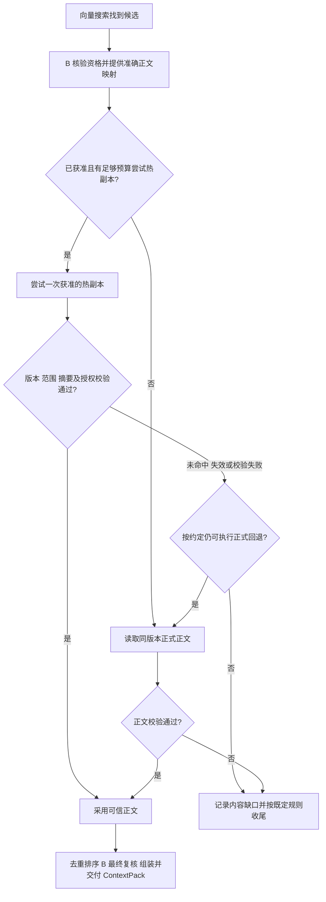

# Recall 对 P2 反馈的影响与可接受性评估 V0.1

编制日期：2026-09-13。评估范围：Recall（A 组）的在线召回，以及 A 组承担的向量投影写入、查询、核验和删除。交付目标：2026-11-30 MVP。

本文依据 P2 于 2026-09-11 编制的 V1.0 答复及现有 Recall 设计，给出 A 组的评估建议。“可接受”表示方案或范围取舍可以接受，不代表双方已经签收、P2 已完成实现或真实联调已经通过。

## 1. 总体判断

**P2 的反馈总体上可以作为继续开发的基础，但只能有条件接受，不能据此认定 Recall 所需能力已经全部具备。**

- **可以接受的范围取舍**：本期关闭可选 Prewarm；来源、层级和动作归因证据不足时保留不可验证状态。前提是正式正文读取满足版本、范围、完整性与授权要求。
- **可以接受的替代方案**：不依赖原生 S3 Versioning，改用不可变对象 key 定位准确正文版本。需要 B/P2 提供不可变和版本映射保证。
- **可以接受的补齐方向**：新增操作查询、准确目标核验，完善搜索、幂等与删除规则；但必须明确实际方法、负责人、可调用日期及验证样例。
- **不能接受的交付结果**：核心保证一直缺失，却把模拟成功、接口声明或请求受理当作真实完成；或者在没有真实联调证据时认定 MVP 已通过验收。

P2 在答复中按 PRD 评估“支持程度”，这与实现、部署和验收状态不同。“需要新增”既不等于永久不支持，也不等于已经承诺按期交付。

## 2. 逐项影响及接受条件

| Recall 能力及对应问题 | P2 反馈 | 对 Recall 的影响 | 是否可接受及条件 |
| --- | --- | --- | --- |
| 向量检索与筛选：RP2-01，P2Q-02～05 | 有基础 Search 与过滤能力的 PRD 依据；现有请求字段不足，多字段 Scope、模型空间、排序及 complete/partial 语义需补齐 | 可开发候选处理和搜索适配框架；真实协议未定会影响筛选、空结果判断及租户隔离验证 | **有条件接受。** 提供实际请求响应、服务端授权与过滤映射、稳定引用、模型/Schema 依据，以及正常空集、部分结果、超时样例。不能用本地过滤代替租户隔离，也不能把失败返回当正常空集 |
| 正文读取与版本：RP2-02/03，P2Q-06/07 | 提供 GET/HEAD/Range 基础能力；不支持 S3 Versioning，建议使用不可变 key；范围与摘要规则需确认 | 可以沿用准确版本读取流程，调整物理定位适配；无需为了 S3 原生版本号重做 Recall | **替代方案有条件可接受。** B/P2 明确内容版本与 key 的映射、同 key 不被不同内容覆盖或复用的保证，并确认范围端点、编码、摘要覆盖及接收字节上限。HEAD 和独立 checksum 方法可以由可信映射或读取响应覆盖，不必强制增加一次调用 |
| 向量写入与载荷映射：RP2-06，P2Q-13/14 | 已声明 InsertVector；五元组、物理 ID、模型/Schema、正文关联、dtype 与元数据编码仍需签收 | 可开发授权、向量校验和本地操作记录；真实适配与双方摘要一致性仍有依赖 | **有条件接受。** 固定目标编码、实际写入语义和载荷映射；明确 float 编码及精度规则。模型字段可以有独立存储映射，但不得直接改变现有三字段 metadata 的摘要口径 |
| 原操作查询与安全重发：RP2-07，P2Q-10/15 | 无现成的按原操作引用或幂等键查询能力；作用域、保留期、负查询最终性和重发规则需新增 | 首次回包丢失、重启或记录过期时，无法完整判断原写入效果，影响恢复与去重 | **补齐方向可接受，缺失状态不能作为完整写路径验收结果。** 无操作 ID 时仍能按原键查证；查无记录不能当从未执行。安全重发须有“无既有效果、无迟到效果、允许沿用原键”的证据及有效窗口，否则保持 UNKNOWN，不盲重写 |
| 准确目标核验与完成判断：RP2-08，P2Q-13/14/16 | 需新增 get/status；建议回读或提供等价证明；普通索引状态与 Segment 内省仅有基础 | 无法确认准确对象、真实载荷、持久化和可查询性是否同时成立，影响向 B 返回可靠的机制 READY | **补齐方向可接受，不能接受以普通集合/段统计替代对象证明。** 证据须绑定准确目标、载荷及相容的观察时点；明确补偿检索可查与正式索引 Ready 的关系。A 返回机制结果，B 仍负责领域 Ready 判定 |
| 精确删除与防复活：RP2-09，P2Q-17 | 有幂等删除、Tombstone 和 Generation 原则；条件/代际删除及旧在途写屏障需补齐 | 可以开发删除编排和状态处理，但暂不能证明删除后旧请求不会再次写回 | **有条件接受。** 明确旧请求与合法新代际的区别，验证“旧 upsert 延迟到达、delete 先完成、旧 upsert 后到”的结果。保持现有同目标重建限制，不能把普通再 Upsert 自动当作获准重建 |
| 热副本读取：RP2-04，P2Q-08 | PRD 未定义 Prewarm 读取契约，本期关闭 | 不走可选热副本路径，改为直接读取正式正文；无法验证该路径的加速收益 | **从 Recall 基础 MVP 范围看可接受。** 现有设计已允许关闭。保留正式读取和校验，不因关闭而改变 Working/长期来源选择，也不承诺预热性能收益 |
| 来源、层级和动作归因：RP2-05，P2Q-09 | 读取响应缺实际 Provider、tier、放置版本及动作关联字段，需与调度契约对齐 | 影响向 C 提供预热使用和放置归因证据；不必阻断已经证明可信的正文使用 | **作为可选归因能力缺失可以接受。** 未知保留未知，不计作热副本命中，也不等于已证明未命中。正文版本和完整性保证仍必须满足 |
| 鉴权、限额、错误和重试：P2Q-05/10/11/18 | 有基础鉴权和错误模型；具体限额、超时、幂等窗口及效果说明需落实 | 影响并发、预算、背压、恢复策略及异常处理；开发后期变化可能带来返工 | **开发阶段允许使用明确标注的测试配置，真实验收前必须固定服务约束。** 正式鉴权不能用 metadata 替代；SDK 不叠加隐式重试；超限不得静默缩小 K 或截断正文冒充成功 |
| 真实环境与性能：P2Q-01/12/18，并引用 BP2Q-08 | 答复称 Azure 环境未就绪，先用本地样本/契约驱动器；性能目标未形成承诺，环境和数值节点不够具体 | 本地开发可继续；真实跨模块故障、吞吐和时延验收受依赖影响 | **可作为阶段性现状接受，不能作为最终交付状态接受。** 明确接口可调用日期、环境可用日期与联合验证窗口；在固定环境、数据和并发条件下确认验收指标。模拟证据不能替代真实证据 |

上述能力中，RP2-01～05 主要支撑在线读取；RP2-06～09 属于 A 组承担的投影维护链路。在线 Recall 不需要对每条命中额外调用 get_projection 来替代 B 的资格和 Ready 核验，但投影维护能力不足会影响新投影的可靠发布及后续长期召回。

## 3. 对开发和交付的安排建议

### 3.1 现在可以继续的开发

Recall 可以继续开发本地请求流程、向量及候选校验、B 接口适配、读取预算、状态持久化、结果组装和故障处理，并通过模拟依赖验证这些本地行为。P2 相关适配保留明确的输入输出边界，以便接入正式协议。

Prewarm 默认关闭，先完成“搜索候选 → B 核验并给出正文映射 → 正式读取 → 校验 → 最终复核 → 交付”的主链路。不能用本地模拟结果证明 P2 已提供真实持久化、隔离或恢复保证。

### 3.2 需要先落实的依赖

优先由 P2 提供 Recall 专项交接清单，每项至少记录：RP2 编号、实际方法及版本、尚缺保证、P2 负责人、可调用日期、可用环境和验收用例。优先级依次是搜索契约、准确版本正文读取，以及操作查询、目标核验和删除屏障。

有两处口径应在实现前统一：

1. **模型信息与 metadata。** 我们现有 metadata_hash 只覆盖 scope、memory_type、occurred_at；P2 提议将模型/Schema 信息写入物理 metadata 时，须与这个规范语义视图区分，并明确模型和投影 Schema 的固定绑定。
2. **可查询与索引 Ready。** P2 声称未建索引段可通过补偿检索查询，同时又以索引状态解释 index_queryable；双方应确定准确对象达到什么条件才算可查询，避免不必要等待或错误完成。

### 3.3 对 11 月 30 日 MVP 的影响

目前不能仅凭这份答复判断必然延期。风险在于新增能力的可调用日期和真实环境日期尚未逐项落实。

现有 EI 计划安排 10-19～10-23 开始基础写读联合调用、11-16～11-20 验证完整检索与可信正文读取，11-23～11-27 还需验证晚到能力并修复复验。这些是现有规划依据，不能当成 P2 对新增接口的已确认承诺。

建议在 09-18 的契约节点先固定核心规则，在既有 09-24 对接节点落实新增能力负责人和交接日期；各批能力按可用时间尽早进入真实联调。若首次真实调用整体推迟到 11-23，则至 11-27 仅有五个工作日，还要承担故障验证和修复，不能继续把该窗口视为纯缓冲。11-30 的最终验收应以真实证据及阻断问题关闭为依据。

## 4. Prewarm 流程说明

### 4.1 它在 Recall 中是什么

Prewarm 在本设计中表示：**召回已经找到并获准使用某份正文后，优先尝试读取提前准备好的同版本热副本，以减少正式存储读取开销。** 具体存放介质由 Provider 和调度契约决定，不限定为 Redis 或内存。

例如，搜索命中“项目接口约定”的第 3 版，B 批准读取该版本的指定片段。如果已经存在获准的第 3 版热副本，Recall 可以先读它；只存在第 2 版时不能拿来替代第 3 版。

它加速的是候选确认之后的正文加载，不是向量搜索本身，也不是新增一个候选来源。热副本仍属于原来的长期 Memory；Working 仍由 B 的 Working 读取流程提供。

### 4.2 副本准备与在线读取的分工

| 参与方 | 职责 |
| --- | --- |
| Operate / C | 在独立调度流程中决定是否准备、保留或释放副本；维护动作及生命周期事实 |
| P2 / 内容 Provider | 在能力启用并确认承接后提供副本执行、可读引用、字节和状态事实；本期不能假设这些已具备 |
| Remember / B | 核验 Memory 资格及授权，提供准确正文版本、批准范围和可信摘要，确认热副本与正式内容的关系 |
| Recall / A | 消费已经获准的热副本引用，执行预算、读取、校验和回退，记录真实加载事实 |

Prefetch 等动作负责“准备副本”，Prewarm 读取负责“使用已有副本”。在线 Recall 不调用 Promote/Prefetch/Release，不等待临时调层完成，也不直接拼装内部缓存 key。

### 4.3 启用后的读取流程

以下以需要从 Provider 加载长期正文的候选为例；内联正文等其他路径仍按现有设计处理。

1. **先确定要读什么。** Search 返回候选后，B 核验资格、当前性和权限，并提供准确版本、范围及可信期望摘要；不因为有热副本就跳过 B。
2. **先检查是否值得尝试。** 只有启用能力、存在获准引用，并且时间、调用次数和字节预算足以保障首次正式回退时，才尝试热副本；否则直接正式读取。
3. **命中后仍需验证。** hit 只表示读到了副本，版本、范围、字节数和摘要全部通过后才能采用。摘要的期望值来自 B 认可的依据，不从缓存回包自行生成。
4. **失败后按约定回退。** miss、释放、不可用或校验失败时，在剩余预算内由唯一责任方安排正式读取。回退成功且正文可信时，不单因缓存失败自动降级；两条路径都未能提供可信内容时，记录缺口并按现有模式收尾。
5. **最后仍走正常交付流程。** 可信正文进入去重和排序，经 B 最终复核后组装、可靠提交并发出 ContextPack。

### 4.4 回退与证据的关键规则

- **回退只由一方负责。** 如果由 Recall 回退，Provider 返回本次热副本失败事实；如果 Provider 已内部回退，Recall 验证最终字节后不得再重复请求正式正文。
- **两路都计入预算。** 断流、校验失败时已接收的字节仍消耗预算。Provider 内部回退须能说明调用及字节累计口径，不能只报告最后一次读取量掩盖前面开销。
- **区分命中与采用。** 热副本返回字节不等于校验通过；校验通过不等于最终进入 Context；Context 发出也不证明模型实际使用。各阶段按真实事实记录。
- **归因未知不等于正文无效。** 正文校验通过但缺少层级、动作关联时，可继续基础召回；相应归因保留不可验证，不能伪称预热命中或收益。

### 4.5 为什么本期关闭，是否可以接受

P2 答复的明确理由是：其本期 PRD 没有定义 Prewarm 热副本读取契约。答复没有证明技术上无法实现，也没有给出人手不足等原因。RGW 内部缓存或介质分层不能自动视为满足这套版本、引用、失效、回退及证据要求的 Prewarm 能力。

**对 Recall 基础 MVP，建议接受本期关闭。** 当前设计已将其定义为可选路径，关闭后的主流程为：

> 搜索候选 → B 核验及提供准确正文映射 → 直接读取正式正文 → 校验 → 去重排序与最终复核 → 交付 ContextPack。

关闭不必改变候选来源、授权和正文正确性规则，但失去这条路径的潜在加速收益，也不能验收对应的预热使用归因。是否仍达到总体时延和吞吐目标，需要在正式读取路径上实测，不能直接认定性能没有影响。

后续启用条件包括：副本准备能力落实、B 认可同版本读取关系、Provider 提供正式方法与可读引用、明确失效/回退和预算规则，并验证正确命中、旧版本、释放竞态、超时断流、重复回退和归因证据等场景。

## 5. 建议的接受结论

Recall 建议接受 P2 本期关闭可选 Prewarm、采用不可变 key 替代原生对象版本管理的方向；同时要求落实正式正文读取所需的版本、范围和完整性保证。对搜索协议、原操作查询、准确目标核验、幂等恢复和删除屏障，接受补充方案的方向，但在方法、交付日期及真实证据明确前，不能认定已满足相应验收条件。

本地开发可以继续，真实能力按已确认范围分批接入。最终验收保留对准确授权、可信正文、可靠写入与删除、故障恢复和真实环境的要求。本文不替代原有 AL 签收记录，也不代 P2 或其他组确认承诺。

## 6. 依据与追溯

- P2《AetherEngine_P2_P3接口对接需求评估与答复_V1.0(1).md》，正文标题为《AetherEngine P2 · P3 接口对接需求评估与待回复问题答复 V1.0》，编制日期 2026-09-11。依据本对话此前完整读取的原文，重点为 1.2、2.2 及其引用的 BP2Q-01/04/05/08；编写本文时原微信临时路径已不可访问，未据此推断后续实现或部署状态。
- [Recall 与 P2 接口对接需求](../Recall流程/运行时详细设计_V0.1/召回与P2接口对接需求_V0.1.md)：第 1 章在线读取，第 1.6 节 Prewarm，第 2 章向量投影维护。
- [Recall 与调度优化接口对接需求](../Recall流程/运行时详细设计_V0.1/召回与调度优化接口对接需求_V0.1.md)：预热读取边界、回退预算和使用证据。
- [Recall 数据定义](../Recall流程/运行时详细设计_V0.1/召回数据定义_V0.1.md)：目标、载荷、metadata_hash 和请求指纹。
- [跨模块待确认事项](../Recall流程/运行时详细设计_V0.1/跨模块待确认事项_V0.1.md)：AL-P201～208 及相关 B/C 依赖，继续作为原有签收位置。
- [P3 与 P2 的 EI 对接计划](AetherStore_P3_External_Integration_P2对接计划_V0.1.md)：分批联调窗口及最终交付安排。
