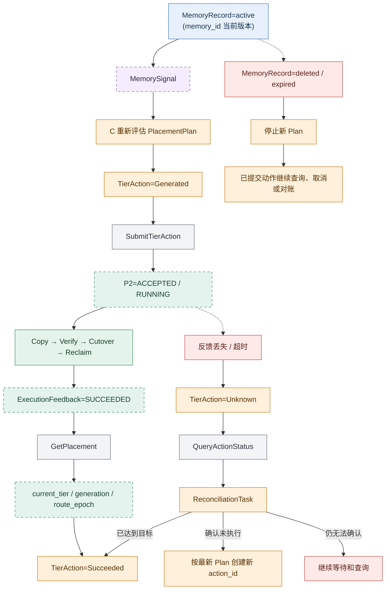

# AetherStore P3 跨组业务对象完整流转图 V0.1

## 1. 图的范围

本图描述 A/Recall、B/Remember、C/Operate 和 P2/Provider 之间的主要业务对象、Signal、计划、动作和真实观察如何流转。

图中分为四类：

| 图例 | 含义 |
|---|---|
| 蓝色 | 业务对象或 Recall 结果 |
| 紫色虚线 | Signal、Event 或访问事实 |
| 橙色 | C 的计划、动作和对账对象 |
| 绿色 | P2 / Provider 返回的真实事实 |
| 灰色 | 接口或内部执行过程 |

说明：

- `memory_id` 是稳定的业务逻辑身份，不单独落库；B 实际管理和持久化 `MemoryRecord` 及其版本历史；
- `AccessTrace` 由 A/Recall Runtime 产生，C 只消费；
- `PlacementPlan`、`TierAction` 和 `ReconciliationTask` 由 C 管理；
- `PlacementObservation`、`ResourceState` 和 `ExecutionFeedback` 的真实内容由 P2/Provider 提供；
- `Representation` 保持抽象，不在本图冻结具体表示类型；
- Recall 的在线 `Prewarm` 不会生成 C 的 `TierAction`。

## 2. 完整对象流转主图

```mermaid
flowchart LR
    %% -------------------- B / Remember --------------------
    subgraph B["B / Remember：业务事实与记忆生命周期"]
        ME["MemoryEvent\n业务输入事实"]:::business
        MI["memory_id\n稳定逻辑身份\n不单独落库"]:::business
        MR["MemoryRecord\nB 实际持久化对象\nrecord_id / memory_version"]:::business
        RS["Representation\n与 memory_id 关联的抽象表示"]:::business
        PS["ProjectionState\nbuilding / pending / ready / stale / failed / unknown"]:::derived
        MS[["MemorySignal\ncreated / updated / lifecycle_changed / deleted"]]:::signal
        MRD["MemoryRead\n提供给 A 的当前事实与映射"]:::interface

        ME -->|形成或识别业务身份| MI
        MI -->|关联同一业务记忆的版本历史| MR
        MR -->|登记或更新表示| RS
        RS -->|派生机制状态| PS
        MR -.->|创建、版本或生命周期变化| MS
        PS -.->|状态变化事实| MS
        MI -->|定位当前 Record| MRD
        MR --> MRD
    end

    %% -------------------- A / Recall --------------------
    subgraph A["A / Recall：检索、读取与访问事实"]
        RR["RecallRequest\nreceived / processing"]:::business
        Q["Query / QueryEmbedding\n检索输入"]:::interface
        CAND["Candidate\nretrieved / validated / rejected"]:::business
        CL["ContextLoad\ncontent_loaded / validated"]:::business
        CP["ContextPack\nemitted / degraded / failed / expired"]:::business
        AT[["AccessTrace\nsearch_hit / loaded / selected / used"]]:::signal

        RR --> Q
        Q -->|候选发现| CAND
        CAND -->|B 核验当前版本| MRD
        MRD -->|准确正文映射| CL
        CL -->|排序与最终复核| CP
        CL -.->|产生访问事实| AT
        CP -.->|有效使用事实| AT
    end

    %% -------------------- Recall P2 --------------------
    subgraph RP2["A/Recall ↔ P2：在线读取边界"]
        SEARCH["search\n在线候选搜索"]:::interface
        PREWARM["RP2-04 Prewarm\n在线读取时尝试已有热副本"]:::interface
        GET["get_content / get_range\n在线正文读取"]:::interface
        READOBS[["RP2-05 P2ReadPlacement\nactual_provider / observed_tier / placement_generation"]]:::fact
    end

    %% -------------------- C / Operate --------------------
    subgraph C["C / Operate：决策、调度与对账"]
        HOT["Hotness / Decision\n访问事实与策略计算"]:::decision
        PLAN["PlacementPlan\ncreated / valid / expired / superseded"]:::control
        TARGET["ActuationTarget\nP2 返回的不透明目标"]:::control
        ACTION["TierAction\nGenerated / Submitted / Succeeded / Failed / Unknown"]:::control
        HIST["ActionHistory\n幂等、冲突与审计"]:::control
        RECON["ReconciliationTask\nWaiting / Running / Succeeded / Failed"]:::control
        POLICY["PolicyContext\n策略与模型版本"]:::decision
        HOT --> PLAN
        POLICY --> HOT
        PLAN --> TARGET
        TARGET --> ACTION
        ACTION --> HIST
        ACTION -.->|结果不确定| RECON
    end

    %% -------------------- P2 / Provider --------------------
    subgraph P2["P2 / Provider：真实执行与事实"]
        GP["GetPlacement\n读取真实 Placement"]:::interface
        GR["GetResourceState\n读取真实资源"]:::interface
        SUB["SubmitTierAction\n接收抽象动作"]:::interface
        QAS["QueryActionStatus\n按原动作查询"]:::interface
        WATCH["WatchExecutionFeedback\n反馈流或回调"]:::interface
        PT["ProviderTask\nP2 内部执行任务"]:::provider
        MIG["Physical Migration\nCopy → Verify → Cutover → Reclaim"]:::provider
        EF[["ExecutionFeedback\nACCEPTED / RUNNING / SUCCEEDED / FAILED"]]:::fact
        PO[["PlacementObservation\ncurrent_tier / generation / route_epoch"]]:::fact
        RES[["ResourceState\ncapacity / pressure / health / budget"]]:::fact

        SUB --> PT
        PT --> MIG
        MIG --> EF
        MIG --> PO
        PT --> WATCH
        PT --> QAS
        GP --> PO
        GR --> RES
    end

    %% -------------------- cross-group flow --------------------
    MS -.->|输入事实| HOT
    AT -.->|真实访问输入| HOT
    READOBS -.->|写入 AccessTrace / 归因观察| AT
    SEARCH --> CAND
    PREWARM --> CL
    GET --> CL
    PREWARM -.->|不产生 TierAction| AT

    RS --> GP
    PLAN --> GP
    PLAN --> GR
    GP --> HOT
    GR --> HOT
    TARGET --> SUB
    ACTION --> SUB
    EF --> ACTION
    EF --> RECON
    PO --> ACTION
    PO --> RECON
    QAS --> RECON
    RECON -->|达到目标或确认未执行| ACTION
    RECON -->|需要新决策| PLAN

    classDef business fill:#e8f1fb,stroke:#3c78b4,color:#17324d;
    classDef derived fill:#f1eafa,stroke:#8055a6,color:#352044;
    classDef signal fill:#f5edff,stroke:#8055a6,color:#352044,stroke-dasharray: 5 5;
    classDef control fill:#fff0dc,stroke:#c87918,color:#553000;
    classDef decision fill:#fff8d9,stroke:#b59621,color:#4c3d00;
    classDef interface fill:#f2f4f6,stroke:#68737d,color:#29323a;
    classDef provider fill:#e5f4eb,stroke:#3a8a58,color:#163d25;
    classDef fact fill:#e4f3ee,stroke:#31866c,color:#173f34,stroke-dasharray: 5 5;
```



## 3. 主图的对象流转顺序

| 顺序 | 对象或事实 | 产生方 | 消费方 | 状态或作用 |
|---|---|---|---|---|
| 1 | `MemoryEvent` | B 上游 | B | 触发业务事实形成 |
| 2 | `memory_id` | B 通过 `MemoryRecord` 维护 | A、C | 稳定逻辑身份，不单独落库 |
| 3 | `MemoryRecord` | B | A、C | B 实际保存的业务记录，承载具体版本和引用关系 |
| 4 | `Representation` | 表示生产方 / B 交接 | A、C、P2 | 作为读取或调度的抽象对象 |
| 5 | `ProjectionState` | B 收口，A 提供机制结果 | A、B | 表示派生投影是否可用 |
| 6 | `MemorySignal` | B | C、Shared Runtime | 告知某个 `memory_id` 下 `MemoryRecord` 的创建、更新、失效或删除 |
| 7 | `RecallRequest` / `Candidate` | A | B、P2 | 发起检索并核验当前 Memory |
| 8 | `ContextLoad` / `ContextPack` | A | 上层调用方 | 形成可输出的上下文 |
| 9 | `AccessTrace` | A/Recall Runtime | C | 记录真实加载、选择和使用事实 |
| 10 | `PlacementPlan` | C | C、P2 | 表达调度目标，不代表物理成功 |
| 11 | `ActuationTarget` | P2 | C | 表达可转发但不可解析的执行目标 |
| 12 | `TierAction` | C | P2 | 表达要执行的抽象调度动作 |
| 13 | `ProviderTask` | P2 | P2 内部 | 承接物理迁移 |
| 14 | `ExecutionFeedback` | P2 | C | 反馈接收、执行和结果 |
| 15 | `PlacementObservation` | P2 / Provider | C、Shared Runtime | 返回真实层级、版本和路由 |
| 16 | `ResourceState` | P2 / Provider | C | 返回容量、压力和健康事实 |
| 17 | `ReconciliationTask` | C | C、审计 | 收敛 Unknown、冲突和反馈丢失 |

## 4. 状态收口关系图



## 5. 四条必须保持的边界

### 5.1 `memory_id`、MemoryRecord 与 Representation

```text
memory_id 是稳定的业务逻辑身份，不是独立落库对象。
MemoryRecord 是 B 实际保存的业务记录和版本对象。
Representation 是 C 的调度和访问决策单位。
```

C 可以针对某个 `representation_id` 调度，但不能把调度结果写回成 Memory 的业务生命周期状态。

### 5.2 AccessTrace 与 MemorySignal

```text
MemorySignal：某个 memory_id 下的 MemoryRecord 发生了什么业务变化。
AccessTrace：Recall 实际发生了什么访问。
```

两者不能互相替代：

- `MemorySignal` 不能证明 MemoryRecord 被读取或使用；
- `AccessTrace` 不能修改 MemoryRecord 的业务生命周期；
- `search_hit` 不能直接当成有效使用；
- `context_emitted` 或 `used_in_context=true` 才能作为有效使用证据。

### 5.3 PlacementPlan、TierAction 与 PlacementObservation

```text
PlacementPlan：C 想达到什么目标。
TierAction：C 请求执行什么动作。
PlacementObservation：P2 真实达到了什么状态。
```

因此：

- `desired_tier` 不是 `current_tier`；
- `Succeeded` 不是单凭 P2 `ACCEPTED` 得出；
- C 必须用 `ExecutionFeedback` 加最新 `PlacementObservation` 完成收口；
- P2 的 `generation` 和 C 的 `policy_version` 不能混用。

### 5.4 Recall Prewarm 与 C Prefetch

```text
RP2-04 Prewarm：在线读取时尝试已有热副本。
C Prefetch：C 根据预测生成后台调度动作。
```

在线 `Prewarm` 命中时，只产生读取和放置观察事实，不产生 C 的 `TierAction`。

## 6. 关键 Signal 到对象状态的转换

| Signal / 事实 | 影响对象 | 允许的变化 | 不允许的变化 |
|---|---|---|---|
| `MemorySignal(created)` | `memory_id`、`MemoryRecord` | 建立当前 Record 和版本 | 不能直接生成物理调度动作 |
| `MemorySignal(updated)` | `MemoryRecord`、`Representation`、`ProjectionState` | 旧 Record 或派生对象进入 `stale` 或 `superseded` | 旧版本结果不能覆盖新版本 |
| `MemorySignal(deleted)` | `memory_id` 对应的 `MemoryRecord`、`PlacementPlan` | Record 进入 `deleted`，新计划停止 | 不能直接假定 P2 已删除所有副本 |
| `AccessTrace(context_emitted)` | C 热度统计 | 更新访问和使用统计，重新评估 Plan | 不能直接把 TierAction 改成成功 |
| `ProviderResult(ready)` | `ProjectionState` | B 核验后进入 `ready` | A 不能直接写 B 的 Ready |
| `ExecutionFeedback(accepted/running)` | `TierAction` | `Generated` -> `Submitted` | 不能直接进入 `Succeeded` |
| `ExecutionFeedback(succeeded)` + `PlacementObservation` | `TierAction` | `Submitted/Unknown` -> `Succeeded` | 缺少真实层级和版本时不能收口 |
| 反馈丢失 / 超时 | `TierAction` | `Submitted` -> `Unknown` | 不能直接判定 Failed 或盲目重试 |
| `ResourceState` 过期 | `PlacementPlan` | 计划等待或失效 | 不能提交新的非 `Keep` 动作 |
| RP2-05 `P2ReadPlacement` | `AccessTrace` / 归因记录 | 补充实际来源和观察版本 | 不能按时间猜 `producing_action_id` |

## 7. 最终判断标准

如果只看这张图，应该能够回答以下问题：

- B 如何通过 `MemoryRecord` 管理 `memory_id` 对应的业务记忆？
- A 什么时候产生 AccessTrace？
- C 根据哪些输入生成 PlacementPlan？
- C 如何从抽象 Representation 找到 P2 执行目标？
- P2 执行后，谁提供真实层级和版本？
- TierAction 什么时候才算 Succeeded？
- 反馈丢失时为什么不能直接重试？
- `MemoryRecord` 删除或过期后，已提交的动作如何处理？
- Recall 的在线 Prewarm 为什么不等于 C 的 Prefetch？

完整关系可以概括为：

```text
MemoryEvent
  -> memory_id（稳定逻辑身份）
  -> MemoryRecord v1 / v2 / ...
  -> Representation
  -> MemorySignal
  -> RecallRequest / Candidate / ContextPack
  -> AccessTrace
  -> PlacementPlan
  -> ActuationTarget
  -> TierAction
  -> ProviderTask / Physical Migration
  -> ExecutionFeedback
  -> PlacementObservation / ResourceState
  -> Succeeded / Failed / Unknown
  -> Reconciliation
```
