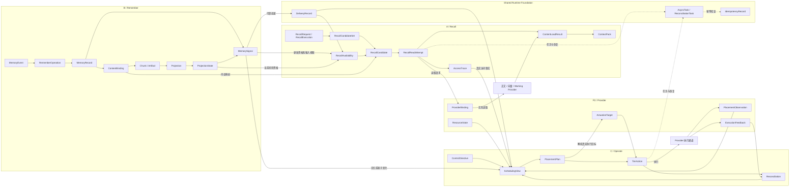
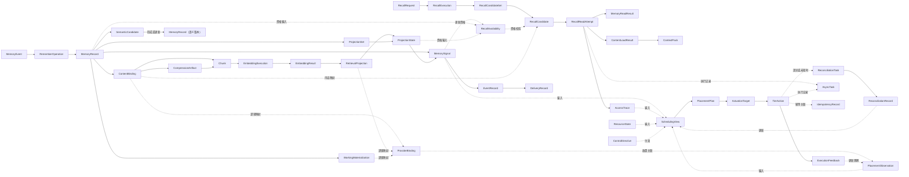
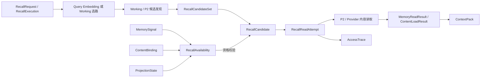
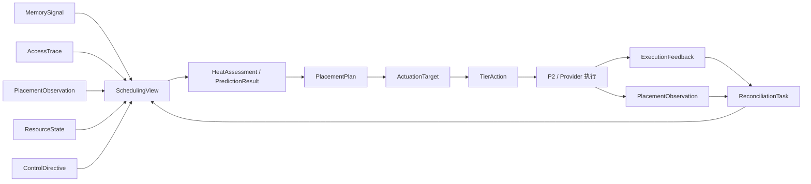
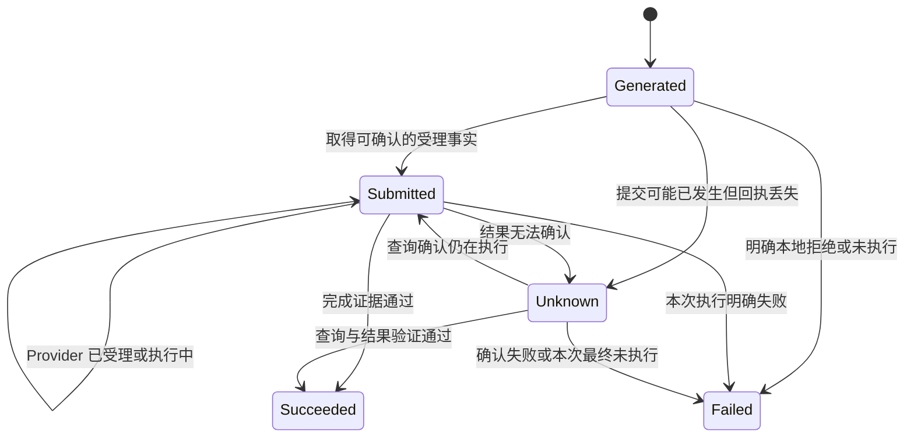

# AetherStore P3 跨组业务对象生命周期与 Signal 统一管理

版本：V0.4  
修订日期：2026-09-09  
面向：Shared Runtime Foundation、Remember、Recall、Operate 和 External Integration 负责人

本文先说明整个 P3 系统有哪些需要管理的对象、各自包含什么及相互关系，再给出生命周期和统一管理方式。当前组织模型采用三个业务流：Remember、Recall、Operate；两个横向责任域：Shared Runtime Foundation 和 External Integration。

核心结论是：**以 MemoryRecord 为 Remember 的记忆主事实，以内容和表示承载可读取、可检索、可调度的数据，以请求、任务、计划和动作记录处理过程，以事件和观察连接三个业务流。Shared Runtime Foundation 统一公共对象规则、状态转换、任务、投递、幂等和恢复机制；各业务流负责本流业务判定和授权状态更新；External Integration 负责外部能力和事实的契约、适配与验证。**

本文是跨流评审用的生命周期与责任边界基线，不代表已经完成接口冻结或系统实现。对象名称与字段表示逻辑含义，不要求每个对象单独建表、单独建服务，也不在本文冻结接口参数、数据类型、表结构或实现限制。本文先明确 Shared Runtime Foundation 应统一什么、不能统一什么；待本基线确认后，再同步调整 Remember、Recall 和 Operate 的详细交付物。

## Shared Runtime Foundation：统一生命周期管理边界

### 0.1 先给结论

Shared Runtime Foundation（简称 SRF）是横向的公共生命周期治理和运行时基础，不是第四条业务流，也不是一个替 B、A、C 直接修改业务对象的“总管服务”。

SRF 统一的是以下内容：

1. 对象目录：每个对象是什么、由谁负责、谁可以写、谁只能读。
2. 状态语义：同一个状态名称在不同对象中表达什么，以及允许怎样转换。
3. 公共运行机制：事件信封、投递、消费确认、任务、租约、幂等、审计、重试和恢复；其中包括供各业务流复用的 Reconciliation Runtime。
4. 跨对象关系：版本变化、删除、失效、动作冲突和结果未知会影响哪些对象。
5. 统一查询和证据关联：能够沿着对象、版本、事件、任务、计划、动作和反馈追溯完整链路。

SRF 不统一以下内容：

- 不把 `MemoryRecord`、`AccessTrace`、`PlacementPlan` 和 P2 的物理状态放进同一个业务状态机。
- 不代替 B 判断记忆是否有效，不代替 A 判断上下文是否可信，不代替 C 判断是否调层。
- 不伪造 `current_tier`、容量、物理迁移结果或 Provider 完成证据。
- 不因为某个事件已投递、任务已受理或 Provider 返回 `Accepted`，就把业务对象直接判为成功。
- 不替 C 比较 `TierAction` 与 `PlacementObservation`，也不替任何业务流决定业务补偿、重计划或物理动作成功。

因此，“统一管理”应理解为：**统一规则、统一公共机制、统一跨组交接和统一可追溯性；业务事实和业务决策仍由各自领域负责人拥有。**

### 0.2 SRF 纳管范围与业务归属

| 对象类别 | 典型对象 | 业务事实或结果负责人 | SRF 负责什么 |
|---|---|---|---|
| Remember 主事实 | `MemoryRecord`、`ContentBinding`、`ProjectionState` | B / Remember | 提供版本、状态更新、事件发布、任务和审计的公共机制；不判断记忆业务资格 |
| Recall 请求与访问 | `RecallRequest`、`RecallCandidate`、`ContextPack`、`AccessTrace` | A / Recall 或实际观察组件 | 提供请求关联、任务、事件信封、投递和审计机制；不决定候选和上下文业务结果 |
| Operate 决策与动作 | `SchedulingView`、`PlacementPlan`、`TierAction`、`ReconciliationTask` | C / Operate | 提供 Reconciliation Runtime、动作任务、幂等、状态目录、反馈关联和恢复机制；不决定业务对账结论和物理执行结果 |
| P2 / Provider 事实 | `PlacementObservation`、`ResourceState`、`ExecutionFeedback`、Provider Operation | P2 / Provider | 统一外部事实接入、版本和证据关联；不改写外部系统的真实状态 |
| 公共控制记录 | `EventRecord`、`DeliveryRecord`、`AsyncTask`、`TaskAttempt`、`IdempotencyRecord`、`AuditRecord` | SRF 提供公共机制；业务流提供业务语义 | 维护公共结构、状态含义、执行权、投递、查询、审计和恢复 |
| 失效与清理约束 | `Tombstone`、`InvalidationRecord`、`CleanupRecord` | 产生删除或失效决定的业务流 | 保障约束传播、在途工作失权、清理进度和恢复顺序可查询 |

这里的“SRF 负责”主要表示公共机制和规则的责任，不表示所有记录都必须由 SRF 独立保存，也不表示业务流可以绕过自己的权威存储。一个对象可以由 B、A、C 或 P2 维护，同时使用 SRF 提供的统一任务、投递、幂等和审计能力。

### 0.3 统一管理的不是一套状态机，而是几类状态维度

不同对象回答的问题不同，不能强行共用一列状态。SRF 需要统一各维度的含义和使用方式：

| 状态维度 | 它回答的问题 | 典型状态 | 适用对象 | 主要负责人 |
|---|---|---|---|---|
| 业务有效性 | 这条业务事实现在是否有效 | `Active`、`Superseded`、`Expired`、`Deleted` | `MemoryRecord`、内容和表示资格 | B / Remember |
| 版本当前性 | 这个版本是不是当前版本 | `Current`、`Superseded` | 记忆、内容、Projection、计划和动作引用 | 各对象权威方 |
| 任务执行 | 后台工作进行到哪一步 | `Pending`、`Running`、`Retryable`、`Succeeded`、`Failed`、`Cancelled` | `AsyncTask`、`ReconciliationTask` | SRF 统一任务状态和运行机制；业务流定义查询目标、业务完成条件和业务结论 |
| 事件投递 | 事件对某个消费者交付到哪一步 | `Pending`、`Sent`、`Acknowledged`、`RetryScheduled`、`AttentionRequired` | `DeliveryRecord` | SRF / 生产者 / 消费者按层次确认 |
| 外部动作 | C 发出的动作是否已被提交和确认 | `Generated`、`Submitted`、`Succeeded`、`Failed`、`Unknown` | `TierAction` | C；P2 提供外部状态和证据 |
| 观察新鲜度 | 当前观察还能不能用于决策 | `Fresh`、`Stale`、`Unknown` | `PlacementObservation`、`ResourceState`、派生视图 | P2 / Provider 提供事实，C 消费判断 |
| 清理进度 | 失效对象的各层残留清理到哪里 | `Pending`、`InProgress`、`Completed`、`Blocked` | `CleanupRecord`、删除屏障 | 业务流汇总，Provider 执行物理清理 |

统一规则是：状态名称的含义、允许转换、版本检查、完成证据和异常处理方式必须一致；不要求所有对象拥有全部状态，也不要求所有对象使用同一条状态转换线。

### 0.4 一个对象从产生到结束的统一管理步骤

| 步骤 | SRF 提供的公共能力 | 业务流或外部系统的责任 |
|---|---|---|
| 1. 登记对象 | 对象目录、身份、Scope、版本和权威方登记 | 业务 Owner 说明对象含义和主事实 |
| 2. 形成事实 | 受控写入、并发检查、状态修订和审计 | 权威方判断输入是否满足业务条件 |
| 3. 发布变化 | Outbox、事件信封、事件序号和可靠提交 | 生产方产生不可变业务事件 |
| 4. 投递消费 | `DeliveryRecord`、去重、游标、补发和重放 | 消费方校验版本并更新自己的视图或待办 |
| 5. 执行任务 | `AsyncTask`、租约、心跳、预算和恢复 | 业务 Owner 定义目标、步骤和成功条件 |
| 6. 接收结果 | 结果关联、证据保存和状态映射 | 结果权威方提供事实；业务 Owner 判断业务完成 |
| 7. 对账收口 | Reconciliation Runtime 负责任务持久化、租约、查询调度、重试约束、恢复和审计 | 相应业务流比较本域事实，处理 `Unknown`、失效和补偿，并决定业务收口 |
| 8. 失效清理 | Tombstone 传播、清理记录、保留和恢复顺序 | 业务 Owner 决定删除范围，Provider 执行物理清理 |

任何一步失败，都不能直接修改已经确认的上游主事实。应通过事件、任务、结果、对账和清理记录把未完成责任保留下来。

### 0.5 各组必须同步遵守的边界

| 责任方 | 必须负责 | 不得负责或不得假设 |
|---|---|---|
| B / Remember | `MemoryRecord`、版本、内容映射、Projection 资格和 `MemorySignal` | 不把投递成功当作 C 已完成调度；不让 C 回写主事实 |
| A / Recall | Recall 请求、候选、读取、上下文结果和 `AccessTrace` | 不把搜索命中当作实际使用；不替 C 生成 TierAction |
| C / Operate | 热度、`PlacementPlan`、`TierAction`、准入和对账 | 不伪造真实 Placement、容量或物理执行结果 |
| P2 / Provider | Provider 任务、物理放置、资源和执行反馈 | 不把 C 的计划当作已执行；不能只返回受理就宣称完成 |
| Shared Runtime Foundation | 对象目录、公共状态语义、事件、任务、幂等、审计、查询和恢复机制 | 不代替业务 Owner 做业务判断，不建立第二套主事实 |
| External Integration | 外部契约、适配、错误映射、完成证据和真实联调 | 不人工维护 P2 的真实 tier，不越权修改业务状态 |

### 0.6 SRF 详细设计完成的判定标准

在正式调整 A、B、C 详细文档之前，SRF 至少需要明确以下交付物：

1. **对象总目录**：对象定义、身份、版本、Scope、权威方、写入者和消费者。
2. **状态语义表**：每个对象使用哪些状态、状态含义、允许转换和完成证据。
3. **Signal / Event 规则**：产生方、消费方、事件信封、事件版本、幂等和消费确认层次。
4. **Task / Retry / Recovery 规则**：任务状态、租约、重试预算、Unknown、对账和人工接管。
5. **跨对象影响矩阵**：版本更新、删除、失效、动作冲突和迟到结果分别影响哪些对象。
6. **统一查询与审计规则**：如何根据对象 ID、版本、事件、任务、计划或动作查到完整证据。
7. **保留与清理规则**：事件、任务、幂等记录、墓碑、业务历史和物理残留的保留与清理责任。
8. **跨组验收场景**：重复投递、乱序、重启、回包丢失、Unknown、删除竞态和共享目标冲突。

本版完成的是 SRF 的边界和设计基线；具体接口参数、实现位置、数据类型、表结构、保留时长和性能指标仍需在公共契约评审中冻结。

## 1 范围与建模口径

### 1.1 哪些需要当作对象管理

“业务对象”有狭义和广义两种用法。狭义是 MemoryRecord、SemanticCandidate 等表达业务含义的领域对象；统一管理还必须覆盖任务、动作、关联记录、事件、观察和派生视图，否则无法解释一条记忆为什么可用、为什么不能用、失败后如何恢复。

| 类别 | 判断标准 | 典型对象 | 管理重点 |
|---|---|---|---|
| 领域对象 | 有稳定身份和业务含义，需要独立判断有效性 | MemoryRecord、SemanticCandidate | 版本、业务资格、来源、生命周期 |
| 内容与关系对象 | 说明数据是什么、来自哪里、引用什么 | ContentBinding、Artifact、Chunk、EvidenceRelation | 精确版本、完整性、依赖、保留和清理 |
| 流程与执行记录 | 记录一次请求、工作或副作用 | RememberOperation、RecallRequest、Task、TierAction | 目标、承诺、进度、完成证据和恢复 |
| 决策与派生视图 | 由权威事实计算，不产生第二套主事实 | RecallAvailability、SchedulingView、PlacementPlan | 输入版本、计算规则、新鲜度和重算 |
| 事件与观察 | 记录已发生的事实或某时刻的观察 | MemorySignal、AccessTrace、PlacementObservation | 来源、时间、顺序、去重、保留 |
| 公共控制记录 | 保障上述对象可靠运转 | IdempotencyRecord、DeliveryRecord、Tombstone、AuditRecord | 通用机制、作用域、执行权和审计 |

只有字段、枚举、引用或瞬时结果的内容，不必一律提升为独立生命周期对象。例如 Memory Type、Category、Scope、Token Budget、content_ref、memory_id 都需要统一定义，但不因此各自拥有一套状态机。请求和候选是否完整持久化，取决于恢复、幂等和解释需求，不能为了“统一”保存所有中间数据。

### 1.2 统一术语

| 名称 | 本文含义 |
|---|---|
| Remember | 记忆形成、分类、版本、证据、有效性、派生构建及读取资格的业务流 |
| Recall | 从请求、候选发现和校验到内容加载、上下文组装与结果交付的业务流 |
| Operate | 基于记忆、访问、资源和放置事实做驻留决策，跟踪动作和验证效果的业务流 |
| Memory | 一条业务记忆的概念，其稳定身份为 memory_id |
| MemoryRecord | 表达这条记忆某一业务版本的主事实记录；当前版本和历史版本一起管理 |
| Representation | 与某个记忆版本或内容版本关联、供读取、检索或调度使用的表示的统一抽象 |
| Projection | Representation 中用于检索的派生表示；当前重点是向量投影 |
| ProjectionState | Projection 的构建和领域可用状态，不是另一个内容实体 |
| Signal | 用来通知业务变化的事件；不能泛指所有请求、返回值和快照 |
| P2／Provider | 提供实际存储、索引、资源或执行能力的外部系统；Provider 不全部等同于 P2 |

Memory 与 MemoryRecord 不重复维护两套主事实。在 B 的交付口径中，Memory 只是业务概念，真正需要持久化和管理的是 MemoryRecord；不要求单独建立 Memory 表或 Memory 状态机。`memory_id` 是身份，`memory_version` 是内容或业务版本；是否使用独立 `record_id`、版本表和当前版本指针属于存储设计。本文不延续“memory_id 必须不单独落库”这种实现限制，但要求当前版本的判定只有一个权威来源。

## 2 全流程对象流转

本章按业务流程说明对象如何从一个责任域交给另一个责任域，而不是把对象简单按团队或系统罗列。P3 不是一条固定的“B → A → B → C → P2”直线，而是 Remember、Recall、Operate 三条相互关联的业务流：Remember 形成事实，Recall 按请求读取，Operate 根据事实和观察做驻留决策；Shared Runtime Foundation 为三条业务流提供统一任务、投递、幂等和恢复机制。

### 2.1 全流程总览



这张图是混合流程图：泳道标题代表责任域，`正文 / 向量 / Working Provider` 和 `Provider 执行通道`代表外部能力，其他方框才是业务对象或业务记录。不能把同一条线上的对象理解为同一个对象的不同状态。例如 `MemoryRecord` 是 B 的主事实，`ProjectionState` 是派生表示的资格，`PlacementPlan` 是 C 的决策，`TierAction` 是一次外部动作，`PlacementObservation` 是 Provider 返回的物理观察。`ProviderBinding` 是 P3 侧维护的逻辑对象与外部对象关联，P2／Provider 提供其中的物理标识和观察事实，不代表 P2 单独拥有这条业务关系。

External Integration 是横向对接责任域，不是另一条业务对象流：它负责 Provider 契约、身份、映射、错误和完成证据的接入与验证；业务事实仍由 Remember、Recall、Operate 或 Provider 各自的权威方维护。

三条业务流不是必须同步完成的流水线：Remember 可以在新建、更正、删除或投影变化时发布 `MemorySignal`；Recall 由上层请求触发；Operate 可以由 `MemorySignal`、`AccessTrace`、资源观察或定时评估触发。Recall 不等待 Operate 完成调度，`MemorySignal` 也不直接命令 P2 迁移。

关系基数和版本约束必须保持一致：

- 一个 `memory_id` 可有多个业务版本；普通当前读取在同一作用域和业务口径下只选定一个当前版本。
- 一个记忆版本可关联多个内容片段、Artifact、Projection 或运行时表示；一个内容对象也可能被多条记忆引用。
- 一组 Projection 可以包含多个 Chunk 的投影项；集合完整和单项成功分别判断。
- 一个逻辑 Representation 可以有多个物理副本；多个逻辑对象也可能落在同一个物理 Segment 中。
- 所有引用必须绑定适用版本或不可变快照；仅有 `memory_id` 不能确定应该读取、重建或删除哪份数据。

#### 2.1.1 严格业务对象关系图（主链路）

下面的图只保留第 3 章目录中的对象、事件、观察、任务和记录。泳道、Provider、执行通道和具体 RPC 不作为节点；同一行中的两个名称也不再合并成一个节点。



图中实线表示主事实、派生或包含关系；虚线表示资格输入、事件通知、观察关联或公共执行关联。`ProviderBinding`、`ActuationTarget`、`PlacementObservation`、`ResourceState` 和 `ExecutionFeedback` 虽然来自外部能力或外部事实，但在 P3 中具有稳定身份、来源和证据，因此仍属于需要纳入统一管理的对象；Provider 本身不是业务对象。

这是一张主链路关系图，不替代第 3 章的完整对象目录。`Source`、`EvidenceRelation`、`ConflictRecord`、`AuditRecord`、策略和模型记录等辅助对象仍按其关系挂接到主对象，不为保持图面可读性全部展开。

### 2.2 Remember：写入、表示构建与事实发布


| 阶段 | 主要责任方 | 主要对象 | 产生的事实和下一步 |
|---|---|---|---|
| 接收和形成主事实 | B／Remember | MemoryEvent、RememberOperation、MemoryRecord | 确认记忆身份、业务版本、Scope、来源和必要内容；主事实与派生结果分开管理 |
| 绑定正文和片段 | B／Remember | ContentBinding、Chunk、CompressionArtifact | 确认后续读取或向量化使用的准确内容版本和片段范围 |
| 生成表示输入 | B／Remember、语义／向量能力 | EmbeddingExecution、EmbeddingResult | 生成或复用经过校验的向量结果；这一步不等于 P2 已写入 |
| 批准投影和外部写入 | B／Remember、机制能力、P2／Provider | Projection、ProjectionSet、MechanismOperation、ProviderBinding | B 批准业务目标；机制能力将准确目标、载荷和幂等意图交给 P2 |
| 核验完成和更新资格 | B／Remember、P2／Provider | ProviderResult、ProjectionState | P2 提供物理结果和证据，B 执行 Ready Guard，决定业务上的 Ready、Failed 或 Stale |
| 发布业务变化 | B／Remember、Shared Runtime Foundation | MemorySignal、DeliveryRecord | 将已提交的主事实或表示资格变化可靠通知 Recall 和 Operate；不直接要求 C 或 P2 执行动作 |

B 在这条流程中不是一个单一动作节点，而是主事实、内容映射、表示资格和业务 Signal 的权威方。C 不参与向量生成和 Projection Ready 判断；C 只消费后续的事实和观察，决定是否需要驻留动作。

### 2.3 Recall：从请求到可信上下文



Recall 的处理顺序是：先受理请求和范围，再发现候选，之后由 B 提供当前资格和准确内容映射，最后进行预算受控的读取、完整性校验、去重排序和上下文组装。`RecallCandidateSet` 说明这一轮搜索是 Complete、Partial 还是 Failed；`RecallReadAttempt` 说明某一次读取实际消耗了多少预算以及结果是否可确认。

P2 的 `P2SearchResult`、`P2SearchHit`、`P2ContentReadResult`、`P2CacheTrace` 和 `P2ReadPlacement` 是接口事实或证据结构：Recall 将它们分别归一到候选集合、候选项、内容加载结果、读取尝试以及访问／放置观察中，不把每个接口返回结构都提升为新的业务主对象。

`ContextPack` 表示 P3 已向调用方交付上下文，不证明上层模型实际阅读、采用或执行了其中内容。真实发生的搜索、候选接受、正文加载、上下文选中和上下文发出，分别通过 `AccessTrace` 记录；缺失阶段不能补猜。

### 2.4 Operate：从事实观察到驻留动作



Operate 的输入不是某一个 B 对象，而是多个权威事实的组合：`MemorySignal` 告诉 C 记忆或表示发生了业务变化，`AccessTrace` 提供真实访问事实，`PlacementObservation` 和 `ResourceState` 提供物理放置与资源情况，控制约束由 `ControlDirective` 提供。

C 先形成 `SchedulingView`，再计算热度或预测，生成 `PlacementPlan`。计划不能直接跳到 Provider-specific action，必须通过 `ActuationTarget` 解析实际可执行目标，再形成 `TierAction`。P2／Provider 返回 `ExecutionFeedback` 和新的 `PlacementObservation`，C 依据它们更新视图或启动对账。C 不回写 `MemoryRecord`、`ContentBinding` 或 B 的 `ProjectionState`。

### 2.5 跨流程 Signal 和状态闭环

| 事实或对象 | 生产方 | 主要消费方 | 消费方可以做什么 | 不能做什么 |
|---|---|---|---|---|
| MemorySignal | B／Remember | Recall、Operate、公共投递机制 | 更新候选资格、可用性视图和调度输入 | 不能把信号当作 P2 调度命令；消费者不能回写 Memory 主状态 |
| RecallCandidateSet／RecallCandidate | Recall | Recall 内部、审计和诊断 | 判断搜索完成性、候选资格和缺口 | 不能因为候选被拒绝就把 MemoryRecord 标为 Failed |
| RecallReadAttempt／ContentLoadResult | Recall、Provider | Recall；Operate 消费关联的 AccessTrace 或摘要 | 记录预算、加载路径、完整性和实际读取事实 | 不能用读取成功替代 Memory 业务有效性，也不能用 miss 推断对象已删除 |
| AccessTrace | Recall 或实际观察阶段的组件 | Operate、必要时 Remember | 统计真实访问、评估热度和预测输入 | 不能把未发生的阶段补写成命中或模型使用 |
| PlacementPlan／TierAction | C／Operate | Shared Runtime、P2／Provider | 受控提交驻留或资源动作，跟踪执行和对账 | 不能覆盖历史动作，不能绕过 ActuationTarget 直接调用 Provider-specific action |
| ExecutionFeedback／PlacementObservation | P2／Provider | C／Operate、必要时 Recall | 更新动作结果、当前放置和后续计划 | 不能直接改变 B 的 MemoryRecord 或 ProjectionState |

三条业务流通过不可变事件、独立投递记录和可查询的执行／对账记录连接。某个消费者未完成消费，不会把已经提交的 `MemorySignal` 改成失败；某个 `TierAction` 未完成，也不会回滚已经确认的 `MemoryRecord`。具体幂等、乱序、删除屏障和恢复规则见第 5 至第 7 章。

## 3 业务对象目录及内容

本章先按用途列出对象。表中的“维护方”表示业务事实或结果的权威方，不等于所有实现代码都由该方独立完成；统一规则、公共机制和跨流治理由前置 Shared Runtime Foundation 章节及第 8 章的责任矩阵共同承担。字段仅为最小业务内容示例，正式 Schema 可采用等价表达。

### 3.1 Remember 的领域和内容对象

本节是 B／Remember 的对象范围。B 的核心权威对象是 `MemoryRecord` 及其业务版本、内容映射、语义证据和表示资格；`MemorySignal` 是 B 产生的不可变领域事件，不是第二套主事实或状态对象。B 参与接收输入、运行任务和外部操作，但不拥有 P2／Provider 的物理字节、索引、放置和执行结果。公共 Task、事件投递、幂等和审计机制由 Shared Runtime Foundation 提供，B 负责其中与记忆业务相关的目标、条件和结果判断。

| 对象 | 具体是什么 | 至少包含什么 | 维护方 |
|---|---|---|---|
| MemoryEvent（输入事件） | 上游交来的记忆输入，可以是对话、工具结果、业务事件、长文本或更正 | 来源事件 ID、内容或输入引用、发生时间、来源、授权 Scope、幂等关联、更正目标及调用方 Hint | 上游对原事件负责；Remember 只负责接收、校验和规范化 |
| RememberOperation | 一次记忆写入或修改的处理记录，在主事实尚未确认时也能查询 | operation_id、请求指纹、Scope、本次要求的输出、目标 memory/version、处理进度、未决项、结果和恢复引用 | Remember |
| MemoryRecord | 一条记忆的某个业务版本，是记忆主事实 | memory_id/version、当前版本关系、Type、Category、业务状态、正文或引用、Scope、来源与证据、有效时间、importance/confidence/stability、分类策略、状态修订号 | Remember |
| Source（来源信息） | 记忆输入或内容的来源描述，通常作为 MemoryRecord 或 ContentBinding 的来源关联，不要求单独建表 | source_id、来源事件、来源版本、来源类型、发生时间、授权 Scope、可信度或确认依据 | 上游对原始来源负责；Remember 管来源关联 |
| ContentBinding | MemoryRecord／版本到 Original 或 Canonical 内容的逻辑映射 | binding_id、memory/version、内容角色、content_ref、内容版本或不可变定位、checksum、大小、编码、授权范围、确认依据 | Remember 管逻辑映射；Provider 管实际字节 |
| Chunk | 某份确定内容版本中的可定位片段，服务投影、回溯和局部加载 | chunk_id、来源内容版本、顺序、范围及单位、片段摘要、切分规则版本、必要转换关系 | Remember 确认片段的业务绑定；切分能力实现方按契约产出 |
| CompressionArtifact | 提纯、摘要或压缩后形成的可追踪产物，是表示而非新的记忆类型 | artifact_id/version、source memory/content/version、生成任务或操作、加工策略、输出引用、输入输出字节数、checksum、质量结果 | Remember 判定业务可用；加工能力与 Provider 提供结果 |
| SemanticCandidate | 待证据校验的语义结论，如长期偏好、规则或事实假设 | candidate_id、候选结论、来源版本集合、独立证据、Scope、有效期、置信依据、冲突、评估策略、判断结果、形成的 Memory 引用 | Remember |
| EvidenceRelation／LineageRelation | 说明支持、派生、替代、补强等关系；可复用同一关系模型，通过关系类型区分 | 两端对象及精确版本、关系类型、来源、建立理由、策略、有效性；必要时保留关系 ID | Remember |
| ConflictRecord | 记录尚不能确定真值的冲突，以及后续解决依据 | 冲突对象与版本、冲突内容或字段、证据、发现时间、状态、解决决定和结果版本 | Remember；Recall 消费冲突说明 |
| WorkingMaterialization | 供当前 Session／业务 Task 快速读取的 Working 表示 | representation_id、memory/version、Scope、内容或引用、TTL、必要版本和校验、提供方、当前可用观察 | Remember |
| RetrievalProjection | 单个指定来源与模型下的检索表示 | projection_id、memory/version、chunk、输入内容或 Artifact 版本、模型及检索空间、投影 Schema、向量引用或外部绑定 | Remember 管业务绑定和资格；Embedding／向量能力提供机制结果 |
| ProjectionSet | 针对一个记忆版本的必需投影项清单和集合资格 | projection_set_id、memory/version、manifest、必需项、成功项、缺失项、覆盖范围和集合判定依据 | Remember 管集合要求和资格；机制能力提供单项结果 |
| ProjectionState | 对某个 Projection 或集合的构建进度和可用资格记录 | 目标及构建版本、Pending/Building/Ready/Failed/Stale、最近证据、未知原因、Guard 结果、对应 Task/Operation | Remember 最终判定 |
| MemorySignal | 对已经提交的记忆、版本、类型、生命周期或表示资格变化的通知 | event_id、memory/version、状态修订号、变化类型、必要事实摘要、Scope、时间、因果关联 | Remember 产生；Shared Runtime 负责可靠投递；多个消费者各自确认消费 |

**Original 与 Canonical 的区别。** Original 保留输入来源；Canonical 是系统确认供后续处理和读取使用的规范内容。两者可以指向同一份不可变字节，也可以存在可解释的转换关系。Artifact 是进一步加工的派生产物，不应静默替代原始证据。正文可以可靠内嵌，也可以外存；是否必须外存由内容大小与可靠性 Profile 决定。

**Type 与 Category 的区别。** Working、Episodic、Semantic 是记忆的业务角色；Preference、Fact、Task、Tool Result 等是内容分类标签。两者均为 MemoryRecord 的属性，不单独建成三套 Memory 主库，也不与 Redis、Milvus、S3 一一对应。

**两种 Candidate 必须分名。** SemanticCandidate 是“尚待证据确认的知识候选”；下一节的 RecallCandidate 是“某次查询找出的检索候选”。两者不共享身份、状态或成功条件。

### 3.2 Recall 的请求与结果对象

| 对象 | 具体是什么 | 至少包含什么 | 维护方 |
|---|---|---|---|
| RecallRequest／RecallExecution | 一次从 Query 到上下文结果的请求及执行记录 | recall_id、Query 或受控引用、可信 Scope、来源选择、Token Budget、deadline、策略版本、处理阶段、结果质量、候选集合和读取尝试关联、未完成来源、错误与结果引用 | Recall |
| RecallCandidateSet | 一次候选发现过程的结果集合，用于区分完整、部分完成和失败 | candidate_set_id、recall_id、来源、Query 或搜索策略关联、Scope、候选项关联、requested_k、returned_count、completion、partial_reason、排序依据、证据和时间 | Recall；P2 只提供原始搜索结果 |
| RecallCandidate | 某次请求从 Working 或检索后端发现的候选项 | candidate_id、candidate_set_id、recall_id、来源、memory/version、projection/chunk 引用、检索分数、资格校验结果、拒绝原因、读取尝试和入选关联 | Recall；记忆资格由 Remember 提供 |
| RecallReadAttempt | 一次需要记账和可恢复的内容读取尝试，覆盖 Working、Prewarm 和 Canonical 读取路径 | read_attempt_id、recall_id、候选或来源关联、content/version/range、读取路径、reserved_bytes、bytes_received、bytes_charged、操作关联、执行尝试、状态、实际来源、校验结果、错误和证据 | Recall；Shared Runtime Foundation 提供任务与恢复机制，P2／Provider 提供读取事实 |
| MemoryReadResult／ContentLoadResult | 资格校验、正文映射或实际加载的一次结果；可作为请求中的证据，不一定独立建表 | 被校验版本、授权范围、内容映射或真实字节引用、完整性、来源、可用性、时间、错误、读取尝试和证据 | Remember 对资格与映射负责；实际读取方对加载事实负责 |
| RecallAvailability | 对指定记忆版本、访问路径和作用域的派生可用性视图 | Working 可用性、正式正文可用性、Projection 资格、缺失原因、评估时间、输入版本及适用范围 | Remember 提供主事实；Recall 结合请求条件判定最终可用性 |
| ContextPack | 最终组装并交给调用方的上下文结果 | context_id、recall_id、有序内容条目、各条 memory/version/chunk/evidence、来源和冲突、Token 使用、截断、缺失来源、完整／降级／失败语义 | Recall |
| AccessTrace | 某次业务访问中真实发生的阶段事件集合 | access/event_id、recall/context/candidate_set/read_attempt 引用、memory/version/representation、事件阶段、来源、发生时间、加载成本、实际命中、归因证据及 Scope | 实际观察到该阶段的组件产生；Recall 负责检索、入选和上下文输出事实 |

RecallAvailability 不另行批准 Memory 有效性，也不能用旧缓存授权本次读取。长期向量路径依赖当前匹配的 Ready Projection；Working 当前读取不依赖 Projection。ContextPack 的“完整”必须按本次请求的来源、预算和结果规则判断，不能只看返回条目数量。

`RecallExecution` 是一次召回的总记录；`RecallCandidateSet` 和 `RecallReadAttempt` 是它关联的可恢复子记录。前者回答“这一轮候选发现是否完整”，后者回答“某一次读取实际发生了什么、消耗了多少预算”。二者不替代 `RecallCandidate`、`ContentLoadResult` 或 `AccessTrace`。

附件中的 `P2SearchResult`、`P2SearchHit`、`P2ContentReadResult`、`P2CacheTrace` 和 `P2ReadPlacement` 是接口响应或证据结构：分别映射到候选集合／候选项、内容加载结果、读取尝试及访问／放置观察，不另建 Recall 主对象。

ContextPack 已交付表示 P3 已提供上下文，不证明上层模型实际阅读、采用或执行了其中内容。若要确认后者，需要另有上层使用反馈及其可信来源。

### 3.3 Operate 的决策和控制对象

| 对象 | 具体是什么 | 至少包含什么 | 维护方 |
|---|---|---|---|
| SchedulingView | 一次评估所见的记忆价值、表示、访问、资源和放置的组合视图 | memory/version/representation、Provider 目标映射、各输入版本和时间、实际放置、访问统计、热度、近期动作、控制约束、缺失项 | Operate 计算；各输入事实仍归原权威方 |
| AccessStatistics 与 HeatAssessment | 从访问事件和记忆价值计算出的统计和热度判断，可内嵌于 SchedulingView | 对象及统计粒度、窗口、水位、去重口径、有效访问数、成本、heat、输入与策略版本、缺失覆盖 | Operate；Remember 可维护有来源的业务使用摘要 |
| PredictionResult | 对未来访问或热点的预测结果，按预测能力建设阶段启用 | prediction_id、目标、history_window、预测时刻与 horizon、score、模型及特征版本、输入引用、是否进入计划 | Operate |
| PlacementPlan | 对某个表示希望达到的驻留结果的决策快照 | plan_id、representation/version、观察引用、desired_tier 或期望副本条件、输入版本、策略／模型、原因、generated_at、valid_until、替代关系 | Operate |
| TierAction | 将一个有效计划落实为一次具体外部变更的动作记录 | action_id、plan_id、动作类型、准确目标与范围、前置条件、幂等键、Provider operation、状态、完成标准、结果和证据 | Operate |
| HotMaterialization | 为长期内容建立的热副本或预热表示；可复用 Representation 模型 | representation_id、source/version、内容角色、Provider 绑定、形成动作、有效窗口、占用、保护约束、命中统计关联 | Operate 管驻留意图；Provider 管存在、可读、TTL 和实际回收 |
| OperatorControlTask | 一次 Pause、Resume、Pin、Force Keep、Cancel 等控制请求的执行记录 | task_id、actor、权限、目标范围、操作、原因、传播结果、状态、关联控制与审计 | Operate；复用公共 Task 机制 |
| ControlDirective | 控制任务生效后持续存在的控制约束，例如某对象在一段时间内被 Pin | control_id、类型、目标／Scope、优先级、有效期、撤销／替代关系、产生任务、执行确认 | Operate |

ControlDirective 是单独的逻辑记录，用于区分“Pin 设置任务已经成功”与“Pin 约束仍然生效”。它可以与控制任务存于同一实现中，但这两个事实必须能够分别查询。暂停不代表在途物理动作已经停止，Resume 也不能直接重新执行过期计划。

PlacementPlan 采用以下基本口径：**不强制增加 PlanState 枚举**，由有效期、目标版本、输入、控制和替代关系计算其有效性。若实现需要生命周期展示，应标明它是派生判断。计划存在、计划仍有效、动作成功是三个不同事实。

### 3.4 跨流共享的执行与治理记录

以下逻辑记录用于补齐可靠运行所需信息。已有等价对象可复用，不要求照此新增同名表。

| 对象 | 具体是什么 | 至少包含什么 | 维护方式 |
|---|---|---|---|
| AsyncTask | 某个业务流安排的可恢复后台工作 | task_id、owner_flow、task_type、目标及版本、required_outputs、状态、检查点、预算、deadline、结果证据 | Shared Runtime Foundation 统一机制；所属业务流定义任务目标和成功条件 |
| TaskAttempt／ExecutionLease | 一次执行尝试及当前执行权 | attempt_id、task_id、worker、租约／执行代次、心跳、起止时间、步骤、结果 | 公共任务机制维护；旧执行者不能写回新状态 |
| EmbeddingExecution 与 EmbeddingResult | 一次 Query／Passage 推理及已验证的向量结果 | 输入引用和摘要、usage、模型／预处理／空间绑定、执行状态、向量引用和摘要、维度、校验证据、复用来源 | 共享语义计算能力维护；与业务流之间通过契约交接，不形成第四条业务流 |
| MechanismOperation | 一次可恢复的正文、投影或其他外部操作，可细化为 ContentWriteIntent、VectorProjectionOperation | client operation、Provider 引用、目标及版本、请求指纹、动作类型、幂等键、提交记录、观察状态、错误、副作用确定性 | 发起该能力的运行组件维护；Shared Runtime Foundation 统一恢复约定，External Integration 落实外部映射 |
| ProviderBinding | P3 逻辑对象与外部精确对象之间的版本化关联 | representation/content/projection 引用、provider、resource、外部对象与版本、映射依据、有效期、所支持操作 | 业务流登记合法逻辑关联；适配能力解析物理关联 |
| IdempotencyRecord | 同一次业务意图的身份及处理结果，防止重复执行 | Scope、操作类别、幂等键、请求指纹、原操作／对象、结果引用、有效窗口 | Shared Runtime Foundation 提供统一机制；业务流明确指纹包含的语义 |
| EventRecord 与 DeliveryRecord | 已发生的不可变事件，以及它对某个消费者的投递进度 | 事件本体；另记 event_id、consumer、状态、attempt、发送／确认时间、Ack、水位和错误 | 生产者提交事件；公共投递机制管理发送；消费者提供可靠消费确认 |
| ReconciliationTask／ReconciliationRecord | 一次查询、比较、决定恢复措施并验证的工作 | owner_flow、目标、期望与实际观察、差异、原操作、决策、恢复关联、状态、未决项和下一次检查 | Shared Runtime Foundation 提供通用流程；Remember／Recall／Operate 分别收敛本流对象 |
| Tombstone／InvalidationRecord | 对记忆或指定版本已删除、失效或撤权的持久约束 | 目标及范围、原因、生效时间、状态修订号、禁止使用条件、相关在途工作和保留策略 | 业务权威方产生；公共机制保障跨流传播和恢复时执行 |
| CleanupRecord | 一次受控清理的对象清单和完成进度 | cleanup_id、发起原因、目标表示／版本、共享引用检查、保留约束、要求的完成层次、逐项结果、残留和证据 | 业务流负责各自目标；Memory 删除由 Remember 汇总，Operate 处理在途调度和热副本 |
| AuditRecord | 记录授权决策、重要状态变化、人工控制和证据修正 | actor、permission、Scope、目标、原因、前后事实、时间、request/task/action、策略和结果引用 | 各业务流产生；Shared Runtime Foundation 统一结构、关联、访问和保留规则 |

AsyncTask 是通用工作模型，ReconciliationTask、OperatorControlTask 可以作为任务类型实现；不要为同一项工作维护两套互相矛盾的执行状态。`task_id` 指后台工作；Scope 中的上层业务任务应使用明确的 `business_task_id` 或带类型引用，避免和 Worker Task 混淆。Shared Runtime Foundation 提供统一机制，业务流定义各自的业务目标和完成条件。

调用意图和恢复记录允许在 MemoryRecord 确认之前存在，用于处理“正文可能已经写入但回复丢失”。它们不构成 Active Memory，也不证明业务写入成功。

### 3.5 外部事实与能力对象

| 对象 | 回答的问题 | 至少包含什么 | 权威来源与本地使用 |
|---|---|---|---|
| ActuationTarget | Provider 实际能对什么单元执行哪些动作 | Provider／资源、精确目标、执行粒度、generation 等条件、有效期、supported_operations、影响范围 | Provider 或其授权解析能力提供；Operate 保存并按契约消费 |
| PlacementObservation | 此刻这个目标有哪些副本，在哪里，是否可读 | 精确目标、各副本或路由角色、实际 tier、对象 generation、route_epoch、可读性、观察时间、证据 | Provider 权威；P3 只维护带来源的观察副本 |
| ResourceState | 某资源范围和窗口的容量、预算、压力、并发及健康如何 | resource_ref、容量与占用、Working 保留、Prewarm／Pin 配额、迁移负载、延迟窗口、observed_at | 原始事实来自 Provider／监控；配额策略来自授权配置，两者分别保留来源 |
| ExecutionFeedback／ProviderOperationResult | 一次外部操作被受理、执行到哪一步、最终产生什么效果 | operation/action 关联、状态、目标、前后版本、完成条件、错误、部分效果、时间与证据 | Provider 产生；本地业务流校验后推进自己的状态 |
| ProviderResult | 共享能力对原始 Provider 结果作出的标准机制结论 | operation_kind、目标、ACCEPTED/PENDING/READY/FAILED/UNKNOWN 或等价结果、证据、查询引用 | 能力实现方形成，例如向量能力方；不等同于 P2 原始响应或 ProjectionState |
| Capability／HealthObservation | 当前外部能力支持什么，以及某路径是否具备执行条件 | Provider／接口版本、能力、限制、一致性和幂等语义、健康、时间、契约及证据引用 | External Integration 组织对接和验证；运行适配器读取，各业务流按需消费 |

这些对象通常是快照或结果记录，不应硬套 Memory 的 Active／Archived 状态机。但它们仍有“何时取得、何时过期、何时被更新观察替代、保留多久”的管理需求。“没有业务状态机”不等于“不用统一管理”。

`current_tier` 是有明确目标和路由口径的观察字段，不能填成计划中的 `desired_tier`。存在多个副本或读路由时，应返回足够的副本信息；不能仅用一个 HOT 字段推断原冷副本已经删除。

### 3.6 策略与模型闭环对象

这些对象来自策略、语义计算和预测闭环，不能全部塞入 PolicyContext。预测、训练相关对象按相应建设阶段启用，本文不因此扩大当前交付阶段。

| 对象 | 包含什么 | 主要维护方 |
|---|---|---|
| PolicyVersion／RuntimeProfile | 分类、巩固、压缩、召回、调度或保留策略的版本、适用范围、参数、兼容性、校验与历史 | 各业务流负责规则；Shared Runtime Foundation 统一版本登记和兼容机制 |
| PolicyContext | 一次实际决策绑定的策略、模型、阈值、预算和运行模式快照 | 作出本次决策的业务流 |
| ModelVersion／ModelBinding | 模型身份和制品、版本、usage、维度、预处理、检索空间、输入输出 Schema、加载和兼容证据 | Embedding 或预测能力维护方 |
| Policy／ModelReleaseRecord | 发布、灰度、激活、回退的范围、阶段、证据及操作者 | 该策略或模型的业务维护方；复用公共发布和审计机制 |
| DatasetVersion／TrainingRun／EvaluationRecord | 数据来源及窗口、样本／特征／标签版本、切分、训练代码与配置、模型结果、评价和可复现证据 | Operate 预测闭环维护方 |

PolicyContext 是使用快照，不采用 `draft → shadow → canary → active` 发布状态机。发布过程由 ReleaseRecord 表达，具体阶段名称不在本次强制冻结。回退切换后续执行使用的版本，保留历史 Plan、Prediction、Action 和评估结果。

### 3.7 不需要重复建立的对象

| 容易混淆的名称 | 统一处理 |
|---|---|
| memory_id、record_id、projection_id | 标识字段，不另设同名业务状态机 |
| Working／Episodic／Semantic | Memory Type，不是三条独立业务流或三个物理库 |
| content_ref、URI、vector_ref | 引用值；通过 ContentBinding／ProviderBinding 解释版本和范围 |
| QueryEmbedding、PassageEmbedding | 同一语义计算能力的不同用途；不能因维度相同就认为检索空间兼容 |
| SearchHit、RecallCandidate、ContextItem | 分别是发现结果、候选处理记录和最终上下文条目，不应强制建成三套长期主实体 |
| ActionHistory | 已保存的 Action 与相关事件的查询视图，不是另一套动作权威表 |
| Ready Guard、Admission、Keep／No-op | 判断或决策结果，不是必须落库的独立执行对象；需要保留理由和输入证据 |
| Redis、Milvus、S3、Celery、Broker、Worker | 实现或执行设施，其资源／健康观察可纳管，但不是 Memory 业务对象 |
| Copy、Verify、Cutover、Reclaim | Provider 内部阶段，可原样作为执行观察；不变成 P3 Memory 状态 |
| RequestContext、Scope、trace_id、span_id | 公共上下文和技术关联；不能替代对象身份、业务状态或完成证据 |

## 4 生命周期如何划分

### 4.1 先拆状态维度

如果把几种不同问题放在一个状态表中，容易出现“投影成功所以 Memory 成功”“对象现在不可用所以旧任务失败”等误判。统一管理首先规定每个状态回答哪个问题。

| 维度 | 回答的问题 | 适用对象及示例 |
|---|---|---|
| 业务有效性 | 这条记忆现在是否允许被业务使用 | MemoryRecord：Active、Archived、Expired、Deleted |
| 版本当前性 | 这是当前版本还是历史版本 | Current、Superseded；可与现有 Memory 状态字段兼容映射 |
| 认知类型 | 这条记忆承担什么角色 | Working、Episodic、Semantic |
| 派生进度与资格 | 表示是否建好并通过使用条件 | Projection：Pending、Building、Ready、Failed、Stale |
| 执行进度与结果 | 这次工作或操作做到哪一步 | Task／Action：等待、运行、成功、失败等 |
| 观察确定性与新鲜度 | 对真实结果知道多少，证据是否仍适用 | Known／Unknown、observed_at、fresh_until |
| 事件交付进度 | 这个消费者是否可靠接收并处理事实 | Pending、Sent、Acknowledged、RetryScheduled、DeadLetter |
| 清理完成程度 | 业务禁用和实际清理分别到了哪里 | 逻辑禁用、查询退出、表示清理、物理擦除、备份处置 |

建议逻辑上把“版本当前性”和“业务有效性”拆开。例如 v1 已 Superseded，后来整条记忆被删除，不能因为 v1 仍写着 Superseded 就绕过删除。可继续兼容旧 API 的五态，但必须通过版本关系和删除屏障表达完整含义；本次不要求立刻迁移成两列。

`Unknown` 表示缺少可确认结论，适用于操作或观察；不是所有对象都要新增 Unknown 枚举。Projection 可保持 Building 并携带 `observation_status=unknown`，而 TierAction 可沿用已有 Unknown 状态。`Retryable` 表示允许进入重试决策，不是立即再次执行外部写入的授权。

### 4.2 MemoryRecord 与语义形成

| 触发 | 业务变更 | 必须同时管理的关系和影响 |
|---|---|---|
| 合法输入且主事实及必要内容已可靠确认 | 创建 Active MemoryRecord，并记录分类结果或尚待判定信息 | 建立来源、Scope、幂等和内容映射；当前／uncertain 内容按 Working 管理 |
| 已确认事件或长文本处理结果满足条件 | 可直接形成 Episodic | 不强制先经过 Working，不把“有向量”作为 Episodic 定义 |
| SessionEnd／TaskEnd／巩固触发 | 评估保持 Working、形成 Episodic、归档或过期 | 事件本身不直接等于 Archived；需要保留判定理由和输入 |
| 证据支持稳定结论 | 先形成 SemanticCandidate，校验后形成 Semantic 记录或新版本 | 保存独立证据、Scope、时效、策略和 lineage；原证据不被摘要覆盖 |
| 内容更正或事实含义改变 | 产生新业务版本，旧版本不再作为当前事实 | 切换当前版本；旧任务失去发布权；旧表示默认退出当前召回 |
| 仅访问统计、新鲜度或任务进度变化 | 更新相应状态修订或派生视图 | 不为每次访问制造新的 memory_version |
| 无法判断冲突真值 | 保留双方证据及 ConflictRecord | 不任选一方；Recall 根据业务规则展示冲突或降级 |
| 归档 | 保留事实，退出默认前台使用 | 历史读取是否允许由策略控制；归档不自动等于物理删除 |
| 到期 | Expired，普通读取资格失效 | 保留证据和清理约束；TTL 触发判断不能只依赖缓存条目消失 |
| 授权删除 | 提交 Deleted／Tombstone 和清理待办 | 阻断新使用与旧工作发布；逐表示处理残留，完成程度单独查询 |

建议的身份规则是：同一事实更正沿用 memory_id 并产生新版本；多个事件归纳出一个新结论，使用新的 memory_id 和 derived_from/evidence 关系。Working 巩固究竟是同一事实的新版本还是新的派生事实，应按语义判断并由 Remember 明确规则，不可由各实现随意选择。

归档恢复、过期后续期、删除后重新写入均需显式业务决定和版本关系，不能通过恢复旧缓存或收到迟到回调自动复活。具体允许范围见第 10 章。

### 4.3 内容、表示与 Projection

Representation 统一描述身份、用途、来源版本、Provider 绑定和使用条件；各类表示采用自己的必要状态。**不为所有 Representation 强加一条 registered → available → stale → retired 的线性状态机。**

共同描述至少包括 `representation_id`、用途／类型、`owner_flow`、来源对象及版本、输入摘要、ProviderBinding、可读取／可检索／可调度能力和保留约束。业务记忆是否 Active、表示是否符合当前输入、Provider 观察是否新鲜是三个判断：仅放置观察过期时标记观察过期，不把内容本身直接判成 Stale；同样，内容退役不证明其物理副本已经删除。

| 对象 | 生命周期或资格判断 | 完成和失效边界 |
|---|---|---|
| ContentBinding | 准备映射 → 验证必要内容 → 发布映射；换版时保留旧映射并建立新映射 | 内容版本、摘要和范围对应才可信；主事实提交与外存写入的原子边界需明确 |
| Chunk | 从确定内容版本及切分规则产生 → 被投影／加载引用 → 退役或随保留策略清理 | 内容、范围单位或切分规则变化必须有新的绑定，不能用新正文解释旧片段 |
| Artifact | 候选产物 → 质量与持久性通过后可用；不通过则拒绝／隔离 | 来源失效后重新判定当前使用资格；质量失败不回滚主事实 |
| WorkingMaterialization | 写入／刷新 → 确认可读 → TTL、版本、权限或业务状态变化后不可用 | Redis 中有值不等于当前业务允许读取；条目消失不直接证明 Memory Deleted |
| Projection | Pending → Building → Ready 或 Failed；来源不匹配、对象缺失等进入 Stale | 明确执行失败与无法观测分开；新尝试需保留原操作关系 |
| ProjectionSet | 按 manifest 管理必需项、成功项、缺失项和集合资格 | 单个 chunk 成功不等于整份 Memory 的所需投影已齐全；允许部分服务时显式标注覆盖范围 |
| HotMaterialization | 建立意图 → Provider 确认存在和可读 → 窗口结束／低价值／失效后进入回收判断 | 实际存在和回收由 Provider 证明；不能被当作当前业务 Working 数据直接使用 |

Projection Ready 的判断至少绑定当前允许使用的 memory/version、合法输入来源、准确投影目标、模型与检索空间、维度／Schema、可读取正文和 Provider 完成证据。校验强度与接口实现由 Remember、语义／向量能力方及 External Integration 对齐；Shared Runtime Foundation 维护统一完成语义。

ProviderResult 必须携带 `operation_kind`。若 delete 的机制结果沿用 `READY`，它表示“删除操作完成”，绝不能被通用处理器翻译成 `ProjectionState=Ready`。

**同版本修复是正常业务需求，但具体写入机制需验证。**历史 Ready 对象丢失时，先标记当前资格 Stale，再查询原操作和目标，按已支持的修复／代际规则执行。新 task_id 或 attempt_id 不能自动授权新物理写；也不能伪造 memory_version 绕过幂等。若当前接口不支持同版本重建，应作为待核实的接口限制确认，不能直接提升为永久产品规则。

### 4.4 Recall 的生命周期与访问事实

RecallExecution 可以按 `Received → Running → Finished` 管理执行进度，并单独记录阶段及结果质量。现有更细枚举可映射到这一含义，不要求为展示新增字段。

`RecallCandidateSet` 可按“收集 → Complete／Partial／Failed”管理，`Partial` 必须保留缺失来源和原因；`RecallReadAttempt` 可按“准备（含预算预留）→ 执行 → Validated／Failed／Unknown”管理。`Unknown` 只表示结果或副作用尚不能确认，不得直接当作失败，也不能在未查询原操作前盲目新建读取。

| 结果语义 | 判定 |
|---|---|
| CompleteAvailable | 按请求契约完成所需处理，有可信上下文 |
| CompleteEmpty | 所需来源被充分检查且确认无符合条件的内容；不能因依赖失败而报告正常空结果 |
| DegradedAvailable | 有安全可用内容，但有缺失来源、未完成处理或契约定义的降级因素，说明具体原因 |
| FailedUnavailable | 无法提供可信结果或关键条件不成立，给出错误和原因 |
| Cancelled／DeadlineReached | 请求终止原因；是否仍有可交付的部分结果按契约决定，与结果质量分开表达 |

RecallCandidate 的发现、资格校验、加载、入选和输出是不同处理阶段。候选被拒绝或未进入 ContextPack 不需要把 MemoryRecord 改为 Failed。

AccessTrace 按真实发生的阶段追加记录，不把它当作一条必须走完的状态链：

| 阶段事实 | 证明什么 | 可供哪些统计使用 |
|---|---|---|
| search_hit | 后端搜索找到候选 | 检索覆盖和候选量 |
| candidate_accepted | 候选通过当前资格检查 | 过滤效果；尚不证明内容已读 |
| content_loaded | 实际加载了某版本内容 | IO、加载成本和可验证的缓存命中 |
| context_selected | 组装过程中选中了条目 | 选择分析；预算调整后仍可能被移除 |
| context_emitted | 条目进入已交付的 ContextPack | P3 上下文使用量；不证明上层模型采用 |

Working 路径不一定产生 search_hit；直接内联内容也不一定产生外部加载。实际阶段由可观察的组件产生：Recall 负责最终入选与输出；Remember 的读取能力可记录实际读取；Provider 提供 IO 和来源事实。Shared Runtime Foundation 统一事件类型及去重关系，Operate 消费并关联，不能补猜不存在的访问。

真实加载、最终上下文使用、预测命中应有不同指标口径。`action_id` 只有在版本、副本、执行结果和读取来源能够可靠关联时才填写；仅时间接近或目标相同不足以归因。即便关联成立，也只证明该副本被访问，额外收益仍需基线或对照口径验证。

可选热副本读取是 Recall 的加载路径，后台 Prefetch 是 Operate 的驻留动作。Miss 后按需加载不能算作预测提前命中。具体调用顺序（例如 Query 阶段是否先完成再读取 Working）不在此冻结；可并行的独立来源应按延迟、依赖和预算设计。

### 4.5 计划、动作与人工控制

动作的共同准入条件是：计划仍有效、目标映射和作用范围可信、业务资格允许、资源及控制约束满足、没有尚未解决的冲突动作。不能对所有动作套用 `desired_tier != observed_tier`：迁层看层级差异，Prefetch 看所需副本或可服务性缺口，Release 看可释放副本及保留条件，Pin 看保护约束。

Keep／No-op 记录决策理由，通常不创建外部动作。Pin 若仅设置 P3 约束，由 ControlDirective 表达；若需要外部资源操作，再按契约派生动作。Release 与业务删除分别授权。动作枚举与 Provider 能力的最终对应，需按第 10 章的待决事项确认。

TierAction 采用统一约定的五态，并纠正线性串写造成的误解：



提交前应保存调用意图；`Generated → Unknown` 覆盖“第一次提交的回包就丢失”，避免因为没进入 Submitted 就误判未执行。是否增加显式 Submitting 状态属于实现选择。

Succeeded 按本次动作的完成契约判断，绑定准确目标、对应操作、Provider 结果及适用时点的放置证据。输入 generation 是前置条件；执行可能产生新的 generation，成功时应验证合法的前后关联，不能一概要求返回值与旧值相等。

Failed 表示本次执行确认失败，**不保证物理世界毫无变化**。例如复制了部分目标数据后失败，仍需处理残留并查询真实放置。必要证据不足或无法确认是否仍会生效时保持 Unknown。

后续放置变化不自动推翻历史 Succeeded；应创建新的观察、差异或修复记录。只有发现原成功结论当时就不成立，才通过可审计的纠正记录修订当前结论，保留原判断、原证据和纠正原因。

OperatorControlTask 记录设置控制的执行结果，ControlDirective 管生效期间的规则。请求取消、撤销本地执行权、Provider 确认取消和已经完成的物理效果须分别记录。若现有 Action 五态没有独立 Cancelled，可在已证明停止后保存明确的取消结果原因；不能仅收到取消请求就写终态。

### 4.6 公共 Task 与对账

通用任务可采用 Pending、Running、RetryScheduled、Succeeded、Failed、Cancelled、Expired 等语义，兼容已有 Retryable 和 Waiting 名称。状态名统一的重点是含义和合法转换，不是大小写。

- Task 成功：本任务承诺的 `required_outputs` 已有对应版本的完成证据；只负责压缩的任务可以成功，而投影任务仍未完成。
- Task 失败：本任务的执行目标明确未完成或不再继续自动执行；若外部副作用未知，仍保留原 Operation 的 Unknown 和后续对账责任。
- 租约丢失：撤销旧执行者写回权，再决定接管；不能仅因心跳消失就认定外部写入没有发生。
- 新版本或删除：旧 Task 失去发布资格，是否可取消外部操作由 Provider 能力决定；产生的残留仍须纳入清理。
- 历史成功后目标漂移：保留原 Task 成功记录，建立修复 Task；发现原判定错误则以审计纠正方式处理。

Reconciliation 是全系统公共模式，不专属于 Operate，但要分成“公共运行机制”和“业务对账判断”两层。Shared Runtime Foundation 提供统一的 `Reconciliation Runtime`，负责任务登记、持久化、租约、查询调度、重试预算执行、恢复、人工接管入口和审计；Remember、Recall、Operate 分别提供本流的比较规则、完成条件和补偿决定。Remember 对正文、投影、Task 和删除进行记忆域对账；Recall 对可靠结果保存、访问事件交付等需要恢复的记录进行召回域收敛；Operate 对 `TierAction` 和 `Placement` 进行调度域对账。过期的在线 Recall 不为了恢复而无限继续为原调用生成内容。

对账闭环为：读取当前权威事实 → 查询原操作和外部目标 → 记录差异 → 由有权业务流决定补偿 → 执行获准工作 → 再验证。`ReconciliationTask` 的运行状态由 Shared Runtime 统一维护；任务成功只表示本次查询、比较和记录要求已经完成，不等于业务对象或物理动作成功。业务流必须单独保存 `comparison_result`、`convergence_decision` 等领域结论；对账任务失败或转人工也不自动把原动作的 Unknown 改成 Failed。

对 Operate 场景，分工固定为：Shared Runtime 运行 `ReconciliationTask`，C 比较 `TierAction`、`PlacementPlan`、`ExecutionFeedback` 和 `PlacementObservation`，C 决定原动作收口、进入 Unknown、重新计划或创建新 `action_id`；P2／Provider 只提供真实执行状态和 Placement 事实。Shared Runtime 不因查询完成而直接发起迁移，也不替 C 把 `Accepted` 或 `Submitted` 判断为 `Succeeded`。

## 5 跨对象变更如何一致生效

### 5.1 每次状态转换记录什么

对可变权威对象，统一采用以下转换记录含义：

```text
目标对象及精确版本
  + 预期 state_revision 和当前状态
  + 发起者 权限 作用域
  + 触发命令或观察及证据
  + 业务 Guard 和策略版本
  → 新状态及新的 state_revision
  + 变更事件或可靠待办
  + 审计与恢复关联
```

状态权威方判断业务 Guard，公共状态机制执行并发检查与可靠保存。相同事件重复到达不重复变更；旧执行者、旧目标版本或冲突修订号的写回被拒绝。主事实及其事件／待办应同事务提交，或使用能够证明等价可靠性的方案。

统一管理不要求跨 Remember、Recall、Operate、P2 建立一个分布式大事务。已经确认的主事实不被后续派生故障回滚；后续步骤通过可靠事件、待办和对账收敛。

### 5.2 生命周期影响矩阵

| 权威变化 | Remember 需要处理 | Recall 需要处理 | Operate 需要处理 |
|---|---|---|---|
| Memory 新建 | 发布主事实及表示构建待办 | 按当前路径资格使用 | 更新输入，不直接执行物理动作 |
| 内容或业务版本更新 | 原版本退出当前性；重新绑定内容、证据和表示；旧工作失去发布权 | 候选和加载结果校验版本，避免新旧内容混用 | 旧计划失效重算；在途动作查询与对账 |
| Type 或价值变更 | 保存判定依据及状态修订 | 按当前类型与质量信息排序、过滤 | 重评估价值，不将 Type 直接映射成物理 tier |
| Projection Stale | 当前检索资格失效；判断修复路线 | 排除不可信投影，按实际可用来源降级 | 不再基于旧资格作相冲突动作；已经存在的物理副本仍以观察为准 |
| Memory Archived／Expired | 执行业务保留和访问规则 | 普通路径排除；显式历史读取按授权策略 | 停止不合适的升温；允许获准的降层、保留管理和清理 |
| Memory Deleted 或授权撤销 | 提交相应屏障，影响派生关系，建立清理或权限更新待办 | 受控读取与发出前检查资格，排除失效内容 | 停止冲突的新动作；管理热副本及在途操作，不复活失效版本 |
| Provider 放置改变 | 通常不改变 Memory Type／内容版本；必要时更新读取映射观察 | 使用真实可读路径和来源 | 更新观察及计划，保留原动作历史 |
| 策略／模型换版 | 对受影响的分类／表示重新评估 | 绑定本次实际使用版本 | 新决策采用新版本，历史决策保持可解释 |

业务删除后，要对通过 evidence／derived_from 关联的 Semantic 结论重新评估。是否删除派生结论、减少证据或标记不可信由业务和保留规则决定；不能只删除一个向量就宣布影响已全部处理。

### 5.3 删除需要一个可查询的闭环

1. Remember 校验权限并提交删除范围、状态修订及 Tombstone；范围必须说明“指定版本”“当前版本”或“整条记忆及其历史”。
2. 读取入口和最终结果发布检查执行屏障；跨流信号用于传播和缓存失效，不能单靠异步通知保证禁止读取。
3. 清点正文、Artifact、Projection、Working、热副本、在途写入和派生证据关系，逐项登记 CleanupRecord。
4. 检查共享引用与保留约束。仍被其他有效对象合法引用的内容不能直接物理擦除；记录剩余引用及处理决定。
5. Remember、相关机制能力和 Operate 执行各自获准的清理，External Integration 落实外部删除、查询、在途写屏障和 inventory 能力。
6. 查询真实结果及残留。区分逻辑不可用、索引退出、在线副本清理、物理擦除和备份处置，不用一个 deleted=true 概括所有层次。
7. 恢复时先恢复权威版本与屏障，再开放数据；防止旧 Worker、延迟写入或备份把失效内容重新发布。

严格的“删除返回之后新输出不得含该对象”需要明确并发发布与删除的协调边界，例如受控发布检查、资格修订条件或等价机制。普通的“发出前查一次”仍可能与删除竞态，不能直接宣称强一致。已交付给上层的历史内容也不能通过本地墓碑收回。准确承诺由第 10 章确认。

### 5.4 重试必须区分业务意图与传输尝试

| 情况 | 身份与处理原则 |
|---|---|
| 相同请求重放 | 使用原业务幂等身份和指纹，返回原操作及最新可查询结果；再次检查访问权限 |
| 同一次外部提交回复丢失 | 先用原 action／client operation／幂等键查询；满足外部幂等和安全重发条件时，同 ID 同载荷重发 |
| Worker 接管同一任务 | 可产生新 attempt，但保留任务、业务意图、目标和原操作关系；原预算不归零 |
| 原动作已经明确结束，新评估仍要求再次执行 | 新建 Action 并关联原动作，重新检查最新放置、有效计划和资源 |
| 原动作部分执行后失败 | 先确认残留与最终执行状态，再决定补偿或新的动作；不要求假装物理世界完全未变 |
| 同一键对应不同内容、目标或语义 | Conflict；不能覆盖旧指纹或随机换键规避 |
| 操作查询 not_found | 不能单独证明未执行；还需考虑查询一致性、记录保留期及是否会迟到生效 |

因此，不采用“任何重试必须新建 action_id”的绝对规则。**同一次动作的传输重试沿用身份，新的业务动作才使用新身份。**同一规则不得在不同接口或业务流中出现冲突解释。

### 5.5 物理目标共享与动作冲突

多个 memory_id 或 representation_id 可能解析到同一个 Segment、对象或副本组。动作并发与冲突检查必须覆盖 Provider 实际执行单元，不能只按 memory_id 加锁，否则两条记忆可能同时要求同一个 Segment 升层和降层。

目标解析应说明实际影响范围。Operate 在提交前检查受影响对象的保护、保留和已有动作约束；无法确认共享目标范围时，不执行依赖该范围的释放或相冲突变更。Provider 的条件执行和 fencing 保障物理侧有效性，P3 的版本检查及协调机制保障本地准入；两者分别提供证据。

同一目标存在 Submitted 或 Unknown 动作时，新的相反动作先等待、查询或按外部契约协调。确认前次动作结束后，再依据新的观察重新生成计划，不能为了清空队列把未知动作强行标为失败。

## 6 Signal 及跨流事实如何统一

### 6.1 先区分消息性质

| 性质 | 例子 | 含义 |
|---|---|---|
| 命令／请求 | Remember、Recall、SubmitAction、Delete、Pin | 请求某个有权组件做事；受理不保证完成 |
| 领域事件 | MemoryCreated、MemoryUpdated、MemoryDeleted、ProjectionEligibilityChanged | 权威方已经提交了变化，再通知消费者 |
| 访问事件 | ContentLoaded、ContextEmitted | 记录已观察到的访问阶段，不控制 Memory 生命周期 |
| 操作结果 | ProviderResult、ExecutionFeedback | 证明某次机制或外部操作的结果，供业务权威方判断 |
| 观察快照 | PlacementObservation、ResourceState | 某个范围和时刻的事实，不命令消费者产生动作 |
| 查询／业务结果 | MemoryReadResult、ContextPack | 对调用方返回的结果，可派生事件但本身不必强制事件化 |

`MemoryCreated` 等 MemorySignal 不负责再次创建生产者的 MemoryRecord。正确方向是 Remember 提交主事实及事件，然后消费者据此更新自己的输入视图。命令和已发生事件分开，避免循环触发和多处写主事实。

### 6.2 事件与结果的消费矩阵

| 事实 | 生产方 | 消费方及允许行为 | 关键限制 |
|---|---|---|---|
| MemorySignal | Remember | Recall 更新候选资格缓存；Operate 更新输入并重算计划；公共机制投递和关联 | 消费方不回写 Memory 主状态；删除和版本事实不可被普通合并丢弃 |
| Projection 机制结果 | Embedding／向量能力 | Remember 核验操作类型、版本、完整集合及 Ready Guard | upsert 完成和 delete 完成必须分开处理 |
| AccessTrace | 实际观察阶段的组件 | Operate 统计、评估与预测；Remember 可用有来源的摘要做巩固或衰减 | 同一访问不能因 A 事件、B 摘要、P2 IO 重复计数 |
| ContextPack／Recall 结果 | Recall | 上层调用方使用；审计关联本次结果 | 不作为动作执行或模型实际采用的证明 |
| PlacementObservation | Provider／适配能力 | Operate 对账和决策；需要时供 Recall 解释实际读取来源 | 观察缺失不推出对象被删除；较新观察可能反映后续合法动作 |
| ResourceState | Provider／监控及授权配额配置 | Operate 做准入；其他流消费自己所需的资源／健康观察 | 不从未完成计划反推容量；关键输入过期则阻止依赖它的新动作 |
| ExecutionFeedback | Provider | Operate 关联原动作并校验后推进 Action | 受理／运行不等于成功；版本冲突需区分明确拒绝和结果未知 |
| Control／PolicyRelease 事件 | 控制或策略维护方 | 相应业务流更新有效约束和后续决策版本 | 不改写旧动作、旧策略快照或已经发生的物理事实 |

### 6.3 公共事件信封

| 字段组 | 语义及适用要求 |
|---|---|
| event_id、event_type、schema_version | 每条已提交事件的唯一身份、类型与结构版本；兼容旧 signal_id 时维护明确映射 |
| producer、authority、owner_flow | 谁产生、谁对事实负责、属于哪个业务流或能力；适配器和底层事实来源可不同 |
| tenant／scope、访问分类 | 适用的可信隔离范围；存在字段不自动构成授权，消费者仍校验 |
| subject_type、subject_id、subject_version | 本事件主要针对的对象及适用版本，不强迫资源事件伪造 memory_id |
| state_revision／event_sequence | 同一权威对象的状态修订或有序事件序号；用来处理重复、乱序和缺口 |
| occurred_at、observed_at、recorded_at | 事实发生、外部观察、本地保存时间；不适用字段可不提供，不伪造来源时间 |
| request_id、trace_id、causation_id、correlation_refs | 关联请求、技术调用、直接触发事件以及 memory/task/action 等对象 |
| payload、evidence_refs | 与事件类型匹配的必要事实、原始观察和契约依据 |
| idempotency_key | 适用时关联命令或副作用，不用它替代事件去重 ID |

同一事件重发使用原 event_id 和原 payload；事实发生变化则产生新事件。`schema_version`、`memory_version`、`state_revision`、`projection build version`、Provider `generation`、`route_epoch` 分别定义，不能互相替代。只有明确有顺序语义的修订号可以比较大小，不对不透明版本字符串自行排序。

### 6.4 事件事实与投递状态分开

MemorySignal 本体一旦提交就是历史事实，不因 C 未 Ack 而从“事实成功”变成“事实失败”。可变的是每个消费者的 DeliveryRecord：

```text
Pending → Sent → Acknowledged
              ↘ RetryScheduled → 再次发送
              ↘ DeadLetter 或 AttentionRequired
```

发送成功、Broker 收到、消费者可靠接收、消费者业务处理完成是不同层次，Ack 明确指哪一层。建议消费方在幂等登记并可靠保存处理结果或后续待办后确认；若只是接收入 Inbox，应使用接收确认，不能冒充已完成业务应用。MemorySignal 消费完成不等待 TierAction 成功。

Remember→Operate 和 Remember→Recall 各自记录交付状态，不能共用一个全局 `Signal=Succeeded`。兼容旧 Pending／Submitted／Succeeded 接口时，应说明它描述的是哪个消费者及哪种确认层次。

幂等和乱序规则：

- 生产端采用状态变更与 Outbox 可靠提交；消费端按 `consumer + event_id` 去重，并将消费登记与自己的视图变更／待办可靠衔接。
- 完整状态快照可按可比较的修订号采用较新版本；增量事件发现序号缺口时补拉或重建，不能简单跳过。
- Tombstone、授权变化及历史副作用不得被普通“只留最后一条”规则遗漏；读取最终仍以权威资格为准。
- 访问事件按事件身份去重，并以访问／请求关联聚合；允许迟到数据修正统计，不能用到达时间伪装发生时间。
- 超出重试预算进入可查询的人工处理／死信流程；保留事实与未交付责任，不回滚 Memory，也不把整条业务链报告成功。

## 7 统一管理需要提供哪些公共能力

### 7.1 对象目录与关系查询

每种对象登记一份统一定义，包括：对象用途、身份、Scope、权威方、允许的写入能力、版本规则、状态／事件类型、完成证据、查询入口、派生依赖、删除传播、保留和恢复方式。新增对象或状态先更新目录与契约，再由业务流实现。

运行时应能按 `memory_id` 查询当前版本、历史、正文映射、Artifact、Projection、关联 Task、未交付事件、删除及清理情况；按 `action_id` 查询计划、目标、提交、反馈、观察和对账；按 `recall_id` 查询来源、候选处理、最终 ContextPack 和访问事实。

查询可以聚合各权威服务的数据。共享目录、索引或数据库不是额外的主事实权威，聚合视图必须标明来源、输入版本、时间及缺失项。Shared Runtime Foundation 不只维护静态目录，还需推动这套关联与运行查询能力落地。

### 7.2 状态更新与执行恢复

提供一致的状态转换接口或库：执行 Scope／权限检查、对象与目标版本检查、修订号比较、租约／执行权检查、事务保存、事件／待办和审计。业务 Guard 由相应业务流接入，公共机制不自行判断某条知识能否成为 Semantic 或某个对象是否值得升层。

统一任务领取、租约、检查点、恢复调度、次数与时间预算、错误分类和人工接管。每个调用边确定一个主要 Retry Owner，协调上层、Adapter、SDK 和 Worker，避免叠加重试。物理 fencing 和 Provider 内部恢复仍依赖外部能力，P3 本地租约不能代替它们。

#### 7.2.1 Reconciliation Runtime 的统一边界

Reconciliation Runtime 是 SRF 提供的公共运行能力，不是一个替各业务流判断结果的业务服务。它只保证“对账工作能够被可靠地登记、执行、恢复和追溯”；每个业务流仍要提供“比较什么、什么算完成、下一步做什么”。

| 字段或字段组 | 统一含义 | 主要维护方 |
|---|---|---|
| `reconciliation_task_id`、`owner_flow`、`task_kind` | 对账任务身份、所属业务流和任务用途 | Shared Runtime；业务流提供归属和用途 |
| `target_ref`、`source_operation_ref`、`correlation_refs` | 被核验对象、原操作和关联链路 | Shared Runtime 保存关联；业务流提供业务引用 |
| `task_state`、`state_revision` | 任务处于待执行、运行、待重试、完成、失败或人工接管的哪个阶段 | Shared Runtime |
| `lease`、`worker_ref`、`checkpoint`、`restart_marker` | 当前处理权、检查点和重启恢复依据 | Shared Runtime |
| `next_query_at`、`attempt_count`、`retry_budget`、`backoff_context` | 下一次查询、已用尝试、预算和退避信息 | Shared Runtime 执行统一约束；业务流提出业务上限 |
| `last_error`、`attention_reason`、`audit_ref`、`evidence_refs` | 失败、转人工、审计和证据关联 | Shared Runtime 统一保存；业务流提供业务原因和证据 |
| `business_payload_ref`、`business_result_ref` | 业务流输入和业务结论的引用，不把业务结论塞进公共任务状态 | Shared Runtime 维护关联；业务流维护内容 |

以 Operate 为例，C 需要提供或判断 `action_id`、`plan_id`、期望与实际层级、`generation`、`feedback_id`、`observation_id`、`comparison_result`、`convergence_decision` 和 `retry_decision`。SRF 负责运行任务、调度查询、执行租约和预算、保存证据并恢复任务；SRF 不比较 Action 与 Placement，不把 `Accepted` 映射成 `Succeeded`，也不自行生成新的 `action_id`。

### 7.3 事件交付与可观测

公共机制提供事件 Schema、Outbox／Inbox 或等价可靠投递、去重、消费进度、缺口补偿、死信及重放。重放必须保留原身份并重验当前权限和目标资格；技术 Trace 可采样，关键业务事件、操作意图和删除屏障不能依赖采样日志恢复。

分别管理四类记录：AccessTrace 表达真实业务访问；OTel Trace 表达技术调用；Runtime Log 表达诊断过程；AuditRecord 表达责任与重要决定。它们使用统一关联字段，但不合成一个“大 Trace”后失去各自的生产方和证据含义。

至少能观察长期 Pending／Unknown、对账未决时长、旧版本写回拒绝、Signal 积压、Projection 缺项、删除残留及孤立反馈。阈值按业务流和运行 Profile 确定，不在本文虚构生产数值。

### 7.4 保留、清理与恢复次序

事件、任务、操作、墓碑、业务历史和模型数据采用各自保留策略。去重和操作记录的保留期覆盖允许的重放／恢复窗口；墓碑覆盖迟到写入及备份恢复的风险窗口；长期保留审计时只保留必要证据和受控引用，避免无限保留正文副本。

恢复次序采用：权威业务记录和失效屏障 → 当前对象关系及执行权 → 查询外部原操作 → 重新确认资格 → 恢复任务和投递 → 按业务优先级恢复优化。不要先恢复缓存和 Worker 写入，再补删除事实。

## 8 三个业务流与两个责任域如何分工

### 8.1 Shared Runtime Foundation

本节是前置 Shared Runtime Foundation 统一管理边界在责任分工上的落地说明；前置章节优先解释“统一管理什么”，本节进一步说明“由谁负责、如何与业务流交接”。两处内容不能理解为 SRF 接管各业务流的主事实。

Shared Runtime Foundation 对**整个系统对象生命周期能够统一定义、可靠执行、跨流关联和恢复**负责，职责包括：

1. 维护对象总目录、状态语义、版本与 Scope 规则，明确每个对象的业务权威和允许写入者。
2. 建设或统筹公共状态、任务、幂等、执行权、事件交付、查询、审计和恢复机制。
3. 维护跨对象影响规则：换版影响谁、删除如何传播、迟到结果如何失权、哪些关系需要重新验证。
4. 组织跨流故障与一致性验收，追踪 Unknown、孤立对象、未交付事件和删除残留是否有处理归属。
5. 维护公共 Schema 和版本兼容，让三个业务流使用同一套基础规则并可持续演进。
6. 提供统一 Reconciliation Runtime：登记并持久化对账任务，管理租约、查询调度、重试预算、恢复、人工接管和审计；不拥有各业务流的业务比较结论。

业务判断仍由业务流给出：Remember 决定 Memory、证据和 Projection 领域资格；Recall 决定本次上下文是否可信完整；Operate 决定计划、动作和驻留控制。公共状态服务可以代表业务流执行受控写入，但不能存在第二个不受同一规则约束的写入口。

### 8.2 External Integration

External Integration 对**外部能力能否兑现 P3 所需语义，以及如何接入和验证**负责，范围包括实际涉及的 P2、正文／向量／Working Provider、执行通道及身份、监控等外部依赖，不局限于整理一张 P2 接口表。

具体工作是确认 Provider、接口／协议版本、身份和 Scope 传递、对象及操作 ID 映射、能力限制、错误和未知语义、完成证据、查询一致性、幂等保留、取消／删除／屏障、资源及恢复保证，并组织 Simulator 契约验证与真实集成验证。

外部系统仍是其物理事实的权威方；External Integration 不人工维护“真实 tier”，也不替 Remember 判定 Projection Ready。某个 Port 原来由 Recall、Remember 或 Operate 提供，不能仅因新增 External Integration 责任域就自动迁移代码归属；External Integration 负责契约完整和对接闭环，具体适配器实现分配再明确。

### 8.3 可执行的责任矩阵

| 工作 | 业务流负责 | Shared Runtime Foundation 负责 | External Integration 负责 | 外部系统负责 |
|---|---|---|---|---|
| 对象定义与生命周期 | 提出业务含义、转换和 Guard | 统一目录、规则、关系与兼容性 | 核实外部可表达与可证明范围 | 说明自身对象和版本语义 |
| 主事实与结果更新 | 有权组件判定并提交变化 | 公共受控写入、并发和审计机制 | 对接调用返回及证据映射 | 返回真实机制／物理结果 |
| 事件 | 产生业务事实、完成可靠消费 | 信封、投递、去重、进度和重放 | 接入外部事件或查询补偿 | 提供原始反馈及查询 |
| Task 和 Unknown | 定义目标、比较规则、恢复判断、业务结论和必要补偿 | Reconciliation Runtime、任务、执行权、查询调度、预算、统一恢复框架和审计 | 确保原操作可查询及安全重发条件 | 幂等、执行状态、内部恢复 |
| Operate 业务对账 | 比较 `TierAction`、`PlacementPlan`、`ExecutionFeedback` 和 `PlacementObservation`，决定收口、Unknown 或重计划 | 提供任务运行状态、租约、重试约束、恢复和证据关联；不决定业务结论 | 提供真实状态查询和反馈适配 | 返回真实物理事实 |
| Memory 删除 | Remember 汇总业务删除；其他流执行影响 | 屏障、关系追踪、清理记录和恢复规则 | 验证外部删除及残留证明 | 实际清理和物理屏障 |
| Placement 与资源 | Operate 决策并消费；其他流按需读取 | 公共标识、版本、新鲜度与证据规则 | 获取并无损适配真实观察 | 物理放置、资源、路由及执行 |
| Recall 输出 | Recall 负责可信结果与降级 | 公共权限、结果关联、可靠事件机制 | 提供准确读取和来源能力 | 返回真实内容与读取事实 |
| 契约验收 | 给出业务成功和异常场景 | 跨流一致性及恢复验收 | 外部契约、环境和真实联调 | 履行声明的能力和保证 |

## 9 典型场景验证统一管理是否成立

以下是本次文档建议的验收场景，尚未执行系统测试。

| 场景 | 应观察到的对象结果 |
|---|---|
| 短 Working 写入成功，向量能力不可用 | Memory 主事实及 Working 读取满足本次承诺即可使用；Projection 单独不可用，不伪造长期就绪 |
| 长文本主事实成功，10 个必需投影只完成 9 个 | 已成功主事实保留；ProjectionSet 显示缺项；要求全量投影的 Task 不成功；Recall 按策略说明覆盖不足 |
| 正文写入可能完成但第一次回包丢失 | RememberOperation／MechanismOperation 可查询且保持未确认；沿原操作查证，不重复创建 Memory |
| v2 生效后收到 v1 的 Provider READY | 保存旧结果；拒绝更新 v2 Projection 资格，必要时清理旧表示 |
| 相同 MemorySignal 投递两次且 Ack 丢失 | 消费端只可靠应用一次；重发沿用事件身份，不重复生成外部动作 |
| 同一 MemorySignal 两个消费者只完成一个 | DeliveryRecord 分别显示进度；不能用单个全局 Succeeded 隐藏未交付责任 |
| Recall 命中候选但未加载或未进入最终上下文 | 仅记录实际阶段，不能同时算 content_loaded 与 context_emitted |
| 正文读成功但缺少放置归因 | 内容、授权和版本可信则可继续；标记归因不可验证，不猜测 action_id |
| 搜索依赖故障而 Working 仍有内容 | 按请求契约给出明确降级；不能报告完整空结果 |
| TierAction 首次提交回包丢失 | 本地意图存在，进入 Unknown 或等价未确认；查询原动作，不换 ID 盲重发 |
| Provider 明确因版本条件拒绝且保证无效果 | 本次 Action 记录明确失败／冲突，计划重算；不机械地把所有版本冲突归为 Unknown |
| 动作成功后又有合法后续迁层 | 原动作成功历史保留；新的 PlacementObservation 驱动当前视图，不回改历史结果 |
| 动作失败但存在目标残留 | Failed 与残留事实同时可见；另行获准清理，不能声称源和目标未变 |
| 两个表示映射到同一 Segment 且计划相反 | 按实际目标和影响范围协调，不能只按 memory_id 分别准入两个冲突动作 |
| 删除时有正在写入的 Projection 和热副本 | 业务屏障先生效；旧结果不得重新发布；逐项清理及在途副作用可查询 |
| 两条 Memory 共享一个正文对象，其中一条删除 | 只解除获准删除范围内的引用；共享对象按剩余引用和保留规则处理 |
| Pin 设置任务完成后有效期尚未结束 | Task 为成功，ControlDirective 仍生效；过期或撤销后重新评估计划 |
| Memory 主事实恢复但缓存来自旧备份 | 先验证当前版本、墓碑和权限，旧表示不能直接开放读取 |
| ResourceState 过期或目标映射不完整 | 不进行依赖缺失信息的新资源变更；保留查询、对账和有明确依据的恢复能力 |
| 预测窗口结束且没有可信访问覆盖 | 不自动标为“未命中负样本”；记录观察缺失，避免污染训练标签 |

## 10 仍需对齐的有限决策

本文已给出可用的对象模型和管理建议。以下事项会影响接口、存储或对外承诺，须由相关负责人结合真实系统确认；本节只保留待决事项。

| 事项 | 本文采用的建议／约束 | 需要确认的内容 | 牵头 |
|---|---|---|---|
| Memory 身份与换版 | 同事实更正采用原身份的新版本；归纳新事实保留派生关系 | Working 巩固、证据补强、Scope 变化分别是否产生新版本或新身份；现有五态兼容方案 | Remember＋Shared Runtime Foundation |
| 主事实可靠落点 | 先确认主事实及必要内容，派生失败不回滚 | 状态库、可靠内嵌与外存 Profile、Redis 作用、事务和补偿边界 | Remember＋Shared Runtime Foundation＋External Integration |
| Representation 类型与物理粒度 | 统一身份、用途、来源和 Provider 绑定，不强制类型清单封闭 | Segment 基线是否继续适用；不同 Provider 的 Object／Segment／副本粒度及共享影响 | Operate＋External Integration＋Shared Runtime Foundation |
| Projection 完整性和重建 | 单项与集合分别验证；同版本修复保留业务需求 | Ready 最小证据、部分召回策略、build 代次、幂等和旧写屏障；是否支持同版本重建及其限制 | Remember＋语义／向量能力方＋External Integration |
| Recall 资格与删除竞态 | 默认用当前获准版本；发布检查不能只依赖异步事件 | 历史快照读取、最终发布协调、删除返回的保证、已交付结果保留和授权变化处理 | Recall＋Remember＋Shared Runtime Foundation |
| Action 类型与完成语义 | Keep 通常不执行；迁层、预热、保护、释放各有完成条件 | 与 Provider 的实际动作映射，取消表达，版本前后关系，是否需要独立 Submitting／Cancelled | Operate＋External Integration＋Shared Runtime Foundation |
| 事件与重放 | 事件不可变，每消费者进度独立，快照和增量分开 | 哪种 Ack、水位／序号、保留期、缺口补拉、投递 SLA 和死信处理 | Shared Runtime Foundation＋各生产消费流 |
| 删除与保留 | 逻辑失效、在线清理、物理擦除分别可查 | 保留时间、共享引用、派生证据、备份限制、墓碑窗口和责任交接 | Remember＋Shared Runtime Foundation＋External Integration |
| 公共能力实现分工 | 统一规则不自动迁移 Port 代码 Owner | 任务／状态服务复用方式、语义计算能力、健康 Port、适配器的具体维护方 | Shared Runtime Foundation＋External Integration＋三个业务流 |
| 预测和训练范围 | 对象列入系统目录，按相应阶段启用 | 当前阶段交付清单、数据／标签定义、模型发布和效果验收口径 | Operate＋Shared Runtime Foundation |
