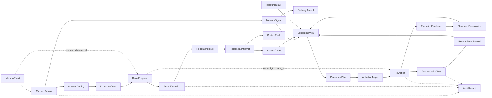

# P3 Observability Correlation Model V0.1

版本：V0.1  
项目：AetherStore P3  
责任域：Shared Runtime Foundation  
主要负责人：沈家隆  
协作负责人：杨鹏通  
计划窗口：2026-10-09～2026-11-27

## 1. 文档定位

本文是 Shared Runtime Foundation 的第三份交付物，定义如何把 Remember、Recall、Operate 和 P2 / Provider 的记录关联成一条可查询的证据链。

它解决的不是“多打印一些日志”，而是要能从一个稳定身份出发回答：

- 这条记忆或表示从哪里产生；
- 哪一次 Recall 发现、校验、加载并交付了它；
- C 根据哪些访问和资源事实生成了什么计划；
- 哪个 `ActuationTarget` 被解析成了哪次动作；
- P2 / Provider 返回了什么反馈和真实放置观察；
- 如果结果未知或不一致，哪个对账任务正在处理；
- 后续访问是否真的命中了调度产生的副本。

本文统一关联字段和查询视图，不定义字段数据类型，不把 AccessTrace、OTel Trace、Runtime Log 和 AuditRecord 合成一类记录。

## 2. 全链路关联图



图中的箭头表示业务关系或证据关联，不表示所有对象由同一个组件写入。`MemoryRecord` 由 B 维护，`AccessTrace` 由真实访问组件产生，`PlacementObservation` 和 `ExecutionFeedback` 由 P2 / Provider 提供，C 维护 `SchedulingView`、`PlacementPlan` 和 `TierAction`，Shared Runtime 维护公共关联和查询能力。

## 3. 统一关联字段

| 字段 | 关联范围 | 由谁产生或维护 | 使用要求 |
|---|---|---|---|
| `request_id` | 一次业务请求的全过程 | 请求入口 | 同一次请求跨 A/B/C/P2 传递；重试不随意新建 |
| `trace_id` | 一次技术调用链 | 运行时 Trace 组件 | 允许采样；关键业务证据不能只依赖它 |
| `span_id` | 某个技术调用片段 | OTel Trace 组件 | 用于定位耗时和错误，不作为业务对象身份 |
| `memory_id` | 一条记忆的稳定业务身份 | B / Remember | 需要与适用版本一起使用 |
| `memory_version` | 记忆主事实版本 | B / Remember | 读取、投影、调度和清理必须核对 |
| `representation_id` | 某个逻辑表示身份 | 表示权威方 | 同一 Memory 的不同表示分别关联和统计 |
| `recall_id` | 一轮召回执行身份 | A / Recall | 关联候选、读取、AccessTrace 和 ContextPack |
| `candidate_id` | 一项 Recall 候选身份 | A / Recall | 关联候选来源和资格校验 |
| `plan_id` | 一份调度计划身份 | C / Operate | 关联输入水位、策略版本和动作 |
| `action_id` | 一次业务动作身份 | C / Operate | 同一次动作的传输重试沿用；新的业务动作才新建 |
| `provider_task_id` | Provider 内部操作身份 | P2 / Provider | 查询、反馈和物理证据的主要入口 |
| `task_id` | 公共异步任务身份 | Shared Runtime + 业务流 | 关联任务状态、尝试、租约和结果 |
| `reconciliation_task_id` | 一项对账任务身份 | Shared Runtime | 关联 Unknown、差异、查询和收口结果 |
| `event_id` | 一条不可变事件事实身份 | 事件生产方 | 重发沿用原身份；消费者按身份去重 |
| `delivery_id` | 某事件面向某消费者的投递身份 | Shared Runtime | 同一事件不同消费者分别记录 |
| `policy_version` | 产生决策时使用的策略版本 | 业务 Owner | 解释 Plan、Action 或预测结果 |
| `model_version` | 产生表示或预测的模型版本 | 对应能力 Owner | 不能和业务版本互相替代 |
| `generation` | Provider 物理代次 | P2 / Provider | 用于判断物理观察和动作前后关系 |
| `route_epoch` | 路由或映射代次 | Provider / 适配层 | 目标变化时不能继续沿用旧映射 |
| `state_revision` | 对象状态修订 | 对象权威方 | 仅按已定义顺序比较 |

## 4. 各阶段必须记录的关联

| 阶段 | 主要对象 | 最少关联 | 关键证据 | 责任方 |
|---|---|---|---|---|
| 记忆形成 | `MemoryEvent`、`MemoryRecord` | `request_id`、`memory_id`、`memory_version`、`event_id` | 主事实提交、版本和权限结果 | B：杨鹏通 / 赵旭东 |
| 内容绑定 | `ContentBinding`、`Artifact` | `memory_id`、`memory_version`、内容版本 | 来源、摘要、完整性和持久化事实 | B：杨鹏通 / 赵旭东；P2 E2：陈晔 / 杨文博 |
| 表示构建 | `ProjectionState`、执行记录 | `memory_id`、`memory_version`、`representation_id`、`model_version`、任务身份 | 输入指纹、Provider 结果、Ready 依据 | B + Recall：杨鹏通 / 赵旭东；陈凯 / 肖宇 |
| Recall 请求 | `RecallRequest`、`RecallExecution` | `request_id`、`recall_id`、`trace_id`、Scope | 请求模式、预算、截止时间和结果终态 | A：陈凯 / 肖宇 |
| 候选处理 | `RecallCandidate`、`RecallCandidateSet` | `recall_id`、`candidate_id`、`memory_id`、`memory_version`、`representation_id` | 来源、搜索完成性、资格检查和版本 | A + B |
| 内容读取 | `RecallReadAttempt`、`ContentLoadResult` | `recall_id`、`candidate_id`、`memory_id`、`memory_version`、来源引用 | 实际加载结果、范围、校验和失败原因 | A + B + Provider |
| Context 交付 | `ContextPack`、`AccessTrace` | `request_id`、`recall_id`、`memory_id`、`memory_version`、阶段 | 条目是否被选中、是否进入交付包 | A：陈凯 / 肖宇 |
| 热度计算 | `AccessTrace`、`SchedulingView` | `representation_id`、访问阶段、发生时间、输入水位 | 去重后的真实访问事实和统计窗口 | C：沈家隆 / 谭旭梁 |
| 计划生成 | `SchedulingView`、`PlacementPlan` | `memory_id`、`representation_id`、观察代次、`policy_version` | 输入快照、目标层级、原因和有效期 | C：沈家隆 |
| 目标解析 | `ActuationTarget` | `plan_id`、`representation_id`、`generation`、目标代次 | opaque target、有效期和影响范围 | C + P2 平台接入：高琛 / 高旭 |
| 动作提交 | `TierAction`、`AsyncTask` | `plan_id`、`action_id`、`task_id`、`provider_task_id`、幂等身份 | 提交载荷、受理结果和权限审计 | C：沈家隆 / 谭旭梁 |
| 结果观察 | `ExecutionFeedback`、`PlacementObservation` | `action_id`、`provider_task_id`、`representation_id`、输入/输出 `generation` | Provider 反馈和实际 Placement | P2 / Provider |
| 对账收口 | `ReconciliationTask`、`ReconciliationRecord` | 原 `action_id`、`plan_id`、最新观察、差异 | 查询结果、比较结果、收口和下一步 | C：谭旭梁；SRF：沈家隆 / 杨鹏通 |

## 5. 三种查询视图

### 5.1 按 `memory_id` 查询

用于回答“一条记忆现在是什么状态、曾经如何被使用、有哪些派生和清理责任”。查询结果至少聚合：

```text
MemoryRecord 当前版本和历史版本
ContentBinding、Chunk、Artifact 和来源证据
ProjectionState、模型/空间及构建任务
MemorySignal、事件序号和各消费者 DeliveryRecord
RecallCandidate、AccessTrace 和 ContextPack 引用
SchedulingView、PlacementPlan、TierAction 和 PlacementObservation
Tombstone、InvalidationRecord、CleanupRecord 和未决任务
```

结果必须标明各记录的来源、版本、记录时间和缺失项。聚合视图不是新的业务主事实。

### 5.2 按 `recall_id` 查询

用于回答“一次召回为什么返回这个上下文，哪些候选实际被使用”。查询结果至少包括：

- 请求模式、Scope、预算、截止时间和终态；
- 候选集合的来源、完成性和候选版本；
- 资格校验、正文加载、失败或降级原因；
- `AccessTrace` 的实际阶段：`retrieved`、`validated`、`loaded`、`selected`、`used_in_context`；
- 最终 `ContextPack`、缺失来源和提交证据；
- 与 `action_id` 的关联，以及关联是否有版本和 Provider 证据。

不能仅凭时间接近、相同 Memory 或相同 Provider 目标，推断一次召回命中了某个调度动作。

### 5.3 按 `action_id` 查询

用于回答“一次调度动作是否真的完成、当前物理状态是什么、是否需要对账”。查询结果至少包括：

```text
原始 PlacementPlan、输入水位、policy_version 和有效期
ActuationTarget、目标解析依据和目标代次
TierAction 状态、幂等身份、提交记录和权限审计
provider_task_id、ExecutionFeedback 和原始错误
提交前与提交后的 PlacementObservation
ReconciliationTask、查询结果、差异和收口决定
后续新动作与原动作的 parent/related 关系
```

`TierAction=Succeeded` 只说明本次动作的完成契约被证据支持，不保证之后没有合法的新动作或放置变化。

## 6. 记录边界

| 记录 | 必须保存 | 不承担 |
|---|---|---|
| `AccessTrace` | 真实业务访问阶段、对象版本、来源和结果 | 不承担技术调用全链路，不证明模型实际采用 |
| OTel Trace | 服务调用、Span、耗时、错误和资源标签 | 不承担不可采样的业务事实和删除屏障 |
| Runtime Structured Log | 诊断步骤、内部判断、异常上下文 | 不作为唯一主事实或动作完成证据 |
| `AuditRecord` | 权限主体、重要决定、前后引用、原因和时间 | 不复制全部正文或高频运行日志 |
| `EventRecord` | 已提交的不可变事件事实和载荷引用 | 不保存某消费者的处理结论 |
| `DeliveryRecord` | 某消费者的接收、处理、重试和确认进度 | 不修改事件事实本身 |
| `ExecutionFeedback` | Provider 对原动作的过程或结果反馈 | 不代替 C 判断业务对账结论 |
| `PlacementObservation` | 某范围和时刻的真实放置观察 | 不代表 C 想要的目标，也不代表动作一定成功 |

## 7. Reconciliation 可观测性

当出现回包丢失、状态未知、观察过期或版本冲突时，必须在同一条关联链上同时保留：

1. 原 `action_id`、原 `plan_id` 和原目标；
2. Provider 操作身份和最后已知反馈；
3. 提交前观察、最新观察及其观察时间；
4. 差异字段和比较规则版本；
5. `reconciliation_task_id`、当前任务状态、租约和下次执行时间；
6. C 的 `comparison_result`、`convergence_decision` 和 `retry_decision`；
7. 若创建新业务动作，新 `action_id` 与原动作的关联原因。

公共任务状态和租约由 Shared Runtime 维护；C 维护调度业务比较和收口结论。两者不能合并成一个含义模糊的状态字段。

## 8. 指标与告警

| 指标 / 告警 | 观测对象 | 关联维度 | 触发后责任 |
|---|---|---|---|
| Signal 积压 | `DeliveryRecord` | `event_type`、消费者、Scope | Shared Runtime 补发；消费者确认业务结果 |
| Projection 缺项 | `ProjectionState`、构建任务 | `memory_id`、版本、表示、模型 | B 判断修复；A/P2 提供机制证据 |
| 长期 Pending / Unknown | `AsyncTask`、`TierAction`、`ReconciliationTask` | 任务、动作、Provider、Scope | 业务 Owner 查询和收口，SRF 提供恢复 |
| 对账未决时长 | `ReconciliationTask` | `action_id`、任务代次、原因 | C 处理比较，超过预算进入人工接管 |
| 删除残留 | `Tombstone`、`CleanupRecord` | 对象版本、清理层次、Provider | B 汇总业务删除，Provider 证明物理清理 |
| 旧版本写回拒绝 | 状态转换和审计 | 对象、版本、执行者 | 对应 Owner 检查并发和失权任务 |
| AccessTrace 覆盖不足 | `AccessTrace` | `recall_id`、阶段、来源、事件时间 | A 补真实观测，C 不补猜热度 |
| Action/Placement 不一致 | `TierAction`、`PlacementObservation` | `action_id`、目标、generation | C 创建对账任务；P2 提供查询证据 |

指标应同时保留事件发生时间、观察时间和记录时间，不能只按到达时间计算业务延迟。关键删除、动作意图和未知结果不得依赖采样 Trace 才能恢复。

## 9. 端到端示例

以下只用于说明关联方式，具体 ID 是示例值。

| 阶段 | 记录示例 | 关联关系 |
|---|---|---|
| 记忆形成 | `memory_id=mem-1001`、`memory_version=v2` | B 提交 `MemoryRecord`，生成 `event_id=evt-2001` |
| 变化通知 | `MemorySignal`：版本更新、`state_revision=r8` | `evt-2001` 投递给 C，形成 C 的 `delivery_id=del-3001` |
| 召回请求 | `request_id=req-4001`、`recall_id=rec-5001` | 通过 `trace_id=trace-6001` 关联 Query、候选和 Context |
| 候选读取 | `representation_id=rep-1001-v2`、阶段 `loaded` | `AccessTrace` 关联 `rec-5001` 和 `memory_version=v2` |
| 上下文交付 | 阶段 `used_in_context` | 条目进入 `ContextPack`；不证明模型采用 |
| 调度输入 | C 保存 `SchedulingView=view-7001` | 汇总 `MemorySignal`、AccessTrace、Placement 和 Resource |
| 计划 | `plan_id=plan-8001`、目标 `desired_tier=hot` | 记录 `policy_version=policy-3` 和输入水位 |
| 目标解析 | `target_id=target-9001` | P2 / Provider 返回 opaque target 和目标代次 |
| 动作 | `action_id=act-10001` | 由 `plan-8001` 派生，具备幂等身份 |
| Provider 反馈 | `provider_task_id=pt-11001`、反馈为 Running | 不直接把 Running 当成成功 |
| 观察与收口 | 新 `PlacementObservation` 显示 hot、`generation=g5` | C 比较输入代次和输出代次，写入成功或差异结论 |
| 后续召回 | 新 `recall_id=rec-12001` 命中同一表示 | 只有有版本、来源和动作证据时，才可关联 `act-10001` |

如果动作提交后回包丢失，`act-10001` 保持 `Unknown`，Shared Runtime 创建 `reconciliation_task_id=rt-13001`；C 查询原动作和最新 Placement。只有确认原动作未产生物理效果且新的业务判断仍成立，才创建新的 `action_id`。

## 10. 责任分工与计划

| 阶段 | 项目日期 | 主要输出 | 责任人 |
|---|---|---|---|
| 关联字段和链路图设计 | 2026-10-09～2026-10-16 | ID 关联、记录边界、查询视图和端到端样例 | 沈家隆 / 杨鹏通；A：陈凯 / 肖宇；B：杨鹏通 / 赵旭东；C：沈家隆 / 谭旭梁 |
| 查询视图与审计关联 | 2026-10-19～2026-11-06 | memory、recall、action 三类查询视图和审计引用 | 沈家隆；杨鹏通协作 |
| 指标、告警与对账观测 | 2026-11-09～2026-11-20 | 积压、Unknown、残留、不一致和旧版本写回告警 | 沈家隆；C：沈家隆 / 谭旭梁；P2：杨文博 / 王广诚 |
| 跨组联调与验收 | 2026-11-23～2026-11-27 | 形成、Recall、调度、反馈、对账的完整证据链 | 陈凯 / 肖宇组织；Remember：杨鹏通 / 赵旭东；Recall：陈凯 / 肖宇；Operate：沈家隆 / 谭旭梁；P2：刘佳正 / 陈晔 / 张晋 / 胡孝阳 / 杨文博 / 徐博文；Shared Runtime：沈家隆 / 杨鹏通 |

| 工作项 | 人天 |
|---|---:|
| 设计 | 4 |
| 开发 | 5 |
| 测试 | 3 |
| 联调 | 2 |
| **总人天** | **14** |

## 11. 验收标准

1. 一条链路可以通过 `memory_id`、`recall_id` 或 `action_id` 查询到相关对象、事件、任务、反馈、观察和审计证据。
2. 同一记忆不同版本、不同表示和不同 Provider 目标不会被错误合并。
3. Recall 的实际访问阶段、C 的计划和动作、P2 的反馈和放置观察分别可见。
4. AccessTrace、OTel Trace、Runtime Log、AuditRecord 和 EventRecord 的边界清晰，任何一类记录缺失时不会用另一类记录伪造事实。
5. Action 回包丢失、Unknown、版本冲突、观察过期和动作后合法再迁移都能在关联视图中解释。
6. 指标和告警可以定位 Signal 积压、Projection 缺项、长期 Pending/Unknown、对账未决、删除残留和 Action/Placement 不一致。
7. 端到端示例中的关联字段从 Remember 贯通到 Recall、Operate、P2 / Provider 和 Reconciliation。
8. 关联模型的公共实现不重复计入 C 组 152 人天；C 只承担自己的业务记录、决策和对账增量。
