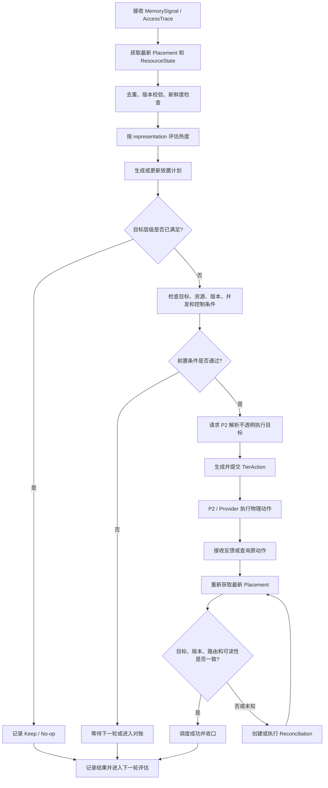
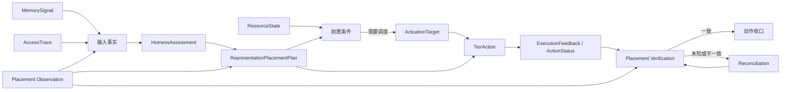

# AetherStore P3 Operate 业务框架节点与 P2 交接说明

版本：V0.1  
编制方：P3 C 组 / Operate  
用途：作为 P3 各业务框架节点汇总文档中的 Operate 部分，供 P2 评审整体分层和交接是否合理。

---

## 1. 文档定位

本文只梳理 Operate 业务的框架节点、节点关系、责任边界和 P2 交接位置。

本文暂不展开：

- 具体字段和字段类型；
- 具体 SDK、RPC 或 HTTP 方法名；
- P2 内部 Provider 的实现细节；
- 具体策略公式和模型算法；
- 最终接口契约和错误码。

这些内容在接口对接和详细设计文档中继续细化。

本文中的“节点”是业务和系统框架节点。一个框架节点后续可以拆成多个服务、任务或接口，也可以由多个节点合并实现，最终以 P2 联调评审结果为准。

---

## 2. Operate 业务要解决什么问题

Operate 负责根据运行过程中产生的事实，判断某个记忆表示是否需要调整存储层级，并把判断交给 P2 执行，最后确认实际结果。

简单说，Operate 要完成：

```text
看到访问和记忆变化
        ↓
判断对象应该放在哪个逻辑层级
        ↓
生成调度计划和调度动作
        ↓
交给 P2 执行真实迁移
        ↓
检查实际是否完成
        ↓
失败或未知时进行对账和恢复
```

Operate 的最终结果不是“发出了一条调度指令”，而是：

> 调度目标、实际执行结果和当前真实放置状态能够相互对上，并且在异常或重启后仍然可以恢复。

---

## 3. Operate 在整体架构中的位置

### 3.1 上下游关系

```text
Remember Runtime（B）
    └─ 提供 Memory 形成、更新和版本变化等事实信号
                 │
                 ▼
Recall Runtime（A） ──写入──> Shared Runtime Trace Store
    └─ 产生访问、命中、加载和上下文使用等事实
                 │
                 ▼
Operate（C）
    ├─ 接收和校验输入事实
    ├─ 计算热度并做放置决策
    ├─ 生成计划和抽象调度动作
    ├─ 请求 P2 执行
    └─ 根据反馈和真实放置完成收口
                 │
                 ▼
AetherEngine P2 / Provider
    ├─ 返回真实放置和资源状态
    ├─ 解析不透明执行目标
    ├─ 承接物理复制、校验、切换和回收
    └─ 返回执行状态和结果证据
```

### 3.2 责任边界

| 参与方 | 主要负责什么 | 不负责什么 |
|---|---|---|
| Remember / B | 产生 Memory 的形成、更新、版本和重要性等事实信号 | 不负责 C 的冷热判断和调度动作 |
| Recall / A | 产生访问和使用事实，并写入共享 Trace；按需要消费在线读取能力 | 不负责后台调层决策和物理迁移 |
| Operate / C | 消费事实、判断目标层级、生成 Plan 和 TierAction、处理反馈、对账和恢复 | 不直接操作 Provider，不修改 B 或 Recall 的事实 |
| P2 / Provider | 返回真实放置和资源状态，解析目标，执行物理步骤，返回执行结果 | 不替 C 决定业务调度策略 |
| Shared Runtime Foundation | 提供跨业务共用的对象状态、关联、幂等、审计和恢复基础能力 | 不替代 C 的调度决策，也不替代 P2 的物理执行 |

---

## 4. Operate 的分层框架

Operate 可以先按六个业务层划分。这里的层是业务处理层，不是 Redis、磁盘或其他物理介质层。

| 层级 | 框架层名称 | 主要职责 | 主要责任方 | 对 P2 的关系 |
|---|---|---|---|---|
| L1 | 输入事实层 | 接收 MemorySignal、AccessTrace 和 P2 状态观察 | B、A、P2 产生；C 消费 | P2 提供真实放置和资源状态 |
| L2 | 事实整理层 | 去重、校验版本、判断新鲜度、补齐缺失事实 | C | C 需要能够识别 P2 返回的过期或未知状态 |
| L3 | 决策计划层 | 汇总热度、比较目标和实际、生成放置计划 | C | P2 提供决策所需的当前真实状态和资源准入事实 |
| L4 | 动作交接层 | 把计划转换为抽象 TierAction，并交给 P2 | C 与 P2 交接 | P2 接收抽象动作并解析执行目标 |
| L5 | 执行确认层 | 获取执行进度、结果和最新真实放置 | P2 执行；C 确认 | P2 必须返回可验证的状态和证据 |
| L6 | 恢复优化层 | 处理 Unknown、超时、反馈丢失、对账和策略优化 | C；Shared Runtime 提供基础支撑 | P2 需要支持原动作查询和状态恢复 |

---

## 5. Operate 框架节点清单

下面是当前建议的框架节点。节点名称用于说明业务职责，不等于最终服务名或接口名。

| 节点编号 | 所属层 | 框架节点 | 主要工作 | 输入 | 输出 | 责任方 |
|---|---|---|---|---|---|---|
| O-01 | L1 输入事实层 | 接收记忆变化事实 | 接收 Memory 形成、更新、版本变化等事实 | Remember 的记忆事实信号 | 待处理的输入事实 | B 产生，C 消费 |
| O-02 | L1 输入事实层 | 接收访问使用事实 | 获取检索、加载、上下文选中和实际使用等事实 | Recall Runtime 的访问记录 | 待处理的访问事实 | A 产生，C 消费 |
| O-03 | L1 输入事实层 | 获取真实放置和资源事实 | 获取当前逻辑层级、版本、路由、可读性、容量和健康状态 | P2 的状态查询结果 | 当前事实快照 | P2 产生，C 消费 |
| O-04 | L2 事实整理层 | 输入去重和关联 | 按业务对象和请求关联输入，避免重复信号重复触发计划 | 记忆信号、访问事实、状态快照 | 可消费的输入事件 | C |
| O-05 | L2 事实整理层 | 版本和新鲜度校验 | 判断事实是否仍对应当前对象，识别过期、缺失和未知 | 输入事实和状态版本 | 有效事实或等待/对账标记 | C |
| O-06 | L3 决策计划层 | 热度评估 | 按 representation 汇总访问和业务重要性，形成热度判断 | 有效访问事实、记忆事实和策略 | 热度评估结果 | C |
| O-07 | L3 决策计划层 | 放置目标决策 | 判断对象希望处于哪个 P3 逻辑层级，以及是否需要保持不变 | 热度、策略、当前放置、资源事实 | 目标层级和决策原因 | C |
| O-08 | L3 决策计划层 | 生成或更新放置计划 | 保存目标层级、当前观察快照、版本、有效期和决策依据 | 放置目标和有效事实 | RepresentationPlacementPlan | C |
| O-09 | L3 决策计划层 | 计划有效性和前置检查 | 检查目标、版本、资源、并发、人工控制和已有动作 | 放置计划、最新状态和控制条件 | Keep/No-op 或允许调度的结论 | C |
| O-10 | L4 动作交接层 | 解析不透明执行目标 | 请求 P2 将抽象对象和目标逻辑层级解析为可提交目标 | representation、目标层级、版本约束 | ActuationTarget | P2 解析；C 保存和转发 |
| O-11 | L4 动作交接层 | 生成并提交调度动作 | 根据有效计划生成唯一 TierAction，并提交给 P2 | 放置计划、执行目标、动作意图 | Submitted、Provider 任务关联或提交失败 | C 提交，P2 接收 |
| O-12 | L5 执行确认层 | 物理执行和阶段反馈 | 承接复制、校验、路由切换和旧副本回收 | 抽象 TierAction | 执行阶段、状态和结果证据 | P2 / Provider |
| O-13 | L5 执行确认层 | 动作结果查询和反馈接收 | 接收或查询执行中、成功、失败和未知结果 | action_id、反馈或查询请求 | ExecutionFeedback / ActionStatus | P2 提供，C 消费 |
| O-14 | L5 执行确认层 | 最终放置核验 | 用最新真实状态核对目标层级、版本、路由和可读性 | 执行结果和最新 Placement | 已确认成功、失败或仍需对账 | C 核验，P2 提供事实 |
| O-15 | L6 恢复优化层 | 异常对账和恢复 | 处理超时、反馈丢失、Unknown、重启和版本冲突 | 原动作、查询结果、真实放置 | Reconciliation 结果或新的重算触发 | C |
| O-16 | L6 恢复优化层 | 策略和结果持续优化 | 根据调度结果、访问收益和资源变化调整策略 | 历史结果、访问收益、资源状态 | 新策略或下一轮评估输入 | C |

---

## 6. Operate 主流程

### 6.1 正常流程



### 6.2 正常流程的简单解释

1. B 或 Recall Runtime 产生新的事实，C 收到或读取这些事实。
2. C 先确认事实没有重复、没有过期，且对象版本一致。
3. C 结合访问情况、业务重要性和当前放置，判断目标逻辑层级。
4. 如果当前已经满足目标，只记录 Keep/No-op，不产生调度动作。
5. 如果当前不满足目标，C 检查资源、版本、并发和人工控制等条件。
6. 条件通过后，C 请求 P2 解析执行目标，生成抽象 TierAction 并提交。
7. P2 在内部完成真实复制、校验、路由切换和回收等步骤。
8. C 获取反馈后，重新读取最新 Placement，确认动作是否真正完成。
9. 如果结果不明确，C 先对账，不能直接重复提交相同动作。

---

## 7. Operate 与 P2 的关键交接点

| 交接编号 | C 做什么 | P2 做什么 | 交接结果 | P2 需要确认的问题 |
|---|---|---|---|---|
| H-01 | 请求对象当前真实状态 | 根据真实 Provider 返回当前 P3 逻辑层级、版本、路由和可读性 | Placement Observation | `current_tier` 是 P3 逻辑层级，不是物理介质名称；物理对象信息作为证据返回 |
| H-02 | 请求当前资源是否允许新动作 | 返回容量、健康、压力、预算、并发和带宽事实 | ResourceState | 资源快照是否有新鲜度，哪些状态会阻止动作 |
| H-03 | 提供抽象对象和目标逻辑层级 | 解析出不透明 ActuationTarget | 可提交的目标引用 | 目标有效期、绑定版本、路由和支持动作是什么 |
| H-04 | 提交抽象 TierAction 和幂等信息 | 接收动作并关联 Provider 任务 | Accepted/Running 或明确拒绝 | 重复提交如何保证不重复执行，版本冲突如何返回 |
| H-05 | 接收反馈或查询原动作 | 返回真实阶段、状态、结果和副作用 | ExecutionFeedback / ActionStatus | 如何区分 Accepted、Running、Succeeded、Failed 和 Unknown |
| H-06 | 重新读取 Placement 并完成对账 | 返回动作完成后的真实放置和证据 | Succeeded、Failed 或继续对账 | 成功是否能被层级、版本、路由和可读性共同证明 |
| H-07 | 在异常情况下查询和恢复 | 保留原动作查询能力，返回真实当前状态 | 可恢复的对账结果 | P2 重启、反馈丢失和 Provider Unknown 后能否按原动作查询 |

---

## 8. Operate 主要业务对象关系

下面只说明对象之间的业务关系，不定义字段级契约。



### 8.1 对象归属

| 对象 | 在 Operate 中的作用 | 产生或拥有方 | Operate 的处理方式 |
|---|---|---|---|
| `MemorySignal` | 表示 Memory 形成、更新或版本变化 | B | 消费、去重和关联，不修改原信号 |
| `AccessTrace` | 表示真实访问和使用事实 | Recall Runtime / Shared Runtime Trace Store | 消费和汇总，不伪造访问事实 |
| `Placement Observation` | 表示 P2 观察到的当前真实放置 | P2 / Provider | 作为当前事实和最终核验依据 |
| `ResourceState` | 表示当前资源和后端健康状态 | P2 / Provider | 用于动作准入，不自行推算替代 |
| `HotnessAssessment` | 表示某个 representation 的热度判断 | C | 计算并保存决策依据 |
| `RepresentationPlacementPlan` | 表示 C 希望达到的逻辑层级 | C | 生成、校验、替代和审计 |
| `ActuationTarget` | 表示 P2 返回的不透明执行目标 | P2 解析；C 保存引用 | 不解析内部 Provider 信息 |
| `TierAction` | 表示一次抽象调度动作及其状态 | C | 生成、提交、跟踪和收口 |
| `ExecutionFeedback` | 表示动作执行过程和结果 | P2 / Provider | 消费、去重并与动作关联 |
| `Reconciliation` | 表示对未知或不一致结果的恢复任务 | C | 查询、对账、恢复或转人工处理 |

---

## 9. Operate 的状态闭环

### 9.1 计划和动作的关系

```text
放置计划：记录“希望对象处于哪一层”
        ↓
调度动作：记录“本次要执行什么调整”
        ↓
执行反馈：记录“P2 做到了哪一步”
        ↓
真实放置：确认“对象现在实际上在哪一层”
```

需要明确：

- `RepresentationPlacementPlan` 是目标计划，不是物理执行结果；
- `TierAction` 是一次动作记录，不等于动作已经完成；
- P2 返回 `Accepted` 或 `Running`，只能说明动作已接收或执行中；
- P2 返回 `Succeeded` 后，C 仍需要重新读取 Placement；
- `Unknown` 不是终态，必须查询原动作并完成对账；
- 如果确实需要重新执行，应创建新的动作记录，不能重复提交旧动作。

### 9.2 C 侧主状态

```text
TierAction.Generated
        ↓
TierAction.Submitted
        ├─→ TierAction.Succeeded
        ├─→ TierAction.Failed
        └─→ TierAction.Unknown
                         ↓
                   Reconciliation
                         ↓
                 Succeeded / Failed / Replan
```

### 9.3 成功判定

Operate 只有同时确认以下事实，才能把调度动作收口为成功：

1. P2 返回动作完成；
2. 实际层级与目标逻辑层级一致；
3. 对象版本或 generation 校验通过；
4. 路由状态符合动作预期；
5. 目标副本可读，且在需要时已经可以提供服务；
6. 释放旧副本时，剩余副本和释放副作用可解释。

---

## 10. 不同动作在框架中的位置

| 动作 | Operate 的业务含义 | P2 需要完成的物理结果 | 默认注意事项 |
|---|---|---|---|
| `Keep / No-op` | 当前实际放置已经满足目标 | 不产生隐式迁移 | 仍可记录当前状态和决策原因 |
| `Prefetch` | 提前建立目标副本，降低后续访问延迟 | 复制并校验目标副本 | 默认不切换路由，不删除源副本 |
| `Promote` | 将对象调整到更适合服务的逻辑层级 | 复制、校验，必要时切换路由 | 是否回收旧副本要由动作语义明确 |
| `Demote` | 将对象调整到较低成本的逻辑层级 | 复制、校验，必要时切换路由并回收旧副本 | 回收前必须确认目标可用和副本安全 |
| `Pin / Unpin` | 固定或解除对象的驻留约束 | 更新驻留保护或调度约束 | 需要受预算和控制规则约束 |
| `Release / Reclaim` | 释放不再需要的副本或资源 | 确认安全副本后回收指定副本 | 不能把成功提交当成已安全释放 |

Operate 只提交抽象动作。动作如何对应到物理复制、校验、路由切换和回收，由 P2 / Provider 承接。

---

## 11. 异常流程框架

| 异常情况 | Operate 的处理 | P2 需要提供的能力 |
|---|---|---|
| 输入重复 | 去重，不重复生成计划和动作 | 能提供稳定的关联标识或查询依据 |
| 输入过期 | 暂不根据旧事实调度，等待新事实或重新查询 | 返回状态时间和版本信息 |
| 目标层级已满足 | 记录 Keep/No-op，不创建动作 | 返回真实当前层级 |
| 资源不足或后端不健康 | 不提交新的非保持动作，等待下一轮 | 返回资源状态、健康状态和拒绝原因 |
| 目标解析失败 | 不提交物理动作，记录原因并等待重算 | 返回明确错误和冲突证据 |
| 提交超时 | 将动作记为 Unknown，按原动作查询 | 支持按原 action_id、任务标识或幂等键查询 |
| 反馈丢失 | 不直接重试，先查询原动作和最新放置 | 保留动作状态和反馈恢复能力 |
| P2 返回 Unknown | 进入对账，不把 Unknown 当成功或失败 | 返回当前真实状态和可查询证据 |
| 版本冲突 | 作废当前计划或动作，重新读取并重算 | 返回冲突的版本或代次信息 |
| P2 重启 | 恢复未收口动作，先查询再决定后续 | 重启后仍可查询原动作 |
| 取消后有副作用 | 核验真实放置、副本、路由和版本 | 返回取消结果和实际副作用 |

---

## 12. P2 评审重点

请 P2 重点确认以下内容：

1. Operate 的六层框架是否能覆盖 P2 需要对接的全部环节；
2. O-03 的 Placement 和 ResourceState 是否可以由现有能力提供；
3. O-10 的 ActuationTarget 是否可以由 P2 统一解析并保持不透明；
4. O-11 的抽象 TierAction 是否可以映射到现有 P2 任务体系；
5. O-12 的 Copy、Verify、Cutover、Reclaim 是否能通过反馈或查询被 C 观察；
6. O-13 和 O-14 是否可以支持动作状态与真实 Placement 的双重核验；
7. O-15 是否可以在超时、反馈丢失、Unknown 和 P2 重启后恢复；
8. `current_tier` 是否统一表示 P3 逻辑层级，而不是暴露物理介质名称；
9. Prefetch、Promote、Demote、Release 等动作的副作用是否能明确区分；
10. 模拟环境和真实 Provider 环境是否可以使用同一套 C 业务语义完成验收。

---

## 13. 当前阶段的交付边界

### 本文档已经明确

- Operate 业务从哪里开始，到哪里结束；
- 六个业务层的划分；
- 16 个框架节点及其上下游关系；
- C、B、Recall、P2 和 Shared Runtime Foundation 的责任边界；
- C 与 P2 的七个关键交接点；
- 正常调度、成功核验和异常恢复的总体路径。

### 后续文档继续明确

- 各接口的实际方法名和契约版本；
- 每个接口的具体请求、响应和错误码；
- 字段级来源、映射和缺失处理；
- P2 模拟环境与真实 Provider 环境的差异；
- 具体热度算法、阈值和策略参数；
- PPR 的测试数据、断言和验收证据。

---

## 14. 一句话总结

Operate 负责“根据事实做出调度决定，并确认调度是否真的完成”；P2 负责“把抽象调度决定转换成真实物理执行，并返回可核验的真实状态”。

