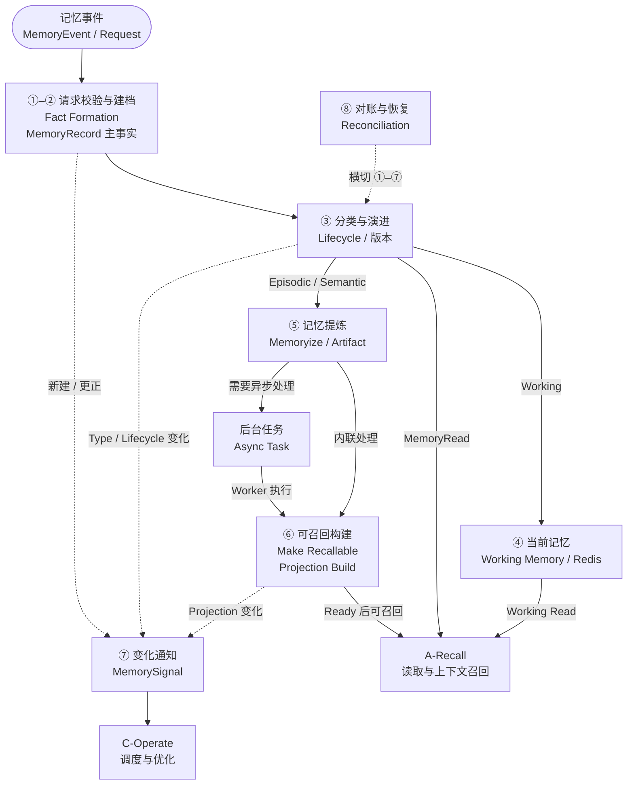

## Remember 主数据流

### 总体流程

Remember 不是只有“写入成功／失败”两个结果的线性 API 链路。它以 `MemoryRecord` 主事实为中心：①–⑥ 形成和演进 Memory，⑦ `MemorySignal` 与⑧ `Reconciliation` 横切全程。

```text
【阶段一：受理与主事实形成】
MemoryEvent / Request
  → Request Validation
  → Fact Formation
  → MemoryRecord

【阶段二：分类、生命周期与当前可用】
  → Classification / Lifecycle
  ├→ Working Memory（Redis）
  └→ Episodic / Candidate / Semantic

【阶段三：长期沉淀与可召回构建】
  → Memoryize / Artifact（按策略）
  → 内联处理 / Async Task
  → Make Recallable / Projection Build
  → Recall Ready

【全链路交接、观测与收敛】
  → Working Read / MemoryRead / Canonical Load → A-Recall
  → MemorySignal → C-Operate
  → Reconciliation（贯穿各阶段）
```

这条链路可归纳为三个主阶段：

```text
受理与主事实形成
  → 分类、生命周期与当前可用
  → 长期沉淀与可召回构建
```

`Working Memory` 服务当前会话／任务；`Async Task` 是长文本、压缩、背压、重建等工作的执行路线，不改变主事实。`MemorySignal` 与 `Reconciliation` 是横切闭环，不是长期 Projection 之后才发生的最后一步。具体状态枚举、Guard、失败出口和恢复动作在后续中展开。



图中不展开 Working、Memory、Task、Projection 和 Signal 的具体状态枚举；其合法转换仍以各阶段表为准。

### Remember 的跨对象状态机编排

Remember 本节采用**组合状态机**写法：每个阶段说明“当前对象组合 → 事件／Guard → 下一对象组合 → 后续处理”。

#### 状态维度与阶段检查点

| 状态对象／维度                  | 承担的阶段含义                                             | 可作为何种检查点                                             | 不应被误当作                                  |
| ------------------------------- | ---------------------------------------------------------- | ------------------------------------------------------------ | --------------------------------------------- |
| `MemoryRecord` 的 Status + Type | 主事实是否仍有效，以及当前是 Working、Episodic 或 Semantic | `Active` 且正文／引用、Scope、version 可追溯，才完成 Fact Formation；Type 决定下一路径 | Task 已创建、Redis 有值或向量已写入的替代品   |
| Redis Working 表示              | 当前 Scope 下的快速临时可读性                              | `Active + Working` 且 Redis 的 version / TTL / 内容已确认，才可 Working Read | 长期向量 Recall Ready                         |
| `Task`                          | 一个耗时派生动作的可恢复执行事实                           | `Pending / Running / Retryable` 说明工作未完成；仅在目标对象经验证后才可 `Succeeded` | Broker 消息、Worker 取件或函数返回            |
| `Artifact`                      | Original / Canonical 的可追溯压缩或提纯表示                | source memory/version、checksum 和质量规则都通过，才可作为指定 Projection 输入 | 新的 Memory Type 或主事实                     |
| `ProjectionState`               | 指定 memory/version 的长期向量可用性                       | `Ready` 需 Provider 结果、对象存在、版本、模型、Schema 与可查询性共同成立 | Provider `READY` 或 Task `Succeeded` 的同义词 |
| `MemorySignal`                  | 向 C 交接的事实变更和使用价值输入                          | `Succeeded` 需匹配版本的消费确认；未 Ack 可保持未决而不回滚 Memory | C 的 Placement / TierAction 状态              |

#### 主链组合状态流转

| 当前组合状态                                                | 事件／Guard                                               | 组合状态转换                                                 | 阶段出口                                         |
| ----------------------------------------------------------- | --------------------------------------------------------- | ------------------------------------------------------------ | ------------------------------------------------ |
| 无 MemoryRecord                                             | Request 已通过校验，必要正文或 `content_ref` 可可靠关联   | `无记录 → MemoryRecord=Active`；随后执行分类                 | 进入阶段二、三；派生对象尚非成功条件             |
| `Memory=Active`，Type 尚未稳定                              | 当前 Session/Task 内容或 Type uncertain，分类选择 Working | `Active → Active + Working`；Redis 写入确认后才成为当前可读  | 进入 阶段四Working Read；不等待 Task/Projection  |
| `Memory=Active + Working`                                   | SessionEnd/TaskEnd 或长期价值 Guard 通过                  | `Active + Working → Active + Episodic`，或创建关联 Episodic 版本 | 进入 阶段五Artifact 与阶段六Projection Build     |
| `Memory=Active`，明确事件／长文本结果满足事件性条件         | 分类 Guard 通过                                           | `Active → Active + Episodic`                                 | 可直接进入长期 Recallability，不必先经过 Working |
| `Memory=Active + Episodic`                                  | 聚合／提纯产生 Semantic Candidate                         | `Episodic 保持 → Candidate`；Candidate 不是 Semantic 主事实  | 等待证据／策略校验                               |
| `Memory=Active + Episodic + Candidate`                      | 证据、Scope、时效与策略 Guard 通过                        | `Candidate → Active + Semantic`；Episodic evidence 保留      | 按策略建立或重建 Projection                      |
| `Memory=Active + Episodic/Semantic`，Projection 缺失／Stale | projection_policy 要求该版本向量召回                      | `Projection: 无／Stale → Pending → Processing/Building`；仅耗时路线同时 `Task: 无 → Pending` | 调用 Provider，等待真实结果                      |
| `Projection=Processing/Building`                            | Provider 成功且 Ready Guard 通过                          | `Projection → Ready`；关联 Task（如有）在目标证据成立后 `→ Succeeded` | 该 memory/version 成为长期向量候选／Recall Ready |
| Memory、Type、Status、Projection 或有效使用发生变化         | Signal 触发事实与版本完整                                 | `Signal: 无 → Pending → Submitted → Succeeded`               | C-Operate 消费事实；不改变 Memory Type           |

#### 失败、Unknown 与版本变化的组合状态流转

| 当前组合状态                            | 事件／观察                                                | 状态转换或保持                                               | 恢复／异常出口                                               |
| --------------------------------------- | --------------------------------------------------------- | ------------------------------------------------------------ | ------------------------------------------------------------ |
| 无 MemoryRecord                         | 输入非法、越权或关键内容无法验证                          | 保持无 Memory；不得创建“半成功” Task／Projection             | 返回稳定错误，由调用方修正后重新提交                         |
| Fact Formation 前的正文／引用结果未知   | Content timeout／Unknown                                  | 保持未确认主事实；不进入 `Memory=Active`                     | 用 `content_ref`、head/get/checksum 查询真实状态；确认后重试或失败 |
| `Memory=Active + Working`（或即将进入） | Redis 写入／读取未确认                                    | Memory 可保持 Active，但**不进入可读 Working**               | 按契约失败或部分接受；Redis/Memory 对账后受控补写            |
| `Task=Pending/Running`                  | Broker 丢消息、Worker 崩溃、心跳超时                      | `Task → Pending/Retryable`；目标 Projection／Artifact 不得误置成功 | Outbox／扫描重新投递；只在目标经验证后 `Task→Succeeded`      |
| `Projection=Pending/Processing`         | Provider Accepted/Pending/Unknown 或调用 timeout          | Projection 保持非 Ready；Memory Active/Type 不回滚           | 查询 operation／对象；必要时 `Task→Retryable`，禁止盲目重写  |
| `Projection=Processing/Ready`           | Provider 明确失败、对象缺失、模型／Schema／version 不匹配 | `Projection → Failed/Stale`；旧 Task 失权或取消              | 按当前有效版本与幂等键创建新 attempt 重建                    |
| 当前 Memory 有新证据、更正、过期或删除  | 新版本或 Status 变化生效                                  | 旧 Memory `→ Superseded/Expired/Deleted`；旧 Projection `→ Stale/删除`；旧 Task `→ Cancelled` | 先从默认 Recall 排除，再异步删除／对账                       |
| `Signal=Pending/Submitted`              | C 未 Ack、Ack 版本不匹配或网络失败                        | `Signal → Retryable`，或保持当前等待状态                     | 使用相同 signal_id/version 补发；Memory 不回滚               |

因此，写入接口只报告“主事实是否可靠形成”以及各对象的当前状态和未决项；长文本等异步路线可按契约返回 `Accepted/Partial`，但 `ProjectionState=Ready`、`Task=Succeeded`、`Signal=Succeeded` 分别是不同对象的事实。它们没有一个可以替代另一个，也没有一个可以代表整条 Remember 主链的全局成功。

每次跨对象推进都要先持久化本阶段输出，再以对象当前 state、版本和乐观并发条件（例如 `state_version`）校验后更新；迟到回调、重复投递和旧版本结果只能被去重、审计或拒绝，不能回退已确认状态。

### 阶段一：Request Validation 与 Canonical Content

本阶段建立身份、Scope、时间、来源、内容和幂等基础。`RequestContext` 是控制封套，不是 Memory 内容；本阶段只决定“输入能否进入 Fact Formation”，**不**决定 Memory Type，也不应在主事实形成前把 Broker 消息或 Task 当作写入成功。

| 当前组合状态                                    | 事件或 Guard                                       | 状态流转                                                     | 后续处理                                                     |
| ----------------------------------------------- | -------------------------------------------------- | ------------------------------------------------------------ | ------------------------------------------------------------ |
| 无 `MemoryRecord`、无 Task、无 Projection       | 身份、Scope、权限、来源、内容和幂等均合法          | 保持无领域对象；形成规范化 `MemoryEvent`、固定 Scope 与 request/trace/idempotency 关联 | 生成／解析 memory_id、version，进入 Fact Formation           |
| 无 `MemoryRecord`、无 Task、无 Projection       | 未认证                                             | 保持无领域对象；返回 `Unauthorized`                          | 由上游完成认证后重新提交                                     |
| 无 `MemoryRecord`、无 Task、无 Projection       | 已认证但无权限、跨 Scope 或 Scope 不完整           | 保持无领域对象；返回 `Forbidden` 或契约错误，不泄露资源存在性 | 拒绝，不触达 Memory、Content、Task                           |
| 无 `MemoryRecord`、无 Task、无 Projection       | 内容为空、结构非法、大小／媒体类型不被当前策略支持 | 保持无领域对象；返回 `Invalid/Contract Error`                | 上游修正后重提                                               |
| 已有相同幂等键对应的 memory/version             | 请求与既有事实完全相同                             | 所有既有对象状态保持；不产生新版本或新 Task                  | 返回既有 Memory、Task、Projection、Signal 的当前状态         |
| 已有相同幂等键对应的 memory/version             | 内容、Scope 或请求语义冲突                         | 所有既有对象状态保持；返回 `Conflict`                        | 由业务方更正或显式建立新版本，不覆盖既有事实                 |
| 无 `MemoryRecord`，输入为长内容或 `content_uri` | 引用可访问，大小／checksum／来源约束可接受         | 保持无领域对象，进入 Fact Formation；尚未以“已入队”代替主事实 | 主事实可靠落点后，才可创建持久化 Task 并投递                 |
| 无 `MemoryRecord`，Content 观察结果为 Unknown   | 必要正文／引用的写入或验证超时                     | `无记录 → 无记录`；不得进入 `Memory=Active`，也不得创建“半成功” Task／Projection | 用 `content_ref`、head/get/checksum 查询真实状态，再决定继续、失败或补偿 |

短期 Working 内容可以由 Redis 保存正文或引用；长内容通常由 Durable Store 保存 Original，而 MemoryRecord／当前运行上下文保存 `content_ref`。这只是正文表示与物理落点，不能据此推断 Memory Type：长文本处理结果可以直接形成 Episodic，Working 也可能只保存引用。

### 阶段二：Fact Formation

输入通过后，B-Remember 才创建 `Active` MemoryRecord 主事实，并保存或引用 Original、来源、证据、Scope、时间、version、Category Hint 与策略版本。这里落实 PRD 的 `Fact First`：先确认可追踪的主事实，再决定分类、压缩、Projection 与 Signal 的同步／异步路径。

Memory Status 在此进入 `Active`；Memory Type 是紧随其后的分类结果：当前／不确定内容按 Working 管理，已确认事件可直接为 Episodic，Semantic 只能在 Candidate 校验后形成。

| 当前组合状态                                                 | 事件或 Guard                                         | 状态流转                                                     | 后续处理                                                     |
| ------------------------------------------------------------ | ---------------------------------------------------- | ------------------------------------------------------------ | ------------------------------------------------------------ |
| 无 `MemoryRecord`，必要正文或可验证引用、Scope、来源、version 已可靠落点 | 主事实可被重启后的 Runtime 重新读取与追踪            | `无记录 → MemoryStatus=Active`；Type 尚待阶段三分类；Task／Projection 仍非成功条件 | 进入阶段三判定 Type 与生命周期                               |
| 无 `MemoryRecord`，Original／canonical 引用尚未确认          | 无法证明该 Memory 可追溯                             | `无记录 → 无记录`；不确认 `Active`，不报告写入成功           | 回到阶段一的 Content 对账，确认后重试 Fact Formation         |
| `Memory=Active`，目标 Type 为 Working                        | 当前 Working 的 Redis 写入未确认                     | `Memory=Active` 保持；Working 可读状态尚未形成               | 记录未就绪原因；由阶段四补写／对账 Redis，按契约返回失败或部分接受 |
| 已存在相同 memory/version                                    | 重复请求／重复投递，且 idempotency_key 一致          | Memory、Task、Projection 保持既有状态                        | 返回既有主事实及对象状态，不重复创建长期工作                 |
| 旧 `Memory=Active(version=n)`                                | 更正或新证据可形成可追溯的新版本                     | `Active(n) → Superseded(n)`；创建 `Active(n+1)` 或关联派生 Memory | 对新版本重新分类；旧 Projection／Task 按版本失效             |
| `Memory=Active` 已确认                                       | 分类、压缩、Embedding、Projection 或 Signal 随后失败 | `Memory=Active` 保持；派生对象各自进入 `Pending / Retryable / Failed / Stale` | 由对应 Task／Reconciliation 收敛；主事实不回滚               |

进程内缓存、请求已发送、消息已入队、Task 已创建或向量已生成都不能代替主事实的可靠形成。

### 阶段三：Classification 与 Lifecycle

Classification 在 Active MemoryRecord 形成后判定当前 Memory Type，并在 Session/Task 阶段变化、新证据、内容更正、跨 Session 复用或策略升级时重新判定。Memory Type 与 Memory Status 正交：Type 表示当前业务角色，Status 表示主事实是否仍然有效。

| 当前组合状态                            | 事件或 Guard                                               | 状态流转                                                     | 后续处理                                                     |
| --------------------------------------- | ---------------------------------------------------------- | ------------------------------------------------------------ | ------------------------------------------------------------ |
| `Memory=Active`，Type 未定或待重判      | 当前 Session/Task 仍在推进，内容快速变化                   | `Active → Active + Working`                                  | 保留 Scope、version、TTL、当前目标／约束／中间状态，进入阶段四Redis Working 路径 |
| `Memory=Active`，Type 未定或待重判      | Type 暂时无法可靠判定                                      | `Active → Active + Working(uncertain=true)`；不新设第四种 Type | 保存 uncertainty、classification_source、policy_version、判定时间；等待新证据再次分类 |
| `Memory=Active`，Type 未定或待重判      | 已确认事件、任务过程、交互结果或长文本处理结果具有时间边界 | `Active → Active + Episodic`，可为同一版本或带 lineage 的派生记录 | 保留 Original／正文、时间窗口、Session/Task、来源和 evidence；必要时进入 Artifact／Projection |
| `Memory=Active + Working`               | SessionEnd／TaskEnd，且通过长期价值判断                    | `Active + Working → Active + Episodic`，或形成关联 Episodic  | 保存巩固原因、来源、旧／新版本关系；进入长期 Recallability；SessionEnd 本身不等于 Archived |
| `Memory=Active + Working`               | 失去当前用途且无长期价值                                   | `Active + Working → Archived` 或 `Expired`                   | 保存 TTL／策略／判定证据；从默认 Recall 排除，按保留策略清理 |
| `Memory=Active + Episodic`              | 满足稳定复用的候选条件                                     | `Active + Episodic → Active + Episodic + Candidate`；Candidate 不是第四种 Memory Type | 保存 Candidate 输入、独立证据、有效期、策略版本；进入证据／策略校验，不得直接标为 Semantic |
| `Memory=Active + Episodic + Candidate`  | 证据、Scope、时效和策略 Guard 全部通过                     | `Candidate → Active + Semantic`；Episodic evidence 仍保留    | 保存 derived_from/evidence、confidence、stability、Scope、valid_to；可按策略建立／重建 Projection |
| `Memory=Active + Episodic + Candidate`  | 证据不足、来源不独立或时效不足                             | `Candidate → 无 Candidate`，保持 `Active + Episodic`         | 保存不通过原因和已有 evidence；后续新证据可再次触发 Candidate |
| `Memory=Active + Episodic` 或 Candidate | 多来源冲突且不能判定真值                                   | Memory Type／Status 保持；增加 Conflict 关系，不静默覆盖     | 保存双方来源、版本、冲突证据；Recall 仅能按 A 的规则显示 Conflict/Degraded |
| 当前有效 `Memory(version=n)`            | 明确更正、新版本、过期或授权删除                           | `Active(n) → Superseded / Expired / Deleted`；如有新事实则创建 `Active(n+1)` | 保存 lineage、原因、时间、审计；旧 Projection／Task／Signal 按版本失效、取消、清理或补发 |

分类／巩固结果必须记录 `classification_source`、`policy_version`、判定时间和不确定性。TTL、证据门槛、权重、Category 词表与阈值由版本化 Policy/Profile 冻结；实现不得把 Type 流转误解为 Redis、正文库或向量库之间的物理搬迁。

### 阶段四：Working 可用与 Async Task

这里有两条并行语义：Working 路径保证当前 Scope 的快速可用；Async Task 路径承载不能在当前 deadline 内可靠完成的派生工作。Async 不是 Projection 的前置条件，Working 也不等待长期处理。

**Working 当前可用：**

| 当前组合状态                                                 | 事件或 Guard                                      | 状态流转                                                     | 后续处理                                                     |
| ------------------------------------------------------------ | ------------------------------------------------- | ------------------------------------------------------------ | ------------------------------------------------------------ |
| `Memory=Active + Working`，Redis 表示尚未确认                | Redis 写入成功，且 Scope/version/TTL 与当前值一致 | `Working 未确认 → Working 当前可读`；Memory Status/Type 不变 | 当前 Session/Task 可通过受控 Working Read 使用；后续可触发巩固 |
| `Memory=Active + Working`，Redis 表示尚未确认或读取结果 Unknown | Redis 写入、读取或版本校验未确认                  | `Memory=Active + Working` 保持，但 `Working 当前可读` 不成立 | 返回明确失败或部分可用语义；按 Redis/Memory 对账补写，不伪装为成功 |
| `Memory=Active + Working`，Redis 有旧／异常表示              | Scope、Permission、TTL 或 version 不匹配          | `Working 当前可读 → 当前读取候选排除`；Memory 主事实不因此回滚 | 不泄露跨 Scope 内容；等待新版本或重新写入                    |
| `Memory=Active + Working`                                    | SessionEnd／TaskEnd                               | 不直接改变 Memory Status；进入 `Working → Episodic / Archived / Expired` 的分类判定 | 回到阶段三；保持 Working、转 Episodic，或 Expired/Archived   |

Working 不等待 Celery、Milvus、Embedding、压缩、Projection 或 C-Operate。

**Async Task 派发与执行：**

当处理涉及长文本、提纯、压缩、批量、背压、重建、补发，或内联调用超出 deadline／Provider 返回 Accepted、Pending、Unknown 时，B-Remember 在主事实可靠形成后持久化 Task，再投递执行通道。短 Episodic/Semantic 若在 deadline 内完成 Projection 与 Ready Guard，可以不创建 Task。

| 当前组合状态                       | 事件或 Guard                                                 | 状态流转                                                   | 后续处理                                                     |
| ---------------------------------- | ------------------------------------------------------------ | ---------------------------------------------------------- | ------------------------------------------------------------ |
| 主事实已确认，尚无 Task            | 长文本、提纯、压缩、批量、背压、重建、补发，或内联超过 deadline／Provider 返回 Accepted/Pending/Unknown | `无 Task → Pending`，再写 Outbox；目标 Memory 保持既有状态 | 记录 target_id、target_version、operation、idempotency、trace、优先级和重试预算；可向调用方返回 task_id |
| `Task=Pending`                     | Worker 获得有效租约                                          | `Pending → Running`                                        | 记录 attempt、步骤、心跳、租约和输入版本；执行目标操作，不以取件代替成功 |
| `Task=Running`，目标对象尚未被证实 | Artifact／Projection／Signal 已真实完成并校验                | `Running → Succeeded`，且目标对象已先到达其可证明状态      | 保存目标版本、checksum／Provider 证据／Ack；回写 Task 完成事实 |
| `Task=Running`                     | 瞬时错误、Worker 崩溃或依赖短暂不可用                        | `Running → Retryable`                                      | 保存最后检查点、错误分类、retry_after；有界退避后回到 `Pending/Running` |
| `Task=Running` 或 `Retryable`      | 永久错误或预算耗尽                                           | `Running/Retryable → Failed`                               | 保留 Memory 主事实；告警、人工或后续新版本修复               |
| `Task=Pending/Running/Retryable`   | 新版本、删除或人工取消                                       | `Pending/Running/Retryable → Cancelled`                    | 校验当前版本是否仍有效；旧 Task 不得覆盖新版本               |
| `Task=Pending/Retryable`           | 超过有效窗口                                                 | `Pending/Retryable → Expired`                              | 依据价值／有效期策略，不无条件追赶低价值历史工作             |

| 对象   | 作用                                                 | 不可替代的边界                                               |
| ------ | ---------------------------------------------------- | ------------------------------------------------------------ |
| Task   | B-Remember 持久化的后台工作记录                      | 是任务状态、目标版本、重试和恢复的业务事实                   |
| Broker | 暂存／转发队列消息                                   | 不是 Task 的事实来源；即使采用 Redis，也须与 Working Memory 隔离 key/stream、TTL 和权限边界 |
| Worker | 监听队列并执行压缩、Embedding、Projection 等后台工作 | 取到消息或函数返回不等于 Task Succeeded                      |
| Celery | 组织投递、Broker 与 Worker 的框架                    | 不拥有 B-Remember 的 Task/Projection 领域状态                |

Broker 消息丢失不能导致 Task 消失：B-Remember 通过 Task、Outbox 和 Reconciliation 重新投递或收敛；反过来，Task 存在也不等于 Worker 已完成执行。

### 阶段五：Memoryize 与 Compression Artifact

Memoryize 从当前有效的 Original／canonical Memory 生成可追踪的提纯或压缩 Artifact。Artifact 是派生表示，不改变 Memory Type，也不能替代主事实或来源证据；只有当前版本、可校验且质量合格的 Artifact，才可按策略作为 Projection 输入或长期读取回退。

Artifact 至少关联 source memory_id/version、task_id、policy_version、Original／compressed bytes、checksum、quality result 和 created_at。

Artifact 没有被冻结为独立的领域状态机；下表的“无／候选／可用／失效”只表达它能否作为当前 Projection 输入。正式可恢复的执行状态仍由 `Task` 承担。

| 当前组合状态                                     | 事件或 Guard                                   | 状态流转                                                     | 后续处理                                                     |
| ------------------------------------------------ | ---------------------------------------------- | ------------------------------------------------------------ | ------------------------------------------------------------ |
| `Memory=Active + Episodic/Semantic`，无 Artifact | 当前策略不要求提纯／压缩                       | `Artifact=无` 保持；Original／canonical 仍是当前有效输入     | 不创建 Artifact 不是失败；Projection 可按策略直接使用 Original |
| `Memory=Active + Episodic/Semantic`，无 Artifact | 当前有效 Original 可读取，内联或 Task 处理开始 | `Artifact: 无 → 候选（未验证）`；若走后台路线同时 `Task: 无 → Pending` | Artifact 与 source memory/version、policy 绑定，不得脱离来源单独使用 |
| Artifact 候选，source memory/version 仍有效      | 压缩结果已持久化，checksum 与质量规则通过      | `Artifact: 候选 → 当前可用`；Memory Type/Status 保持         | Artifact 可作为指定 Projection 输入或可读表示；进入阶段六或按 Policy 保留 |
| Artifact 候选                                    | 质量不足、checksum 不一致或引用错误            | `Artifact: 候选 → 拒绝／隔离`；不得成为 Projection 输入      | 保留 Original，记录质量原因，允许重新生成                    |
| Artifact 候选，关联 `Task=Running`               | Worker／Provider 瞬时失败                      | `Task: Running → Retryable`；Artifact 保持未验证，不可使用   | 有界重试或后续 Reconciliation                                |
| 当前可用或候选 Artifact                          | 永久失败、source/version 变化或删除            | `Artifact: 当前可用／候选 → 失效或待清理`；关联 Task 进入 `Failed/Cancelled`（如有） | 不影响 Active 主事实；只为当前有效版本重建，或按保留策略清理旧 Artifact |

合同指标为 `Compression Ratio = Original Persisted Bytes / Compressed Persisted Bytes >= 5x`。Metadata、Vector 和索引开销是否进入分子／分母，必须在 Acceptance Profile 中书面冻结。

### 阶段六：Make Recallable 与 Projection Build

长期 Projection 是当前有效 Episodic / Semantic 进入向量召回的写路径；它不只服务长文本异步处理。已确认的普通事件直接形成 Episodic、Working 巩固为 Episodic、长文本处理结果及 Semantic 都使用同一套 `ProjectionState + Ready Guard`。它不是 Working 当前读取路径，也不是 A-Recall 的在线 Query／Context Assembly。

构建时，B-Remember 选择当前有效 Memory/version 与合法输入（Original 或指定质量合格的 Artifact），以 Passage Usage 调用 A 的 Embedding／VectorProjection 能力，再依据 ProviderResult 与 Ready Guard 维护领域 ProjectionState。

| 当前组合状态                                                 | 事件或 Guard                                                 | 状态流转                                                     | 后续处理                                                     |
| ------------------------------------------------------------ | ------------------------------------------------------------ | ------------------------------------------------------------ | ------------------------------------------------------------ |
| 当前有效 `Memory=Active + Episodic/Semantic`，Projection 不存在或为 Stale | `projection_policy` 要求向量召回                             | `无 Projection / Stale → Pending`；选择内联或 Task 路线      | 记录 memory_id、chunk_id、memory_version、model_version、projection_schema_version 的幂等关联 |
| `Projection=Pending`                                         | 开始 Embedding／向量写入                                     | `Pending → Processing`（工程冻结名：`Building`）             | 验证输入正文／Artifact 来源、目标模型、Schema、维度、operation/attempt；等待 ProviderResult |
| `Projection=Processing/Building`                             | 内联 Provider 成功且 Ready Guard 通过                        | `Processing/Building → Ready`；没有 Task 也合法              | 验证当前 memory/version、checksum、metadata、对象存在与可查询性；当前版本成为长期向量候选 |
| `Projection=Pending/Processing`                              | Provider 返回 Accepted/Pending，或内联超过 deadline／背压    | `Pending/Processing` 保持非 Ready；若需后台继续，则 `Task: 无/Retryable → Pending` | 保存 task_id、operation、最后观测状态与重试预算；前台结束，Worker／对账继续 |
| `Projection=Pending/Processing`，Provider 观察结果为 Unknown | Provider timeout、断连或回调缺失                             | Projection 保持 `Pending/Processing` 且非 Ready；不得以 Unknown 推进 Ready | 保存 last_confirmed_state、operation/object 查询证据；先查询真实 Provider 状态，禁止盲目重复 upsert |
| `Projection=Processing/Building`                             | Provider 明确失败                                            | `Processing/Building → Failed`；关联 `Task: Running → Retryable`（若可恢复） | 保存稳定失败原因、版本与影响范围；主事实保留，新 attempt 可从 `Pending/Building` 重建 |
| `Projection=Pending/Processing/Ready`                        | Memory、Artifact、模型或 Schema 产生新版本，或 Ready 对象缺失 | `Pending/Processing/Ready → Stale`；旧 `Task → Cancelled` 或失去写回权 | 保存当前版本、旧／新幂等键和删除／失效原因；只为当前有效版本重建 |

只有 B-Remember 可以把 `ProjectionState` 置为 `Ready`。A／Provider 的 `ProviderResult=READY` 只是机制层成功证据；同一个 ProjectionState 状态机同时覆盖内联与异步路线，二者的差别只在执行与恢复方式。

### 阶段七：MemorySignal

B-Remember 向 C-Operate 发送描述 Memory 事实与使用价值变化的 `MemorySignal`。新建、Type／Status 变化、内容更正、Projection 状态变化与可证明的有效使用都可以触发 Signal；实际热度、PlacementPlan 与 TierAction 仍由 C-Operate 决定。

Signal 至少携带 memory_id/version、Type、importance、lifecycle、Scope 摘要、最近有效访问、唤醒频次、Context 使用、signal_id/version 和 trace。AccessTrace 是访问事实，不等同于 Signal；B-Remember 只能在有证据时把它作为 Signal 或衰减输入，不能伪造访问。

| 当前组合状态                                                 | 事件或 Guard                                              | 状态流转                                     | 后续处理                                                     |
| ------------------------------------------------------------ | --------------------------------------------------------- | -------------------------------------------- | ------------------------------------------------------------ |
| 无当前 Signal；触发的 Memory／Projection 事实、版本和 Scope 完整 | 新建、Type／Status/版本/Projection 变化或可证明的有效使用 | `无 Signal → Pending`，并写入 Outbox         | 固定 signal_id/version、event 类型和来源 version；等待发送   |
| `Signal=Pending`                                             | 已发送或 C 已受理                                         | `Pending → Submitted`                        | 保存投递时间、幂等键、最后观测状态；不等于已消费，等待 Ack   |
| `Signal=Submitted`                                           | C 确认消费了匹配版本                                      | `Submitted → Succeeded`                      | 保存 acknowledgment、consumer、消费版本与时间；Signal 闭环完成 |
| `Signal=Submitted`                                           | Ack 迟到、版本不匹配或重复                                | `Submitted` 保持；旧 Ack 不得覆盖当前 Signal | 校验 signal_id/version 与消费证据；去重、审计，必要时继续等待当前版本 Ack |
| `Signal=Pending/Submitted`                                   | C 或网络暂时不可用                                        | `Pending/Submitted → Retryable`              | 保存失败分类、retry budget、下一次尝试；同一 signal_id/version 幂等补发 |
| `Signal=Retryable`                                           | 通道恢复且预算允许                                        | `Retryable → Pending/Submitted`              | 以同一 signal_id/version 恢复投递或查询已受理状态，不创建重复 Signal |
| `Signal=Pending/Retryable`                                   | 永久错误或预算耗尽                                        | `Pending/Retryable → Failed`                 | 保存错误与影响范围；告警／人工处理，不回滚 Memory 或 Projection |

B-Remember 不决定 Promote、Demote、Prefetch、Pin 或 Keep/No-op；C-Operate 的物理 Tier 变化也不改变 Working/Episodic/Semantic。

### 阶段八：Reconciliation、AccessTrace 与再次收敛

Reconciliation 由 Content／Provider Unknown、timeout、版本不一致、Ready 但对象缺失、Task/Artifact 不一致、Signal 未确认、重启、删除清理和长期 Pending 触发。它在所有阶段横切执行：先读取 B-Remember 当前权威主事实，再查询 Redis、Content、Vector、Worker 或 C 的真实状态，比较 ID、version、checksum、model、schema、状态与有效期，然后选择补偿并再次验证。

| 当前组合状态                                                 | 事件或观察                                             | 状态流转／补偿                                               | 收敛要求                                            |
| ------------------------------------------------------------ | ------------------------------------------------------ | ------------------------------------------------------------ | --------------------------------------------------- |
| Content 观察结果为 `Unknown`，Memory 尚未确认或已引用该内容  | `content_ref`、head/get、checksum、Memory 当前 version | `Unknown → durable confirmed / absent`；确认后补登记，未形成 Active 时才可继续 Fact Formation；不存在则重写或标记失败 | 不把 timeout 当成功，也不把未知当永久失败           |
| `Projection=Pending/Processing`，ProviderResult 为 `Unknown` 或回调缺失 | operation、对象、model/schema、最后确认状态            | `Projection` 只能恢复为可证实的 `Pending/Processing/Ready/Failed`，或保持对账；Unknown 不得直接变 Ready | 未确认前 Projection 不得 Ready，禁止盲目重复 upsert |
| `Projection=Ready`，但后端向量对象缺失／不匹配               | 当前 Projection 幂等键、对象 metadata、可查询性        | `Ready → Stale`，再重建／补登记／人工处理                    | A 只可使用版本匹配的 Ready Projection               |
| `Task=Succeeded/Running/Retryable` 与 Artifact／Projection／Signal 实际结果不一致 | Task target/version、Worker 心跳、目标对象真实状态     | `Task=Succeeded →` 仅在目标证据存在时保持；否则改为 `Retryable/Failed/Cancelled`；目标 Projection 可进入 `Failed/Stale` | Task=Succeeded 必须有目标对象证据                   |
| `Task=Pending/Running/Retryable`，Worker 重启、租约丢失或长期 Pending | Task 状态、attempt、心跳、Outbox、当前版本             | `Running → Retryable` 或 `Pending → Pending` 后重新投递；仅一个 Retry Owner 可接管 | 不能重复并发执行同一有效幂等操作                    |
| 当前有效 `Memory(version=n)`，出现新证据、更正、模型／策略升级 | 当前 Memory version、lineage、Policy、模型/Schema      | `Active(n) → Superseded(n)`（若新版本生效）；旧 `Artifact/Projection → Stale`，旧 `Task → Cancelled/失权` | 新版本重新分类；迟到结果不得覆盖新版本              |
| `Memory=Expired/Deleted`，但 Redis、正文、Artifact 或 Projection 仍有残留 | Memory Status、tombstone、各表示的删除结果             | 逻辑 Recall 排除保持；相关 `Projection → Stale/删除待完成`，Working 表示失效，物理清理异步推进 | 清理失败可重试／告警，保留审计证据                  |
| `Signal=Pending/Submitted/Retryable` 长期未 Ack              | signal_id/version、Outbox、C 的消费证据                | `Pending/Submitted/Retryable → Pending/Submitted`（同 ID/version 补发），或在预算耗尽后 `→ Failed` | Memory 不回滚，Signal 结果可解释                    |
| 有可信 Recall／Context 实际使用                              | 可信 AccessTrace、Scope、memory/version                | 更新允许的衰减／价值输入；如触发交接，则 `Signal: 无 → Pending` | B 不改写 A 的 Context Pack 结果或 C 的调度决策      |

统一原则：先读真实状态，再补偿；同一调用边只有一个 Retry Owner；迟到结果不得覆盖新版本；Unknown 不等于 Failed，不盲目重复副作用操作。无法自动收敛时保留可解释未决状态、告警与人工入口，而不是伪造成功。