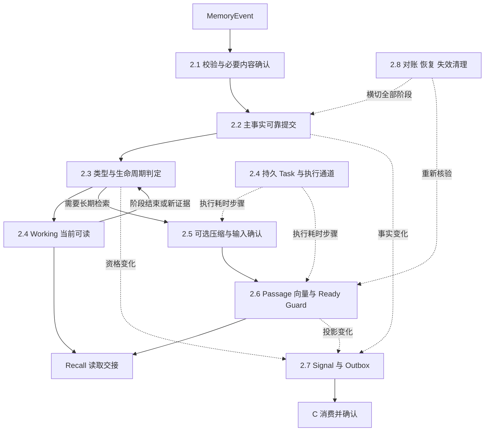

# 记忆形成流程详细设计 V0.1（开发精简版）

整理日期：2026-09-07。责任范围：Remember Runtime（B）。本文说明 MemoryEvent 如何形成可靠主事实、提供当前 Working、完成长期可召回构建，并在故障和生命周期变化后收敛。字段唯一定义见[记忆形成数据定义](记忆形成数据定义_V0.1.md)；外部确认状态只在本文第 7 章维护。

本版是整理后的本地设计基线。沿用已有 Owner、Port 和业务不变量；新增字段、提交方式和参数约束是供评审的具体方案，不表示接口已获签收或系统已经实现。原材料之间的冲突和本版处理见[审查记录](审查记录_V0.1.md)。

## 1. 要实现什么、边界在哪里

Remember 接收业务事件、可信身份、Scope、来源、时间和幂等信息，建立 MemoryRecord 主事实。它以两种能力交给 Recall：当前 Working 可读；当前有效长期版本的正文与 Projection 已具备可核验的可召回资格。Recall 从 Query 开始，对候选检索、排序和最终 ContextPack 负责。

**主事实可靠形成表示“可靠保存了一项声明及其来源”，不表示声明一定真实。** Semantic 仍需证据和策略校验。Working、Episodic、Semantic 是类型；Active 等是生命周期；Artifact、Projection、Working 副本是表示；Task 是执行记录。它们不能互相代替。

| 归属 | 谁定义什么 |
|---|---|
| Remember Runtime（B） | Memory 身份、版本、类型、生命周期、来源、证据、内容映射、Working 资格、Task、Artifact 资格、ProjectionState、Signal 和业务恢复 |
| A 的 Semantic Embedding 与向量机制 | Passage/Query 向量化、模型契约、向量合法性、VectorProjectionPort 和 ProviderResult 适配；不改 B 的 ProjectionState |
| Recall Runtime（A） | Query 到 ContextPack；消费 B 的资格、语义策略和内容映射，最终发出前复核 |
| Operate Runtime（C） | Signal/访问事实消费、热度、表示驻留计划、预热及 TierAction；不修改 Memory Type/Status |
| P2 / 对应 Provider | 正文和向量的物理字节、对象版本、持久化、查询可见性、删除及操作结果 |
| RF / Infra | 可信身份和基础状态机制、共享遥测 Schema/摄取、持久化与执行通道；实际承接者按第 7 章确认 |
| 上游 / P4 网关 | 提交业务载荷、转交结果；不把网关受理、HTTP 成功或队列接收当作业务完成 |

本地采用 **W1 + L1 作为评审基线**：事务状态库保存主事实、小型可靠正文快照、映射和待办；长正文与 Artifact 经 Durable Content Provider；Redis 保存可重建的当前 Working。数据库选型及事务保证仍待 AL-B01。W2（Redis 作为唯一事实落点）需额外证明持久性、防淘汰、原子性和恢复，未获确认不启用。

Working Redis 与 Prewarm Redis 按 PRD §4.4.16、功能验收中的**独立实例**要求准备正式联调；早期“共享基础设施、逻辑隔离”表述仍列 AL-RF03，由项目方统一口径。Broker 即使也用 Redis，也须独立资源与生命周期；不能用名称隔离代替正式实例要求。

阅读顺序：第 2 章看步骤，第 3 章看结果与故障，第 4、5 章看交付与依赖，第 6 章看使用、遗忘和表示变化，第 7、8 章看待决问题与验收。

## 2. 主链路怎么实现（B-03）

八节对应 Remember V2.0 的八个阶段，采用 Recall 参考稿的“本节解决什么 → 例子 → 五步处理 → 开发对照”写法。阶段是职责分解，不是八个全局执行状态；Signal 与对账横切全程，Working 路径可以先返回，压缩可以跳过。

贯穿例子：当前任务记录“本次报告使用 UTC 时间”；任务结束后，将该约定及执行结果形成 Episodic。多次独立、获准证据支持长期规则时，再形成 Semantic。文中的记忆和标识均为流程示例。

### 2.1 校验请求并固定内容

**本节解决“能否受理，收到的究竟是哪一份内容”**。先验证调用和内容，再进入主事实提交；超时未决的正文不能被包装成已接受的 Memory。

例子中，上游提交当前报告任务的一条约定。它是业务事件；Worker 心跳、Provider 查询和技术日志不自动变成 MemoryEvent。

**第 1 步：接收业务载荷与控制封套**

读取内容或受管理引用、source/source_event、发生时间、Scope 和可选 Hint；RequestContext 提供 request_id、trace_id、deadline、身份和幂等信息。业务任务标识用 scope.business_task_id 表达，后台任务用 async_task_id，避免同名混用。

**第 2 步：检查权限、范围与输入边界**

验证身份和 Memory.Write 权限，检查租户、项目、Agent、Session/业务任务归属。内容类型、大小、编码和时间必须在已加载 Profile 内。外部 content_uri 只能由获准连接器访问，校验引用读取权限和允许来源，不直接抓取任意地址。更正或删除另验目标权限和 expected_memory_version。

**第 3 步：绑定幂等身份并固定输入指纹**

在同一租户及调用身份域中原子登记幂等键、规范化规则版本和语义指纹。指纹包含操作、内容身份、来源、Scope、业务时间、Hint 和版本前置条件，不含每次变化的 trace_id、网络 deadline。相同请求复用已有 operation_id/memory_id；同键异义返回 Conflict。重试仍重新授权，不因旧授权结果已保存就放行。

**第 4 步：确认本次必要正文或精确引用**

小内容走 W1 时固定正文、编码、字节数和摘要，随第 2.2 节本地事务落地；长内容走 L1 时，先保存 ContentWriteIntent，再调用 ContentStorePort，核对精确对象版本、摘要覆盖范围、持久性与可读证据。用户给出的可变 URL、一次 HEAD 或裸 ETag 均不足以证明受管理的正式正文。

**第 5 步：形成规范请求，或保留未确认操作**

所有必要验证通过后保存 RememberRequest 和内容绑定，进入第 2.2 节。正文写超时只把对应操作观察记为 unknown，保存原操作身份，交第 2.8 节查询；此时没有已确认 Memory，也不创建“主事实已形成”的长期 Task。可查询 operation 是恢复入口，外部如何查询待 AL-RF01，不在本文新增公共 API。

**开发对照：字段、错误处理与接口（第一次阅读可以跳过）**

**本节产物。** [RememberRequest、RememberOperation](记忆形成数据定义_V0.1.md#request)、[ContentWriteIntent、ContentBinding](记忆形成数据定义_V0.1.md#content)。原始内容受控保存；普通日志只记 ID、摘要和原因。

**调用与校验。** BI-01 接入授权、BI-02 状态/幂等、BI-03 ContentStorePort（OBJ-001）。未认证、越权、输入错误、幂等冲突分别映射统一错误类，不能返回空 Memory。参考 AL-B01、AL-P201、AL-P202、AL-RF01。

**失败与恢复。** B 为内容业务重试 Owner；结果未知先查操作与精确对象。只有明确未执行且仍满足同操作重试保证时才重写。单次 not_found 在可见性窗口未结束时不证明未写。相关原因：RM_INPUT_INVALID、RM_SCOPE_DENIED、RM_IDEMPOTENCY_CONFLICT、RM_CONTENT_UNKNOWN。

**阶段出口。** 有效规范请求和可靠内容准备证据进入 2.2；拒绝不产生可用主事实；未决操作由 2.8 收敛。

### 2.2 形成主事实并确认提交

**本节解决“何时可以说这条 Memory 已可靠保存”**。MemoryRecord 的身份、正文、来源、权限和恢复入口都须存在，单独创建一个 ID 不算完成。

例子中，约定的小型正文与主事实在 W1 事务状态库保存；如果输入是一份大报告，则先确认 E2 正文，再提交引用映射。

**第 1 步：固定事实身份与新旧关系**

新事件分配稳定 memory_id；显式更正核验旧版本。采用同一事实更正使用同根新 memory_version、独立事件或 Semantic 结论使用新 ID 加 lineage 的评审方案（AL-B02）。仅语义相似不得自动覆盖旧记忆；不能确认目标就保留新证据或冲突候选。

**第 2 步：组装不可缺失的主事实**

保存 Original/Canonical 绑定、来源事件、业务时间、Scope、版本、证据引用及当前状态 Active。Type 可在内部检查点暂未判定，不能对外发布无合法 Type 的成功记录；2.3 必须紧接完成轻量分类，uncertain 落 Working，不新增 Unknown 类型。

**第 3 步：按可恢复边界提交**

W1 以本地事务提交 MemoryRecord、MemoryVersion、ContentBinding、幂等结果、阶段检查点，以及可重放的分类/Signal 待办。耗时任务先登记必要性，再由 2.4 创建持久 Task 和投递待办。若采用不同存储服务，必须证明等价的可靠桥接；不假设 B 与 E2、Redis 或 Broker 存在跨库事务。

**第 4 步：核对提交结果与并发条件**

事务确认后记录 fact_confirmed=true 和 state_version；响应丢失时按 operation_id 重读提交证据，不新建第二条 Memory。更正需条件更新当前指针，新版本正文与事实确认前不能先使旧版本不可恢复。当前指针、新版生效、旧版 Superseded 和失效待办需同事务或可证明的一致性屏障。

**第 5 步：进入分类，保留后续失败的独立状态**

主事实确认后进入 2.3，随后根据本次承诺返回 Working 可用、已受理长期工作或部分结果。派生失败只改变目标 Task/Artifact/Projection/Signal，不能回滚已确认正文和主事实；若最终响应不能完成，也要提供原 operation 的恢复语义。

**开发对照：字段、错误处理与接口（第一次阅读可以跳过）**

**本节产物。** [MemoryRecord、MemoryVersion、MemoryVersionState、StageCheckpoint](记忆形成数据定义_V0.1.md#memory)。不可变内容版本与可变版本资格分开，当前指针/状态快照同步提交；旧版 Superseded/Deleted 有自己的记录。主事实和公共响应分别用 fact_confirmed 与类型/读取条件表达，不能只检查 status=Active。

**提交约束。** B-EPIC-01、B-EPIC-03；BI-02、BI-03；AL-B01、AL-B02。state_version 负责本地并发，memory_version 负责内容/证据修订，Provider generation 负责物理条件，不互相代换。

**失败与恢复。** 未确认事务记 RM_FACT_COMMIT_UNKNOWN；明确失败记 RM_FACT_COMMIT_FAILED。E2 成功而 B 未提交，登记候选孤儿并等待操作/引用对账；不能立即删可能仍在提交的正文。已提交未分类的记录不可用于 Recall，恢复优先完成分类和失效屏障。

**阶段出口。** 内部可靠主事实进入 2.3；对外 Success/Accepted/Partial 仍按第 3 章的完整条件判定。

### 2.3 判定类型并推进生命周期

**本节解决“这项内容现在用于什么，何时保留、巩固或失效”**。Type 判定、Semantic 形成和生命周期变化均由 B 决定，不以存储位置推断。

例子中的“本次报告使用 UTC”先用于当前任务，归 Working。任务结束不自动归档；若约定和执行结果有长期价值，可形成 Episodic。只有证据支持跨任务规则时，才形成 Semantic。

**第 1 步：按版本化规则判定当前角色**

先执行已授权显式规则，再综合来源、任务阶段、时效、稳定性与复用范围；Hint 只是输入。轻量分类器失败或置信不足时记录 uncertain=true，按 Working 管理，不能悄悄升级长期类型。已确认、有时间边界的事件可直接 Episodic，不强制全部先 Working。

**第 2 步：登记触发事件并判断 Working 的去向**

SessionEnd、业务 TaskEnd、阶段/目标变化、显式保留、Working 用途到期、重复使用或新证据形成一次有 ID 的评估。判定保持 Working、形成/关联 Episodic，或按政策 Archived/Expired。先确认长期正文和映射，再处理旧 Working 释放；长期保留期不能直接继承缓存 TTL。

**第 3 步：对稳定结论建立 Semantic Candidate**

Candidate 保存拟表达的结论、主体、语义键、证据版本集合、Scope 和策略。独立来源、一致性、权威性、有效时间、冲突与权限全部校验通过后，形成新 Semantic Memory 或获准新版本，并保留 Episodic 来源。证据不足就保存不通过原因，不制造永久知识；一次摘要或同源复制不算多份独立证据。

**第 4 步：处理更正、冲突和证据撤销**

明确更正创建新版本并保留替代链；无法判断的矛盾保留双方来源和 ConflictGroup。来源删除、到期、撤权时，沿反向证据依赖找到 Candidate/Semantic，重新检查可用性。依据不足的派生结论先隔离，不能借摘要或 Semantic 扩大来源权限。当前有效指针由 B 条件更新。

**第 5 步：保存判定及下一步待办**

保存 LifecycleEvaluation、分类来源、策略版本、时间、输入与输出关系。Working 进入 2.4；需要长期向量检索的 Episodic/Semantic 进入 2.5/2.6；耗时评估用 2.4 的 Task 执行。类型、资格或版本变化登记 2.7 Signal，清理与撤销进入 2.8。单纯排序衰减不改变生命周期，详见第 6 章。

**开发对照：字段、错误处理与接口（第一次阅读可以跳过）**

**本节产物。** [LifecycleEvaluation、SemanticCandidate、EvidenceLink、ConflictGroup](记忆形成数据定义_V0.1.md#lifecycle)。Candidate 和评估结论不是 Memory 的第四种 Type。

**调用与校验。** B-EPIC-02、B-EPIC-06；BI-02、BI-09；AL-B02、AL-B03、AL-B04、AL-B05。分类快速路径不得无条件等待压缩或模型长调用。已有可用证据必须带原始授权范围和版本。

**失败与恢复。** 分类不确定是明确回退；关键权限/版本不明则不发布资格。RM_EVIDENCE_INSUFFICIENT、RM_CONFLICT_UNRESOLVED、RM_VERSION_STALE、RM_POLICY_UNAVAILABLE 分开记录。Policy 升级只有改变事实含义/判定结果才生成相应事实变化；Embedding 模型升级仅影响投影，不能自动 Superseded Memory。

**阶段出口。** 轻量分类发布后，已确认主事实可进入响应判定；任何新 Semantic 都必须能回溯到校验通过的 Candidate 和证据。

### 2.4 提供 Working 并交接异步任务

**本节解决“当前内容怎样立即可用，耗时工作由谁继续”**。Working 与 Task 是两个独立分支；Task 可处理巩固、压缩或投影，不代表另一种记忆。

例子中，当前约定需要尽快供后续上下文读取；任务结束后的长报告处理可以后台继续。

**第 1 步：确认当前 Working 资格与恢复来源**

检查 Active、Type=Working、当前 Session/业务任务 Scope、业务有效期与 Working 用途期限。固定主事实版本、资格 state_version 和可靠正文来源；无当前范围的内容不能任意暴露为会话 Working。

**第 2 步：写入并验证 Redis 当前表示**

用条件版本写正文或精确引用、Scope、generation 和 cache_expires_at。只有当前版本及可确认读写证据匹配才标 recall_availability.working=available；写超时先查询，旧写不得覆盖新值。Redis miss 或缓存 TTL 到期只表示副本缺失，不直接把 Memory 置 Expired。

**第 3 步：提供有界 WorkingRead**

Recall 传授权范围、当前 Session/业务任务、筛选和数量边界。B 返回当前候选、正文或合法引用、版本/有效期及范围完成证据；完整零条、partial 和 unavailable 分开。读取时复核资格，不能只看 Redis key。W1 可靠来源回退只有在已批准的 WorkingRead 契约中明确时启用，不能伪造 Redis 命中。

**第 4 步：把耗时工作交给持久 Task**

主事实已确认且剩余前台预算不够，或属于长文本、压缩、批量、重建/恢复时，事务保存 AsyncTask、目标版本、输入指纹、检查点及 TaskDispatchOutbox，再投递。内联转后台沿用同一操作和投影输入，转交时撤销内联写回资格；Broker 接收不等于 Task 成功。

**第 5 步：按承诺返回并让 Worker 条件接管**

当前 Working 已确认可独立完成该请求；不等待 Celery、Embedding、长期 Projection 或 C。异步请求带真实 task_id 和待办返回，Worker 获有效租约后 Running。Worker 完成目标验证后才 Succeeded；重复取件、过期租约和旧版本回调均不能重复提交。

**开发对照：字段、错误处理与接口（第一次阅读可以跳过）**

**本节产物。** [WorkingMaterialization、WorkingReadResult](记忆形成数据定义_V0.1.md#working)、[AsyncTask、TaskDispatchOutbox](记忆形成数据定义_V0.1.md#task)、[RememberResponse](记忆形成数据定义_V0.1.md#response)。

**调用与校验。** BI-04 Redis、BI-05 Worker 通道、BI-09 Recall；AL-B01、AL-B06、AL-RF02、AL-RF03。内联/后台只能有一个有效提交者；租约撤销不保证外部副作用立即停止，残留由 2.8 查询清理。

**失败与恢复。** Redis 故障为 RM_WORKING_UNAVAILABLE/RM_WORKING_UNKNOWN；主事实保留，但承诺同步 Working 的接口不能 Success。Task 或派发待办未落地为 RM_TASK_PERSIST_FAILED，不能报告“后台已接管”；恢复扫描必须从 operation 的剩余目标重建待办。后台故障不能拖垮前台，预算见参数目录。

**阶段出口。** Working 可返回；Task 执行 2.3/2.5/2.6/2.8 的目标步骤。Task 查询状态与每项表示状态独立，不能用 task_id 是否存在判断 Recall 可用。

### 2.5 生成并验证压缩表示

**本节解决“是否需要加工内容，加工结果能否成为正式输入”**。压缩是可选表示处理；形成 Semantic 是证据判定，不把两者合成必经步骤。

例子中，短约定直接用 Original 建投影；任务结束后的长报告按策略生成压缩 Artifact。报告的关键决定、时间和证据不得因压缩而丢失。

**第 1 步：选择当前有效来源和处理目标**

绑定 Memory 版本、正式正文/Artifact 来源、精确内容版本与摘要；确认 source Scope、有效性、压缩策略及本次请求是否要求 Artifact。无需压缩时显式 skipped，携带 Original 进入 2.6，不产生空 Artifact 或失败状态。

**第 2 步：按固定输入生成候选 Artifact**

长文通过 Task 读取来源并生成压缩内容，保存生成配方、输入指纹、实现/策略版本和候选引用。来源换版、删除或撤权即撤销本次提交资格。一次函数返回只能说明产生候选，不能证明持久化或质量。

**第 3 步：验证语义质量和来源关联**

检查关键事实、数值、主体、否定、时间、约束和证据引用是否满足冻结质量规则；保留逐项结论。存在不可接受偏差或质量规则未配置时，候选不得成为正式可读表示。压缩比高不能抵消错误内容。

**第 4 步：持久化并确认实际字节**

通过 ContentStorePort 保存 Artifact，核对精确版本、checksum、durable 和可读证明。Original Persisted Bytes / Compressed Persisted Bytes 按同一数据集和统计口径计算；分母必须大于零。Metadata/Vector/索引是否计入待 Profile，保留 Original 时不能把该比率声称为系统总占用下降。

**第 5 步：发布合格表示或明确回退**

质量与持久化均通过后登记 CompressionArtifact 及表示绑定，作为获准的 2.6 输入。失败保留 Original；只有策略允许且本次承诺不要求压缩完成时，才回退 Original 继续投影，并保留 Artifact 未完成项。请求要求压缩成功时不能用投影 Ready 掩盖压缩失败。

**开发对照：字段、错误处理与接口（第一次阅读可以跳过）**

**本节产物。** [CompressionArtifact、QualityCheck](记忆形成数据定义_V0.1.md#artifact)，操作证据沿用 ContentWriteIntent。Artifact 的 accepted/rejected/unverified 是资格结论，不另造全局状态机。

**调用与校验。** B-EPIC-04；BI-03、BI-05；AL-B03、AL-B07、AL-P201、AL-RF02。Artifact 变更须改变投影输入身份，不能只换 artifact_ref 而复用旧向量声称匹配。

**失败与恢复。** RM_ARTIFACT_QUALITY_FAILED、RM_CONTENT_INTEGRITY_FAILED、RM_CONTENT_UNKNOWN 独立记录。可恢复时重用来源指纹和操作身份；输出不同就生成新 Artifact 标识并重新验质，不能假设非确定性生成逐字一致。

**阶段出口。** Original 或合格 Artifact 的精确输入进入 2.6；不合格候选隔离，压缩 Task 只在其承诺目标完成后成功。

### 2.6 构建投影并核验可召回性

**本节解决“哪些向量确实对应当前内容，可以交给长期 Recall”**。长期构建使用同一套输入身份、ProviderResult 和 Ready Guard，内联和后台不各造一套状态。

例子中的 Episodic 约定需要长期语义检索。B 固定正文和分块；A 生成 Passage 向量并写 Provider；B 根据证据决定 Ready。

**第 1 步：固定构建输入和完整目标集合**

验证 Active 的 Episodic/Semantic 及 projection_policy，建立 ProjectionSet、ChunkManifest 和 build_fingerprint。保留既有 memory_id、chunk_id、memory_version、model_version、projection_schema_version 五元组；另绑定 source_ref/version/hash、分块/预处理版本、模型空间、维度及目标资源。Artifact 或分块变化即为新输入，不能在同键下覆盖。

**第 2 步：以 Passage 用途调用 A 的 Embedding**

取得有效执行权后，将 Pending 推进 Building，再交付已获准文本/片段、source_hash、model_contract、usage=Passage 和 timeout。核验实际模型、空间、维度、dtype、有限数值及输入绑定。错误、空向量和不兼容结果不进入写入；维度相同不证明模型空间相容，Query/Passage 配套规则由 A 提供。

**第 3 步：写入向量并逐项保留结果**

B 在 Building 状态下经 A 的 VectorProjectionPort（VEC-001）提交固定 chunk 集合。保存稳定 vector 引用、provider_operation、逐项状态及版本证据。批次 HTTP 成功、总 count 相同或部分 chunk READY 均不能证明整个集合完成。

**第 4 步：处理机制结果并执行 Ready Guard**

ACCEPTED/PENDING 留非 Ready 并查询；UNKNOWN 先查询原操作/对象，不盲目重写；FAILED 按可重试性进入失败/恢复。READY 还须逐项或等价范围证明以下条件：当前 Memory/资格版本仍有效；来源正文可读且匹配；全部预期 chunk 完整；实际模型/Schema/metadata/资源/空间相符；后端对象存在且可查询。缺任一必要证明即非 Ready。

**第 5 步：条件发布当前集合并完成目标任务**

以当前 memory_version、state_version、build_fingerprint 和有效执行租约做 CAS，先保存 ReadyProof，再切当前 ProjectionSet=Ready。关联 Task 在其全部 required_outputs 验证后 Succeeded。若删除、换版或新构建先完成，本次结果失权，残留转清理；不能恢复旧版本。Ready 后由 MemoryRead 提供资格，A 仍在发出前重新核对。

**开发对照：字段、错误处理与接口（第一次阅读可以跳过）**

**本节产物。** [ProjectionSet、ChunkManifest、ProjectionItem、ReadyProof](记忆形成数据定义_V0.1.md#projection)。状态唯一采用 Pending/Building/Ready/Failed/Stale；PRD Processing→Building、Retryable→错误属性/Task Retryable 的适配待 AL-A02。

**调用与校验。** B-EPIC-05；BI-06 SemanticEmbeddingCapability、BI-07 VectorProjectionPort；AL-A01、AL-A02、AL-P203。B 是领域 Ready 唯一写入者；A/Provider 提供机制证据，不直接写 ProjectionState。

**失败与恢复。** RM_EMBEDDING_INVALID、RM_PROJECTION_PARTIAL、RM_PROVIDER_UNKNOWN、RM_READY_PROOF_MISSING、RM_VERSION_STALE。只补未确认项也必须保持完整输入身份；不拼接不同模型或不同 manifest 的成功部分。旧 Ready 集合因对象丢失先 Stale，再建关联修复 Task。

**阶段出口。** 长期可召回资格可交 A；正文仍按 B 映射读取，不从向量还原。Signal 交接独立推进，不能以 C 尚未消费阻塞已经满足的长期读取能力。

### 2.7 记录并投递变化信号

**本节解决“事实变化如何可靠交给 C，怎样知道对方已消费”**。Signal 在主事实创建、分类/生命周期/版本、投影及获准使用事实变化时触发，不等到整条长期链结束。

例子中，Working 创建、Episodic 形成和投影 Ready 是不同变化，各有来源版本；投递重试不是新业务变化。

**第 1 步：从已提交事实生成不可变事件**

把触发对象、memory_version/state_version、Scope 摘要、类型/生命周期、importance、发生时间、策略与原因绑定到 MemorySignal。最近有效访问、唤醒和 Context 使用无可靠证据时为 unknown/null，不默认零次或 false；B 消费 Recall 的路径须先通过 AL-RF04。

**第 2 步：随业务提交保存待投递载荷**

事实变化与 Signal 或可生成该 Signal 的完整不可变变化记录原子提交。分类未发布的内部 Active 检查点不外发无合法 Type 的事件；分类发布后补齐创建事件。载荷一经发布不可因当前 Memory 变化被覆盖，旧事件与新事件分别保留。

**第 3 步：按已确认通道投递并区分确认层次**

以稳定 signal_id/signal_version 至少一次投递。Pending 表示已保存，Submitted 表示已发送/对方受理；仅匹配当前信号身份和载荷摘要的 C 持久消费 Ack 才置 Succeeded。RF 或 Broker 摄取确认不能代替 C 消费，更不能证明 C 的调度动作完成。

**第 4 步：处理重复、乱序和失效优先级**

C 按事件身份去重，按 B 的状态版本/屏障判断当前资格；旧 Active 或使用事件不能覆盖新的 Deleted/Expired/Superseded。Ack 先于本地 Submitted 更新到达时，核实发送记录与 Ack 后按合法语义补记，不丢弃真 Ack。错误版本 Ack 留审计，不完成别的信号。

**第 5 步：补发未决信号并保留交接证据**

短暂故障进入 Retryable，同 ID 和同载荷补发；预算耗尽进入 Failed 并保留人工恢复入口。删除/失效事件不得被快照合并吞掉。C 不可用不回滚 Memory，也不阻塞已有 Working/Recall；Outbox 本身无法可靠登记时按提交边界处理，不能声称已完成交接。

**开发对照：字段、错误处理与接口（第一次阅读可以跳过）**

**本节产物。** [MemorySignal、SignalDelivery](记忆形成数据定义_V0.1.md#signal)。载荷事实与投递状态分离，Succeeded 是某事件交接完成，不是所有 Memory 派生任务完成。

**调用与校验。** B-EPIC-07；BI-08 SignalCapability、BI-10 RF；AL-C01、AL-C02、AL-RF04。具体 push/pull/MQ 和 Ack 字段由双方确认，不要求 C 直读 B 数据库。

**失败与恢复。** RM_SIGNAL_UNCONFIRMED、RM_OUTBOX_UNAVAILABLE。只有可证明来源事实才能补发；历史事件丢失时当前快照须明确标记 snapshot，不能伪造成原事件。恢复已有 Failed 投递需审计和新投递轮次，业务事件身份保持不变。

**阶段出口。** C 消费确认收敛本信号；事件延迟由 2.8 对账。B 不产生 Promote/Demote/Prefetch/Pin 动作。

### 2.8 对账恢复并处理失效

**本节解决“中断后从哪里继续，怎样避免旧数据重新生效”**。先读权威事实与真实物理状态，再决定补写、重建、补发、清理或人工处理。

例子中，向量已写而回执丢失，同时用户更正了约定。恢复流程须先看到新版本，使旧 Worker 失权，再处理旧向量残留。

**第 1 步：扫描可恢复事项并取得处理权**

从 RememberOperation、未完成 Task、过久 Pending/Building Projection、SignalDelivery、CleanupRecord 取得有界批次。启动先恢复主事实、授权/删除屏障与当前指针，再开放读取；用租约和 fencing 接管任务，不能根据进程重启自动把所有 Running 改成功。

**第 2 步：重新读取当前资格和依赖版本**

核对 Memory/内容/状态/模型版本、来源证据、业务有效期、输入指纹及删除决定。Task Expired 不等于 Memory Expired；模型升级不等于事实更正。已取消任务的外部副作用可能仍在执行，需要继续查询，但无权发布当前结果。

**第 3 步：查询实际结果并区分未知与缺失**

Content 查询原操作和精确版本，Projection 查询完整 manifest 的对象/可见性，Redis 查询目标 generation，Signal 查询 C 的匹配 Ack。一次超时、缺少回调或窗口内 not_found 保持未知。只有契约明确的负查询证据才可认定未执行或不存在。

**第 4 步：执行受约束补偿并再次核验**

已写成功就补登记；明确未执行才同操作重试；版本失效先撤资格，再清理；Ready 对象丢失先 Stale 再建新恢复 Task。历史 Task 曾真实 Succeeded 时保留历史，目标后来损坏用新 Task；历史误报成功则追加纠正审计与影响标记，不能无痕改写为 Running。

**第 5 步：持久化结论并进入下一轮或完成**

保存观察证据、比较结果、修复动作、复核结果、下一次时间和 Owner。逻辑删除成功与物理清理完成分别报告；未完成项保持可查。重试预算耗尽或缺少必要 Provider 能力时告警并等待人工决策，不制造 Success。关闭事项前验证所有目标，而非只看最后一次 RPC。

**开发对照：字段、错误处理与接口（第一次阅读可以跳过）**

**本节产物。** [ReconciliationRecord、CleanupRecord、AuditCorrection](记忆形成数据定义_V0.1.md#reconciliation)。引用原 Task、operation、对象和证据，不建立第二套 Memory 权威库。

**调用与校验。** B-EPIC-08；BI-02/03/04/05/07/08/10；AL-B05、AL-P202、AL-P204、AL-RF02、AL-RF05。恢复调度由 B 承担，单一调用边主要 Retry Owner 见 3.3。

**失败与恢复。** RM_LEASE_LOST、RM_VERSION_STALE、RM_CLEANUP_PENDING、RM_RETRY_EXHAUSTED；未知保留原因和下次查询，不反复重复副作用。删除影响 Semantic 依赖、A 的派生缓存/历史 Context 和 C 的热副本，由失效事实交接并追踪确认。

**阶段出口。** 每个事项达到有证据的完成/失败，或保留明确未决状态与责任方；不设置“所有对象全局成功”状态。

#### 参数目录

本表维护运行参数的含义和约束，**不虚构生产默认数值**。TTL、阈值、预算由 AL-B04/AL-RF02/AL-RF03/AL-RF05 对应 Profile 给值；缺关键配置时仅关闭相应能力，不默认无限等待或无限容量。合同数值见第 8 章。

| ID | 参数及单位 | 必须满足的约束 | 使用位置 |
|---|---|---|---|
| BP-01 | max_input_bytes、inline_content_bytes，byte | 正整数，inline ≤ max；外部引用也核验实际大小 | 2.1、2.2 |
| BP-02 | request_timeout_ms、finalization_reserve_ms，ms | timeout > reserve > 0；子调用取剩余 deadline；排队同样计时 | 2.1–2.6 |
| BP-03 | max_inline_work_ms，ms | 不超过前台剩余预算减收尾预留；超出先可靠转 Task | 2.4–2.6 |
| BP-04 | working_ttl_ms、working_limit，ms/条 | TTL 与业务有效期分离；limit 有界，覆盖证据使用实际边界 | 2.4 |
| BP-05 | max_attempts、retry_window_ms、backoff_ms、jitter_ratio | 次数含首次；总次数和总时间双限制；同边不叠加 SDK 重试 | 3.3 |
| BP-06 | lease_ms、heartbeat_ms、claim_batch | heartbeat < lease；claim 有界；接管后旧 fencing 失效 | 2.4、2.8 |
| BP-07 | max_chunks、embedding_batch、vector_write_batch | 有界且符合 A/Provider 限制；不静默截少 manifest | 2.6 |
| BP-08 | foreground_inflight、background_inflight、queue_limit | 分开配额；后台不可占用前台保留；队列满显式拒绝/延后 | 2.4、5.7 |
| BP-09 | outbox_capacity、signal_retry_window、ack_wait，条/ms | 准入预留业务事件空间；积压可观测；未 Ack 不丢事件 | 2.7 |
| BP-10 | reconcile_batch、reconcile_interval、unknown_alert_after | 扫描和查询有界；未知超窗告警，不推断成功或失败 | 2.8 |
| BP-11 | orphan_grace、retention、tombstone_retention | 保留窗口覆盖操作、重试、备份恢复及旧回调风险；共享引用另验 | 2.8、6.3 |
| BP-12 | clock_tolerance、usage_lateness_window，ms | 记录 occurred/observed 两个时间；超窗事件隔离或新评估 | 6.1 |

## 3. 结果、故障与恢复

### 3.1 按请求承诺返回，不复制 Recall 的四终态

RememberResponse 是一次返回时点的状态快照，可随后随任务推进变化。它不是 Memory/Task/Projection/Signal 的新总状态机。正式 HTTP/Proto 映射仍待 AL-RF01，下面规范的是内部语义。

| response_status | 必要条件 | 返回内容与后续动作 |
|---|---|---|
| Failed | 请求被拒绝，或关键主事实未确认；也可用于明确失败的指定目标操作 | 原因、retryable、request/trace、可查 operation；已确认 Memory 必须如实带回，不暗示回滚；未知另带 certainty=unknown |
| Accepted | 主事实已确认、合法 Type 已发布，未完成目标均有可靠待办/Task 接管 | memory_id/version、真实 task_id、独立表示状态、pending_items、查询语义；不能只有消息入队 |
| Partial | 已确认主事实或部分承诺结果存在，另一项失败/未完成/未能交接 | 逐项列出已确认与缺口；例如主事实已存但同步 Working 失败，或压缩失败而 Original 可读 |
| Success | 本次 required_outputs 全部得到验证，合法 Type 与当前授权成立 | 版本和独立对象状态；长期请求需要长期 Ready，Working 请求需要当前 Working 确认 |

判定顺序：先验证请求/授权与主事实 → 确認 Type 发布 → 检查本次 required_outputs → 检查未完目标是否可靠交接 → 合并上述响应。Signal 不属于请求要求的同步输出时，不因 Ack 未到阻塞已有能力；仍在 signal_state/pending_items 明示。没有主事实不能 Accepted/Partial Memory。客户端读超时不能自动判未提交。

RecallAvailability 分开表达 working 和 long_term：available、unavailable、not_applicable。long_term available 必须匹配当前 Ready 集合和正文；working available 不要求投影。Content 可直接读取不等于语义检索可用。MemoryRead 失败时不要伪造 unavailable 业务事实，应返回不可验证错误。

### 3.2 原因码（本地设计目录）

下列为 Remember 本地诊断码，不替换 RF/Provider 原始错误；保留来源错误和契约版本。错误码不自动决定 Task/Memory 状态，须结合操作与已确认结果。

| 原因码 | 触发条件 | 处理边界 |
|---|---|---|
| RM_INPUT_INVALID | 结构、大小、编码、时间或必填字段不合法 | 拒绝，修正输入后新请求 |
| RM_SCOPE_DENIED | 未授权、跨租户或当前作用域不合法 | 拒绝，不泄露其他资源 |
| RM_IDEMPOTENCY_CONFLICT | 同有效键语义指纹不同 | 不覆盖已有执行 |
| RM_CONTENT_UNKNOWN | 正文写/验证结果未知 | 原操作查询，不确认主事实 |
| RM_CONTENT_INTEGRITY_FAILED | 正文/Artifact 精确版本或摘要不匹配 | 隔离输入，保留来源证据 |
| RM_FACT_COMMIT_UNKNOWN | 本地主事实事务结果未知 | 先重读 operation/提交凭据 |
| RM_FACT_COMMIT_FAILED | 主事实明确未提交 | 不报告 Memory 成功 |
| RM_WORKING_UNKNOWN | Redis 写结果未确认 | 查询目标版本/generation |
| RM_WORKING_UNAVAILABLE | 当前 Working 无可信读写结果 | 失败/部分结果，不冒充空 |
| RM_TASK_PERSIST_FAILED | 后续任务/派发记录未可靠保存 | 不声称后台已接管 |
| RM_EVIDENCE_INSUFFICIENT | Candidate 证据未达门槛 | 不生成 Semantic；保存评估 |
| RM_CONFLICT_UNRESOLVED | 冲突不能安全裁决 | 保留双方与资格约束 |
| RM_POLICY_UNAVAILABLE | 必需策略缺失或无法解释 | 不随意用阈值；关闭对应判定 |
| RM_ARTIFACT_QUALITY_FAILED | 压缩质量未通过 | Original 保留；按策略回退 |
| RM_EMBEDDING_INVALID | usage、输入、数值或模型空间不匹配 | 不写向量，修正模型契约 |
| RM_PROJECTION_PARTIAL | 预期 chunk 仅部分完成 | 集合非 Ready；有界补项 |
| RM_PROVIDER_UNKNOWN | 向量操作结果未知 | 查询操作/对象，不盲目 upsert |
| RM_READY_PROOF_MISSING | Ready Guard 必要证据不齐 | 保持非 Ready |
| RM_VERSION_STALE | 目标版本、输入或资格已失效 | 旧结果失权；残留进入清理 |
| RM_LEASE_LOST | Worker 租约/fencing 失效 | 拒绝写回；查询外部残留 |
| RM_SIGNAL_UNCONFIRMED | C 未给匹配持久消费 Ack | 保持未决或有界补发 |
| RM_OUTBOX_UNAVAILABLE | 变化记录/Outbox 不可持久化或容量不足 | 按提交点失败或恢复缺口 |
| RM_CLEANUP_PENDING | 已失效表示物理清理未完成 | 不解除读屏障，逐项对账 |
| RM_RETRY_EXHAUSTED | 当前操作次数/时间预算耗尽 | 失败或人工处理；保留未知事实 |

### 3.3 重试与中断

| 调用边或事项 | 主要 Retry Owner | 可以做什么 | 不能做什么 |
|---|---|---|---|
| 上游 → Remember | 上游重交原幂等键；B 负责内部去重 | 重查现有 operation/响应，重新授权 | 换键重复上传掩盖未知 |
| B → 本地事务状态 | B | 读提交证据后条件继续 | 未读结果先再建主事实 |
| B → ContentStorePort | B；Provider 内部重试需被计入合同 | 已确认未执行才重发；未知先查 | 由 B、SDK、Worker 各自无限重试 |
| B → A Embedding/Vector Port | B 管任务；A 管一次机制调用 | 按共享预算重算或查询同操作 | 切不兼容模型、重复覆盖同键 |
| B → Redis Working | B | 条件写/读、核验 generation、恢复视图 | 普通删除旧键误删新值 |
| Task 投递与 Worker | B Task Runtime | Outbox 重投，租约/fencing 接管 | Celery 自动重试绕过 B 的版本与预算 |
| B → C Signal | B 投递端；C 幂等消费 | 同事件补发/查 Ack | 把传输 Ack 当消费完成 |
| 删除/恢复 | B 编排；A/C/Provider 各执行其边界 | 先读现状、逐表示处理、复核 | 用取消当外部副作用已停止 |

请求 deadline、后台 task deadline、租约、业务有效期是四种时间。前台超时不删除后台任务；后台过期不延长 Memory 有效期；租约丢失只撤销当前执行者的写回权。所有任务重放沿用输入身份，不能借恢复换成新正文。

### 3.4 典型中断点

| 断点 | 已确认事实 | 恢复动作 |
|---|---|---|
| E2 已写，B 提交前崩溃 | 仅物理正文可能存在 | 查询 operation/版本，补主事实或登记候选孤儿 |
| 主事实提交后，分类/Working 前崩溃 | 内部 Active 与可靠待办 | 先补分类发布与资格，再重建 Working |
| Task 已落库，Broker 消息丢失 | Task/Outbox | 原 Task 重投；重复消息不重复执行 |
| 向量写成功，Ready 提交前崩溃 | Provider 证据，集合未 Ready | 重读完整 manifest 和当前版本，重做 Guard |
| Signal 已消费，Ack 丢失 | C 消费事实待核实 | 查 Ack 或同事件重发，C 去重 |
| 删除后旧 Worker 才完成 | 业务读屏障已生效 | 拒绝当前写回，记录并清理外部残留 |

### 3.5 对象状态转换的本版口径

| 对象 | 正常与恢复转换 | 终态和受限转换 |
|---|---|---|
| Memory 版本资格 | 无→Active；Active→Archived/Superseded/Expired；非 Deleted→Deleted；Archived 到期可→Expired | Deleted 默认不可逆；恢复/续期需 AL-B05 的独立授权与新状态/版本，不由访问或备份自动触发 |
| Task | 无→Pending→Running→Succeeded；Running→Retryable→Pending/Running；Running/Retryable→Failed；Pending/Running/Retryable→Cancelled；Pending/Retryable→Expired | Succeeded/Failed/Cancelled/Expired 为终态；新修复创建关联 Task，历史误报追加 AuditCorrection |
| Projection | 无→Pending→Building；Building→Ready/Failed；等待依赖可 Building→Pending；Pending/Building/Ready→Stale；Failed/Stale→Pending 后重新构建 | Ready 只表当前输入资格，不是永久终态；UNKNOWN 为机制观察，Retryable 为任务/错误属性 |
| Signal | 无→Pending→Submitted→Succeeded；Pending/Submitted→Retryable；Retryable→Pending/Submitted；Pending/Retryable→Failed | Succeeded 保留匹配 Ack；Failed 人工恢复需新投递轮次和审计，事件身份/载荷不变 |

类型变化不由 Task/Projection 状态自动触发。并发中若当前状态/版本已被其他提交推进，旧转换必须被 CAS 拒绝，不能倒写。表中为本版统一解释；Processing 等接口别名及旧 Task 误报纠正映射仍需 AL-A02/AL-RF02 确认。

## 4. 我们需要提供的功能

以下是 B 的能力交付边界；具体方法名按现有契约适配，不把每行都要求成一个新服务。

### 4.1 可靠写入与可查询结果

输入是通过验证的 MemoryEvent；输出是稳定身份、主事实/任务/投影/Signal 的独立状态与原因。必须支持同键重试、同键冲突、明确更正和未知提交查询。验收重点是重启后可追踪，不是仅 HTTP 成功。对应 B-EPIC-01/03，BI-01/02/03。

### 4.2 当前 Working 读取与 MemoryRead

B 提供当前范围有界 WorkingRead；对任意发现引用提供 MemoryRead 资格判断、当前版本、有效期、Evidence、Conflict、策略和可用性证据。A 初次校验、发出前及幂等重放前都能复核。B 返回“已知排除”或“无法核验”的区别，不替 A 决定最终 Context。对应 B-EPIC-06、Recall RB-01/02/04/05。

### 4.3 正式内容映射与表示清单（B-01、B-02）

B 定义 Memory/version → 合法 Original/Artifact/Projection/Working 表示及其精确引用、版本、范围、摘要和使用资格。ContentStorePort 的物理字节由 Provider 保证。表示的 authority、重建与驻留边界见[数据定义第 8 章](记忆形成数据定义_V0.1.md#storage)，不以 Redis、向量或摘要代替主事实。对应 B-EPIC-03、Recall RB-03。

### 4.4 长期形成与可召回构建

B 实现分类/巩固、Candidate 校验、Artifact 质量、输入 manifest、Task 编排、ProjectionState/Ready Guard 和重建。A 交付 Embedding/向量机制；B 接收证据后发布领域结果。对应 B-EPIC-02/04/05，BI-06/07。

### 4.5 生命周期、语义策略和失效通知（B-04）

B 提供类型、衰减输入/策略、冲突完整性和证据约束；负责更正、到期、删除、依赖撤销及通知。A 执行排序与输出控制；C 只调整获准表示驻留。对应第 6 章、B-EPIC-02/06/08、Recall RB-04/06。

### 4.6 Signal、运行观察与恢复入口

B 记录本地真实事件、Task/操作状态、Signal 和清理进度，按 RF 契约投递并保留去重身份。通过可靠状态提供人工重试/对账所需的对象、原因和证据；管理权限仍须校验。对应 B-EPIC-07/08，BI-08/10。

## 5. 我们需要外部提供的功能

| 章节 / 能力 | 需要的输入输出与保证 | 主要提供方 | 缺失时影响 |
|---|---|---|---|
| 5.1 接入与可信授权 | RequestContext、Scope、资源权限、撤权与错误映射；重试重验 | 上游/P4、Auth、RF | 拒绝受影响请求，不绕过授权 |
| 5.2 可靠状态机制 | 幂等唯一性、事务或等价桥接、CAS、时间/租约、恢复扫描、备份水位 | RF/Infra 的状态 Provider | 不确认主事实/Task/Outbox |
| 5.3 Durable Content | OBJ-001 put/get/head/delete/checksum、精确版本、durable、负查询与操作查询 | B Port + P2 E2/Provider | 必要正文未确认则不建成功 Memory |
| 5.4 Working 与执行通道 | Redis 条件读写、版本、TTL、容量；Broker 投递/Worker 身份与结果回写 | Redis/Infra、任务基础设施 | Working/后台各自降级；不互相替代 |
| 5.5 Passage 与向量机制 | 真实向量及模型空间；VEC-001 逐项写、查状态、删除与可见性证明 | A，经 P2 E1/Provider | 长期非 Ready，已确认 Working 可继续 |
| 5.6 C 消费和失效交接 | Signal 持久消费 Ack、去重顺序、表示失效与 Prewarm 清理确认 | C，必要时 RF/Provider | 信号待决，不回滚 Memory |
| 5.7 资源与故障观察 | 实际容量/压力/健康与 observed_at；前后台预算、告警和恢复限速 | Infra、A/C/P2/RF 各自事实 | 拒绝或延后超预算工作；未知不当零压力 |
| 5.8 共享遥测与使用证据 | RF Schema、摄取 Ack、事件去重/重放；实际使用须调用方证据 | RF、A、实际调用方 | B 新消费路径未获准不启用；安全读取继续 |

外部能力必须提供契约版本、脱敏正常/异常样例、限额与一致性边界。P2 Catalog/TaskService 不自动成为 B 主事实/业务 Task 存储；Working、Broker 也不默认由 P2 承接。具体对接见三份接口文档，第 7 章统一签收。

## 6. 使用、遗忘和各表示怎样保持一致（B-04）

### 6.1 使用事实怎样产生与消费

| 实际发生的事 | B 可以记录什么 | 不可推导什么 |
|---|---|---|
| 主事实提交、类型/状态变化 | 事实变更及因果 operation | 内容已被用户/模型使用 |
| WorkingRead 真实读取与交付 | B 本次 read_id、版本、结果、完成范围 | A 最终将其发进 Context |
| 压缩/投影内部读写 | 内部处理 IO、目标 Task、来源版本 | useful access、唤醒次数 |
| A 检索、加载、选择、发出 Context | 获准通道中各阶段原始证据 | 任一阶段等于实际模型采纳 |
| 实际调用方模型请求包含内容 | 经校验的真实使用证据 | 模型回答一定依赖该内容 |

B 是自身观察的 Producer；共享 Schema/Ingest 归 RF，Work Map 目前冻结的 Consumer 为 C。B 接收 A AccessTrace 的消费权限、契约和用途仍待 AL-RF04，确认前不新增订阅或直连回调。已有 B 真实读观察是否计 useful access 仍需 AL-B04；无获准证据时不增加使用计数。

接入后按 source_runtime + event_id 去重，绑定实际 memory_version；区分 occurred_at 与 observed_at。重复、乱序、迟到、跨版本和删除后事件均保留原因。事件流不完整不能解释成零使用；足够正向证据可形成新评估，缺失不能构造未使用结论。

### 6.2 衰减、巩固、到期和释放的顺序

1. B 保存 memory age、可信 last_useful_access、wake frequency、Type、importance、稳定性、任务 Scope 与策略版本；A 在一次确定的 evaluation_time 计算排序影响。
2. 单纯时间衰减不修改主事实、不触发压缩/Embedding，不直接写 P2。公式、半衰期和强化规则待 AL-B04，本文不新增数值。
3. 生命周期扫描或业务事件读取当前版本、有效时间、Working 用途、证据依赖、保留和保护约束，产生 LifecycleEvaluation。
4. 业务 valid_to 到期即在读取时排除，不能等扫描才生效；Redis cache_expires_at 只控制副本。访问、预热和缓存刷新不能暗中续期。
5. 有长期价值则先保存长期事实/正文/映射，再按需构建 Projection；释放 Working 要确认当前用途已结束或替代可用，并满足保护窗口。无须把所有释放都强行等待向量 Ready，但不能破坏本次仍承诺的当前可读性。

### 6.3 生命周期对表示的影响矩阵

| Memory 状态 | 默认读取资格 | Canonical / Artifact | Projection | Working | Signal / 外部影响 |
|---|---|---|---|---|---|
| Active | 当前版本、范围、时间与表示条件均满足才可读 | 正式正文保留；Artifact 需质量与来源有效 | 当前输入可 Pending/Building/Ready/Failed/Stale | 当前用途有效时可建立 | 发布真实变化 |
| Archived | 默认排除；历史读取另需用途/权限 | 按保留政策，不等于删除 | 普通召回排除；历史空间是否保留待确认 | 非当前副本释放 | 告知 A/C 资格变化 |
| Superseded | 旧版默认排除；新版本独立核验 | 保留旧证据和精确版本，不换成 latest | 旧集合 Stale/退出默认；新集合重建 | 旧 generation 失效 | 替代链阻止旧消息覆盖 |
| Expired | 业务到期立即排除 | 受控保留或清理；不可因仍存在继续读 | 非 Ready 资格，按清单清理 | 失效并条件释放 | 到期事实补发，访问不复活 |
| Deleted | 删除屏障立即生效 | 按授权范围、共享引用与保留要求清理 | 经 A 删除精确集合，逐项验证 | 失效，旧 Worker 写回无效 | 通知 A 派生结果及 C 预热清理，追踪 Ack |

状态不是顺序经过的五关。允许无记录→Active；Active 可归档、更正替代、到期或删除；非 Deleted 可授权删除。Archived 恢复、Expired 续期、历史召回与版本级删除的完整合同待 AL-B05；默认不因热度、备份或旧事件恢复资格。

### 6.4 删除与证据依赖怎样收口

先原子保存删除决定/权限屏障、状态版本、精确范围与失效待办，再列出 Original、Artifact、ProjectionSet、Working、A 历史 Context/缓存、C 热副本及派生证据使用关系。Provider 软删、索引不可见、当前版本删除、全部版本擦除是不同完成层次，分别记录。

共享正文/证据须检查其他获准引用和保留要求，不能删除一条 Memory 就扩大到其他租户或全部历史对象。物理保留不授予读取资格；派生 Semantic 无法证明独立合法来源时先限制使用，再重评估。失效通知迟到不替代 A 发出前复核；跨服务一致性窗口需双方明示。

释放/删除使用精确版本或 generation 条件，旧 cleanup 不能删新数据。tombstone 保留窗口覆盖任务重放、迟到回调和备份恢复；具体时长和 SLA 待 AL-P204、AL-RF05。逻辑删除响应只证明读屏障，不能冒充全系统物理擦除完成。

## 7. 哪些事项必须与外部确认

本章是本套新文档的唯一确认登记处。**22 项目前均待确认。** 编号是本套 Remember 需求编号，不复用 Recall 的 AL 含义；引用 Recall 原编号时写明来源。已有 D01–D16 只做映射，不修改旧问题表。

### 7.1 交互索引

| ID | 方向与能力 | 对齐项 |
|---|---|---|
| BI-01 | 上游/P4/Auth → B：MemoryEvent、身份与请求/响应 | AL-RF01、AL-B02 |
| BI-02 | B → RF/Infra 状态 Provider：事务、幂等、CAS、恢复 | AL-B01、AL-RF02、AL-RF05 |
| BI-03 | B → ContentStorePort / OBJ-001 → E2 | AL-P201、AL-P202、AL-P204 |
| BI-04 | B → Working Redis Provider | AL-B06、AL-RF03 |
| BI-05 | B → Task 执行通道 → Worker 回写 | AL-RF02 |
| BI-06 | B → A SemanticEmbeddingCapability：Passage | AL-A01 |
| BI-07 | B → A VectorProjectionPort / VEC-001 → E1 | AL-A02、AL-P203、AL-P204 |
| BI-08 | B → C MemorySignal；C → B 消费 Ack/清理证据 | AL-C01、AL-C02、AL-C03 |
| BI-09 | B → A WorkingRead/MemoryRead/CanonicalLoad/失效事实 | AL-B05、AL-B06、AL-A03 |
| BI-10 | A/B → RF：真实观察；RF → B 的消费另需获准 | AL-RF04、AL-B04 |

### 7.2 Remember 领域与内容决策

| ID | 需回答的明确问题 | 决策方 / 旧问题映射 | 未确认时的边界 | 应提供的证据 | 状态 |
|---|---|---|---|---|---|
| AL-B01 | W1 的事务库、原子字段、分类发布屏障、孤儿窗口和故障最小成功点是什么；W2 是否允许 | B 牵头，RF/Infra；D01 | 按 W1 设计，不声称已部署；未证实主事实不成功 | 事务序列、崩溃/提交未知用例、可靠性 Profile | 待确认 |
| AL-B02 | 更正、巩固、Semantic 何时同 ID 增版或新 ID；state_version 与旧字段怎样兼容 | B，A/C/RF；D02 | 用显式 lineage 提案，不自动覆盖相似内容 | 身份/版本契约、并发更正与历史样例 | 待确认 |
| AL-B03 | Semantic 独立证据、冲突、撤销与压缩质量的可执行门槛是什么 | B、产品/测试；D03 | 不合格候选不发布；不发明次数/阈值 | 版本化规则、正反例、质量集、撤权场景 | 待确认 |
| AL-B04 | 哪类真实观察计 useful access；衰减公式、时间单位、缺失/迟到和巩固触发怎样定义 | B；A/RF；D04/D05 | 无证据不强化；排序衰减不删除 | 策略版本、时钟/去重 Golden Cases、事件权限 | 待确认 |
| AL-B05 | Working 用途期、业务有效期、归档/历史读、续期、共享证据与删除范围如何约束 | B、产品；A/C/RF；D05/D11 | 默认仅当前 Active；旧版/删除内容不借历史模式放行 | 状态/时间表、权限与引用图、保留/删除合同 | 待确认 |
| AL-B06 | WorkingRead 如何表达范围/limit/完成空/partial，最终复核与 Redis 回退如何保证 | B；A/Redis；Recall RBQ-01/02 | 不把故障作空；无获准回退不宣称 Working 成功 | 读契约、批量复核、一致性窗口和并发样例 | 待确认 |
| AL-B07 | Original/Artifact 输入优先级、失败回退、压缩比字节范围及新输入切换条件是什么 | B、A/测试；D03/D06 | 默认保 Original；请求要求压缩时不隐式绕过 | 输入选择策略、真实字节口径、回退正反例 | 待确认 |

### 7.3 A 的共享能力与 Recall 交接

| ID | 需回答的明确问题 | 决策方 / 旧问题映射 | 未确认时的边界 | 应提供的证据 | 状态 |
|---|---|---|---|---|---|
| AL-A01 | 分块由谁实现；Passage 输入/hash、usage、模型空间、维度、批量与错误如何绑定 | A 提供、B 消费；D06；Recall RBQ-08 | 不替 A 实现向量，不以同维度认兼容 | Embedding 契约版本、真实/错误样例、输入映射 | 待确认 |
| AL-A02 | 五元组如何携带完整输入指纹；ProviderResult、逐项/集合证明和 Processing 别名如何适配 | A 机制、B 领域、P2；D06/D07/D10 | B 五态不扩展；证据不足不 Ready | VEC-001、manifest、partial/unknown/换模/迟到用例 | 待确认 |
| AL-A03 | A 如何消费 B 资格/映射/语义策略、发出前复核以及删除通知；历史输出如何清理 | B 提供、A 消费、RF 通道；Recall RBQ-02–06 | 沿用已确认安全读；不新增历史召回假设 | 读/通知契约、范围摘要、冲突组和清理样例 | 待确认 |

### 7.4 P2 与 Provider 物理证明

| ID | 需回答的明确问题 | 决策方 / 旧问题映射 | 未确认时的边界 | 应提供的证据 | 状态 |
|---|---|---|---|---|---|
| AL-P201 | E2 哪个实际接口证明 durable、精确版本和正文完整性；范围摘要/ETag 含义是什么 | B Port、P2 E2；D10/D13 | 必要正文未证实不确认主事实 | OBJ-001 映射、版本/摘要/partial 样例与限制 | 待确认 |
| AL-P202 | 写超时怎样按稳定操作查询；负查询何时可信；可见性窗、条件写和孤儿判断是什么 | B Port、P2 E2；D10 | Unknown 先查询，不凭一次 404 重写 | 已写丢响应/未执行/暂不可见三类证据 | 待确认 |
| AL-P203 | E1 如何证明全部 chunk 对象、metadata、索引可见和目标空间兼容 | A Port、P2 E1，B Guard；D07/D10 | 部分成功非集合 Ready | 逐项/范围可见性、操作状态、模型切换样例 | 待确认 |
| AL-P204 | 精确版本删除、全版本擦除、共享引用、取消残留与恢复水位怎样确认 | B/A Port、P2，C 各自范围；D11/D16 | 逻辑失效先行，物理未完成单列 | delete/scan/status 合同、残留/备份恢复/负查询证据 | 待确认 |

### 7.5 Operate 交接

| ID | 需回答的明确问题 | 决策方 / 旧问题映射 | 未确认时的边界 | 应提供的证据 | 状态 |
|---|---|---|---|---|---|
| AL-C01 | Signal 的实际通道、持久消费 Ack、去重、顺序及错误版本 Ack 怎样处理 | B 事件、C 消费、RF 通道；D09 | Submitted 不等于 Succeeded | 消费契约、Ack 丢失/先到/重复/乱序样例 | 待确认 |
| AL-C02 | 版本/删除失效怎样阻止在途预热，怎样返回清理/约束消费证据 | C 动作、B 资格、Provider；D11 | B 读屏障不等待物理清理 | 在途 Action 与删除竞态、generation、残留样例 | 待确认 |
| AL-C03 | Signal 合并、积压、死信、补发和保留上限是什么；谁能人工恢复 | B/C/RF；D09/D15 | 不丢关键失效事件，不回滚 Memory | 预算、告警、重放/补快照规则和管理权限 | 待确认 |

### 7.6 RF、Infra 与接入

| ID | 需回答的明确问题 | 决策方 / 旧问题映射 | 未确认时的边界 | 应提供的证据 | 状态 |
|---|---|---|---|---|---|
| AL-RF01 | Success/Accepted/Partial/Failed、主事实未知和 operation 查询怎样映射正式 API；声明哪些同步目标 | B/RF/API 消费方；D08/D13 | 仅维护内部响应语义，不新增公共路径 | API 版本、长文本 202+task_id、超时/失败样例 | 待确认 |
| AL-RF02 | Task/Outbox 原子交接、租约/fencing、终态纠正和每边 Retry Budget 怎样实现 | B/RF/Worker、A/Provider；D14 | 无持久接管不 Accepted；旧执行者失权 | 事务/租约协议、内联转任务、重启与终态修复证据 | 待确认 |
| AL-RF03 | Working/Prewarm 独立实例、Broker 隔离、P2/Milvus Profile 与前后台配额怎样部署 | B/Integration/Infra，A/C；D12/D15 | 正式联调按独立实例要求准备，旧隔离冲突不默认为已解决 | 端点/资源配置、隔离压测、限额与降级条件 | 待确认 |
| AL-RF04 | B 能否消费 A 的 AccessTrace；共享 Schema、权限、去重与实际使用证据从哪里来 | B 提用途，RF/架构确认，A 提事实；Recall AL-B07 | 不新增 B 订阅；未知不作零使用 | 获准消费范围、Schema/版本、迟到/重复/无回执样例 | 待确认 |
| AL-RF05 | 备份水位、RPO/RTO、删除防复活、恢复节流与告警/清理 SLA 是什么 | B/RF/Infra，P2；D15/D16 | 先恢复屏障；未验证不标生产就绪 | Profile、恢复演练、容量和混合负载报告 | 待确认 |

每项签收必须附确认人/日期、契约与策略版本、脱敏证据、支持范围和不支持项；本文未向外部发送，也未代其确认。表中 D13 的联系人/接口版本/交付时间由对应行实际 Provider 回填，不沿用历史计划日期作为承诺。

## 8. 怎样验收、怎样追溯

### 8.1 四个门槛分开看

| 门槛 | 通过条件 | 本次交付状态 |
|---|---|---|
| G1 文档一致性 | 阶段颗粒度、字段、链接、Owner、状态、问题与场景能互相追溯 | 检查结果见审查记录；仅文档交付 |
| G2 契约就绪 | 启用能力的 AL 由对应 Owner 附证据确认 | 全部待确认 |
| G3 实现与故障验证 | L1 领域行为及 L2 Simulator Contract/Fault 验证 | 本轮未执行业务测试 |
| G4 真实集成与生产 | L3 真实 E1/E2/Redis、恢复/删除、容量和负载验收 | 本轮未联调、未压测 |

### 8.2 回归案例（待实现验收）

| ID | 输入或断点 | 必须观察的结果 | 阶段 |
|---|---|---|---|
| RM-T01 | 未认证、跨 Scope、非法/超大内容 | 拒绝且不产生可用 Memory/Task | 2.1 |
| RM-T02 | 同键同输入、同键异输入、重试撤权 | 复用、冲突、拒绝分别正确；不重复建事实 | 2.1–2.2 |
| RM-T03 | E2 已写丢响应、明确未写、窗口内 404 | 三类观察分开；未知不重写 | 2.1、2.8 |
| RM-T04 | E2 成功、B 提交失败/未知/响应丢失 | 按原操作收敛，无重复 Memory/误删孤儿 | 2.2 |
| RM-T05 | Active 已内部提交、分类前重启 | 未分类不对外发布；恢复可继续 | 2.2–2.3 |
| RM-T06 | uncertain、明确事件、显式长期声明 | Working 回退、Episodic、Candidate 分路正确 | 2.3 |
| RM-T07 | SessionEnd、同源重复、冲突、证据撤权 | 不直接归档/升 Semantic；依赖可追踪 | 2.3 |
| RM-T08 | Redis 不可用、写未知、miss/TTL、旧 generation | 主事实保留；Working 不假成功；miss 不等于 Expired | 2.4 |
| RM-T09 | Working 当前读完整空/partial/超时 | 覆盖状态分开；不等待长期依赖 | 2.4 |
| RM-T10 | Task 落库未投递、重复取件、租约丢失 | 原 Task 可重投；单个有效写回者 | 2.4 |
| RM-T11 | 内联 timeout 转 Task，旧内联迟到成功 | 同输入/操作，旧执行者不能重复发布 | 2.4、2.6 |
| RM-T12 | 不压缩、质量失败、持久化未知、分母零 | skipped 与失败分开；Original 保留；不伪造比率 | 2.5 |
| RM-T13 | 同维不同空间、非法向量、source_hash 不符 | 不写向量、不 Ready | 2.6 |
| RM-T14 | Provider 五态、缺 chunk、只有总 count | 集合证据不足不 Ready；UNKNOWN 查询 | 2.6 |
| RM-T15 | Artifact/分块变更但五元组相同 | 新输入身份，旧结果不覆盖 | 2.6 |
| RM-T16 | 删除/更正在 Ready CAS 前发生 | 旧 Worker 失权；外部残留清理 | 2.6、2.8 |
| RM-T17 | Signal Ack 丢失/先到/乱序/错误版本 | 稳定事件补发，C 消费与传输分开 | 2.7 |
| RM-T18 | Outbox 不可写或容量满 | 不假称已交接；主事实按真实提交点保留 | 2.2、2.7 |
| RM-T19 | 历史成功 Task 的目标后来损坏 | 目标 Stale，新修复 Task；成功历史保留 | 2.8 |
| RM-T20 | 重复/迟到使用事件、只有 loaded 无模型回执 | 不重复强化、不伪造模型使用、不复活删除 | 6.1 |
| RM-T21 | 业务到期但 Redis 未过期，缓存过期但业务有效 | 前者立即排除，后者仅副本缺失 | 6.2 |
| RM-T22 | 共享证据、全版本删除、旧备份恢复 | 不扩大删除；读取屏障先恢复；清理可查 | 6.3–6.4 |
| RM-T23 | 后台压缩/重建/预热压力 | Working 资源受保护；正式 P99 与错误率同时报告 | 5.7 |
| RM-T24 | Simulator 成功而真实 E1/E2 未就绪 | 仅 L2 可通过，不宣称 L3/生产通过 | 8.1 |

正式 Working 核心 API 端到端 P99 **< 10 ms**，压缩比 **≥ 5×**。前者固定接口、Payload、读写比、并发、Redis 独立资源、网络与持续时间，报告延迟及错误率，不丢弃高延迟有效样本；后者固定真实持久化字节、数据集、策略和质量结果。两项均不是本次文档检查的实测结论。

### 8.3 依据与覆盖

| 来源 | 使用范围 |
|---|---|
| [Recall 详细设计目录](../../Recall流程/运行时详细设计_V0.1/召回流程详细设计_V0.1.md)及同目录数据/接口文档 | 五份主体结构、八阶段叙述方式、字段与外部需求分离、问题/验收追溯 |
| [Remember V2.0](../2026-09-03-201608-remember-V2.0.md) §2–7 | 八个运行阶段、对象、交接与原待决问题 |
| [PRD V1.3](../../../../../AetherBrain_P3_PRD_V1.3.docx) §3.3、4.2、4.4、5.4–5.6、6 | 产品语义、Fact First、长期处理、隔离与正式验收要求；按章节引用 |
| [Work Map V0.4.1](../../总设计/AetherStore_P3_Work_Map_V0.4.1.md) §2–7 | Port、Owner、Projection 五态、RF Consumer 边界 |
| [B 工作包](../../总设计/PROGRAM_B_REMEMBER_WORK_PACKAGE.md)、[工程 WBS](../../总设计/AetherStore_P3_Engineering_WBS_V1.0.md) | B-EPIC-01–08 和 A 机制依赖 |
| [9 月 5 日节点分工](../../2026.9.5文档更新/AetherStore_P3_典型落地问题抽象与节点分工_V0.2(1).md) §4.1 | B-01 清单、B-02 驻留、B-03 时序、B-04 生命周期影响 |
| [Remember V2.1 提案](../../../../../9.5接口明确/01_AetherStore_P3_Remember_Overall_Flow_V2.1.md)、[流程纠正与九问](../../../../../9.5接口明确/05_Remember_流程纠正与九个问题详解_V1.0.md) | 补齐输入身份、终态历史、有效期、证据与旧稿冲突；不继承其未签收提案为事实 |
| [驻留 Profile](../../../../../9.5接口明确/Remember_Data_Residency_Profile_V0.1.md)、[运行时序](../../../../../9.5接口明确/Remember_Runtime_Sequence_V0.1.md)、[表示清单](../../../../../9.5接口明确/Memory_Representation_Inventory_V0.1.md)、[生命周期影响](../../../../../9.5接口明确/Memory_Lifecycle_Representation_Effect_V0.1.md) | W1/L1、精确版本、逐表示恢复及删除关系 |
| [B 生产就绪补充](../../../../../PPR/PROGRAM_B_Production_Readiness_Addendum_V1.0.md) | 后台预算、重试/容量、Pending 告警与混合负载 |

B-01/B-02 的清单和逻辑驻留落在数据定义第 8 章；B-03 是本文第 2、3 章；B-04 是第 6 章及相应数据对象。三份接口文档分别面向 A、C、P2；RF/Infra/接入问题集中在 7.6，不额外创建未定义 Port。所有原文件保留，审查发现与修订只发生在本套新增文件。
